# ERD & Production Database Design

**Project:** Karigar Marketplace
**Architecture:** Modular Monolith
**Database:** PostgreSQL + PostGIS
**Cache:** Redis
**ORM:** JPA/Hibernate
**Migration:** Flyway — working assumption
**Status:** Database Architecture / Design

---

# 1. Purpose

This document defines the initial production-oriented database design for the Karigar Marketplace.

The database must support:

* customers
* workers
* worker skills
* worker verification
* worker availability
* customer addresses
* service requests
* geographic matching
* worker matches
* bookings
* jobs
* additional work
* payments
* reviews
* disputes
* notifications
* audit history

The database is not designed merely around UI screens.

It is designed around the business lifecycle:

```text
Customer
   ↓
Service Request
   ↓
Matching
   ↓
Booking
   ↓
Job
   ↓
Payment
   ↓
Review
   ↓
Reputation
```

---

# 2. Database Principles

The initial database follows these principles:

1. PostgreSQL is the source of truth.
2. PostGIS handles geographic operations.
3. Redis is not a permanent source of business truth.
4. Foreign keys protect important relationships.
5. Database constraints enforce critical invariants where possible.
6. Money is stored using exact numeric types, never floating point.
7. Timestamps are stored consistently in UTC.
8. Historical transactional data is preserved.
9. Spatial columns receive appropriate spatial indexes.
10. Indexes are designed around actual query patterns.
11. Database migrations are version-controlled.
12. State transitions are controlled by application/domain logic and supported by database constraints.
13. High-risk operations use transactions.
14. External provider IDs have appropriate uniqueness constraints.
15. PII and sensitive information are minimized.

---

# 3. Initial Database Schemas

The first version can use a single PostgreSQL database.

We can logically organize tables into business areas:

```text
identity
customer
worker
catalog
service request
matching
booking
job
payment
review
dispute
notification
audit
```

We do **not** need separate PostgreSQL databases for every module.

---

# 4. High-Level ERD

The core relationship is:

```text
users
  │
  ├───────────────┐
  │               │
  ▼               ▼
customers       workers
  │               │
  │               ├──── worker_professions ──── professions
  │               │         ├──── worker_rates
  │               │         └──── worker_skills ──── skills
  │               ├──── worker_verifications
  │               ├──── worker_service_areas
  │               └──── worker_availability
  │
  └──── addresses
          │
          ▼
    service_requests
          │
          ├──── service_request_attachments
          │
          └──── worker_matches
                    │
                    ▼
                 bookings
                    │
                    ▼
                   jobs
                 /     \
                /       \
               ▼         ▼
  quotes (+ lines)    payments
                           │
                           ▼
                       refunds

jobs
 │
 ├──── reviews
 │
 └──── disputes
```

Supporting:

```text
users
  ↓
notifications

users
  ↓
audit_events
```

---

# 5. Primary Key Strategy

The initial design should use UUIDs as application-visible identifiers.

Example:

```text
id UUID PRIMARY KEY
```

Why UUID?

* difficult to enumerate
* suitable for distributed systems later
* safe for public API identifiers
* does not expose database row counts
* easier future service extraction

However, UUID generation strategy must be chosen carefully.

For a new PostgreSQL system, UUIDv7 is worth considering because it provides time-ordering benefits while retaining UUID semantics.

The exact implementation will be finalized with the Java/PostgreSQL version decision.

---

# 6. ID Rule

Every major business entity gets its own identifier.

For example:

```text
users.id
customers.id
workers.id
service_requests.id
bookings.id
jobs.id
payments.id
```

Do not use:

```text
worker.user_id
```

as the worker's external/public identifier.

The worker remains its own business entity.

---

# 7. `users` Table

Purpose:

> Stores authenticated platform accounts.

Login method: **email + password** for MVP; phone OTP login is added later when an SMS provider is in place. See [ADR 0016](../adr/0016-email-password-login-phone-otp-later.md).

Conceptual structure:

```text
users
------------------------------------------------
id                  UUID PK
email               VARCHAR(254) NULL            -- login identifier, stored lowercase; NULL only after anonymisation
email_verified_at   TIMESTAMPTZ NULL
password_hash       VARCHAR(255) NULL            -- Argon2id/bcrypt; NULL only for future phone-only accounts
password_updated_at TIMESTAMPTZ NULL
phone               VARCHAR(16)  NULL            -- E.164, e.g. +919876543210; NULL only after anonymisation
phone_verified_at   TIMESTAMPTZ NULL             -- set once SMS OTP verification exists
name                VARCHAR(100) NOT NULL
preferred_locale    VARCHAR(10) NOT NULL DEFAULT 'en'   -- BCP 47; drives API, push, email and SMS language
profile_photo_url   TEXT
status              VARCHAR(20) NOT NULL         -- ACTIVE | SUSPENDED | DEACTIVATED
created_at          TIMESTAMPTZ
updated_at          TIMESTAMPTZ
deactivated_at      TIMESTAMPTZ NULL
anonymised_at       TIMESTAMPTZ NULL             -- set when personal data is erased (DPDP erasure)
```

Important constraints:

```sql
CREATE UNIQUE INDEX ux_users_email ON users (lower(email));
CREATE UNIQUE INDEX ux_users_phone ON users (phone);
ALTER TABLE users ADD CONSTRAINT ck_users_identity_present
    CHECK (anonymised_at IS NOT NULL OR (email IS NOT NULL AND phone IS NOT NULL));
ALTER TABLE users ADD CONSTRAINT ck_users_phone_e164 CHECK (phone ~ '^\+[1-9][0-9]{7,14}$');
```

Both email and mobile number are unique across all accounts, including deactivated ones, and are required for every account that has not been anonymised. Email uniqueness is case-insensitive. When a user's data is erased under the DPDP Act, email and phone are set to NULL and `anonymised_at` is set, which frees them for reuse; transaction history stays, linked to the anonymised user.

Email-verification and password-reset links need single-use tokens:

```text
user_auth_tokens
------------------------------------------------
id                  UUID PK
user_id             UUID FK → users.id
purpose             VARCHAR(32)   -- EMAIL_VERIFICATION | PASSWORD_RESET
token_hash          VARCHAR(64) UNIQUE  -- hex SHA-256; never store the raw token
expires_at          TIMESTAMPTZ
used_at             TIMESTAMPTZ NULL
revoked_at          TIMESTAMPTZ NULL    -- superseded by a newer token (LLD-001)
created_at          TIMESTAMPTZ
```

---

# 8. User Status

Initial values:

```text
ACTIVE
SUSPENDED
DEACTIVATED
```

Do not physically delete users merely because their account is deactivated.

Historical relationships must remain valid.

---

# 9. `customers` Table

Purpose:

> Stores customer-specific profile information.

```text
customers
------------------------------------------------
id                  UUID PK
user_id             UUID FK → users.id
created_at          TIMESTAMPTZ
updated_at          TIMESTAMPTZ
```

Constraint:

```text
UNIQUE(user_id)
```

A user can have at most one customer profile.

---

# 10. `workers` Table

Purpose:

> Stores worker-specific professional information.

```text
workers
------------------------------------------------
id                    UUID PK
user_id               UUID FK → users.id
display_name          VARCHAR(100) NOT NULL
bio                   VARCHAR(500) NULL      -- no phone numbers / emails / links (LLD-004)
account_status        VARCHAR(20) NOT NULL   -- ONBOARDING | ACTIVE | SUSPENDED | DEACTIVATED
verification_status   VARCHAR(20) NOT NULL   -- summary of worker_verifications: UNVERIFIED | PARTIAL | VERIFIED
created_at            TIMESTAMPTZ
updated_at            TIMESTAMPTZ
activated_at          TIMESTAMPTZ NULL       -- first time readiness checklist completed
accepts_emergency_jobs BOOLEAN NOT NULL DEFAULT false  -- night/emergency jobs; requires POLICE_VERIFICATION
deactivated_at        TIMESTAMPTZ NULL
version               BIGINT NOT NULL DEFAULT 0   -- optimistic locking
```

Constraint:

```text
UNIQUE(user_id)
```

A user can have at most one worker profile.

A worker's trades, experience and rates are **not** stored on `workers`. A worker can practise several trades (e.g. a raj mistri who also does tiling), so they live in `worker_professions` and `worker_rates` (§14.1–14.2).

---

# 11. Why Customer and Worker Are Separate

Do not put:

```text
is_worker
is_customer
worker_experience
worker_skills
```

inside `users`.

A user is an identity.

Customer and worker are business roles.

This allows:

```text
User
 ├── Customer profile
 └── Worker profile
```

if the product eventually permits a person to perform both roles.

---

# 12. Profession Catalog

Table:

```text
professions
------------------------------------------------
id                  UUID PK
code                VARCHAR(40) UNIQUE NOT NULL
category_id         UUID FK → trade_categories.id NOT NULL
default_rate_type   VARCHAR(20) NOT NULL        -- how this trade is usually charged (see §14.2)
emergency_enabled   BOOLEAN NOT NULL DEFAULT false   -- 24×7 emergency requests allowed (e.g. plumber, electrician)
emergency_surcharge_minor BIGINT NOT NULL DEFAULT 0  -- shown before confirming an emergency request
advance_minor       BIGINT NOT NULL DEFAULT 0        -- advance paid when placing a request (refundable, LLD-006)
sort_order          SMALLINT NOT NULL DEFAULT 0
active              BOOLEAN NOT NULL DEFAULT false
created_at          TIMESTAMPTZ
updated_at          TIMESTAMPTZ
```

Trades are grouped into **categories** for the app's browse screen (Category → Trade → Skill):

```text
trade_categories
------------------------------------------------
id                  UUID PK
code                VARCHAR(40) UNIQUE NOT NULL   -- e.g. FINISHING
icon_key            VARCHAR(60) NULL              -- icon shown in the app
sort_order          SMALLINT NOT NULL DEFAULT 0
active              BOOLEAN NOT NULL DEFAULT true
created_at          TIMESTAMPTZ
updated_at          TIMESTAMPTZ
```

```text
trade_category_translations
------------------------------------------------
category_id         UUID FK → trade_categories.id
locale              VARCHAR(10) NOT NULL
name                VARCHAR(80) NOT NULL
PRIMARY KEY (category_id, locale)
```

A category is shown only if it has at least one active trade, so categories can be seeded in full while only electrician and plumber are live.

| code | en | bn | hi |
|---|---|---|---|
| CONSTRUCTION | Construction | নির্মাণ কাজ | निर्माण कार्य |
| FINISHING | Finishing & interiors | ফিনিশিং ও ইন্টেরিয়র | फिनिशिंग और इंटीरियर |
| WOOD_METAL_GLASS | Wood, metal & glass | কাঠ, লোহা ও কাচের কাজ | लकड़ी, लोहा और कांच का काम |
| ELECTRICAL_PLUMBING | Electrical & plumbing | ইলেকট্রিক ও প্লাম্বিং | बिजली और प्लंबिंग |
| APPLIANCE_REPAIR | Appliance repair | যন্ত্রপাতি মেরামত | उपकरण मरम्मत |
| CLEANING_PEST | Cleaning & pest control | পরিষ্কার ও পেস্ট কন্ট্রোল | सफाई और पेस्ट कंट्रोल |
| HELPERS_OTHER | Helpers & other | সহকারী ও অন্যান্য | सहायक और अन्य |

Names and descriptions are **not** columns on `professions`. They live in a translations table, so any number of languages can be added as data without a schema change:

```text
profession_translations
------------------------------------------------
profession_id       UUID FK → professions.id
locale              VARCHAR(10) NOT NULL     -- BCP 47: en, bn, hi, ur, or, ...
name                VARCHAR(80) NOT NULL
description         TEXT NULL

PRIMARY KEY (profession_id, locale)
```

`skills` follows the same pattern with `skill_translations (skill_id, locale, name, description)`.

Supported languages are data too, and translation tables reference them:

```text
supported_locales
------------------------------------------------
code                VARCHAR(10) PK          -- BCP 47: en, bn, hi
native_name         VARCHAR(40) NOT NULL    -- English, বাংলা, हिन्दी
active              BOOLEAN NOT NULL DEFAULT true
sort_order          SMALLINT NOT NULL DEFAULT 0
```

Catalog search uses a derived index table (rebuilt on every catalog change) and records searches that found nothing; details in [LLD-003](../lld/lld-003-catalog-and-language.md):

```text
catalog_search_terms   (id, target_type PROFESSION|PROBLEM|SKILL, target_id, profession_id, locale, term, weight)
                       -- btree text_pattern_ops + GIN pg_trgm on term
catalog_search_misses  (query_normalised, locale, miss_count, first_seen_at, last_seen_at)  PK (query_normalised, locale)
```

**Language is resolved by the backend only.** Clients never pick a column or send translated text:

- The backend picks the locale from `users.preferred_locale` for logged-in users, otherwise from the `Accept-Language` header, otherwise `en`.
- If a translation is missing for that locale, it falls back to `en`. Every profession and skill must have an `en` row.
- API responses contain a single resolved `name` (plus `code` for logic). The same resolution is used for push, email and SMS templates.
- Adding a language = inserting translation rows (admin/seed data); no code or schema change.

Seed data: the full list of blue-collar trades the platform is built for. Only `ELECTRICIAN` and `PLUMBER` are active at MVP launch; the rest are loaded inactive and switched on trade by trade without a migration. Initial locales are `en`, `bn` and `hi`; more are added later as rows.

**Construction (civil work)**

| code | en | bn | hi | default_rate_type |
|---|---|---|---|---|
| RAJ_MISTRI | Mason (Raj Mistri) | রাজমিস্ত্রি | राजमिस्त्री | DAILY |
| JOGARE | Mason's helper (Jogare) | জোগাড়ে | हेल्पर / मज़दूर | DAILY |
| CENTERING_MISTRI | Centering / shuttering carpenter | সেন্টারিং মিস্ত্রি | सेंटरिंग मिस्त्री | DAILY |
| ROD_MISTRI | Bar bender (Rod Mistri) | রড মিস্ত্রি | सरिया मिस्त्री | DAILY |
| WATERPROOFING | Waterproofing | ওয়াটারপ্রুফিং মিস্ত্রি | वॉटरप्रूफिंग मिस्त्री | PER_UNIT |
| TUBEWELL_BORING | Tube well / boring | টিউবওয়েল মিস্ত্রি | बोरिंग मिस्त्री | PER_UNIT |

**Finishing and interiors**

| code | en | bn | hi | default_rate_type |
|---|---|---|---|---|
| RONG_MISTRI | Painter (Rong Mistri) | রং মিস্ত্রি | पेंटर | PER_UNIT |
| TILES_MISTRI | Tiles Mistri (tile fitting) | টাইলস মিস্ত্রি | टाइल मिस्त्री | PER_UNIT |
| MARBLE_MISTRI | Marble Mistri (marble / granite fitting) | মার্বেল মিস্ত্রি | मार्बल मिस्त्री | PER_UNIT |
| MARBLE_POLISH | Marble Polish Mistri (floor polishing) | মার্বেল পালিশ মিস্ত্রি | मार्बल पॉलिश मिस्त्री | PER_UNIT |
| FALSE_CEILING | False ceiling (gypsum / PVC) | ফলস সিলিং মিস্ত্রি | फॉल्स सीलिंग मिस्त्री | PER_UNIT |
| POP_MISTRI | POP / wall putty work | পিওপি মিস্ত্রি | पीओपी मिस्त्री | PER_UNIT |

**Wood, metal and glass**

| code | en | bn | hi | default_rate_type |
|---|---|---|---|---|
| KATH_MISTRI | Carpenter (Kath Mistri) | কাঠমিস্ত্রি | बढ़ई | DAILY |
| POLISH_MISTRI | Furniture / wood polish | পালিশ মিস্ত্রি | पॉलिश मिस्त्री | PER_UNIT |
| WELDER | Welder | ওয়েল্ডার | वेल्डर | DAILY |
| GRILL_MISTRI | Grill / gate / shed fabrication | গ্রিল মিস্ত্রি | ग्रिल मिस्त्री | PER_UNIT |
| ALUMINIUM_GLASS | Aluminium and glass work | অ্যালুমিনিয়াম-কাচ মিস্ত্রি | एल्युमिनियम-कांच मिस्त्री | PER_UNIT |
| LOCKSMITH | Locksmith | চাবি মিস্ত্রি | ताला-चाबी मिस्त्री | VISIT |

**Electrical and plumbing**

| code | en | bn | hi | default_rate_type |
|---|---|---|---|---|
| ELECTRICIAN | Electrician | ইলেকট্রিশিয়ান | इलेक्ट्रीशियन | VISIT |
| PLUMBER | Plumber | প্লাম্বার | प्लंबर | VISIT |
| PUMP_MISTRI | Water pump / motor | পাম্প মিস্ত্রি | पंप मिस्त्री | VISIT |
| CCTV_TECHNICIAN | CCTV installation | সিসিটিভি টেকনিশিয়ান | सीसीटीवी टेक्नीशियन | VISIT |
| INVERTER_TECHNICIAN | Inverter / battery | ইনভার্টার মেকানিক | इन्वर्टर मैकेनिक | VISIT |

**Appliance repair**

| code | en | bn | hi | default_rate_type |
|---|---|---|---|---|
| AC_TECHNICIAN | AC technician | এসি মেকানিক | एसी मैकेनिक | VISIT |
| APPLIANCE_REPAIR | Appliance repair (washing machine, fridge, geyser, microwave) | অ্যাপ্লায়েন্স মেকানিক | उपकरण मैकेनिक | VISIT |
| RO_TECHNICIAN | Water purifier (RO) | আর.ও. মেকানিক | आरओ मैकेनिक | VISIT |
| GAS_STOVE_REPAIR | Gas stove / chimney | গ্যাস ওভেন মেকানিক | गैस चूल्हा मैकेनिक | VISIT |

**Cleaning and pest control**

| code | en | bn | hi | default_rate_type |
|---|---|---|---|---|
| HOME_CLEANING | Home / deep cleaning | পরিষ্কার কর্মী | सफाई कर्मचारी | PER_UNIT |
| WATER_TANK_CLEANING | Water tank cleaning | জলের ট্যাঙ্ক পরিষ্কার | पानी टंकी सफाई | PER_UNIT |
| PEST_CONTROL | Pest control | পেস্ট কন্ট্রোল | पेस्ट कंट्रोल | VISIT |

**Helpers and other**

| code | en | bn | hi | default_rate_type |
|---|---|---|---|---|
| LOADING_LABOUR | Loading / shifting labour | মুটে / লেবার | कुली / लेबर | HOURLY |
| GARDENER | Gardener (Mali) | মালি | माली | DAILY |
| DRIVER | Driver (on-demand) | ড্রাইভার | ड्राइवर | DAILY |

**Deliberately not on the platform:**

- **Manual sewer / septic tank cleaning** — manual scavenging is prohibited by law (Prohibition of Employment as Manual Scavengers Act, 2013). Only mechanised cleaning services could be considered later.
- **Live-in or monthly domestic help and cooks** — a recurring employment model, not per-job work; needs a separate design if added.

Unit values for `PER_UNIT` rates (§14.2) cover these trades: `SQ_FT`, `RUNNING_FT`, `POINT`, `PIECE`, `TAP`, `FIXTURE`, `KG` (grill work), `TANK` (tank cleaning).

Each language column above becomes one `profession_translations` row per trade. Each trade's `category_id` points to the matching category above (the section headings of the seed list).

These should be data, not hardcoded Java enums, if the admin/product team needs to manage them.

---

# 13. Skills

Table:

```text
skills
------------------------------------------------
id                  UUID PK
profession_id       UUID FK
code                VARCHAR(60) UNIQUE NOT NULL
active              BOOLEAN NOT NULL DEFAULT true
-- name/description in skill_translations (see §12)

UNIQUE (id, profession_id)              -- target of worker_skills composite FK
created_at          TIMESTAMPTZ
updated_at          TIMESTAMPTZ
```

Example:

```text
Electrical Wiring
Fan Installation
Switch Repair
MCB Installation
Pipe Leakage Repair
Tap Installation
Water Motor Repair
```

---

# 14. Worker-Skill Relationship

A worker can have many skills.

A skill can belong to many workers.

Therefore:

```text
workers
    │
    │
    ▼
worker_skills
    ▲
    │
    │
skills
```

Table:

```text
worker_skills
------------------------------------------------
worker_id       UUID FK
profession_id   UUID
skill_id        UUID
verified        BOOLEAN
created_at      TIMESTAMPTZ

PRIMARY KEY(worker_id, skill_id)
FOREIGN KEY (worker_id, profession_id) → worker_professions(worker_id, profession_id)
FOREIGN KEY (skill_id, profession_id)  → skills(id, profession_id)     -- skills needs UNIQUE(id, profession_id)
```

The composite key prevents duplicate worker-skill relationships. The two composite foreign keys mean a worker can only list a skill from a trade they have registered (no "Tap Installation" on a worker who isn't a plumber).

## 14.1 Worker Trades — `worker_professions`

A worker can practise several trades. Exactly one is primary (shown first on the profile and used as the default in search).

```text
worker_professions
------------------------------------------------
worker_id          UUID FK → workers.id
profession_id      UUID FK → professions.id
is_primary         BOOLEAN NOT NULL DEFAULT false
experience_years   SMALLINT NOT NULL CHECK (experience_years BETWEEN 0 AND 60)
status             VARCHAR(20) NOT NULL     -- ACTIVE | PAUSED | REMOVED
verified_at        TIMESTAMPTZ NULL         -- trade-level skill verification
job_eligible       BOOLEAN NOT NULL DEFAULT false   -- ACTIVE + mandatory verifications valid; maintained by LLD-004
created_at         TIMESTAMPTZ
updated_at         TIMESTAMPTZ

PRIMARY KEY (worker_id, profession_id)
```

```sql
-- at most one primary trade per worker
CREATE UNIQUE INDEX ux_worker_primary_profession
    ON worker_professions (worker_id) WHERE is_primary;

-- matching: "workers of trade X"
CREATE INDEX ix_worker_professions_profession
    ON worker_professions (profession_id, worker_id) WHERE status = 'ACTIVE';
```

Languages a worker speaks (shown to customers; may include languages the app isn't translated into):

```text
worker_spoken_languages
------------------------------------------------
worker_id           UUID FK → workers.id
language_code       VARCHAR(3) NOT NULL     -- ISO 639: bn, hi, ur, or, en, ne …
PRIMARY KEY (worker_id, language_code)
```

Rules:

- Matching uses `service_requests.profession_id` against `worker_professions.profession_id` with `status = 'ACTIVE'`. A request is still for one trade.
- MVP may cap the number of trades per worker (e.g. 3) as a business rule; the schema does not limit it.
- Experience is per trade, because it differs in real life (e.g. 12 years as raj mistri, 4 years tiling).

## 14.2 Worker Rates — `worker_rates`

Blue-collar trades are charged in different ways. Plumbers and electricians usually charge a visit fee plus the work; masons and their helpers are paid a daily wage (hajira); painters and tilers often charge per square foot. A worker can have several rates per trade.

```text
worker_rates
------------------------------------------------
id                 UUID PK
worker_id          UUID
profession_id      UUID
rate_type          VARCHAR(20) NOT NULL   -- see below
unit               VARCHAR(20) NULL       -- required only when rate_type = PER_UNIT
amount_minor       BIGINT NOT NULL CHECK (amount_minor > 0)   -- paise (ADR 0006)
currency           CHAR(3) NOT NULL DEFAULT 'INR'
note               VARCHAR(200) NULL      -- e.g. "visit charge adjusted in final bill"
effective_from     TIMESTAMPTZ NOT NULL
effective_to       TIMESTAMPTZ NULL       -- NULL = current rate
created_at         TIMESTAMPTZ

FOREIGN KEY (worker_id, profession_id) → worker_professions(worker_id, profession_id)
CHECK ((rate_type = 'PER_UNIT') = (unit IS NOT NULL))
```

| rate_type | Meaning | Typical trades |
|---|---|---|
| VISIT | Visiting / inspection charge for coming to the site | Electrician, plumber, AC, appliance |
| HOURLY | Per hour of work | Electrician, plumber |
| HALF_DAY | Half-day wage (about 4 hours) | Raj mistri, jogare, kath mistri |
| DAILY | Full-day wage (hajira, about 8 hours) | Raj mistri, jogare, kath mistri, welder |
| PER_UNIT | Per unit of work, with `unit` | Painter, tiles mistri, electrician (per point) |
| MINIMUM | Minimum charge for any job | Any |

`unit` values for `PER_UNIT`: `SQ_FT`, `RUNNING_FT` (also boring depth), `POINT` (electrical point), `PIECE`, `TAP`, `FIXTURE`, `KG` (grill/fabrication), `TANK` (tank cleaning).

```sql
-- one current rate per (worker, trade, type, unit)
CREATE UNIQUE INDEX ux_worker_rates_current
    ON worker_rates (worker_id, profession_id, rate_type, COALESCE(unit, ''))
    WHERE effective_to IS NULL;
```

Rules:

- A rate change closes the current row (`effective_to = now()`) and inserts a new one. Rows are never updated in place, so old bookings keep the rate that was agreed (ADR 0006).
- A booking stores a **snapshot** of the agreed rate (type, unit, amount) rather than a foreign key to `worker_rates`. Pricing and quotes are covered in [modules/03](../modules/03-pricing-quotation-and-money-flow.md).
- Rates shown to customers are the worker's own asking rates, not a platform guarantee.

Example: one worker, two trades (amounts are indicative Howrah figures, for illustration only):

| Worker | Trade | Primary | Experience | Rates |
|---|---|---|---|---|
| Rahim Sheikh | RAJ_MISTRI | yes | 12 yrs | DAILY ₹850, HALF_DAY ₹450 |
| Rahim Sheikh | TILES_MISTRI | no | 4 yrs | PER_UNIT ₹28 / SQ_FT |
| Sujit Das | ELECTRICIAN | yes | 8 yrs | VISIT ₹200, PER_UNIT ₹150 / POINT, MINIMUM ₹300 |
| Sujit Das | AC_TECHNICIAN | no | 3 yrs | VISIT ₹300 |

---

# 15. Worker Verification

Customers let workers into their homes, so verification is the main trust signal. In India the checks are based on specific documents, each with its own rules:

| verification_type | What it proves | How it is done | What is stored |
|---|---|---|---|
| EMAIL | Account owner reachable | Email link | Timestamp only |
| PHONE | Number belongs to the worker | SMS OTP (later phase) | Timestamp only |
| AADHAAR_EKYC | Real identity, name, year of birth (18+) | DigiLocker or Aadhaar offline e-KYC | Masked number (last 4), reference id, name, year of birth. **Never the full Aadhaar number or a card copy** (Aadhaar Act s.29 / UIDAI rules). |
| PAN | Tax identity, needed for TDS on payouts | PAN verification API | Masked PAN for display; full PAN encrypted (needed for TDS returns) |
| POLICE_VERIFICATION | No criminal record | Certificate from the local police station / state portal | Certificate number, issuing station, issue date, file |
| SKILL_CERTIFICATE | Trained in the trade | ITI, NSDC / Skill India, or employer certificate | Issuer, certificate no., trade, issue date, file |
| ELECTRICAL_LICENSE | Allowed to do electrical installation work | State licensing board wireman / supervisor permit | Licence no., issuer, expiry, file |
| SELFIE_MATCH | The person using the app is the person on the ID | Selfie vs ID photo (provider) | Match score, reference id |
| BANK_ACCOUNT | Payout account belongs to the worker | Penny drop / UPI validation (§46.2) | On the payout account |

```text
worker_verifications
------------------------------------------------
id                       UUID PK
worker_id                UUID FK → workers.id
verification_type        VARCHAR(30) NOT NULL
profession_id            UUID FK → professions.id NULL   -- for trade-specific checks (skill certificate, licence)
status                   VARCHAR(20) NOT NULL   -- PENDING | IN_REVIEW | VERIFIED | REJECTED | EXPIRED | REVOKED
method                   VARCHAR(20) NOT NULL   -- DIGILOCKER | OFFLINE_EKYC | PROVIDER_API | MANUAL_REVIEW | OTP | EMAIL_LINK
provider                 VARCHAR(40) NULL       -- KYC vendor / DigiLocker
provider_reference_id    VARCHAR(100) NULL
document_number_masked   VARCHAR(30) NULL       -- e.g. XXXX-XXXX-1234, ABXXXXX34F
document_number_hash     VARCHAR(64) NULL       -- HMAC-SHA256 with a server secret; duplicate detection for PAN / licences.
                                                -- NOT used for Aadhaar: use the e-KYC / DigiLocker reference
                                                -- (provider_reference_id) instead (UIDAI vault rules — verify with legal)
document_number_encrypted BYTEA NULL            -- only where the full number is legally needed (PAN for TDS)
name_on_document         VARCHAR(150) NULL
year_of_birth            SMALLINT NULL          -- for the 18+ check; full date of birth is not kept
issuer                   VARCHAR(150) NULL      -- e.g. "Shibpur Police Station", "ITI Howrah", "NSDC"
issued_on                DATE NULL
expires_on               DATE NULL
submitted_at             TIMESTAMPTZ NOT NULL
reviewed_at              TIMESTAMPTZ NULL
reviewed_by_admin_id     UUID FK → admin_users.id NULL
rejection_reason_code    VARCHAR(40) NULL       -- e.g. BLURRY_IMAGE, NAME_MISMATCH, EXPIRED_DOCUMENT
created_at               TIMESTAMPTZ
updated_at               TIMESTAMPTZ
```

```sql
-- the same PAN / licence cannot verify two different worker accounts
CREATE UNIQUE INDEX ux_verifications_document
    ON worker_verifications (verification_type, document_number_hash)
    WHERE status = 'VERIFIED' AND document_number_hash IS NOT NULL;

-- the same Aadhaar e-KYC identity cannot verify two worker accounts (provider reference, not the number)
CREATE UNIQUE INDEX ux_verifications_ekyc_ref
    ON worker_verifications (provider, provider_reference_id)
    WHERE verification_type = 'AADHAAR_EKYC' AND status = 'VERIFIED';

-- one live check of each type (per trade) per worker
CREATE UNIQUE INDEX ux_verifications_live
    ON worker_verifications (worker_id, verification_type, COALESCE(profession_id, '00000000-0000-0000-0000-000000000000'::uuid))
    WHERE status IN ('PENDING', 'IN_REVIEW', 'VERIFIED');

CREATE INDEX ix_verifications_review_queue ON worker_verifications (status, submitted_at)
    WHERE status IN ('PENDING', 'IN_REVIEW');
CREATE INDEX ix_verifications_expiry ON worker_verifications (expires_on)
    WHERE status = 'VERIFIED' AND expires_on IS NOT NULL;
```

Uploaded files (front/back of a certificate, selfie) are kept in object storage and linked through:

```text
verification_documents
------------------------------------------------
id                    UUID PK
verification_id       UUID FK → worker_verifications.id
side                  VARCHAR(10) NOT NULL     -- FRONT | BACK | SELFIE | OTHER
media_id              UUID NOT NULL            -- object storage reference (private bucket)
created_at            TIMESTAMPTZ
```

Which checks each trade needs is data, so it can differ by trade and change without code:

```text
verification_requirements
------------------------------------------------
profession_id         UUID FK → professions.id
verification_type     VARCHAR(30) NOT NULL
is_mandatory          BOOLEAN NOT NULL          -- mandatory to receive jobs, or optional badge
valid_for_months      SMALLINT NULL             -- re-verification interval, e.g. police verification
PRIMARY KEY (profession_id, verification_type)
```

Example setup (to be confirmed by the business):

| Trade | Mandatory to get jobs | Optional badges |
|---|---|---|
| All trades | EMAIL, AADHAAR_EKYC, SELFIE_MATCH, BANK_ACCOUNT (verified bank account required before the first job) | POLICE_VERIFICATION, SKILL_CERTIFICATE |
| ELECTRICIAN | + ELECTRICAL_LICENSE (if required by state rules) | |
| Any trade, before payouts above the TDS threshold | PAN | |

Rules:

- A worker can only receive jobs for a trade when all mandatory checks for that trade are `VERIFIED` and not expired.
- Workers must be 18 or older (`year_of_birth` from e-KYC).
- A nightly job moves expired checks to `EXPIRED` and notifies the worker 30 days before expiry.
- Verification files are in a private bucket, visible only to authorised admins; customers see only badges ("ID verified", "Police verified").
- Name on the ID, the payout account and the profile are compared; a large mismatch goes to manual review.

---

# 16. Verification History

Every status change is kept, so we can always answer "who verified this worker, when, and based on what":

```text
worker_verification_events
------------------------------------------------
id                    UUID PK
verification_id       UUID FK → worker_verifications.id
from_status           VARCHAR(20) NULL
to_status             VARCHAR(20) NOT NULL
actor_type            VARCHAR(20) NOT NULL    -- WORKER | ADMIN | SYSTEM | PROVIDER
actor_id              UUID NULL
reason_code           VARCHAR(40) NULL
note                  TEXT NULL
created_at            TIMESTAMPTZ NOT NULL
```

Rows are append-only.

---


# 17. Worker Availability

Availability is operational state.

Initial table:

```text
worker_availability
------------------------------------------------
worker_id             UUID PK/FK
status                VARCHAR(20) NOT NULL   -- ACCEPTING_JOBS | NOT_ACCEPTING_JOBS
missed_offers_in_row  SMALLINT NOT NULL DEFAULT 0   -- 3 → set offline automatically (LLD-007)
changed_by            VARCHAR(10) NOT NULL   -- WORKER | SYSTEM | ADMIN
updated_at            TIMESTAMPTZ
```

Possible status:

```text
ACCEPTING_JOBS
NOT_ACCEPTING_JOBS
```

This should not be stored as part of worker verification.

---

# 18. Worker Location

Current worker location is different from service area.

A potential table:

```text
worker_locations
------------------------------------------------
worker_id             UUID PK/FK
location              geography(Point, 4326)
accuracy_meters       NUMERIC(7,1) NULL
updated_at            TIMESTAMPTZ
```

This may eventually be updated frequently.

Important:

> We should not update this row every few seconds for every worker without considering database load.

The exact live-location strategy will be designed separately.

---

# 19. PostGIS

Enable PostGIS:

```sql
CREATE EXTENSION IF NOT EXISTS postgis;
```

Geographic coordinates should generally use:

```text
geography(Point, 4326)
```

for distance/radius operations over the Earth's surface.

Example:

```text
location geography(Point, 4326)
```

---

# 20. Why `geography(Point, 4326)`?

The platform's matching questions are naturally geographic:

```text
Find workers within 5 km.
Find nearest eligible workers.
Calculate distance between customer and worker.
```

PostGIS can perform these operations directly.

Example conceptual query:

```sql
ST_DWithin(
    worker_location,
    request_location,
    5000
)
```

where `5000` represents meters for geography.

---

# 21. Spatial Index

The location column must have a spatial index.

Conceptually:

```sql
CREATE INDEX idx_worker_locations_gist
ON worker_locations
USING GIST (location);
```

Without the correct spatial index, geographic matching can become expensive as worker count grows.

---

# 22. Customer Addresses

An address is a **saved service location** in the customer's address book, not the customer's own address. A customer may book work at their own home, a parent's or relative's house, a rented-out flat or a shop. So:

- `users` and `customers` have **no** address columns.
- Every address records **whose place it is** (`address_for`) and **who to contact there**.
- A customer must **save an address before booking**; a service request always references a saved address and also keeps its own snapshot (§25).

Table:

```text
addresses
------------------------------------------------
id                   UUID PK
customer_id          UUID FK → customers.id
label                VARCHAR(40)  NOT NULL      -- Home, Office, Parents' house, Shop ...
property_type        VARCHAR(20)  NOT NULL      -- FLAT | INDEPENDENT_HOUSE | SHOP | OFFICE | OTHER
house_no             VARCHAR(50)  NOT NULL      -- flat / house / holding no., e.g. "Flat 3B", "14/2"
building_name        VARCHAR(100) NULL          -- e.g. "Shanti Apartment"
street               VARCHAR(150) NULL          -- e.g. "G.T. Road"
locality             VARCHAR(100) NOT NULL      -- area / para, e.g. "Shibpur"
landmark             VARCHAR(150) NULL          -- e.g. "near Shibpur Bazar bus stop"
city                 VARCHAR(60)  NOT NULL      -- e.g. "Howrah"
district             VARCHAR(60)  NOT NULL      -- e.g. "Howrah"
state_code           CHAR(2)      NOT NULL      -- ISO 3166-2:IN, e.g. "WB"
pincode              CHAR(6)      NOT NULL
floor_number         SMALLINT     NULL          -- 0 = ground floor
has_lift             BOOLEAN      NULL
address_for          VARCHAR(20)  NOT NULL      -- SELF | FAMILY | RELATIVE | TENANT | BUSINESS | OTHER
contact_name         VARCHAR(100) NULL          -- person at the site; required unless address_for = SELF
contact_phone        VARCHAR(16)  NULL          -- E.164; required unless address_for = SELF
contact_consent_confirmed_at TIMESTAMPTZ NULL   -- customer confirmed the contact agreed to be shared (DPDP)
location             geography(Point, 4326) NOT NULL
location_source      VARCHAR(20)  NOT NULL      -- GPS | MAP_PIN | GEOCODED
location_accuracy_m  INTEGER      NULL          -- GPS accuracy reported by the phone
service_zone_id      UUID FK → service_zones.id NULL   -- resolved by backend (§23.1)
is_default           BOOLEAN      NOT NULL DEFAULT false
created_at           TIMESTAMPTZ
updated_at           TIMESTAMPTZ
deleted_at           TIMESTAMPTZ  NULL          -- soft delete; old requests keep their own snapshot
version              BIGINT       NOT NULL DEFAULT 0
```

```sql
ALTER TABLE addresses ADD CONSTRAINT ck_addresses_pincode CHECK (pincode ~ '^[1-9][0-9]{5}$');
ALTER TABLE addresses ADD CONSTRAINT ck_addresses_floor   CHECK (floor_number BETWEEN -2 AND 100);
ALTER TABLE addresses ADD CONSTRAINT ck_addresses_contact_phone
    CHECK (contact_phone IS NULL OR contact_phone ~ '^\+[1-9][0-9]{7,14}$');
-- someone else's place must have an on-site contact
ALTER TABLE addresses ADD CONSTRAINT ck_addresses_contact_required
    CHECK (address_for = 'SELF'
           OR (contact_name IS NOT NULL AND contact_phone IS NOT NULL AND contact_consent_confirmed_at IS NOT NULL));

-- one default address per customer
CREATE UNIQUE INDEX ux_addresses_default
    ON addresses (customer_id) WHERE is_default AND deleted_at IS NULL;
CREATE INDEX ix_addresses_customer ON addresses (customer_id) WHERE deleted_at IS NULL;
```

Why these fields exist:

| Field | Real-life reason |
|---|---|
| `house_no`, `building_name`, `street` | The worker has to find the exact door |
| `locality` | How people actually describe location here (Shibpur, Salkia, Bally) |
| `landmark` | GPS is often off in narrow lanes; workers navigate by landmarks |
| `floor_number`, `has_lift` | A raj mistri carrying cement or a plumber carrying a motor needs to know it is the 4th floor with no lift |
| `property_type` | Flat vs independent house vs shop changes the job (water tank on roof, society permission, shop hours) |
| `address_for`, `contact_name`, `contact_phone` | People book for relatives, tenants or shops; the person on site is often not the account holder. For `SELF` the customer's own name and phone are used. |
| `pincode` with format check | Prevents bad data; also used to find the service zone |

Example:

```text
label:          Maa's flat
address_for:    FAMILY
property_type:  FLAT
house_no:       Flat 3B
building_name:  Shanti Apartment
street:         14/2 G.T. Road
locality:       Shibpur
landmark:       near Shibpur Bazar bus stop
city/district:  Howrah / Howrah
state_code:     WB
pincode:        711102
floor_number:   2         has_lift: false
contact:        Anjali Das, +919830012345   (customer's mother, at the site)
```

---

# 23. Address Design

Do not rely only on:

```text
address_line
```

for matching.

The geographic point is important.

For example:

```text
Address text:
"Near Howrah Maidan Metro"

Coordinates:
22.xxxxx, 88.xxxxx
```

Matching should use coordinates, not textual address comparison.

## 23.1 Service Areas — `service_zones`

The platform only takes requests where it actually operates. Service areas are data, so launching a new locality or city means adding or switching on rows, not changing code.

```text
service_zones
------------------------------------------------
id                  UUID PK
code                VARCHAR(40) UNIQUE NOT NULL   -- e.g. HWH-SHIBPUR
name                VARCHAR(100) NOT NULL         -- e.g. Shibpur
city                VARCHAR(60)  NOT NULL
district            VARCHAR(60)  NOT NULL
state_code          CHAR(2)      NOT NULL
boundary            geography(MultiPolygon, 4326) NULL   -- optional exact boundary
status              VARCHAR(20)  NOT NULL         -- ACTIVE | COMING_SOON | INACTIVE
launched_at         TIMESTAMPTZ  NULL
created_at          TIMESTAMPTZ
updated_at          TIMESTAMPTZ
```

```text
service_zone_pincodes
------------------------------------------------
service_zone_id     UUID FK → service_zones.id
pincode             CHAR(6) NOT NULL

PRIMARY KEY (service_zone_id, pincode)
```

```sql
CREATE INDEX ix_service_zone_pincodes_pin ON service_zone_pincodes (pincode);
CREATE INDEX ix_service_zones_boundary ON service_zones USING GIST (boundary);
```

How the backend resolves a zone when an address is saved or a request is created:

1. If any zone has a `boundary`, use the one that contains the point (`ST_Covers(boundary, location)`).
2. Otherwise match on `pincode` through `service_zone_pincodes`.
3. Store the result in `addresses.service_zone_id` and `service_requests.service_zone_id`.

Rules:

- A service request can only be submitted when the zone is `ACTIVE`.
- `COMING_SOON` or no zone: the customer sees "We're not in your area yet". The address can still be saved.
- Zones are also the unit for reporting (requests, matches and completion rate by area) and for launching a trade area by area later.

Seed data (MVP launches in Howrah; Kolkata is loaded as `COMING_SOON`). **PIN codes must be checked against the India Post PIN directory (data.gov.in) before loading.**

| code | name | city | pincodes | status |
|---|---|---|---|---|
| HWH-HOWRAH-CENTRAL | Howrah (Maidan / Station area) | Howrah | 711101 | ACTIVE |
| HWH-SHIBPUR | Shibpur | Howrah | 711102 | ACTIVE |
| HWH-BOTANIC-GARDEN | Botanic Garden | Howrah | 711103 | ACTIVE |
| HWH-SALKIA | Salkia | Howrah | 711106 | ACTIVE |
| HWH-BALLY | Bally | Howrah | 711201 | ACTIVE |
| HWH-BELUR | Belur | Howrah | 711202 | ACTIVE |
| HWH-LILUAH | Liluah | Howrah | 711204 | ACTIVE |
| KOL-CENTRAL | Kolkata Central | Kolkata | 7000xx (to be listed) | COMING_SOON |

People outside active zones can ask to be told when the platform reaches them; this also shows where to expand next ([LLD-005](../lld/lld-005-customer-addresses-service-zones.md)):

```text
service_area_waitlist
------------------------------------------------
id                  UUID PK
user_id             UUID FK → users.id NULL      -- NULL when not logged in
email               VARCHAR(254) NULL
pincode             CHAR(6) NOT NULL
location            geography(Point, 4326) NULL
created_at          TIMESTAMPTZ NOT NULL
notified_at         TIMESTAMPTZ NULL             -- "we're now in your area" sent
CHECK (user_id IS NOT NULL OR email IS NOT NULL)
```

Zone names are proper nouns and are stored once. If localized names are needed later, add `service_zone_translations` using the same pattern as `profession_translations` (§12).

---

# 24. Address History

A service request should preserve the service location used when the request was created.

Why?

Suppose:

```text
Customer address:
Home
```

is later edited.

Historical service request data must not suddenly point to the new address.

Therefore a request keeps its own **copy (snapshot)** of the address fields a worker needs, taken when the request is created (§25). Editing or deleting the saved address later does not change past requests.

---

# 25. `service_requests`

Core demand table:

```text
service_requests
------------------------------------------------
id                  UUID PK
customer_id         UUID FK
profession_id       UUID FK
description         VARCHAR(1000) NULL     -- optional when problems or a voice note are given
address_id          UUID FK → addresses.id NOT NULL   -- address must be saved before booking
service_zone_id     UUID FK → service_zones.id NOT NULL
-- address snapshot, copied at creation; never updated from addresses
location            geography(Point, 4326) NOT NULL
address_text        TEXT NOT NULL                  -- formatted full address
landmark            VARCHAR(150) NULL
pincode             CHAR(6) NOT NULL
property_type       VARCHAR(20) NOT NULL
floor_number        SMALLINT NULL
has_lift            BOOLEAN NULL
address_for         VARCHAR(20) NOT NULL
contact_name        VARCHAR(100) NOT NULL          -- customer's own name when address_for = SELF
contact_phone       VARCHAR(16) NOT NULL           -- customer's own phone when address_for = SELF
preferred_start_at  TIMESTAMPTZ NOT NULL   -- IST working hours, rules in LLD-006
preferred_end_at    TIMESTAMPTZ NOT NULL
urgency             VARCHAR(20) NOT NULL   -- NOW | TODAY | SCHEDULED | EMERGENCY (24×7, eligible problems only)
price_guide_min_minor BIGINT NULL          -- price guide shown at confirm (snapshot)
price_guide_max_minor BIGINT NULL
emergency_surcharge_minor BIGINT NOT NULL DEFAULT 0   -- EMERGENCY only (snapshot of trade setting)
advance_minor       BIGINT NOT NULL DEFAULT 0   -- advance to pay at request time (snapshot)
advance_payment_id  UUID FK → payments.id NULL  -- set when the advance succeeds
payment_due_at      TIMESTAMPTZ NULL       -- PENDING_PAYMENT only (+15 min)
preferred_worker_id UUID FK → workers.id NULL   -- "My workers" favourite asked first
selected_worker_id  UUID FK → workers.id NULL   -- set when the customer picks
status              VARCHAR(20) NOT NULL   -- see §29
expires_at          TIMESTAMPTZ NOT NULL
cancellation_reason_code VARCHAR(40) NULL  -- reason_codes, CUSTOMER_CANCELLATION
created_at          TIMESTAMPTZ
updated_at          TIMESTAMPTZ
cancelled_at        TIMESTAMPTZ NULL
version             BIGINT NOT NULL DEFAULT 0
```

```sql
-- one open request per customer + trade + address (stops double taps / duplicates)
CREATE UNIQUE INDEX ux_service_requests_open_per_address
    ON service_requests (customer_id, profession_id, address_id)
    WHERE status IN ('PENDING_PAYMENT', 'SUBMITTED', 'MATCHING', 'AWAITING_SELECTION');
```

Drafts are kept apart so real requests stay strictly validated ([LLD-006](../lld/lld-006-create-service-request.md)):

```text
service_request_drafts
------------------------------------------------
id                  UUID PK
customer_id         UUID FK → customers.id
payload             JSONB NOT NULL         -- partial create body; validated fully on submit
created_at          TIMESTAMPTZ NOT NULL
updated_at          TIMESTAMPTZ NOT NULL
expires_at          TIMESTAMPTZ NOT NULL   -- 30 days after last edit
version             BIGINT NOT NULL DEFAULT 0
```

---

Problems the customer picked (one or more, all from the request's trade):

```text
service_request_problems
------------------------------------------------
service_request_id   UUID FK → service_requests.id
problem_id           UUID FK → common_problems.id
PRIMARY KEY (service_request_id, problem_id)
```

`description` is optional when at least one problem is picked; a voice note or photos can replace typing.

---

# 26. Why Store `address_text` With the Request?

Because the customer's address can change.

The request represents a historical transaction.

Therefore:

```text
service_request.location
service_request.address_text
service_request.landmark / pincode / floor_number / has_lift
service_request.address_for / contact_name / contact_phone
```

should represent what the customer actually requested at that time.

The contact phone is shown to the assigned worker only after a booking is confirmed (minimum-necessary access, §86). The worker always deals with the on-site contact; the account holder gets all status notifications.

This prevents historical data from changing when the customer edits their address later.

---

# 27. Service Request Attachments

Photos/videos should not be stored directly inside PostgreSQL as large binary objects initially.

Instead:

```text
service_request_attachments
------------------------------------------------
id                  UUID PK
service_request_id  UUID FK
media_id            UUID NOT NULL           -- media module object (storage key, type, size live there)
kind                VARCHAR(10) NOT NULL    -- PHOTO | VIDEO | VOICE (voice note instead of typing)
created_at          TIMESTAMPTZ
UNIQUE (service_request_id, media_id)
```

Actual file:

```text
S3-compatible object storage
```

Database stores metadata/reference.

---

# 28. Service Request Indexes

Likely indexes:

```text
(customer_id, created_at)
(status, created_at)
(profession_id, status)
(preferred_start_at)
```

Potential spatial index:

```text
GIST(location)
```

if geographic request queries are performed directly.

---

# 29. Service Request Status

Possible values:

```text
DRAFT
SUBMITTED
PENDING_PAYMENT    -- waiting for the advance payment (15 min), then SUBMITTED
MATCHING           -- workers being notified
AWAITING_SELECTION -- at least one worker accepted; customer to pick
BOOKED             -- customer picked a worker
COMPLETED
CANCELLED
EXPIRED
FAILED_TO_MATCH
```

The exact state transition logic remains in the application/domain layer.

---

# 30. Worker Service Areas

Each worker has **one** service area: a home base point and how far they will travel. Distance is measured from the base, not live GPS (privacy, battery, cheap phones). Polygons can be added later if needed.

```text
worker_service_areas
------------------------------------------------
worker_id           UUID PK FK → workers.id
base_location       geography(Point, 4326) NOT NULL
base_label          VARCHAR(100) NOT NULL       -- locality shown to the worker, e.g. "Shibpur"
radius_meters       INTEGER NOT NULL            -- 1,000–20,000; default 5,000
updated_at          TIMESTAMPTZ NOT NULL
```

```sql
CREATE INDEX ix_worker_service_areas_base ON worker_service_areas USING GIST (base_location);
```

---

# 31. Service Area in Matching

The candidate query first filters with the round radius (constant → uses the GIST index), then checks each worker's own radius:

```text
ST_DWithin(base_location, request.location, :round_radius)      -- index
AND ST_Distance(base_location, request.location) <= radius_meters
```

Full query, eligibility rules and ranking: [LLD-007](../lld/lld-007-matching-candidate-search.md).

---

# 32. Worker Matches

The customer picks the worker ([ADR 0017](../adr/0017-customer-picks-the-worker.md)). Matching notifies suitable workers; those who accept appear on the customer's shortlist; the customer selects one, which creates the booking.

```text
worker_matches
------------------------------------------------
id                     UUID PK
service_request_id     UUID FK → service_requests.id
worker_id              UUID FK → workers.id
round_no               SMALLINT NOT NULL DEFAULT 1   -- matching round (0 = favourite round)
attempt                SMALLINT NOT NULL DEFAULT 1   -- +1 on "search again"
source                 VARCHAR(20) NOT NULL          -- MATCHING | FAVOURITE (customer's "My workers")
status                 VARCHAR(20) NOT NULL          -- NOTIFIED | VIEWED | ACCEPTED | DECLINED | EXPIRED
                                                     -- | WITHDRAWN | SELECTED | NOT_SELECTED
distance_meters        INTEGER NOT NULL
ranking_score          NUMERIC(6,3) NULL
offered_rate_type      VARCHAR(20) NULL              -- on accept: one of the worker's current rates (LLD-008)
offered_unit           VARCHAR(20) NULL
offered_amount_minor   BIGINT NULL
reminder_sent_at       TIMESTAMPTZ NULL              -- customer reminded to choose
available_from         TIMESTAMPTZ NULL              -- for TODAY / SCHEDULED requests
decline_reason_code    VARCHAR(40) NULL
score_reasons          JSONB NOT NULL                -- ranking factors for explainability (LLD-007 §4)
close_reason           VARCHAR(30) NULL              -- REQUEST_CANCELLED | REQUEST_EXPIRED | OTHER_SELECTED | REQUEST_BOOKED
notified_at            TIMESTAMPTZ NOT NULL
viewed_at              TIMESTAMPTZ NULL
responded_at           TIMESTAMPTZ NULL
expires_at             TIMESTAMPTZ NOT NULL          -- worker must respond before this
created_at             TIMESTAMPTZ
updated_at             TIMESTAMPTZ
```

Status flow:

```text
NOTIFIED → VIEWED → ACCEPTED → SELECTED        (customer picked this worker → booking created)
                         └──→ NOT_SELECTED     (customer picked someone else)
         └─────────→ DECLINED / EXPIRED
ACCEPTED → WITHDRAWN                           (worker pulls out before the customer picks)
```

---

# 33. Match Uniqueness

```sql
-- a worker has at most one live offer per request; a new round may re-offer after expiry/decline
CREATE UNIQUE INDEX ux_matches_live
    ON worker_matches (service_request_id, worker_id)
    WHERE status IN ('NOTIFIED', 'VIEWED', 'ACCEPTED', 'SELECTED');

-- at most one selected worker per request
CREATE UNIQUE INDEX ux_matches_selected
    ON worker_matches (service_request_id) WHERE status = 'SELECTED';

CREATE INDEX ix_matches_shortlist ON worker_matches (service_request_id, status, responded_at);
CREATE INDEX ix_matches_worker_inbox ON worker_matches (worker_id, status, expires_at);
```

Selecting a worker runs in one transaction: lock the request, check the match is `ACCEPTED` and not expired, set it to `SELECTED`, set the other accepted matches to `NOT_SELECTED`, create the booking (§37 one-live-booking index), job and planned visits.

---

# 34. Matching Rounds and Shortlist

```text
Round 1: notify the best N eligible workers within the first radius
   ↓ customer shortlist shows each worker as soon as they accept (max 3)
Round 2: if fewer than 3 accepted before the round window ends, widen the radius, notify the next N
   ↓
No one accepted after the last round → request FAILED_TO_MATCH; customer can retry or change time
```

N, radius steps, round window, response window and shortlist size are settings, not code. Workers from the customer's "My workers" list (`source = FAVOURITE`) are notified first.

---

# 34.0 Matching Runs, Blocks and Restrictions

```text
matching_runs           (service_request_id PK, status RUNNING|WAITING_SELECTION|FAILED|STOPPED,
                         round_no, radius_meters, next_round_at, attempt, ranking_version, created_at, updated_at)
                         -- one per request; drives rounds from a DB-polling job (LLD-007)
customer_worker_blocks  (customer_id, worker_id, reason_code, created_at)  PK (customer_id, worker_id)
                         -- a blocked worker is never offered that customer's jobs
account_restrictions    (id, user_id, restriction_type NO_NEW_OFFERS|NO_NEW_REQUESTS|NO_PAYOUTS,
                         source STRIKES|FRAUD|ADMIN, reason_code, starts_at, ends_at NULL, lifted_at NULL,
                         created_by_admin_id NULL, created_at)
                         -- strike / fraud / admin restrictions (modules/07 §6, modules/08 §22)
```

Column details and indexes: [LLD-007 §3](../lld/lld-007-matching-candidate-search.md).

# 34.1 Common Problems — `common_problems`

To make a request a couple of taps, each trade has a list of common problems the customer can pick from instead of typing.

```text
common_problems
------------------------------------------------
id                     UUID PK
profession_id          UUID FK → professions.id
code                   VARCHAR(60) UNIQUE NOT NULL   -- e.g. ELEC_FAN_NOT_WORKING
skill_id               UUID FK → skills.id NULL      -- skill needed, for matching/ranking
typical_min_minor      BIGINT NULL                   -- price guide shown before booking
typical_max_minor      BIGINT NULL
estimated_minutes      SMALLINT NULL
needs_inspection       BOOLEAN NOT NULL DEFAULT false -- worker must see it before quoting
emergency_eligible     BOOLEAN NOT NULL DEFAULT false -- can be requested as EMERGENCY at any hour
sort_order             SMALLINT NOT NULL DEFAULT 0
active                 BOOLEAN NOT NULL DEFAULT true
CHECK (typical_max_minor IS NULL OR typical_max_minor >= typical_min_minor)
```

```text
common_problem_translations (problem_id, locale, title, search_keywords)   PK (problem_id, locale)
```

`search_keywords` holds the words people actually type in each language ("pakha", "পাখা", "पंखा"), so the search box finds "Fan not working" from any of them.

Example seed (indicative prices):

| trade | code | en | bn | price guide |
|---|---|---|---|---|
| ELECTRICIAN | ELEC_FAN_NOT_WORKING | Fan not working | পাখা চলছে না | ₹200–400 |
| ELECTRICIAN | ELEC_SWITCHBOARD_SPARKING | Switchboard sparking / burning smell | সুইচবোর্ডে স্পার্ক | ₹150–500 |
| ELECTRICIAN | ELEC_NEW_POINT | New light / fan point | নতুন লাইট/পাখার পয়েন্ট | ₹250–450 per point |
| ELECTRICIAN | ELEC_MCB_TRIPPING | MCB keeps tripping | এমসিবি বারবার পড়ে যাচ্ছে | needs inspection |
| PLUMBER | PLUM_TAP_LEAKING | Tap leaking | কল দিয়ে জল পড়ছে | ₹150–350 |
| PLUMBER | PLUM_FLUSH_NOT_WORKING | Toilet flush not working | ফ্লাশ কাজ করছে না | ₹200–500 |
| PLUMBER | PLUM_PUMP_NOT_LIFTING | Pump not lifting water | পাম্পে জল উঠছে না | needs inspection |
| PLUMBER | PLUM_BLOCKED_DRAIN | Blocked sink / drain | সিঙ্ক / নালা বন্ধ | ₹250–600 |
| ELECTRICIAN | ELEC_NO_POWER | No power in the house / a room (emergency) | বাড়িতে / ঘরে কারেন্ট নেই | needs inspection |
| PLUMBER | PLUM_BURST_PIPE | Burst pipe / flooding (emergency) | পাইপ ফেটে জল বেরোচ্ছে | ₹300–800 |
| PLUMBER | PLUM_TOILET_OVERFLOW | Toilet overflowing / blocked (emergency) | টয়লেট উপচে পড়ছে / বন্ধ | ₹300–700 |

Emergency-eligible at launch: `ELEC_SWITCHBOARD_SPARKING`, `ELEC_NO_POWER`, `PLUM_BURST_PIPE`, `PLUM_TOILET_OVERFLOW`.

# 34.2 Favourite Workers — `favourite_workers`

Customers in local markets rebook the same trusted person ("Sujit-da"). They can save workers and send a request to them first.

```text
favourite_workers
------------------------------------------------
customer_id         UUID FK → customers.id
worker_id           UUID FK → workers.id
created_at          TIMESTAMPTZ NOT NULL
PRIMARY KEY (customer_id, worker_id)
```

A worker is suggested for saving after a completed job rated 4★ or more.

---


# 35. Bookings

Table:

```text
bookings
------------------------------------------------
id                     UUID PK
service_request_id     UUID FK
customer_id            UUID FK
worker_id              UUID FK
profession_id          UUID FK                 -- trade this booking is for
match_id               UUID FK → worker_matches.id   -- the offer the customer selected
booking_type           VARCHAR(20) NOT NULL    -- SINGLE_VISIT | MULTI_DAY
scheduled_start_at     TIMESTAMPTZ NOT NULL    -- first visit
scheduled_end_at       TIMESTAMPTZ NULL        -- last planned visit end
planned_days           SMALLINT NULL CHECK (planned_days BETWEEN 1 AND 180)  -- MULTI_DAY only
-- agreed rate snapshot, copied from worker_rates or the accepted quote (never a FK)
agreed_rate_type       VARCHAR(20) NOT NULL    -- VISIT | HOURLY | HALF_DAY | DAILY | PER_UNIT | MINIMUM | QUOTE
agreed_unit            VARCHAR(20) NULL
agreed_amount_minor    BIGINT NOT NULL CHECK (agreed_amount_minor >= 0)
helper_count           SMALLINT NOT NULL DEFAULT 0 CHECK (helper_count BETWEEN 0 AND 20)
helper_day_rate_minor  BIGINT NULL             -- jogare rate per helper per day, if helpers come
emergency_surcharge_minor BIGINT NOT NULL DEFAULT 0  -- copied from the request
advance_paid_minor     BIGINT NOT NULL DEFAULT 0    -- request advance, deducted from the final bill
payment_schedule       VARCHAR(20) NOT NULL    -- ON_COMPLETION | DAILY | WEEKLY | MILESTONE
status                 VARCHAR(20) NOT NULL    -- CONFIRMED | COMPLETED | CANCELLED
confirmed_at           TIMESTAMPTZ NULL
cancelled_at           TIMESTAMPTZ NULL
cancelled_by           VARCHAR(20) NULL        -- CUSTOMER | WORKER | ADMIN | SYSTEM
cancellation_reason_code VARCHAR(40) NULL      -- reason_codes (§52.4)
cancellation_note      TEXT NULL
cancellation_fee_minor BIGINT NULL
created_at             TIMESTAMPTZ
updated_at             TIMESTAMPTZ
```

Why the extra fields:

- **`booking_type` / `planned_days`:** a plumber fixing a tap is one visit; a raj mistri building a wall or a painter doing a 2BHK works for many days.
- **Agreed rate snapshot:** the price agreed at booking must not change if the worker edits their rates later (ADR 0006).
- **`helper_count` / `helper_day_rate_minor`:** a raj mistri usually brings one or two jogare (helpers), who are paid per day. Helpers are often not platform users, so they are counted, not linked.
- **`status`:** a booking is created already `CONFIRMED` when the customer picks a worker ([ADR 0017](../adr/0017-customer-picks-the-worker.md)), so there is no pending state; day-to-day progress is tracked on the job and its visits.
- **`payment_schedule`:** daily-wage trades are often paid at the end of each day or each week (hajira), not only at the end of the job.

---

# 36. Booking Relationship

A booking references:

```text
Customer
Worker
Service Request
```

This may look redundant because the request already contains the customer.

The redundancy is intentional if it helps preserve the booking's historical participant information and simplify transactional queries.

However, duplication must be protected against inconsistency.

The exact decision will be finalized after aggregate analysis.

---

# 37. One Active Booking Rule

If the MVP permits one worker per request:

```text
service_request
        ↓
maximum one confirmed booking
```

This must be enforced transactionally.

A normal application-level:

```text
if (!existsBooking) {
    createBooking();
}
```

is insufficient under concurrency.

Two transactions can both observe:

```text
no booking
```

and create two bookings.

---

# 38. Database Concurrency Protection

Potential approaches:

### Option A

Unique partial index:

```sql
CREATE UNIQUE INDEX ux_bookings_one_active_per_request
ON bookings(service_request_id)
WHERE status <> 'CANCELLED';
```

This is powerful because PostgreSQL directly enforces:

> Only one non-cancelled booking per request — including after it moves past `CONFIRMED` to in-progress or completed. (Filtering on `status = 'CONFIRMED'` alone would stop protecting the request once the booking moves on.)

### Option B

Pessimistic locking.

### Option C

Optimistic locking plus retry.

For this invariant, a database-level unique partial index is particularly attractive.

---

# 39. Jobs

Table:

```text
jobs
------------------------------------------------
id                  UUID PK
booking_id          UUID FK UNIQUE          -- one booking creates exactly one job
status              VARCHAR(20) NOT NULL
started_at          TIMESTAMPTZ NULL        -- first visit check-in
worker_marked_complete_at TIMESTAMPTZ NULL  -- worker says work is done
completed_at        TIMESTAMPTZ NULL        -- customer confirmed whole job done (or auto after 24 h)
completion_confirmed_by VARCHAR(10) NULL    -- CUSTOMER | AUTO | ADMIN
completion_notes    TEXT NULL
warranty_until      DATE NULL               -- e.g. 30-day workmanship warranty
created_at          TIMESTAMPTZ
updated_at          TIMESTAMPTZ
```

Per-visit timestamps (en route, arrived, started) moved to `job_visits` (§40.1), because a multi-day job has them once per day.

---

# 40. Job Status

Job (whole piece of work):

```text
SCHEDULED      -- booking confirmed, no visit started yet
IN_PROGRESS    -- at least one visit started
ON_HOLD        -- paused, e.g. waiting for material, rain, customer away
WORK_COMPLETED -- worker marked complete, waiting for customer confirmation
COMPLETED      -- customer confirmed
CANCELLED
```

Visit (one day or one trip) — see §40.1:

```text
SCHEDULED → EN_ROUTE → ARRIVED → IN_PROGRESS → DONE
        ├── WORKER_NO_SHOW
        ├── CUSTOMER_NO_SHOW
        ├── RESCHEDULED
        └── CANCELLED
```

## 40.1 Job Visits — `job_visits`

Every job has one or more visits. A single-visit job (fan repair) has exactly one; a multi-day job (masonry, painting, renovation) has one per working day. Attendance and the amount due are recorded per visit, so day-wise payment is possible.

```text
job_visits
------------------------------------------------
id                     UUID PK
job_id                 UUID FK → jobs.id
worker_id              UUID FK → workers.id     -- copied from booking; needed for overlap check
visit_no               SMALLINT NOT NULL        -- 1, 2, 3 ...
visit_date             DATE NOT NULL            -- local date, Asia/Kolkata
day_type               VARCHAR(20) NOT NULL     -- VISIT | HALF_DAY | FULL_DAY
scheduled_start_at     TIMESTAMPTZ NOT NULL
scheduled_end_at       TIMESTAMPTZ NOT NULL
status                 VARCHAR(20) NOT NULL
en_route_at            TIMESTAMPTZ NULL
check_in_at            TIMESTAMPTZ NULL
check_in_location      geography(Point, 4326) NULL
check_in_distance_m    INTEGER NULL             -- distance from request location at check-in
check_in_flagged       BOOLEAN NOT NULL DEFAULT false   -- "checked in anyway" (poor GPS / too far) → ops review
start_code             CHAR(4) NOT NULL         -- shown to the customer; 5 wrong attempts lock it (LLD-009)
start_code_attempts    SMALLINT NOT NULL DEFAULT 0
start_code_verified_at TIMESTAMPTZ NULL         -- proves the worker was really on site
eta_minutes            SMALLINT NULL            -- given when tapping "On my way"
reschedule_count       SMALLINT NOT NULL DEFAULT 0
worked_minutes         INTEGER NULL             -- HOURLY rate
quantity               NUMERIC(10,2) NULL       -- PER_UNIT rate (e.g. 120 sq ft)
confirmed_by           VARCHAR(10) NULL         -- CUSTOMER | AUTO
check_out_at           TIMESTAMPTZ NULL
check_out_location     geography(Point, 4326) NULL
helpers_present        SMALLINT NOT NULL DEFAULT 0
work_summary           TEXT NULL                -- e.g. "Plastered east wall, 120 sq ft"
labour_amount_minor    BIGINT NULL              -- worker day/visit charge for this visit
helper_amount_minor    BIGINT NULL              -- helpers_present × helper day rate
customer_confirmed_at  TIMESTAMPTZ NULL         -- customer/site contact accepts the day
disputed_at            TIMESTAMPTZ NULL
created_at             TIMESTAMPTZ
updated_at             TIMESTAMPTZ

UNIQUE (job_id, visit_no)
CHECK  (scheduled_end_at > scheduled_start_at)
```

```sql
CREATE EXTENSION IF NOT EXISTS btree_gist;

-- a worker cannot be booked for two overlapping visits
ALTER TABLE job_visits ADD CONSTRAINT ex_job_visits_worker_overlap
    EXCLUDE USING gist (
        worker_id WITH =,
        tstzrange(scheduled_start_at, scheduled_end_at) WITH &&
    ) WHERE (status NOT IN ('CANCELLED', 'RESCHEDULED', 'WORKER_NO_SHOW', 'CUSTOMER_NO_SHOW'));

CREATE INDEX ix_job_visits_worker_date ON job_visits (worker_id, visit_date);
CREATE INDEX ix_job_visits_job ON job_visits (job_id, visit_no);
```

Rules:

- When a booking is confirmed, the job and its planned visits are created in the same transaction. The exclusion constraint rejects double-booking at the database level, even under concurrent requests.
- Day amounts are calculated by the backend from the booking's rate snapshot (`FULL_DAY` = day rate, `HALF_DAY` = half-day rate) plus helpers, and fixed when the customer confirms the day.
- A visit the customer has not confirmed within 24 hours is auto-confirmed unless disputed (exact window is a business setting).
- Extra days beyond `planned_days` are added as new visits and need customer approval.
- Payments for `DAILY` / `WEEKLY` schedules are raised against confirmed visits (payments design, §43).

Changes to visits are agreed by proposal, and job photos are linked per visit ([LLD-009](../lld/lld-009-booking-job-visits.md)):

```text
visit_change_proposals (id, job_id, visit_id NULL, kind ADD_DAYS|RESCHEDULE, proposed_by CUSTOMER|WORKER,
                        payload JSONB, reason, status PENDING|ACCEPTED|REJECTED|EXPIRED|WITHDRAWN,
                        expires_at, decided_at, created_at)      -- one PENDING per job
job_media              (id, job_id, visit_id NULL, media_id, kind BEFORE|AFTER|PROGRESS,
                        uploaded_by WORKER|CUSTOMER, created_at)
```

Example — wall plastering, raj mistri + 1 jogare, 3 days (indicative amounts):

| visit | date | day_type | helpers | labour | helper | status |
|---|---|---|---|---|---|---|
| 1 | 12 Oct | FULL_DAY | 1 | ₹850 | ₹500 | DONE, confirmed |
| 2 | 13 Oct | FULL_DAY | 1 | ₹850 | ₹500 | DONE, confirmed |
| 3 | 14 Oct | HALF_DAY | 0 | ₹450 | — | DONE, confirmed |
| | | | | **₹2,150** | **₹1,000** | **Total ₹3,150** |

---

# 41. Quotes, Material & Additional Work

Real jobs are rarely a fixed price. Typical flows:

- **Inspection then quote:** a plumber or raj mistri visits (visit charge), inspects, then quotes labour + material.
- **Additional work:** during a fan repair the capacitor also needs replacing; during plastering, an extra wall is added.
- **Who supplies material** (cement, sand, pipes, paint, wire) is the biggest money question: the worker buys it and is reimbursed, or the customer buys it.

All of these are modelled as **quotes with line items**. "Additional work" is a quote of kind `ADDITIONAL` on a running job, so there is one pattern for every price the customer must approve.

```text
quotes
------------------------------------------------
id                     UUID PK
service_request_id     UUID FK → service_requests.id
job_id                 UUID FK → jobs.id NULL      -- set for ADDITIONAL quotes on a running job
worker_id              UUID FK → workers.id
quote_kind             VARCHAR(20) NOT NULL        -- INITIAL | REVISION | ADDITIONAL
revision_of_quote_id   UUID FK → quotes.id NULL    -- set when quote_kind = REVISION
status                 VARCHAR(20) NOT NULL        -- DRAFT | SUBMITTED | ACCEPTED | REJECTED | EXPIRED | SUPERSEDED | WITHDRAWN
material_supplied_by   VARCHAR(20) NOT NULL        -- WORKER | CUSTOMER | MIXED | NONE
labour_total_minor     BIGINT NOT NULL DEFAULT 0
material_total_minor   BIGINT NOT NULL DEFAULT 0
other_total_minor      BIGINT NOT NULL DEFAULT 0   -- visit charge, helpers, transport, discount (can be negative)
total_minor            BIGINT NOT NULL CHECK (total_minor >= 0)
currency               CHAR(3) NOT NULL DEFAULT 'INR'
estimated_days         SMALLINT NULL               -- for multi-day work
valid_until            TIMESTAMPTZ NULL
notes                  TEXT NULL
submitted_at           TIMESTAMPTZ NULL
decided_at             TIMESTAMPTZ NULL
decided_by_user_id     UUID FK → users.id NULL     -- customer who accepted/rejected
reject_reason_code     VARCHAR(40) NULL
created_at             TIMESTAMPTZ
updated_at             TIMESTAMPTZ

CHECK (total_minor = labour_total_minor + material_total_minor + other_total_minor)
CHECK ((quote_kind = 'REVISION') = (revision_of_quote_id IS NOT NULL))
CHECK ((quote_kind = 'ADDITIONAL') = (job_id IS NOT NULL))
```

```text
quote_line_items
------------------------------------------------
id                  UUID PK
quote_id            UUID FK → quotes.id
line_no             SMALLINT NOT NULL
line_type           VARCHAR(20) NOT NULL   -- LABOUR | MATERIAL | HELPER | VISIT_CHARGE | TRANSPORT | DISCOUNT | OTHER
skill_id            UUID FK → skills.id NULL
description         VARCHAR(200) NOT NULL  -- e.g. "Cement (OPC 53 grade)"
brand_spec          VARCHAR(100) NULL      -- e.g. "UltraTech", "Finolex 1.5 sq mm"
quantity            NUMERIC(10,2) NOT NULL CHECK (quantity > 0)
unit                VARCHAR(20) NOT NULL   -- SQ_FT | RUNNING_FT | POINT | PIECE | DAY | BAG | KG | LITRE | METRE | CFT | TRIP | LUMPSUM
unit_price_minor    BIGINT NOT NULL
amount_minor        BIGINT NOT NULL        -- ROUND_HALF_UP(quantity × unit_price_minor) to whole paise
supplied_by         VARCHAR(20) NULL       -- MATERIAL lines: WORKER | CUSTOMER

UNIQUE (quote_id, line_no)
CHECK  ((line_type = 'DISCOUNT') = (amount_minor < 0))
CHECK  (line_type <> 'MATERIAL' OR supplied_by IS NOT NULL)
```

```sql
-- one open INITIAL/REVISION quote per worker per request at a time
CREATE UNIQUE INDEX ux_quotes_open
    ON quotes (service_request_id, worker_id)
    WHERE status IN ('DRAFT', 'SUBMITTED') AND quote_kind <> 'ADDITIONAL';
CREATE INDEX ix_quotes_request ON quotes (service_request_id, created_at);
CREATE INDEX ix_quotes_job ON quotes (job_id) WHERE job_id IS NOT NULL;
```

Rules:

- **Immutable once submitted.** A change is a new `REVISION` quote; the old one becomes `SUPERSEDED`. Accepted quotes are never edited.
- **Rounding:** each line amount is rounded half-up to whole paise; totals are the sum of lines. The backend calculates all amounts; client-sent totals are ignored.
- **Accepting an `INITIAL`/`REVISION` quote** sets the booking's rate snapshot (`agreed_rate_type = 'QUOTE'`, `agreed_amount_minor = total_minor`).
- **Accepting an `ADDITIONAL` quote** adds to the job's payable amount; rejecting it leaves the job unchanged. (This replaces the earlier `additional_work` table.)
- **Material supplied by the customer** appears as a line with `supplied_by = CUSTOMER` and amount 0, so the scope is clear but nothing is charged.
- **Visit charge adjustment:** if the inspection visit charge is adjusted against the work, the quote carries a `DISCOUNT` line for it.

## 41.1 Material Bills — `material_bills`

When the worker buys material, the actual shop bill is recorded against the job, so the customer can see what was spent compared with the quote.

```text
material_bills
------------------------------------------------
id                       UUID PK
job_id                   UUID FK → jobs.id
quote_line_item_id       UUID FK → quote_line_items.id NULL
vendor_name              VARCHAR(150) NULL      -- e.g. "Maa Tara Hardware, Shibpur"
bill_no                  VARCHAR(50) NULL
bill_date                DATE NOT NULL
amount_minor             BIGINT NOT NULL CHECK (amount_minor > 0)
bill_photo_media_id      UUID NULL              -- object storage reference
uploaded_by_user_id      UUID FK → users.id
customer_acknowledged_at TIMESTAMPTZ NULL
created_at               TIMESTAMPTZ
```

Material bills above the quoted material amount need customer acknowledgement before they are charged.

Example — bathroom pipe replacement (indicative amounts):

| # | line_type | description | qty | unit | unit price | amount | supplied_by |
|---|---|---|---|---|---|---|---|
| 1 | VISIT_CHARGE | Inspection visit | 1 | LUMPSUM | ₹200 | ₹200 | |
| 2 | LABOUR | Replace concealed CPVC line | 1 | LUMPSUM | ₹1,800 | ₹1,800 | |
| 3 | MATERIAL | CPVC pipe ¾" (Astral) | 20 | RUNNING_FT | ₹45 | ₹900 | WORKER |
| 4 | MATERIAL | Fittings (elbow, tee, coupler) | 1 | LUMPSUM | ₹350 | ₹350 | WORKER |
| 5 | MATERIAL | Wall tiles for patching | 6 | PIECE | ₹0 | ₹0 | CUSTOMER |
| 6 | DISCOUNT | Visit charge adjusted | 1 | LUMPSUM | −₹200 | −₹200 | |
| | | | | | **Total** | **₹3,050** | |

---


# 42. Money Representation

All money is stored as **integer paise** with an explicit currency ([ADR 0006](../adr/0006-money-integer-minor-units.md)):

```text
amount_minor   BIGINT
currency       CHAR(3)   -- 'INR'
```

₹500 is stored as `50000`. Never `FLOAT`/`DOUBLE`, and not `NUMERIC` rupees. Percentages (commission, tax) are applied in the backend and rounded half-up to whole paise.

---

# 43. Payments

Real-life payment situations this has to handle:

- **Online:** UPI (most common), card, net banking, wallet — through the payment provider's checkout.
- **Cash:** very common for local trades. The worker collects it; the platform still has to record it and recover its fee from the worker.
- **More than one payment per job:** visit charge, material advance, daily/weekly wages for multi-day work, then the final balance.

```text
payments
------------------------------------------------
id                        UUID PK
job_id                    UUID FK → jobs.id NULL          -- NULL only for a BOOKING_ADVANCE before booking
customer_id               UUID FK → customers.id
worker_id                 UUID FK → workers.id NULL       -- NULL for a BOOKING_ADVANCE before booking
purpose                   VARCHAR(20) NOT NULL   -- BOOKING_ADVANCE | VISIT_CHARGE | MATERIAL_ADVANCE | DAILY_WAGE | MILESTONE | FINAL | ADDITIONAL
service_request_id        UUID FK → service_requests.id NULL  -- BOOKING_ADVANCE is paid before a job exists
method                    VARCHAR(20) NOT NULL   -- UPI | CARD | NETBANKING | WALLET | CASH
collected_by              VARCHAR(20) NOT NULL   -- PLATFORM (online) | WORKER (cash)
amount_minor              BIGINT NOT NULL CHECK (amount_minor > 0)
currency                  CHAR(3) NOT NULL DEFAULT 'INR'
status                    VARCHAR(20) NOT NULL   -- CREATED | PENDING | SUCCEEDED | FAILED | CANCELLED
provider                  VARCHAR(30) NULL       -- e.g. RAZORPAY, CASHFREE; NULL for cash
provider_order_id         VARCHAR(100) NULL
provider_payment_id       VARCHAR(100) NULL
payer_vpa_masked          VARCHAR(100) NULL      -- e.g. "rah***@okaxis" (UPI)
failure_code              VARCHAR(50) NULL
idempotency_key           VARCHAR(100) NOT NULL
cash_marked_by_worker_at  TIMESTAMPTZ NULL       -- worker says "cash received"
cash_confirmed_by_customer_at TIMESTAMPTZ NULL   -- customer confirms the cash was paid
paid_at                   TIMESTAMPTZ NULL
created_at                TIMESTAMPTZ
updated_at                TIMESTAMPTZ

CHECK ((method = 'CASH') = (collected_by = 'WORKER'))
CHECK (job_id IS NOT NULL OR (purpose = 'BOOKING_ADVANCE' AND service_request_id IS NOT NULL))
CHECK (purpose <> 'BOOKING_ADVANCE' OR method <> 'CASH')
CHECK (method <> 'CASH' OR provider IS NULL)
```

```sql
CREATE UNIQUE INDEX ux_payments_provider_payment
    ON payments (provider, provider_payment_id) WHERE provider_payment_id IS NOT NULL;
CREATE UNIQUE INDEX ux_payments_idempotency ON payments (customer_id, idempotency_key);
CREATE INDEX ix_payments_job ON payments (job_id, created_at);
CREATE INDEX ix_payments_status ON payments (status, created_at);
```

Which visits or quotes a payment covers (needed for daily/weekly wages and partial payments):

```text
payment_allocations
------------------------------------------------
payment_id          UUID FK → payments.id
job_visit_id        UUID FK → job_visits.id NULL
quote_id            UUID FK → quotes.id NULL
amount_minor        BIGINT NOT NULL CHECK (amount_minor > 0)

CHECK ((job_visit_id IS NULL) <> (quote_id IS NULL))
```

Rules:

- **The backend computes the amount** from confirmed visits and accepted quotes. The client never sends the amount.
- **Online payment status comes only from signature-verified provider webhooks** (`provider_events`), never from the app.
- **Cash** is `SUCCEEDED` when the customer confirms it, or after a set time if the worker marked it and the customer did not object. A cash payment always creates a "platform fee owed by worker" entry in the ledger (§46.3).
- **The platform never holds customer money in its own bank account.** Online money flows through the provider's marketplace/split-settlement product (e.g. Razorpay Route or Cashfree Easy Split), in line with RBI payment-aggregator rules. Provider choice is still open ([ADR 0007](../adr/0007-payment-provider-abstraction.md)).

---

# 44. Provider Events (Webhooks)

```text
provider_events
------------------------------------------------
id                  UUID PK
provider            VARCHAR(30) NOT NULL
event_id            VARCHAR(100) NOT NULL     -- provider's own event id
event_type          VARCHAR(80) NOT NULL      -- e.g. payment.captured, refund.processed, payout.processed
payload             JSONB NOT NULL
signature_verified  BOOLEAN NOT NULL
received_at         TIMESTAMPTZ NOT NULL
processed_at        TIMESTAMPTZ NULL
processing_error    TEXT NULL

UNIQUE (provider, event_id)                    -- the same webhook delivered twice is processed once
```

Rows are never updated except `processed_at` / `processing_error`, and are kept for reconciliation and audit.

---

# 45. Idempotency

Every command that moves money carries an idempotency key, unique per actor:

```text
payments:  UNIQUE (customer_id, idempotency_key)
refunds:   UNIQUE (payment_id, idempotency_key)
payouts:   UNIQUE (idempotency_key)
```

Retrying the same request returns the original result instead of creating a second payment, refund or payout.

---

# 46. Refunds

```text
refunds
------------------------------------------------
id                  UUID PK
payment_id          UUID FK → payments.id
amount_minor        BIGINT NOT NULL CHECK (amount_minor > 0)
currency            CHAR(3) NOT NULL DEFAULT 'INR'
status              VARCHAR(20) NOT NULL   -- REQUESTED | PROCESSING | SUCCEEDED | FAILED
reason_code         VARCHAR(40) NOT NULL   -- e.g. WORKER_NO_SHOW, DISPUTE_RESOLVED, DUPLICATE_PAYMENT
dispute_id          UUID FK → disputes.id NULL
provider_refund_id  VARCHAR(100) NULL
idempotency_key     VARCHAR(100) NOT NULL
requested_by_user_id UUID FK → users.id
created_at          TIMESTAMPTZ
completed_at        TIMESTAMPTZ NULL

UNIQUE (payment_id, idempotency_key)
```

- One payment can have several partial refunds. The total of non-failed refunds can never exceed the payment amount; this is checked with the payment row locked (`SELECT … FOR UPDATE`).
- Cash payments cannot be refunded through the provider; they are settled as a ledger adjustment (the worker returns cash, or the platform pays the customer by UPI).
- A refund after the worker has already been paid out creates a recovery entry against the worker in the ledger (§46.3), instead of being lost.

## 46.1 Worker Earnings

For every succeeded payment the backend creates one earnings row that splits the money:

```text
worker_earnings
------------------------------------------------
id                     UUID PK
worker_id              UUID FK → workers.id
job_id                 UUID FK → jobs.id
payment_id             UUID FK → payments.id UNIQUE
gross_minor            BIGINT NOT NULL         -- what the customer paid
platform_fee_minor     BIGINT NOT NULL         -- commission
gst_on_fee_minor       BIGINT NOT NULL         -- GST on the platform fee
tds_minor              BIGINT NOT NULL DEFAULT 0   -- Income-tax TDS u/s 194-O
tcs_minor              BIGINT NOT NULL DEFAULT 0   -- GST TCS u/s 52 (only if the worker is GST-registered)
material_reimbursement_minor BIGINT NOT NULL DEFAULT 0  -- passed through, no commission
net_minor              BIGINT NOT NULL         -- what the worker gets (negative for cash jobs: worker owes the fee)
fee_rate_bps           INTEGER NOT NULL        -- commission rate used, in basis points (e.g. 1000 = 10%)
status                 VARCHAR(20) NOT NULL    -- PENDING | ELIGIBLE | ON_HOLD | PAID_OUT | REVERSED
eligible_at            TIMESTAMPTZ NULL        -- e.g. after the dispute window
created_at             TIMESTAMPTZ

CHECK (net_minor = gross_minor - platform_fee_minor - gst_on_fee_minor - tds_minor - tcs_minor)
```

Tax rates are **data, not code**, because they change by notification:

```text
tax_rates
------------------------------------------------
tax_code            VARCHAR(30)   -- GST_PLATFORM_FEE, TDS_194O, TDS_194O_NO_PAN, TCS_GST_S52
rate_bps            INTEGER       -- basis points
effective_from      DATE
effective_to        DATE NULL
PRIMARY KEY (tax_code, effective_from)
```

Earnings store the amounts actually used, so later rate changes never alter past rows.

## 46.2 Payout Accounts and Payouts

```text
worker_payout_accounts
------------------------------------------------
id                    UUID PK
worker_id             UUID FK → workers.id
account_type          VARCHAR(10) NOT NULL    -- UPI | BANK
upi_vpa               VARCHAR(100) NULL       -- e.g. sujitdas@ybl
bank_account_last4    CHAR(4) NULL            -- full number is never stored
ifsc                  CHAR(11) NULL           -- e.g. SBIN0001234
account_holder_name   VARCHAR(100) NOT NULL
provider_account_ref  VARCHAR(100) NULL       -- provider token / fund account id
verified_at           TIMESTAMPTZ NULL        -- penny-drop / VPA validation
name_match_score      SMALLINT NULL           -- holder name vs worker name
is_primary            BOOLEAN NOT NULL DEFAULT false
status                VARCHAR(20) NOT NULL    -- PENDING_VERIFICATION | ACTIVE | DISABLED
created_at            TIMESTAMPTZ
updated_at            TIMESTAMPTZ

CHECK ((account_type = 'UPI') = (upi_vpa IS NOT NULL))
CHECK (account_type <> 'BANK' OR (ifsc ~ '^[A-Z]{4}0[A-Z0-9]{6}$' AND bank_account_last4 IS NOT NULL))
```

```sql
CREATE UNIQUE INDEX ux_payout_accounts_primary
    ON worker_payout_accounts (worker_id) WHERE is_primary AND status = 'ACTIVE';
```

```text
payouts
------------------------------------------------
id                    UUID PK
worker_id             UUID FK → workers.id
payout_account_id     UUID FK → worker_payout_accounts.id
amount_minor          BIGINT NOT NULL CHECK (amount_minor > 0)
status                VARCHAR(20) NOT NULL    -- QUEUED | PROCESSING | PAID | FAILED | REVERSED
provider              VARCHAR(30) NOT NULL
provider_payout_id    VARCHAR(100) NULL
utr                   VARCHAR(30) NULL        -- bank reference shown to the worker
idempotency_key       VARCHAR(100) NOT NULL UNIQUE
failure_reason        VARCHAR(200) NULL
initiated_at          TIMESTAMPTZ NOT NULL
paid_at               TIMESTAMPTZ NULL

UNIQUE (provider, provider_payout_id)
```

`payout_items (payout_id, worker_earning_id)` links which earnings each payout settled. Payout is only made when the worker's ledger balance is positive, so fees owed from cash jobs are recovered automatically from the next online payout.

## 46.3 Ledger (Double-Entry)

Every money movement is also written as a balanced double-entry transaction. Balances (what a worker is owed, GST payable, platform revenue) are calculated from the ledger, not stored on mutable rows.

```text
ledger_accounts
------------------------------------------------
id              UUID PK
account_type    VARCHAR(30) NOT NULL   -- GATEWAY_CLEARING | WORKER_PAYABLE | PLATFORM_FEE_REVENUE
                                       -- | GST_PAYABLE | TDS_PAYABLE | TCS_PAYABLE | GATEWAY_FEE_EXPENSE
                                       -- | CASH_WITH_WORKER | REFUNDS_PAYABLE
                                       -- | CUSTOMER_ADVANCES (advances held until booked or refunded)
owner_id        UUID NULL              -- worker_id for WORKER_PAYABLE / CASH_WITH_WORKER
currency        CHAR(3) NOT NULL DEFAULT 'INR'
UNIQUE (account_type, owner_id)
```

```text
ledger_transactions
------------------------------------------------
id               UUID PK
txn_type         VARCHAR(30) NOT NULL  -- PAYMENT_SUCCEEDED | CASH_COLLECTED | REFUND | PAYOUT | GATEWAY_FEE | ADJUSTMENT
reference_type   VARCHAR(30) NOT NULL  -- PAYMENT | REFUND | PAYOUT | EARNING | ADJUSTMENT
reference_id     UUID NOT NULL
idempotency_key  VARCHAR(100) NOT NULL UNIQUE
description      VARCHAR(200) NULL
occurred_at      TIMESTAMPTZ NOT NULL
created_at       TIMESTAMPTZ NOT NULL
```

```text
ledger_entries
------------------------------------------------
id                     UUID PK
ledger_transaction_id  UUID FK → ledger_transactions.id
account_id             UUID FK → ledger_accounts.id
direction              CHAR(1) NOT NULL CHECK (direction IN ('D', 'C'))
amount_minor           BIGINT NOT NULL CHECK (amount_minor > 0)
```

- **Invariant:** for every transaction, total debits = total credits. Enforced by a deferred constraint trigger at commit.
- **Append-only:** ledger rows are never updated or deleted; mistakes are fixed with an `ADJUSTMENT` transaction.

Example — ₹1,000 UPI payment, 10% fee, 18% GST on fee, TDS 0.1% (rates illustrative; actual rates come from `tax_rates`):

| Account | Debit | Credit |
|---|---|---|
| GATEWAY_CLEARING | ₹1,000.00 | |
| PLATFORM_FEE_REVENUE | | ₹100.00 |
| GST_PAYABLE | | ₹18.00 |
| TDS_PAYABLE | | ₹1.00 |
| WORKER_PAYABLE (Sujit Das) | | ₹881.00 |

Same job paid **in cash**: the worker already holds ₹1,000, so the ledger records that the worker owes the platform ₹118 (fee + GST). It is deducted from their next online payout or paid by UPI.

## 46.4 GST Invoices

Customers (especially shops and offices) need proper GST invoices, and the platform needs them for its own returns. Invoice numbers must be unique and consecutive per financial year (max 16 characters).

```text
invoices
------------------------------------------------
id                       UUID PK
invoice_no               VARCHAR(16) NOT NULL UNIQUE   -- e.g. KM/2627/000123
financial_year           CHAR(7) NOT NULL              -- e.g. 2026-27
invoice_type             VARCHAR(20) NOT NULL          -- TAX_INVOICE | BILL_OF_SUPPLY | CREDIT_NOTE
job_id                   UUID FK → jobs.id
payment_id               UUID FK → payments.id NULL
original_invoice_id      UUID FK → invoices.id NULL    -- for credit notes
supplier_gstin           CHAR(15) NOT NULL             -- platform's GSTIN
recipient_name           VARCHAR(150) NOT NULL
recipient_gstin          CHAR(15) NULL                 -- B2B customers only
place_of_supply_state    CHAR(2) NOT NULL              -- GST state code, e.g. 19 = West Bengal
taxable_minor            BIGINT NOT NULL
cgst_minor               BIGINT NOT NULL DEFAULT 0
sgst_minor               BIGINT NOT NULL DEFAULT 0
igst_minor               BIGINT NOT NULL DEFAULT 0
total_minor              BIGINT NOT NULL
issued_at                TIMESTAMPTZ NOT NULL
pdf_media_id             UUID NULL

CHECK (total_minor = taxable_minor + cgst_minor + sgst_minor + igst_minor)
CHECK (cgst_minor = sgst_minor)
CHECK (igst_minor = 0 OR (cgst_minor = 0 AND sgst_minor = 0))
CHECK (recipient_gstin IS NULL OR recipient_gstin ~ '^[0-9]{2}[A-Z]{5}[0-9]{4}[A-Z][1-9A-Z]Z[0-9A-Z]$')
```

`invoice_lines (invoice_id, line_no, description, sac_code, quantity, unit, taxable_minor, gst_rate_bps, tax_minor)` holds the items. Numbers come from `invoice_series (financial_year, prefix, next_no)`, allocated with a row lock so they stay consecutive without gaps.

**To confirm with a chartered accountant before launch** (affects which invoice is issued and who pays GST):

- Under GST s.9(5), the e-commerce operator must pay GST on notified "housekeeping services" (plumbing, carpentry etc.) supplied through it by unregistered workers.
- TCS u/s 52 for GST-registered workers, and TDS u/s 194-O on payouts (higher rate if no PAN).
- SAC codes for the platform fee and for each trade.

These rules drive the amounts in `worker_earnings` and `invoices`; the schema already has a place for each.

---


# 47. Reviews

Reviews go both ways: the customer reviews the worker, and the worker reviews the customer. There is **one review per job per direction**, and only for a job in `COMPLETED`. A multi-day job gets one review, not one per visit. Both reviews stay hidden until both sides have submitted or the review window closes (double-blind), so neither side can retaliate. Rules and flows: [modules/07](../modules/07-trust-verification-reputation-and-reviews.md) §3.

```text
reviews
------------------------------------------------
id                     UUID PK
job_id                 UUID FK → jobs.id
reviewer_role          VARCHAR(10) NOT NULL     -- CUSTOMER (reviews the worker) | WORKER (reviews the customer)
reviewer_user_id       UUID FK → users.id       -- who wrote it
customer_id            UUID FK → customers.id   -- copied from the booking, both directions
worker_id              UUID FK → workers.id     -- copied from the booking, both directions
overall_rating         SMALLINT NOT NULL        -- 1–5
comment                TEXT NULL                -- optional, max 1,000 chars (application check)
comment_locale         VARCHAR(10) NULL         -- en | bn | hi, as detected or chosen
status                 VARCHAR(20) NOT NULL     -- PENDING_REVEAL | PUBLISHED | UNDER_MODERATION | HIDDEN | REMOVED
moderation_reason_code VARCHAR(40) NULL         -- reason_codes, category REVIEW_MODERATION (§52.4)
counts_toward_reputation BOOLEAN NOT NULL DEFAULT true  -- false once REMOVED or excluded by a dispute outcome
reveal_due_at          TIMESTAMPTZ NOT NULL     -- end of the review window: jobs.completed_at + window,
                                                -- pushed out while a dispute on the job is open
held_by_dispute_id     UUID FK → disputes.id NULL  -- set while an open dispute blocks the reveal
submitted_at           TIMESTAMPTZ NOT NULL
visible_at             TIMESTAMPTZ NULL         -- when it was revealed (PUBLISHED)
worker_reply           TEXT NULL                -- worker's one public reply to a CUSTOMER review, max 500 chars
worker_reply_status    VARCHAR(20) NULL         -- PUBLISHED | HIDDEN
replied_at             TIMESTAMPTZ NULL
moderated_by_admin_id  UUID FK → admin_users.id NULL
moderated_at           TIMESTAMPTZ NULL
created_at             TIMESTAMPTZ
updated_at             TIMESTAMPTZ

CHECK (reviewer_role IN ('CUSTOMER', 'WORKER'))
CHECK (overall_rating BETWEEN 1 AND 5)
CHECK (status IN ('PENDING_REVEAL', 'PUBLISHED', 'UNDER_MODERATION', 'HIDDEN', 'REMOVED'))
CHECK (status <> 'PUBLISHED' OR visible_at IS NOT NULL)
CHECK (worker_reply IS NULL OR reviewer_role = 'CUSTOMER')
CHECK ((worker_reply IS NULL) = (replied_at IS NULL))
CHECK (status <> 'REMOVED' OR counts_toward_reputation = false)
```

Status meaning:

| status | Visible to the other party / public | Rating counts toward reputation |
|---|---|---|
| `PENDING_REVEAL` | No (author sees their own) | Not yet |
| `PUBLISHED` | Yes | Yes |
| `UNDER_MODERATION` | No (flagged by the filter or reported; waits for an admin) | Not until a decision |
| `HIDDEN` | Stars yes; text, photos and reply hidden (e.g. phone number, abuse in the text) | Yes |
| `REMOVED` | No | No (fake, unrelated, or removed after a dispute) |

Aspect ratings are optional and stored as rows, because the two directions rate different things:

```text
review_ratings
------------------------------------------------
review_id           UUID FK → reviews.id ON DELETE CASCADE
aspect              VARCHAR(30) NOT NULL   -- CUSTOMER → worker: PUNCTUALITY | QUALITY | BEHAVIOUR | CLEANLINESS | PRICE_FAIRNESS
                                           -- WORKER → customer: BEHAVIOUR | PAYMENT_ON_TIME | SITE_READINESS | CLEAR_REQUIREMENTS
rating              SMALLINT NOT NULL      -- 1–5
PRIMARY KEY (review_id, aspect)
CHECK (rating BETWEEN 1 AND 5)
```

Photos (customer reviews only, up to 5, public bucket after moderation):

```text
review_photos
------------------------------------------------
review_id           UUID FK → reviews.id ON DELETE CASCADE
media_id            UUID NOT NULL          -- object storage reference (modules/10)
sort_order          SMALLINT NOT NULL DEFAULT 0
created_at          TIMESTAMPTZ NOT NULL
PRIMARY KEY (review_id, media_id)
```

Rows are never deleted; moderation changes `status`, and each moderation action is written to `audit_events` (§52).

---

# 48. Review Uniqueness

One review per job per direction. The reviewer is implied by the role (the job's one customer or one worker), so `reviewer_user_id` is not part of the key.

```sql
ALTER TABLE reviews ADD CONSTRAINT ux_reviews_job_direction UNIQUE (job_id, reviewer_role);

-- worker profile: published customer reviews, newest first
CREATE INDEX ix_reviews_worker_public ON reviews (worker_id, visible_at DESC)
    WHERE reviewer_role = 'CUSTOMER' AND status IN ('PUBLISHED', 'HIDDEN');

-- reputation input: every review that still counts, per worker / per customer
CREATE INDEX ix_reviews_worker_counted ON reviews (worker_id, submitted_at DESC)
    WHERE reviewer_role = 'CUSTOMER' AND counts_toward_reputation;
CREATE INDEX ix_reviews_customer_counted ON reviews (customer_id, submitted_at DESC)
    WHERE reviewer_role = 'WORKER' AND counts_toward_reputation;

-- scheduler: reveal reviews whose window has closed
CREATE INDEX ix_reviews_reveal_due ON reviews (reveal_due_at)
    WHERE status = 'PENDING_REVEAL';

-- admin moderation queue
CREATE INDEX ix_reviews_moderation_queue ON reviews (submitted_at)
    WHERE status = 'UNDER_MODERATION';
```

The application also checks, in the submit transaction, that the job is `COMPLETED`, the caller is that job's customer or worker, and `now() < reveal_due_at`.

---

## 48.1 Reputation Snapshots

Derived data, recomputed from source tables (reviews, jobs, job_visits, bookings, worker_matches, disputes, worker_strikes); never edited by hand. One row per worker per local day (Asia/Kolkata): each recompute upserts today's row, so the latest row is the current reputation and older rows are history for level hysteresis and analytics. Formula: [modules/07](../modules/07-trust-verification-reputation-and-reviews.md) §4.

```text
reputation_snapshots
------------------------------------------------
worker_id                 UUID FK → workers.id
snapshot_date             DATE NOT NULL            -- local date, Asia/Kolkata
formula_version           SMALLINT NOT NULL        -- bumped when weights/priors change
window_start_at           TIMESTAMPTZ NOT NULL     -- start of the rating window used
jobs_completed_total      INTEGER NOT NULL         -- lifetime, shown on the profile
rating_count              INTEGER NOT NULL         -- counted reviews in the window
rating_avg                NUMERIC(3,2) NULL        -- raw average in the window, shown to customers
rating_bayesian           NUMERIC(3,2) NOT NULL    -- smoothed, used for ranking and levels
punctuality_avg           NUMERIC(3,2) NULL
quality_avg               NUMERIC(3,2) NULL
behaviour_avg             NUMERIC(3,2) NULL
cleanliness_avg           NUMERIC(3,2) NULL
price_fairness_avg        NUMERIC(3,2) NULL
offers_received           INTEGER NOT NULL         -- in the 90-day ops window
response_rate             NUMERIC(5,4) NOT NULL    -- accepted or declined before expiry / offers
acceptance_rate           NUMERIC(5,4) NOT NULL    -- worker-facing only, not in the score
median_response_seconds   INTEGER NULL
completion_rate           NUMERIC(5,4) NOT NULL
worker_cancellation_rate  NUMERIC(5,4) NOT NULL
no_show_rate              NUMERIC(5,4) NOT NULL
on_time_rate              NUMERIC(5,4) NOT NULL
dispute_rate              NUMERIC(5,4) NOT NULL    -- disputes resolved against the worker / completed jobs
repeat_customer_count     INTEGER NOT NULL         -- customers with ≥ 2 completed jobs, lifetime
active_strike_points      SMALLINT NOT NULL
reputation_score          NUMERIC(5,2) NOT NULL    -- 0–100, internal only
level                     VARCHAR(20) NOT NULL     -- NEW | ESTABLISHED | TRUSTED | TOP_RATED
computed_at               TIMESTAMPTZ NOT NULL
PRIMARY KEY (worker_id, snapshot_date)

CHECK (rating_bayesian BETWEEN 1 AND 5)
CHECK (reputation_score BETWEEN 0 AND 100)
CHECK (level IN ('NEW', 'ESTABLISHED', 'TRUSTED', 'TOP_RATED'))
CHECK (response_rate BETWEEN 0 AND 1 AND acceptance_rate BETWEEN 0 AND 1
       AND completion_rate BETWEEN 0 AND 1 AND worker_cancellation_rate BETWEEN 0 AND 1
       AND no_show_rate BETWEEN 0 AND 1 AND on_time_rate BETWEEN 0 AND 1 AND dispute_rate BETWEEN 0 AND 1)
```

```sql
-- current reputation for one worker (matching uses this as a LATERAL join; served by the PK)
SELECT * FROM reputation_snapshots
 WHERE worker_id = :workerId
 ORDER BY snapshot_date DESC
 LIMIT 1;
```

Rows older than 400 days are deleted by the nightly job (history beyond that lives in analytics).

---

## 48.2 Worker Strikes

A strike is a recorded reliability or conduct violation with points and an expiry. Active points drive temporary restrictions and suspension ([modules/07](../modules/07-trust-verification-reputation-and-reviews.md) §6, [modules/08](../modules/08-dispute-resolution-fraud-and-abuse-prevention.md) §22–23).

```text
worker_strikes
------------------------------------------------
id                    UUID PK
worker_id             UUID FK → workers.id
strike_type           VARCHAR(30) NOT NULL   -- NO_SHOW | LATE_CANCELLATION | LATE_ARRIVAL | OFF_PLATFORM_PAYMENT
                                             -- | ABUSIVE_BEHAVIOUR | DISPUTE_UPHELD | REVIEW_MANIPULATION
points                SMALLINT NOT NULL
job_id                UUID FK → jobs.id NULL
job_visit_id          UUID FK → job_visits.id NULL
dispute_id            UUID FK → disputes.id NULL
reason_code           VARCHAR(40) NULL       -- reason_codes, e.g. the WORKER_CANCELLATION code given
status                VARCHAR(20) NOT NULL   -- ACTIVE | APPEALED | REVOKED | EXPIRED
issued_by             VARCHAR(10) NOT NULL   -- SYSTEM | ADMIN
issued_by_admin_id    UUID FK → admin_users.id NULL
issued_at             TIMESTAMPTZ NOT NULL
expires_at            TIMESTAMPTZ NOT NULL   -- issued_at + 90 days (configurable)
appeal_note           TEXT NULL
appealed_at           TIMESTAMPTZ NULL
resolved_by_admin_id  UUID FK → admin_users.id NULL   -- appeal decision or manual revoke
resolved_at           TIMESTAMPTZ NULL
created_at            TIMESTAMPTZ
updated_at            TIMESTAMPTZ

CHECK (points BETWEEN 1 AND 10)
CHECK (expires_at > issued_at)
CHECK (status IN ('ACTIVE', 'APPEALED', 'REVOKED', 'EXPIRED'))
CHECK (issued_by = 'SYSTEM' OR issued_by_admin_id IS NOT NULL)
```

```sql
-- the same event cannot strike twice (event redelivery, double admin click)
CREATE UNIQUE INDEX ux_strikes_visit_type ON worker_strikes (job_visit_id, strike_type)
    WHERE job_visit_id IS NOT NULL AND status <> 'REVOKED';
CREATE UNIQUE INDEX ux_strikes_dispute ON worker_strikes (dispute_id)
    WHERE dispute_id IS NOT NULL AND status <> 'REVOKED';

-- active points per worker; nightly expiry
CREATE INDEX ix_strikes_worker_live ON worker_strikes (worker_id, expires_at)
    WHERE status IN ('ACTIVE', 'APPEALED');
```

An `APPEALED` strike still counts until the appeal is decided (`REVOKED` on success, back to `ACTIVE` on rejection). Strikes are never deleted.

---

# 49. Disputes

Table:

```text
disputes
------------------------------------------------
id                  UUID PK
job_id              UUID FK
opened_by_user_id   UUID FK
reason_code         VARCHAR(40) NOT NULL   -- reason_codes (§52.4), category DISPUTE
description         TEXT
status              VARCHAR(20) NOT NULL   -- OPEN | UNDER_REVIEW | AWAITING_INFO | RESOLVED | CLOSED
resolution          VARCHAR(40) NULL   -- e.g. FULL_REFUND | PARTIAL_REFUND | NO_ACTION | REWORK
resolved_by         UUID NULL
resolved_at         TIMESTAMPTZ NULL
created_at          TIMESTAMPTZ
updated_at          TIMESTAMPTZ
```

---

# 50. Dispute Evidence

Table:

```text
dispute_evidence
------------------------------------------------
id                  UUID PK
dispute_id          UUID FK
type                VARCHAR(20) NOT NULL   -- IMAGE | VIDEO | DOCUMENT | NOTE | PAYMENT_RECORD
storage_key         TEXT NULL
description         TEXT NULL
created_by          UUID
created_at          TIMESTAMPTZ
```

Evidence could reference:

* images
* documents
* messages
* payment records

---

# 51. Notifications

Table:

```text
notifications
------------------------------------------------
id                  UUID PK
user_id             UUID FK
type                VARCHAR(60) NOT NULL   -- e.g. BOOKING_CONFIRMED, WORKER_EN_ROUTE
channel             VARCHAR(20) NOT NULL   -- PUSH | EMAIL | SMS | IN_APP
status              VARCHAR(20) NOT NULL   -- PENDING | SENT | DELIVERED | FAILED
title               TEXT
body                TEXT
data                JSONB
sent_at             TIMESTAMPTZ NULL
failed_at           TIMESTAMPTZ NULL
created_at          TIMESTAMPTZ
```

`JSONB` can be useful for provider-specific metadata or structured notification payloads.

Do not put core transactional data inside notification JSON.

---

# 52. Audit Events

Table:

```text
audit_events
------------------------------------------------
id                  UUID PK
actor_user_id       UUID NULL
action              VARCHAR(60) NOT NULL   -- e.g. WORKER_SUSPENDED, REFUND_APPROVED
entity_type         VARCHAR(40) NOT NULL   -- e.g. WORKER, PAYMENT
entity_id           UUID
metadata            JSONB
created_at          TIMESTAMPTZ
```

Example:

```text
actor:
Admin

action:
WORKER_SUSPENDED

entity:
Worker

entity_id:
...
```

---

# 52.1 Admin Staff, Roles and Permissions

Operations staff (verification agents, support, finance, area managers) are platform users with a staff profile and roles. Roles can be limited to a service zone, because in real operations an area manager handles only their area.

```text
admin_users
------------------------------------------------
id                  UUID PK
user_id             UUID FK → users.id UNIQUE
employee_code       VARCHAR(30) UNIQUE NULL
status              VARCHAR(20) NOT NULL     -- ACTIVE | SUSPENDED | LEFT
mfa_enabled         BOOLEAN NOT NULL DEFAULT false   -- required for finance and super admin
created_at          TIMESTAMPTZ
updated_at          TIMESTAMPTZ
```

```text
roles                (id, code UNIQUE, description)
                     -- SUPER_ADMIN | OPS_MANAGER | VERIFICATION_AGENT | SUPPORT_AGENT | FINANCE | DISPUTE_AGENT
permissions          (code PK, description)
                     -- e.g. catalog.manage, service_zone.manage, worker.verify, worker.suspend, refund.approve, payout.release, dispute.resolve
role_permissions     (role_id, permission_code)                   PK (role_id, permission_code)
admin_user_roles     (admin_user_id, role_id, service_zone_id NULL, granted_by_admin_id, granted_at, revoked_at)
```

- `service_zone_id` NULL means the role applies to all zones.
- Every admin action writes an `audit_events` row (§52).
- Money actions (refund approve, payout release, manual adjustment) need a `FINANCE` role; large amounts can require a second approver.

# 52.2 Login Sessions and Devices

Refresh sessions are kept in PostgreSQL so they can be listed and revoked ([security/01](../security/01-authentication-authorization-and-identity.md)):

```text
refresh_sessions
------------------------------------------------
id                   UUID PK
user_id              UUID FK → users.id
family_id            UUID NOT NULL          -- all rotations of one login; reuse of an old token revokes the family
refresh_token_hash   VARCHAR(64) NOT NULL UNIQUE     -- hex SHA-256
device_id            UUID FK → user_devices.id NULL
ip_address           INET NULL
user_agent           VARCHAR(300) NULL
created_at           TIMESTAMPTZ NOT NULL
last_used_at         TIMESTAMPTZ NULL
expires_at           TIMESTAMPTZ NOT NULL           -- idle expiry of this token (30 d)
family_expires_at    TIMESTAMPTZ NOT NULL           -- absolute expiry of the login (90 d)
revoked_at           TIMESTAMPTZ NULL
revoke_reason        VARCHAR(20) NULL       -- LOGOUT | ROTATED | REUSE_DETECTED | PASSWORD_CHANGED | ADMIN | SUSPENDED | LIMIT_EXCEEDED
replaced_by_id       UUID FK → refresh_sessions.id NULL   -- successor after rotation
```

```text
user_devices
------------------------------------------------
id                   UUID PK
user_id              UUID FK → users.id
platform             VARCHAR(10) NOT NULL   -- ANDROID | IOS | WEB
push_token           VARCHAR(500) NULL UNIQUE   -- FCM / APNs token
app_version          VARCHAR(20) NULL
device_label         VARCHAR(60) NULL       -- e.g. "Redmi Note 12", shown in "My devices"
last_seen_at         TIMESTAMPTZ NULL
disabled_at          TIMESTAMPTZ NULL       -- token rejected by FCM, or user logged out
created_at           TIMESTAMPTZ
```

```sql
CREATE UNIQUE INDEX ux_refresh_sessions_live_family
    ON refresh_sessions (family_id) WHERE revoked_at IS NULL;   -- one usable token per login
```

A password change or account suspension revokes all of the user's refresh sessions. Full behaviour (rotation, reuse detection, deny-list): [LLD-002](../lld/lld-002-identity-sessions-token-rotation.md).

# 52.3 Consent Records (DPDP Act 2023)

India's DPDP Act requires proof of what each person agreed to, under which notice version, and when they withdrew.

```text
user_consents
------------------------------------------------
id                   UUID PK
user_id              UUID FK → users.id
purpose_code         VARCHAR(40) NOT NULL   -- TERMS_OF_SERVICE | PRIVACY_NOTICE | LOCATION_DURING_JOB
                                            -- | MARKETING_EMAIL | MARKETING_WHATSAPP | MARKETING_PUSH
                                            -- | WORKER_KYC | AGE_18_PLUS_DECLARATION
notice_version       VARCHAR(20) NOT NULL   -- version of the notice text shown
locale               VARCHAR(10) NOT NULL   -- language the notice was shown in
granted              BOOLEAN NOT NULL       -- true = given, false = withdrawn
ip_address           INET NULL
user_agent           VARCHAR(300) NULL
created_at           TIMESTAMPTZ NOT NULL
```

- Append-only: each grant or withdrawal is a new row; the latest row per (user, purpose) is the current state.
- Marketing messages are sent only when the latest row for that purpose is `granted = true`.
- Withdrawing consent must be as easy as giving it (one tap in settings).

# 52.4 Reason Codes

Cancellations, rejections, refunds and disputes use fixed reason codes instead of free text, so they can be reported on and shown in any language.

```text
reason_codes
------------------------------------------------
category            VARCHAR(40) NOT NULL   -- CUSTOMER_CANCELLATION | WORKER_CANCELLATION | QUOTE_REJECTION
                                           -- | VERIFICATION_REJECTION | DISPUTE | REFUND | WORKER_SUSPENSION
                                           -- | REVIEW_MODERATION | WORKER_STRIKE | OFFER_DECLINE
code                VARCHAR(40) NOT NULL
requires_note       BOOLEAN NOT NULL DEFAULT false
cancellation_fee_applies BOOLEAN NOT NULL DEFAULT false
active              BOOLEAN NOT NULL DEFAULT true
sort_order          SMALLINT NOT NULL DEFAULT 0
PRIMARY KEY (category, code)
```

Labels are in `reason_code_translations (category, code, locale, label)`, resolved by the backend like other catalog text (§12).

Example seed (`CUSTOMER_CANCELLATION`): `WORKER_LATE`, `FOUND_SOMEONE_ELSE`, `NO_LONGER_NEEDED`, `PRICE_TOO_HIGH`, `BOOKED_BY_MISTAKE`, `OTHER`.
Example seed (`WORKER_CANCELLATION`): `PERSONAL_EMERGENCY`, `CUSTOMER_UNREACHABLE`, `LOCATION_TOO_FAR`, `MATERIAL_NOT_READY`, `OTHER`.

# 52.5 Outbox and Processed Events

Reliable events (matching, booking, payment, earnings, notifications) are written to the outbox **in the same transaction** as the business change, then published by a background worker. Whether the outbox is used from MVP for critical flows is still to be confirmed in [ADR 0005](../adr/0005-async-events-and-transactional-outbox.md); the table is defined here so it is ready.

```text
outbox_events
------------------------------------------------
id                  UUID PK                  -- also the event id consumers deduplicate on
aggregate_type      VARCHAR(40) NOT NULL     -- e.g. BOOKING, PAYMENT
aggregate_id        UUID NOT NULL
event_type          VARCHAR(80) NOT NULL     -- e.g. BookingConfirmed
event_version       SMALLINT NOT NULL DEFAULT 1
payload             JSONB NOT NULL
occurred_at         TIMESTAMPTZ NOT NULL
status              VARCHAR(20) NOT NULL     -- PENDING | PUBLISHED | FAILED | DEAD
attempts            SMALLINT NOT NULL DEFAULT 0
next_attempt_at     TIMESTAMPTZ NOT NULL
locked_until        TIMESTAMPTZ NULL         -- lease for the publishing worker
published_at        TIMESTAMPTZ NULL
last_error          TEXT NULL
```

```sql
CREATE INDEX ix_outbox_due ON outbox_events (next_attempt_at)
    WHERE status IN ('PENDING', 'FAILED');
-- workers claim rows with: SELECT … FOR UPDATE SKIP LOCKED
```

Each consumer records what it has already handled, so a redelivered event is not processed twice:

```text
processed_events
------------------------------------------------
consumer            VARCHAR(60) NOT NULL     -- e.g. notification.booking-confirmed
event_id            UUID NOT NULL
processed_at        TIMESTAMPTZ NOT NULL
PRIMARY KEY (consumer, event_id)
```

# 52.6 API Idempotency Records

For any POST that creates something (booking, payment, quote), the client sends an `Idempotency-Key` header. The first response is stored and replayed on retries:

```text
idempotency_records
------------------------------------------------
user_id             UUID NOT NULL
idempotency_key     VARCHAR(100) NOT NULL
request_hash        VARCHAR(64) NOT NULL     -- same key with a different body → 422
response_status     SMALLINT NULL
response_body       JSONB NULL
created_at          TIMESTAMPTZ NOT NULL
expires_at          TIMESTAMPTZ NOT NULL     -- e.g. 24 hours
PRIMARY KEY (user_id, idempotency_key)
```

---

# 52.7 Privacy and Compliance (DPDP Act 2023)

Tables that support India's DPDP Act and CERT-In duties. The rules behind them (rights, deadlines, retention) are in [security/03 §96–106](../security/03-data-privacy-pii-retention-and-compliance.md).

| Table | Purpose |
|---|---|
| `data_principal_requests` | Access summary, correction, erasure and nomination requests, with due dates and what was kept and why |
| `data_principal_nominees` | Person a user nominates to exercise their rights on death or incapacity |
| `grievances` | Privacy complaints, including from non-users such as site contacts; resolved within 90 days |
| `data_breach_incidents`, `data_breach_affected_users` | Breach register with the CERT-In (6 h) and Data Protection Board (72 h report) timestamps |
| `data_processors` | Vendors that process personal data (Brevo, payment provider, KYC, cloud, FCM) and their DPA status |
| `legal_holds` | Blocks erasure of records needed for a dispute, tax or legal case |

```text
data_principal_requests
------------------------------------------------
id                   UUID PK
user_id              UUID FK → users.id
request_type         VARCHAR(30) NOT NULL   -- ACCESS_SUMMARY | CORRECTION | ERASURE | INACTIVITY_ERASURE | NOMINATION
status               VARCHAR(20) NOT NULL   -- RECEIVED | IN_PROGRESS | BLOCKED | COMPLETED | REJECTED | CANCELLED
channel              VARCHAR(20) NOT NULL   -- APP | EMAIL | NOMINEE | SYSTEM
nominee_id           UUID FK → data_principal_nominees.id NULL
details              JSONB NULL             -- e.g. fields to correct
blocked_reason_code  VARCHAR(40) NULL       -- ACTIVE_BOOKING | UNPAID_FEES | OPEN_DISPUTE | LEGAL_HOLD
notice_sent_at       TIMESTAMPTZ NULL       -- 48-hour notice before inactivity erasure (Rule 8(2))
due_at               TIMESTAMPTZ NOT NULL
completed_at         TIMESTAMPTZ NULL
handled_by_admin_id  UUID FK → admin_users.id NULL
response_summary     TEXT NULL              -- what was done, what was kept and why
created_at           TIMESTAMPTZ NOT NULL
updated_at           TIMESTAMPTZ NOT NULL

UNIQUE INDEX (user_id, request_type) WHERE status IN ('RECEIVED','IN_PROGRESS','BLOCKED')
```

```text
data_principal_nominees
------------------------------------------------
id, user_id FK, name VARCHAR(100), relationship VARCHAR(30), phone VARCHAR(16), email VARCHAR(254) NULL,
created_at, revoked_at NULL
UNIQUE INDEX (user_id) WHERE revoked_at IS NULL
```

```text
grievances
------------------------------------------------
id                   UUID PK
reference_no         VARCHAR(20) NOT NULL UNIQUE
user_id              UUID FK → users.id NULL      -- NULL for non-users (site contacts)
contact_name         VARCHAR(100) NOT NULL
contact_email        VARCHAR(254) NULL
contact_phone        VARCHAR(16) NULL
category             VARCHAR(30) NOT NULL         -- PRIVACY | CONSENT | RIGHTS_REQUEST | BREACH | THIRD_PARTY_DATA | OTHER
related_request_id   UUID FK → data_principal_requests.id NULL
description          TEXT NOT NULL
status               VARCHAR(20) NOT NULL         -- OPEN | IN_PROGRESS | RESOLVED | REJECTED
acknowledged_at      TIMESTAMPTZ NULL
due_at               TIMESTAMPTZ NOT NULL
resolved_at          TIMESTAMPTZ NULL
resolution           TEXT NULL
assigned_admin_id    UUID FK → admin_users.id NULL
created_at           TIMESTAMPTZ NOT NULL
updated_at           TIMESTAMPTZ NOT NULL

CHECK (due_at <= created_at + INTERVAL '90 days')
CHECK (contact_email IS NOT NULL OR contact_phone IS NOT NULL)
```

```text
data_breach_incidents
------------------------------------------------
id                          UUID PK
reference_no                VARCHAR(20) NOT NULL UNIQUE
aware_at                    TIMESTAMPTZ NOT NULL     -- starts the 6h / 72h clocks
occurred_from               TIMESTAMPTZ NULL
occurred_to                 TIMESTAMPTZ NULL
status                      VARCHAR(20) NOT NULL     -- OPEN | CONTAINED | CLOSED
description                 TEXT NOT NULL
data_categories             TEXT[] NOT NULL          -- e.g. {EMAIL, ADDRESS, PAN}
systems_affected            TEXT NULL
affected_count              INTEGER NULL
cert_in_reported_at         TIMESTAMPTZ NULL
cert_in_reference           VARCHAR(50) NULL
board_preliminary_at        TIMESTAMPTZ NULL
board_detailed_report_at    TIMESTAMPTZ NULL
principals_notified_at      TIMESTAMPTZ NULL
not_reportable_reason       TEXT NULL                -- only "no personal data involved" or "not a CERT-In listed type"
root_cause                  TEXT NULL
remediation                 TEXT NULL
owner_admin_id              UUID FK → admin_users.id
created_at, updated_at      TIMESTAMPTZ NOT NULL

data_breach_affected_users (incident_id FK, user_id FK, notified_at NULL, channel VARCHAR(10))  PK (incident_id, user_id)
```

```text
data_processors
------------------------------------------------
id, name VARCHAR(100), service VARCHAR(100), data_categories TEXT[], purpose TEXT,
processing_location VARCHAR(60), cross_border BOOLEAN, dpa_signed_on DATE NULL,
dpa_media_id UUID NULL, review_due_on DATE, status VARCHAR(20) -- ACTIVE | ENDED,
created_at, updated_at
```

```text
legal_holds
------------------------------------------------
id, entity_type VARCHAR(40), entity_id UUID, user_id UUID NULL, reason_code VARCHAR(40),
placed_by_admin_id FK, placed_at, released_at NULL
INDEX (entity_type, entity_id) WHERE released_at IS NULL
```

---

# 53. Why JSONB Is Limited

JSONB is useful for:

```text
audit metadata
provider payload metadata
notification data
flexible evidence metadata
```

It should not become an excuse for:

```text
workers.profile JSONB
bookings.data JSONB
payments.data JSONB
```

when the fields are core business concepts.

Core business data should remain strongly modeled.

---

# 54. Foreign Keys

Important relationships should use foreign keys.

Examples:

```text
customers.user_id → users.id

workers.user_id → users.id

worker_skills.worker_id → workers.id

worker_skills.skill_id → skills.id

worker_professions.worker_id → workers.id

worker_professions.profession_id → professions.id

worker_rates.(worker_id, profession_id) → worker_professions

service_requests.customer_id → customers.id

service_requests.service_zone_id → service_zones.id

addresses.customer_id → customers.id

addresses.service_zone_id → service_zones.id

service_zone_pincodes.service_zone_id → service_zones.id

worker_matches.service_request_id → service_requests.id

worker_matches.worker_id → workers.id

bookings.service_request_id → service_requests.id

bookings.worker_id → workers.id

jobs.booking_id → bookings.id

payments.job_id → jobs.id
```

Foreign keys protect referential integrity.

---

# 55. Delete Strategy

We should generally avoid cascading deletes for core transactional data.

For example:

```text
DELETE user
    ↓
DELETE worker
    ↓
DELETE bookings
    ↓
DELETE jobs
    ↓
DELETE payments
```

would be unacceptable.

Historical transactions must survive account deactivation.

---

# 56. Soft Deletion

Use soft deletion only where it has a real business purpose.

Possible fields:

```text
deleted_at
```

for:

* user/account deactivation
* catalog items
* addresses
* worker profile records

But do not blindly add:

```text
deleted_at
```

to every table.

Financial and historical records should normally remain immutable.

---

# 57. Timestamps

Use:

```text
TIMESTAMPTZ
```

rather than:

```text
TIMESTAMP
```

for events where timezone awareness matters.

Examples:

```text
created_at
updated_at
confirmed_at
completed_at
paid_at
cancelled_at
```

Persist in UTC.

---

# 58. `updated_at`

Every mutable business entity should generally have:

```text
created_at
updated_at
```

But historical/event records may be immutable and therefore only need:

```text
created_at
```

For example:

```text
audit_events
payment provider events
```

should not behave like mutable profile records.

---

# 59. Indexing Philosophy

Do not index every column.

Indexes have costs:

* storage
* write overhead
* memory
* maintenance

Index columns based on actual access patterns.

---

# 60. Important Initial Indexes

## Users

```text
UNIQUE(lower(email))
UNIQUE(phone)
```

## Workers

```text
(user_id)
(account_status)
```

## Worker Professions & Rates

```text
PRIMARY KEY(worker_id, profession_id)
(profession_id, worker_id) WHERE status = 'ACTIVE'
UNIQUE(worker_id) WHERE is_primary
UNIQUE(worker_id, profession_id, rate_type, unit) WHERE effective_to IS NULL
```

## Worker Skills

```text
PRIMARY KEY(worker_id, skill_id)
(skill_id, worker_id)
```

## Addresses & Service Zones

```text
UNIQUE(customer_id) WHERE is_default AND deleted_at IS NULL
(customer_id) WHERE deleted_at IS NULL
service_zone_pincodes(pincode)
GIST(service_zones.boundary)
```

## Service Requests

```text
(service_zone_id, status, created_at)
(customer_id, created_at)
(status, created_at)
(profession_id, status)
```

## Matches

```text
(service_request_id, status)
(worker_id, status)
```

## Bookings

```text
(customer_id, created_at)
(worker_id, scheduled_start_at)
(service_request_id)
```

## Jobs

```text
(booking_id)
(status, updated_at)
job_visits (worker_id, visit_date)
job_visits EXCLUDE (worker_id, time range)
```

## Payments

```text
(job_id)
(customer_id, created_at)
(status, created_at)
```

---

# 61. Spatial Indexes

For every frequently queried spatial field:

```text
GIST(spatial_column)
```

Potential locations:

```text
worker_locations.location
worker_service_areas.center
service_requests.location
addresses.location
```

Exact indexes depend on query patterns.

---

# 62. Partial Indexes

Partial indexes are useful for active records.

Example:

```text
Only confirmed bookings
```

Instead of indexing all bookings equally:

```sql
CREATE UNIQUE INDEX ux_bookings_one_active_per_request
ON bookings(service_request_id)
WHERE status <> 'CANCELLED';
```

This simultaneously improves a query and enforces a business invariant.

---

# 63. Database Constraints

Use database constraints for rules that must never be violated.

Examples:

```text
rating between 1 and 5
amount >= 0
experience >= 0
unique phone
unique provider payment ID
one confirmed booking per request
one job per booking
```

Application validation still exists, but the database is the final safety boundary.

---

# 64. Application Validation vs Database Constraints

Application:

```text
"Phone number is required."
```

Database:

```text
NOT NULL
```

Application:

```text
"Rating must be 1–5."
```

Database:

```text
CHECK(rating BETWEEN 1 AND 5)
```

Application:

```text
"This request cannot be booked twice."
```

Database:

```text
unique partial index
```

Use both where appropriate.

---

# 65. Transactions

Important operations should be transactional.

### Confirm booking

```text
BEGIN
    validate request
    lock/check assignment
    create/update booking
    update request
    create job if appropriate
    create domain event
COMMIT
```

### Complete job

```text
BEGIN
    validate job state
    mark completed
    create completion information
    create relevant event
COMMIT
```

### Payment state update

```text
BEGIN
    validate provider event
    update payment
    record provider event
COMMIT
```

---

# 66. Transaction Boundaries

Do not create a single transaction covering:

```text
Database
+
Stripe
+
SMS
+
Email
+
Redis
```

External systems do not participate in our PostgreSQL transaction in the same way.

Instead:

```text
Database transaction
      ↓
Commit
      ↓
Event/outbox
      ↓
External processing
```

This is why the transactional outbox becomes important.

---

# 67. Transactional Outbox

`outbox_events` (defined in §52.5, with `processed_events` on the consumer side) lets

```text
Business transaction
       +
Event creation
```

happen atomically.

This prevents:

```text
Database committed
BUT
event lost
```

---

# 68. Outbox Is Not Required Everywhere

We should not introduce outbox logic for every operation immediately.

It becomes especially important for:

* notifications
* matching
* payment events
* important asynchronous workflows

The implementation phase will determine which events require guaranteed delivery.

---

# 69. ERD — Simplified

```text
┌──────────────┐
│    users     │
└──────┬───────┘
       │
   ┌───┴────┐
   ▼        ▼
customers  workers
   │         │
   │         ├──────────────┐
   │         ▼              ▼
   │    worker_skills   worker_availability
   │         │
   │         ▼
   │       skills
   │
   ▼
addresses
   │
   │
   ▼
service_requests
   │
   ├───────────────┐
   ▼               ▼
attachments    worker_matches
                    │
                    ▼
                 bookings
                    │
                    ▼
                   jobs
                 /  |  \
                /   |   \
               ▼    ▼    ▼
        additional  payments  disputes
          work                  │
                                ▼
                              evidence

jobs
 │
 ▼
reviews
```

---

## 69.1 Entity Relationship Diagram (Mermaid)

Relationships only; columns are in the sections above.

```mermaid
erDiagram
    users ||--o| customers : "has role"
    users ||--o| workers : "has role"
    users ||--o| admin_users : "has role"
    users ||--o{ user_auth_tokens : ""
    users ||--o{ refresh_sessions : ""
    users ||--o{ user_devices : ""
    users ||--o{ user_consents : ""

    admin_users ||--o{ admin_user_roles : ""
    roles ||--o{ admin_user_roles : ""
    roles ||--o{ role_permissions : ""
    permissions ||--o{ role_permissions : ""

    trade_categories ||--o{ professions : "groups"
    trade_categories ||--o{ trade_category_translations : ""
    professions ||--o{ profession_translations : ""
    supported_locales ||--o{ profession_translations : "language"
    professions ||--o{ catalog_search_terms : "indexed as"
    supported_locales ||--o{ catalog_search_misses : ""
    professions ||--o{ skills : ""
    skills ||--o{ skill_translations : ""
    professions ||--o{ verification_requirements : ""

    workers ||--o{ worker_professions : "practises"
    workers ||--o{ worker_spoken_languages : "speaks"
    professions ||--o{ worker_professions : ""
    worker_professions ||--o{ worker_rates : "priced at"
    worker_professions ||--o{ worker_skills : ""
    skills ||--o{ worker_skills : ""
    workers ||--o{ worker_verifications : ""
    worker_verifications ||--o{ verification_documents : ""
    worker_verifications ||--o{ worker_verification_events : ""
    workers ||--o| worker_availability : ""
    workers ||--o| worker_locations : ""
    workers ||--o{ worker_service_areas : ""
    workers ||--o{ worker_payout_accounts : ""

    service_zones ||--o{ service_zone_pincodes : ""
    users ||--o{ service_area_waitlist : "notify me"
    service_zones ||--o{ addresses : ""
    customers ||--o{ addresses : "address book"
    customers ||--o{ service_requests : ""
    addresses ||--o{ service_requests : "used by (snapshot kept)"
    service_zones ||--o{ service_requests : ""
    professions ||--o{ service_requests : ""
    service_requests ||--o{ service_request_attachments : ""
    service_requests ||--o{ service_request_problems : ""
    customers ||--o{ service_request_drafts : "saved for later"
    service_requests ||--o| payments : "advance"
    common_problems ||--o{ service_request_problems : ""
    professions ||--o{ common_problems : ""
    customers ||--o{ favourite_workers : "My workers"
    workers ||--o{ favourite_workers : ""
    service_requests ||--o{ worker_matches : ""
    workers ||--o{ worker_matches : ""
    service_requests ||--o| matching_runs : "rounds"
    customers ||--o{ customer_worker_blocks : "blocked"
    workers ||--o{ customer_worker_blocks : ""
    users ||--o{ account_restrictions : ""

    service_requests ||--o{ quotes : ""
    quotes ||--|{ quote_line_items : ""
    quotes ||--o{ quotes : "revision of"

    service_requests ||--o| bookings : "one live booking"
    workers ||--o{ bookings : ""
    bookings ||--|| jobs : ""
    jobs ||--|{ job_visits : "one per day/trip"
    jobs ||--o{ visit_change_proposals : "add days / reschedule"
    jobs ||--o{ job_media : "photos"
    jobs ||--o{ quotes : "additional work"
    jobs ||--o{ material_bills : ""

    jobs ||--o{ payments : ""
    payments ||--o{ payment_allocations : ""
    job_visits ||--o{ payment_allocations : ""
    quotes ||--o{ payment_allocations : ""
    payments ||--o{ refunds : ""
    payments ||--o| worker_earnings : ""
    workers ||--o{ worker_earnings : ""
    worker_payout_accounts ||--o{ payouts : ""
    payouts ||--o{ payout_items : ""
    worker_earnings ||--o| payout_items : ""
    jobs ||--o{ invoices : ""
    invoices ||--|{ invoice_lines : ""
    ledger_transactions ||--|{ ledger_entries : "balanced"
    ledger_accounts ||--o{ ledger_entries : ""

    jobs ||--o{ reviews : "one per direction"
    reviews ||--o{ review_ratings : "aspects"
    reviews ||--o{ review_photos : ""
    workers ||--o{ reputation_snapshots : "daily"
    workers ||--o{ worker_strikes : ""
    jobs ||--o{ worker_strikes : ""
    jobs ||--o{ disputes : ""
    disputes ||--o{ dispute_evidence : ""
    disputes ||--o{ refunds : ""

    users ||--o{ notifications : ""
    users ||--o{ audit_events : "actor"
    users ||--o{ idempotency_records : ""
    common_problems ||--o{ common_problem_translations : ""
    reason_codes ||--o{ reason_code_translations : ""
    invoice_series ||--o{ invoices : "numbers"
    payments ||--o{ provider_events : "webhooks"
    outbox_events ||--o{ processed_events : "handled by consumers"
    tax_rates ||--o{ worker_earnings : "rate used"
    users ||--o{ data_principal_requests : ""
    users ||--o{ data_principal_nominees : ""
    data_principal_nominees ||--o{ data_principal_requests : "on behalf of"
    users ||--o{ grievances : ""
    data_breach_incidents ||--o{ data_breach_affected_users : ""
    users ||--o{ data_breach_affected_users : ""
    users ||--o{ legal_holds : ""
```



Logical links only: `reason_codes` is referenced by code from cancellation, rejection, refund and dispute columns; `provider_events`, `processed_events` and `tax_rates` are matched by id/code, not foreign keys; `data_processors` is a standalone register.

---

# 70. Database Ownership by Module

Conceptually:

```text
identity
    users
    user_auth_tokens
    refresh_sessions
    user_devices
    user_consents

customer
    customers
    addresses

worker
    workers
    worker_professions
    worker_rates
    worker_skills
    worker_spoken_languages
    worker_verifications
    worker_verification_events
    verification_documents
    verification_requirements
    worker_availability
    worker_locations
    worker_service_areas

catalog
    trade_categories
    trade_category_translations
    professions
    profession_translations
    skills
    skill_translations
    supported_locales
    catalog_search_terms
    catalog_search_misses
    common_problems
    common_problem_translations
    service_zones
    service_zone_pincodes
    service_area_waitlist

service-request
    service_requests
    service_request_attachments
    service_request_problems
    service_request_drafts

matching
    worker_matches
    matching_runs
    customer_worker_blocks
    favourite_workers

booking
    bookings

job
    jobs
    job_visits
    visit_change_proposals
    job_media
    quotes
    quote_line_items
    material_bills

payment
    payments
    payment_allocations
    provider_events
    refunds
    worker_earnings
    tax_rates
    worker_payout_accounts
    payouts
    payout_items
    ledger_accounts
    ledger_transactions
    ledger_entries
    invoices
    invoice_lines
    invoice_series

review
    reviews
    review_ratings
    review_photos
    reputation_snapshots
    worker_strikes

dispute
    disputes
    dispute_evidence

notification
    notifications

shared/admin
    audit_events
    admin_users
    roles
    permissions
    role_permissions
    admin_user_roles
    reason_codes
    reason_code_translations
    outbox_events
    processed_events
    idempotency_records
    account_restrictions

privacy
    data_principal_requests
    data_principal_nominees
    grievances
    data_breach_incidents
    data_breach_affected_users
    data_processors
    legal_holds
```

The exact table ownership may change slightly after the API and aggregate design.

---

# 71. Cross-Module Foreign Keys

A modular monolith can still use database foreign keys across modules.

For example:

```text
bookings.worker_id
        ↓
workers.id
```

This is acceptable initially.

The modules remain logically isolated even though they share one database.

If a module is extracted into a separate service later, those database relationships must be redesigned.

---

# 72. Important Future Extraction Consideration

Today:

```text
booking
   ↓
workers.id
```

Tomorrow, if worker becomes a separate service:

```text
booking
   ↓
worker_id
```

may become an externally owned identifier with no local foreign key.

Therefore:

> Database foreign keys support the current monolith, but they should not dictate future service boundaries.

---

# 73. PostgreSQL as Source of Truth

For permanent business data:

```text
PostgreSQL
```

is authoritative.

Redis may contain:

```text
OTP
cache
temporary locks
short-lived matching state
rate limits
```

But if Redis disappears:

```text
Business data should remain recoverable from PostgreSQL.
```

---

# 74. Redis and Worker Availability

Worker availability may be represented in PostgreSQL:

```text
worker_availability
```

while Redis may contain a fast operational representation.

For example:

```text
PostgreSQL:
worker accepts jobs = true

Redis:
worker:availability:123 = ACCEPTING
```

If Redis is lost, the system should be able to rebuild its state.

---

# 75. High-Frequency Location

Worker GPS updates can become high-volume.

Do not immediately persist every location update into a permanent relational history table.

Potential future architecture:

```text
Worker device
     ↓
Location API
     ↓
Redis / streaming layer
     ↓
matching
```

with selective persistence.

The exact design depends on whether real-time worker tracking becomes part of the MVP.

---

# 76. Database Partitioning

Do not partition tables initially.

Potential future candidates:

```text
audit_events
notifications
location_history
provider_events
```

could become very large.

Partitioning should only be introduced after actual volume/query evidence.

---

# 77. Read Replicas

Initial architecture:

```text
Application
    ↓
PostgreSQL primary
```

Later:

```text
Writes
  ↓
Primary

Reads
  ↓
Read Replica
```

The application architecture should avoid assuming every query must always use the primary.

But read/write splitting should not be implemented prematurely.

---

# 78. Connection Pooling

Spring Boot will use a connection pool, typically HikariCP.

Important production metrics:

```text
active connections
idle connections
connection wait time
pool saturation
query latency
```

Connection pool size must be based on:

```text
database capacity
application instance count
query behavior
```

not arbitrary large values.

---

# 79. Query Performance

For production queries we should inspect:

```text
EXPLAIN
EXPLAIN ANALYZE
```

especially for:

```text
matching
booking lookup
worker search
payment history
admin dashboards
```

Do not optimize based solely on intuition.

---

# 80. N+1 Query Prevention

JPA can accidentally produce:

```text
1 query for workers
+
N queries for skills
+
N queries for verification
+
N queries for reviews
```

This can become expensive.

Use appropriate:

```text
fetch strategies
projections
join fetch
batching
explicit queries
```

based on actual access patterns.

Do not make every relationship `EAGER`.

---

# 81. JPA Relationship Rule

Avoid blindly defining:

```java
@OneToMany(fetch = FetchType.EAGER)
```

for large collections.

Especially avoid loading:

```text
worker
  ↓
all jobs
  ↓
all payments
  ↓
all reviews
```

every time a worker profile is loaded.

Read models/queries should fetch only what is required.

---

# 82. Database Schema Versioning

Every schema change must be committed through a migration.

Example:

```text
V1__create_users.sql
V2__create_customers.sql
V3__create_workers.sql
V4__create_catalog.sql
V5__create_service_requests.sql
```

Never manually modify production tables and leave the change undocumented.

---

# 83. Migration Rule

A migration should be:

```text
versioned
reviewable
repeatable in a fresh environment
automatable
```

A new developer should be able to:

```text
clone repository
↓
start PostgreSQL
↓
run application
↓
all migrations execute
↓
database ready
```

---

# 84. Seed Data

Initial catalog data may include:

```text
Electrician
Plumber

Electrical Wiring
Fan Installation
Switch Repair
Pipe Leakage
Tap Installation
```

Seed data should be deterministic.

Do not insert production-specific test users through migrations.

Development seed data should be separate.

---

# 85. Database Security

Application database credentials should not be committed.

Use:

```text
environment variables
secret manager
deployment secrets
```

Production database should not be publicly exposed to the internet.

---

# 86. PII Considerations

Potential sensitive data:

```text
phone
email
address
location
identity documents
payment identifiers
```

Access should be restricted.

For example, a worker should not automatically receive the customer's full profile information.

The database design should support minimum-necessary access.

---

# 87. Data Retention

Different data has different retention requirements.

Potentially long-lived:

```text
payments
refunds
jobs
reviews
disputes
audit events
```

Potentially short-lived:

```text
OTP
temporary matching records
notification delivery metadata
```

Exact retention policies require business/legal decisions.

---

# 88. Backup Strategy

Production PostgreSQL should have:

```text
automated backups
point-in-time recovery
backup monitoring
restore testing
```

A backup that has never been restored/tested is not sufficient evidence of recoverability.

---

# 89. Database Failure Principle

If PostgreSQL becomes unavailable:

```text
Do not pretend transactions succeeded.
```

If Redis becomes unavailable:

```text
Critical business data should remain safe.
```

If notification provider fails:

```text
Booking/payment should not necessarily fail.
```

If payment provider fails:

```text
Payment should remain in a recoverable pending/failed state.
```

---

# 90. Initial Database Technology Decision

The working database stack is:

```text
PostgreSQL
        +
PostGIS
        +
Redis
```

Not:

```text
MongoDB
Cassandra
Elasticsearch
Neo4j
```

The reason is not that those technologies are universally bad.

The reason is that our initial domain strongly benefits from:

```text
relational transactions
strong constraints
financial consistency
geospatial queries
joins
mature indexing
```

---

# 91. Why PostgreSQL + PostGIS Fits This Domain

We need all of these simultaneously:

```text
Customer ↔ Request
Worker ↔ Skills
Request ↔ Match
Match ↔ Booking
Booking ↔ Job
Job ↔ Payment
Job ↔ Review
```

plus:

```text
Find workers within X kilometers.
```

PostgreSQL + PostGIS handles both relational consistency and geospatial querying in one primary system.

---

# 92. Initial ERD Summary

Core entities:

```text
users
user_auth_tokens
customers
workers
trade_categories
trade_category_translations
professions
profession_translations
skills
skill_translations
supported_locales
catalog_search_terms
catalog_search_misses
worker_professions
worker_rates
worker_skills
worker_spoken_languages
worker_verifications
worker_verification_events
verification_documents
verification_requirements
worker_availability
worker_locations
worker_service_areas
addresses
service_zones
service_zone_pincodes
service_area_waitlist
service_requests
service_request_attachments
service_request_problems
service_request_drafts
common_problems
common_problem_translations
favourite_workers
worker_matches
matching_runs
customer_worker_blocks
account_restrictions
bookings
jobs
job_visits
visit_change_proposals
job_media
quotes
quote_line_items
material_bills
payments
payment_allocations
provider_events
refunds
worker_earnings
tax_rates
worker_payout_accounts
payouts
payout_items
ledger_accounts
ledger_transactions
ledger_entries
invoices
invoice_lines
invoice_series
reviews
review_ratings
review_photos
reputation_snapshots
worker_strikes
disputes
dispute_evidence
notifications
audit_events
admin_users
roles
permissions
role_permissions
admin_user_roles
refresh_sessions
user_devices
user_consents
reason_codes
reason_code_translations
outbox_events
processed_events
idempotency_records
data_principal_requests
data_principal_nominees
grievances
data_breach_incidents
data_breach_affected_users
data_processors
legal_holds
```

Potential future tables:

```text
location_history
```

---

# 93. What We Are NOT Finalizing Yet

This document intentionally does not fully define:

* exact SQL for every table
* exact enum implementation
* exact UUID generation implementation
* exact PostGIS query implementation
* exact JPA annotations
* exact Flyway migration files
* exact payment provider schema
* exact reputation calculation
* real-time location architecture

Those belong to implementation/API/system-specific design.

---

# 94. Critical Database Invariants

The database/application combination must enforce at least:

```text
1. User email (case-insensitive) and phone are each unique.

2. A user cannot have duplicate customer profiles.

3. A user cannot have duplicate worker profiles.

4. Worker-skill relationships are unique, and a worker's skill must belong to one of their registered trades.

4a. A worker has at most one primary trade.

4b. A worker has at most one current rate per trade, rate type and unit; rate history is never overwritten.

4c. The same Aadhaar / PAN / licence cannot be verified on two worker accounts; full Aadhaar numbers are never stored.

5. A rating must be 1–5.

6. Financial amounts cannot be negative (except discount lines and a worker's net for cash jobs), and are stored as integer paise.

6a. Every ledger transaction balances (debits = credits); ledger rows are append-only.

6b. GST invoice numbers are unique and consecutive per financial year.

7. Provider payment IDs are unique per provider.

8. Idempotency keys cannot create duplicate operations.

9. One booking cannot create multiple jobs.

10. A service request cannot have more than one non-cancelled booking.

10b. A request has at most one selected worker, and a worker at most one live offer per request.

10a. A worker cannot have two overlapping visits (exclusion constraint on `job_visits`).

11. A refund cannot exceed the captured payment amount.

11a. A submitted or accepted quote is never edited; quote totals equal the sum of their lines.

12. Historical financial records are not deleted casually.

13. Invalid lifecycle transitions are rejected.

14. Spatial data uses valid geographic coordinates.

15. PIN codes are 6 digits not starting with 0; a customer has at most one default address.

16. A service request can only be submitted for an address in an ACTIVE service zone, and keeps its own address snapshot.
```

---

# 95. Final Database Architecture

The initial production architecture is:

```text
                     Spring Boot
                         │
                         ▼
                 Modular Monolith
                         │
                         ▼
                 PostgreSQL + PostGIS
                         │
        ┌────────────────┼────────────────┐
        │                │                │
     Relational       Spatial          Constraints
       Data            Data             & ACID
        │                │                │
        └────────────────┼────────────────┘
                         │
                         ▼
                       Redis
                         │
                Cache / Temporary State
```

PostgreSQL remains the authoritative source of business truth.

---

# 96. Final ERD Direction

The database is intentionally designed around:

```text
IDENTITY
    ↓
PARTICIPANTS
    ↓
DEMAND
    ↓
MATCHING
    ↓
TRANSACTION
    ↓
EXECUTION
    ↓
MONEY
    ↓
TRUST
```

Specifically:

```text
User
 │
 ├── Customer
 │      │
 │      └── Address
 │
 └── Worker
        ├── Skills
        ├── Verification
        ├── Availability
        └── Service Area

Customer
   ↓
Service Request
   ↓
Worker Match
   ↓
Booking
   ↓
Job
   ├── Additional Work
   ├── Payment
   ├── Review
   └── Dispute
```

This becomes the persistence foundation for the platform.

---

# 97. Next Document

The database model is now sufficiently defined to move to the next major layer:

**[api/01](../api/01-rest-api-contract-endpoints-and-error-model.md) — REST API Specification & Contract Design**

That document will define:

```text
API versioning
Authentication endpoints
Customer APIs
Worker APIs
Service request APIs
Matching APIs
Booking APIs
Job APIs
Payment APIs
Review APIs
Dispute APIs
Admin APIs
Request/response schemas
HTTP status codes
Error format
Pagination
Filtering
Sorting
Idempotency
Authorization
Webhook endpoints
API lifecycle
```

The API will be designed **from the domain model and database constraints**, rather than simply exposing database CRUD endpoints.
