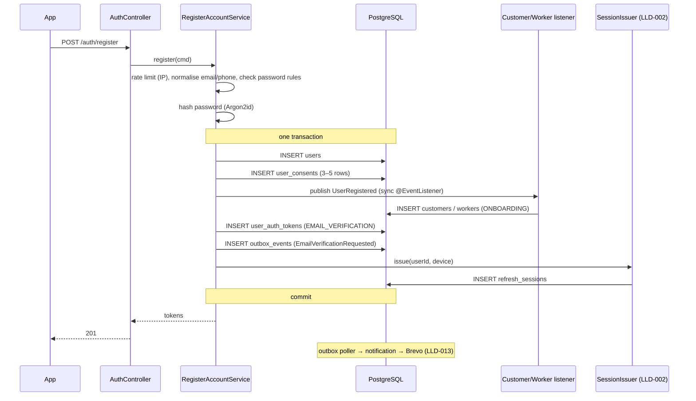
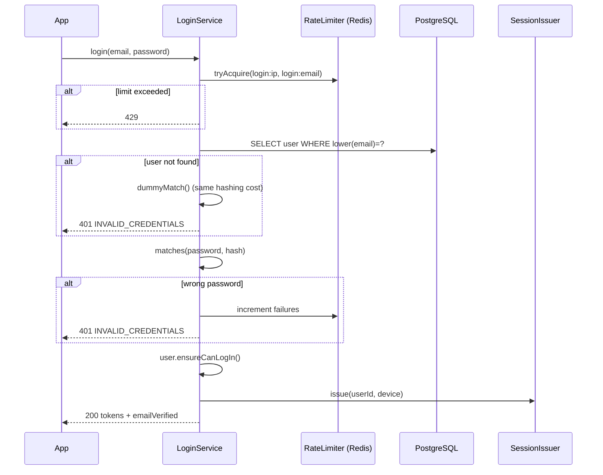
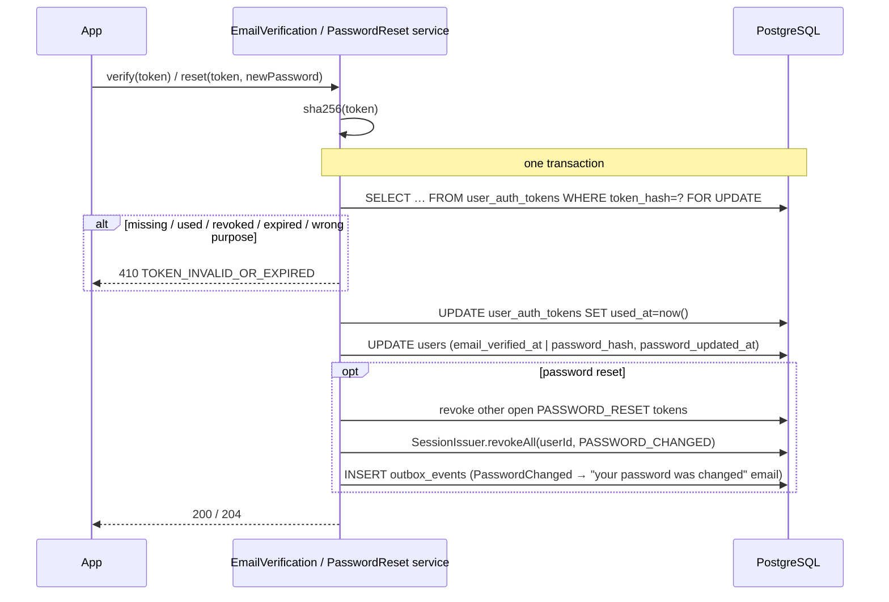

# LLD-001: Email / Password Sign-up, Login and Email Verification

| Field | Value |
|---|---|
| Status | Draft |
| Owner | TBD |
| Reviewers | TBD |
| Module | `identity` (+ listeners in `customer`, `worker`, `notification`) |
| Parent HLD | [security/01 §6](../security/01-authentication-authorization-and-identity.md), [ADR 0016](../adr/0016-email-password-login-phone-otp-later.md), [architecture/03 §7, §52.2–52.3](../architecture/03-erd-and-production-database-design.md), [api/01 §6–7](../api/01-rest-api-contract-endpoints-and-error-model.md) |
| Requirements | FR-CUS-001, FR-CUS-002, FR-WRK-001, [security/03 §99](../security/03-data-privacy-pii-retention-and-compliance.md) (18+), consent records |
| Depends on | LLD-002 (refresh sessions / token issuing), LLD-013 (notification delivery) |
| Last updated | 2026-10-03 |

---

## 1. Context & scope

Customers and workers create an account with **email + password**, give a unique mobile number, accept the terms, privacy notice and 18+ declaration, verify their email through a link sent by Brevo, and log in. Phone OTP comes in a later phase (ADR 0016).

**In scope**

- Register (customer or worker), with consent records
- Login with email + password
- Email verification (send, resend, verify)
- Forgot / reset password
- Rate limiting and account-enumeration protection for these endpoints

**Out of scope (other LLDs)**

- Access/refresh token issuing, rotation, logout → **LLD-002** (this LLD calls its `SessionIssuer` port)
- Email delivery through Brevo, templates, retries → **LLD-013** (this LLD writes outbox events)
- Change email / change phone (`PUT /me/phone`) → separate LLD
- Phone OTP, Google sign-in → later phase

**Decisions in this LLD**

| # | Decision | Why |
|---|---|---|
| D1 | Login is allowed before the email is verified; the token carries `emailVerified`. Placing a service request, going online as a worker, and payouts require a verified email. | Users can explore immediately; risky actions still need a verified email. |
| D2 | Password hashing: **Argon2id** via Spring Security `DelegatingPasswordEncoder` (default id `argon2`). | Current OWASP recommendation; `{id}` prefix allows a future algorithm change without a migration. |
| D3 | Password rules: 8–128 characters, any characters, no composition rules, rejected if on a common-passwords list (top 100k, bundled). | NIST SP 800-63B; low-literacy users manage long simple passphrases better than complex rules. |
| D4 | Customer / worker profile is created by a **synchronous** Spring `@EventListener` on `UserRegistered` in the `customer` / `worker` module, inside the same transaction. | Atomic (no account without a profile) and `identity` has no compile-time dependency on `customer`/`worker`. |
| D5 | Emails are triggered through `outbox_events` (written in the same transaction); `notification` sends them via Brevo. | An email is never sent for a rolled-back registration and never lost after a commit. |
| D6 | Verification and reset tokens: 32 random bytes, base64url; only the **SHA-256** hash is stored. | High-entropy tokens don't need a slow hash; a DB leak doesn't expose usable links. |
| D7 | Register reveals "email/phone already in use" (409); login and forgot-password never reveal whether an account exists. | Registration can't work without telling the user; enumeration there is limited by rate limits. |

---

## 2. Classes / components

```text
com.karigar.identity
├── api/
│   ├── AuthController                 -- /api/v1/auth/**
│   ├── dto/  RegisterRequest, LoginRequest, VerifyEmailRequest, ResendVerificationRequest,
│   │         ForgotPasswordRequest, ResetPasswordRequest, TokenResponse, RegisterResponse
│   └── AuthExceptionMapper            -- maps domain exceptions → error codes (§7)
├── application/
│   ├── RegisterAccountService
│   ├── LoginService
│   ├── EmailVerificationService
│   ├── PasswordResetService
│   └── port/
│       ├── PasswordHasher             -- hash(raw), matches(raw, hash), dummyMatch()
│       ├── SecureTokenGenerator       -- newToken() → RawToken(value, sha256)
│       ├── SessionIssuer              -- LLD-002: issue(userId, deviceInfo) → TokenPair; revokeAll(userId, reason)
│       ├── RateLimiter                -- tryAcquire(key, limit, window) → boolean
│       ├── OutboxWriter               -- shared kernel: append(event)
│       └── CommonPasswordList         -- contains(raw)
├── domain/
│   ├── User                           -- aggregate root
│   ├── AuthToken                      -- verification / reset token
│   ├── valueobject/  UserId, Email, PhoneNumber, PasswordHash, Locale, AuthTokenPurpose
│   ├── UserStatus                     -- ACTIVE | SUSPENDED | DEACTIVATED
│   ├── event/  UserRegistered, EmailVerificationRequested, EmailVerified,
│   │           PasswordResetRequested, PasswordChanged      -- payloads carry userId (+ link where needed), no name/email
│   ├── exception/  EmailAlreadyInUse, PhoneAlreadyInUse, InvalidCredentials, AccountSuspended,
│   │               TokenInvalidOrExpired, WeakPassword, TooManyAttempts
│   └── repository/  UserRepository, AuthTokenRepository, ConsentRepository
└── infrastructure/
    ├── persistence/  UserJpaEntity, AuthTokenJpaEntity, UserConsentJpaEntity, Spring Data repos + adapters
    ├── security/     Argon2PasswordHasher, Sha256SecureTokenGenerator
    ├── ratelimit/    RedisRateLimiter        -- fails closed if Redis is down (§7)
    └── password/     ClasspathCommonPasswordList  -- loads common-passwords.txt into a HashSet

com.karigar.customer.application.CustomerProfileOnRegistration   -- @EventListener(UserRegistered), role = CUSTOMER
com.karigar.worker.application.WorkerProfileOnRegistration       -- @EventListener(UserRegistered), role = WORKER
com.karigar.notification.…                                      -- consumes outbox events (LLD-013)
```

Domain sketch (persistence-free):

```java
public final class User {
    private final UserId id;
    private Email email;                 // stored lowercase
    private PhoneNumber phone;           // E.164
    private PasswordHash passwordHash;
    private String name;
    private Locale preferredLocale;
    private UserStatus status;
    private Instant emailVerifiedAt;     // null until verified
    private Instant passwordUpdatedAt;
    private final List<Object> events = new ArrayList<>();

    public static User register(UserId id, String name, Email email, PhoneNumber phone,
                                PasswordHash hash, Locale locale, SignupRole role, Instant now) {
        User u = new User(id, name, email, phone, hash, locale, UserStatus.ACTIVE, null, now);
        u.events.add(new UserRegistered(id, role, locale, now));
        return u;
    }

    public boolean verifyEmail(Instant now) {           // idempotent
        if (emailVerifiedAt != null) return false;
        emailVerifiedAt = now;
        events.add(new EmailVerified(id, now));
        return true;
    }

    public void changePassword(PasswordHash newHash, Instant now) {
        passwordHash = newHash;
        passwordUpdatedAt = now;
        events.add(new PasswordChanged(id, now));
    }

    public void ensureCanLogIn() {
        if (status == UserStatus.SUSPENDED) throw new AccountSuspended();
        if (status == UserStatus.DEACTIVATED) throw new InvalidCredentials();  // don't reveal
    }
}
```

`SignupRole` is `CUSTOMER | WORKER`; it is not stored on `users` (roles come from the customer / worker / admin profiles, ERD §11).

---

## 3. Data model (DDL, indexes, constraints)

Tables are defined in [ERD §7, §52.3](../architecture/03-erd-and-production-database-design.md). Flyway migration owned by `identity`:

```sql
-- V1_1__identity_users.sql
CREATE TABLE users (
    id                  UUID PRIMARY KEY,                -- UUIDv7, generated in the application
    email               VARCHAR(254),
    email_verified_at   TIMESTAMPTZ,
    password_hash       VARCHAR(255),
    password_updated_at TIMESTAMPTZ,
    phone               VARCHAR(16),
    phone_verified_at   TIMESTAMPTZ,
    name                VARCHAR(100) NOT NULL,
    preferred_locale    VARCHAR(10)  NOT NULL DEFAULT 'en',
    -- profile photo: profile_photo_media_id is added by LLD-014 V4_8 (media reference, not a URL)
    status              VARCHAR(20)  NOT NULL DEFAULT 'ACTIVE'
                        CHECK (status IN ('ACTIVE', 'SUSPENDED', 'DEACTIVATED')),
    created_at          TIMESTAMPTZ  NOT NULL,
    updated_at          TIMESTAMPTZ  NOT NULL,
    deactivated_at      TIMESTAMPTZ,
    anonymised_at       TIMESTAMPTZ,
    version             BIGINT       NOT NULL DEFAULT 0,  -- optimistic locking
    CONSTRAINT ck_users_identity_present
        CHECK (anonymised_at IS NOT NULL OR (email IS NOT NULL AND phone IS NOT NULL)),
    CONSTRAINT ck_users_phone_e164 CHECK (phone ~ '^\+[1-9][0-9]{7,14}$'),
    CONSTRAINT ck_users_email_lower CHECK (email = lower(email))
);
CREATE UNIQUE INDEX ux_users_email ON users (lower(email));
CREATE UNIQUE INDEX ux_users_phone ON users (phone);

CREATE TABLE user_auth_tokens (
    id          UUID PRIMARY KEY,
    user_id     UUID NOT NULL REFERENCES users (id),
    purpose     VARCHAR(32) NOT NULL CHECK (purpose IN ('EMAIL_VERIFICATION', 'PASSWORD_RESET')),
    token_hash  VARCHAR(64) NOT NULL UNIQUE,             -- hex SHA-256
    expires_at  TIMESTAMPTZ NOT NULL,
    used_at     TIMESTAMPTZ,
    revoked_at  TIMESTAMPTZ,                             -- superseded by a newer token
    created_at  TIMESTAMPTZ NOT NULL
);
CREATE INDEX ix_auth_tokens_user_open
    ON user_auth_tokens (user_id, purpose) WHERE used_at IS NULL AND revoked_at IS NULL;

CREATE TABLE user_consents (
    id             UUID PRIMARY KEY,
    user_id        UUID NOT NULL REFERENCES users (id),
    purpose_code   VARCHAR(40) NOT NULL,
    notice_version VARCHAR(20) NOT NULL,
    locale         VARCHAR(10) NOT NULL,
    granted        BOOLEAN     NOT NULL,
    ip_address     INET,
    user_agent     VARCHAR(300),
    created_at     TIMESTAMPTZ NOT NULL
);
CREATE INDEX ix_user_consents_latest ON user_consents (user_id, purpose_code, created_at DESC);
```

`user_auth_tokens.revoked_at` is new compared with the ERD and has been added there.

Token lifetimes (configurable): email verification **24 h**, password reset **30 min**.

Consents written at registration (one row each, `granted = true`): `TERMS_OF_SERVICE`, `PRIVACY_NOTICE`, `AGE_18_PLUS_DECLARATION`, plus `WORKER_KYC` for workers; `MARKETING_*` only if the user ticked them (never pre-ticked).

---

## 4. API contract

All responses use the standard envelope and error format ([api/01 §59–63](../api/01-rest-api-contract-endpoints-and-error-model.md)). All endpoints below are public (no access token).

### 4.1 `POST /api/v1/auth/register` → `201 Created`

```json
{
  "role": "WORKER",
  "name": "Rahim Sheikh",
  "email": "Rahim.Sheikh@example.com",
  "phone": "9876543210",
  "password": "my long pass phrase",
  "preferredLocale": "bn",
  "consents": {
    "termsVersion": "2026-10-01",
    "privacyNoticeVersion": "2026-10-01",
    "isAdult": true,
    "marketingEmail": false,
    "marketingWhatsapp": false
  }
}
```

```json
{
  "data": {
    "userId": "0192f1c2-…",
    "emailVerified": false,
    "accessToken": "eyJ…",
    "refreshToken": "rt_…",
    "expiresIn": 900
  }
}
```

- `email` is trimmed and lowercased. `phone` accepts `9876543210`, `09876543210`, `+91 98765 43210`; normalised to E.164 (`+919876543210`) with libphonenumber, region `IN`; must be a valid Indian mobile number.
- `isAdult` must be `true`; `termsVersion` / `privacyNoticeVersion` must equal the current versions (else `409 NOTICE_VERSION_OUTDATED`, so the app re-shows the notice).
- `preferredLocale` optional; default from `Accept-Language`, else `en`.
- Tokens come from LLD-002; the user is logged in straight away (D1).

### 4.2 `POST /api/v1/auth/login` → `200 OK`

```json
{ "email": "rahim.sheikh@example.com", "password": "my long pass phrase" }
```

Response: same token block as register, plus `"emailVerified": true|false`.

### 4.3 Email verification

| Endpoint | Body | Response |
|---|---|---|
| `POST /api/v1/auth/email/verify` | `{ "token": "…" }` | `200 { "emailVerified": true }` — also 200 if already verified |
| `POST /api/v1/auth/email/verify/resend` | `{ "email": "…" }` (or bearer token) | `202` always |

The email contains `https://karigar.in/verify-email?token=…`; the web/app page posts the token to `/email/verify`.

### 4.4 Password reset

| Endpoint | Body | Response |
|---|---|---|
| `POST /api/v1/auth/password/forgot` | `{ "email": "…" }` | `202` always, same body and similar timing whether or not the email exists |
| `POST /api/v1/auth/password/reset` | `{ "token": "…", "newPassword": "…" }` | `204` |

### 4.5 Error codes

| HTTP | `error.code` | When |
|---|---|---|
| 400 | `VALIDATION_ERROR` | Field errors in `details.fields` (bad email, invalid Indian mobile, password length, missing consent) |
| 400 | `WEAK_PASSWORD` | On the common-passwords list or equals the email / phone |
| 401 | `INVALID_CREDENTIALS` | Wrong email or password, unknown email, deactivated account |
| 403 | `ACCOUNT_SUSPENDED` | Suspended account tries to log in |
| 409 | `EMAIL_ALREADY_IN_USE` | Register with an existing email |
| 409 | `PHONE_ALREADY_IN_USE` | Register with an existing phone |
| 409 | `NOTICE_VERSION_OUTDATED` | Client accepted an old terms / privacy version |
| 410 | `TOKEN_INVALID_OR_EXPIRED` | Verification / reset token unknown, used, revoked or expired |
| 429 | `TOO_MANY_REQUESTS` | Rate limit hit; `Retry-After` header set |

---

## 5. Sequence diagrams

### 5.1 Register



A unique-index violation on `ux_users_email` / `ux_users_phone` rolls everything back and is mapped to 409 (§7).

### 5.2 Login



If the stored hash uses an older algorithm or cost, `DelegatingPasswordEncoder.upgradeEncoding` is true and the hash is re-computed and saved after a successful login.

### 5.3 Verify email / reset password



---

## 6. State transitions

**User email**

| From | Event | Guard | To |
|---|---|---|---|
| — | register | email & phone unique, consents given | UNVERIFIED (`email_verified_at` NULL) |
| UNVERIFIED | verify(token) | token valid, purpose EMAIL_VERIFICATION, same user | VERIFIED |
| VERIFIED | verify(token) | any valid token | VERIFIED (no-op, 200) |

**Auth token**

| From | Event | Guard | To |
|---|---|---|---|
| — | issue | — | OPEN |
| OPEN | use | `now < expires_at` | USED (`used_at`) |
| OPEN | newer token of same purpose issued | — | REVOKED (`revoked_at`) |
| OPEN | password reset completes | purpose PASSWORD_RESET | REVOKED |
| OPEN | time passes | `now ≥ expires_at` | EXPIRED (derived, no write) |

A nightly job deletes tokens older than 7 days (retention, [security/03](../security/03-data-privacy-pii-retention-and-compliance.md)).

---

## 7. Error handling, idempotency & concurrency

- **Duplicate registration race:** two requests with the same email both pass the "exists?" pre-check; the second `INSERT` fails on `ux_users_email`. The adapter catches `DataIntegrityViolationException`, reads the constraint name (`ux_users_email` → `EmailAlreadyInUse`, `ux_users_phone` → `PhoneAlreadyInUse`) and returns 409. The pre-check is only for a nicer message; the index is the guarantee.
- **Register idempotency:** clients may send `Idempotency-Key`; a retry with the same key and body replays the first `201` (`idempotency_records`, ERD §52.6). Without a key, a retry gets 409, which the app treats as "account exists, please log in".
- **Token single use:** `SELECT … FOR UPDATE` on the token row inside the transaction; two parallel `verify`/`reset` calls → the second sees `used_at` set → 410 (verify returns 200 if the email is already verified).
- **Resend:** revokes the previous open verification token(s) and issues a new one in one transaction, so only the newest link works.
- **Outbox:** email events are written in the same transaction; if the transaction rolls back, no email is sent. Payloads carry `userId` (the notification module resolves the address). Outbox payloads that contain a link are cleared (`payload = '{}'`) once the notification module has consumed the event — LLD-013 keeps its own copy in `data.secretUrl` and wipes it after send ([LLD-013](lld-013-notifications.md)).
- **Rate limiting (Redis, configurable defaults):**

| Key | Limit |
|---|---|
| `rl:register:ip:{ip}` | 5 / hour |
| `rl:login:ip:{ip}` | 20 / minute |
| `rl:login:email:{sha256(email)}` | 5 failures / 15 min → then 429 for 15 min |
| `rl:verify-resend:user:{id}` | 3 / hour |
| `rl:forgot:email:{sha256(email)}` | 3 / hour (still returns 202) |

  If Redis is unavailable, these limiters **fail closed** for login/register (503 `SERVICE_UNAVAILABLE`), matching [operations/04](../operations/04-failure-modes-resilience-and-recovery.md).
- **Brevo down:** registration still succeeds; the outbox retries delivery (LLD-013). The user can press "resend".

---

## 8. Security & privacy

- Passwords: Argon2id, never logged, never returned, max 128 chars (prevents hashing DoS). Request bodies of `/auth/**` are excluded from request logging.
- **Enumeration:** login returns the same `INVALID_CREDENTIALS` for unknown email, wrong password and deactivated accounts, and runs a dummy hash when the user doesn't exist so timing is similar. Forgot-password and resend always return 202.
- Tokens: 256-bit random, only SHA-256 stored, single use, short expiry; links use HTTPS only; the token is in the URL query, so the verify page must not load third-party scripts (no `Referer` leakage) and sends `Referrer-Policy: no-referrer`.
- After a password reset, all refresh sessions are revoked and a "password changed" email is sent.
- Suspended users cannot log in; deactivated users get `INVALID_CREDENTIALS`.
- **DPDP:** consents stored with notice version and locale; 18+ declaration required; email/phone are personal data (masked in logs: `r***@example.com`, `+91******3210`).
- CORS: only the app and web origins; `/auth/**` has CSRF disabled because it uses bearer tokens, not cookies (if the web app later uses cookies, see the BFF note in security/01).

---

## 9. Observability

| Type | Name | Notes |
|---|---|---|
| Counter | `auth_register_total{role, result}` | result = success, email_in_use, phone_in_use, validation, rate_limited |
| Counter | `auth_login_total{result}` | success, invalid_credentials, suspended, rate_limited |
| Counter | `auth_email_verified_total` | |
| Timer | `auth_password_hash_seconds` | watch Argon2 cost vs CPU |
| Gauge | `auth_unverified_users_24h` | registrations not verified after 24 h (Brevo or spam-folder problem) |
| Log | `AUTH_LOGIN_FAILED` | masked email, IP, user-agent, traceId — never the password |
| Audit | `audit_events` | password reset completed, account suspended login attempt |

Alerts: login failures > 10× normal for 10 min (credential stuffing); verification-email delivery failures > 5 % for 15 min; `auth_password_hash_seconds` p95 > 500 ms.

---

## 10. Test plan

| Level | Cases |
|---|---|
| Unit (domain) | `Email` normalisation; `PhoneNumber` accepts 10-digit / 0-prefixed / +91 Indian mobiles, rejects landlines and 5xxxx; `User.verifyEmail` idempotent; `ensureCanLogIn` per status |
| Unit (service) | Weak password rejected; consents mandatory; outdated notice version → 409; resend revokes old token |
| Web slice (`@WebMvcTest`) | Validation messages map to `VALIDATION_ERROR` with field details; error codes and HTTP statuses from §4.5 |
| Integration (Testcontainers PostgreSQL + Redis) | Full register → profile row created for role → outbox row written → verify → login; duplicate email in different case → 409; suspended → 403 |
| Concurrency | 20 threads register the same email → exactly 1 user, 19 × 409; 2 threads use the same reset token → exactly 1 success |
| Security | Unknown vs wrong-password responses identical (body and status); timing difference < 50 ms p95; 6th failed login → 429; reset revokes refresh sessions |
| Architecture (ArchUnit / Modulith) | `identity` has no dependency on `customer` or `worker` packages |
| Contract | OpenAPI for `/auth/**` matches implementation (springdoc + oasdiff in CI) |

---

## 11. Open questions

| Question | Default until decided | Owner | Due |
|---|---|---|---|
| Add a CAPTCHA (e.g. Cloudflare Turnstile) on register / forgot-password? | Not at pilot; add if bot sign-ups appear | TBD | Before public launch |
| Check passwords against breached-password API (HIBP k-anonymity) as well as the local list? | Local list only | TBD | Phase 2 |
| Should unverified accounts be deleted after N days? | Delete after 30 days unverified with no activity (align with security/03 retention) | TBD | Before launch |
| Google sign-in as an additional option | Later phase (ADR 0016) | TBD | Phase 2 |

---

## Change log

| Version | Date | Author | Change |
|---|---|---|---|
| 0.1 | 2026-10-03 | TBD | First draft |
| 0.2 | 2026-10-05 | TBD | Integrated with LLD-012–022: `profile_photo_url` dropped (LLD-014 `profile_photo_media_id`), outbox link cleared after LLD-013 consumes it, payloads carry `userId` |
