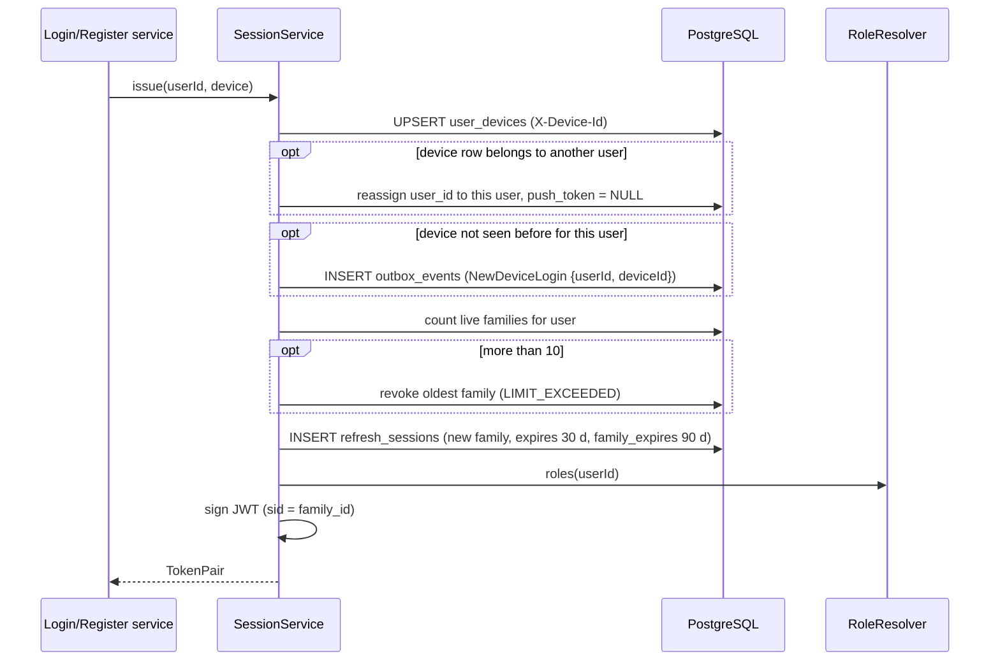
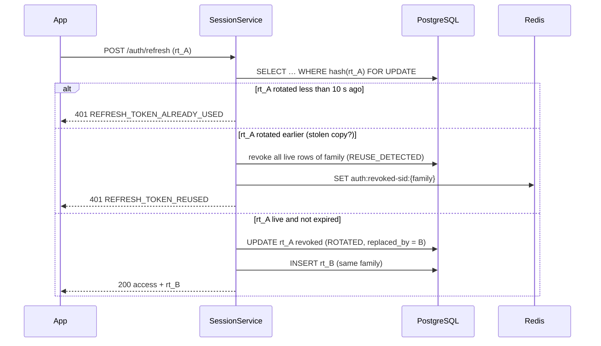
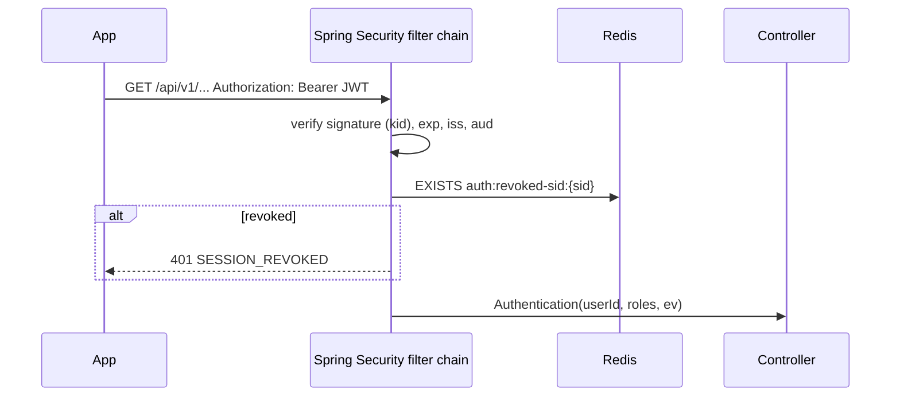

# LLD-002: Login Sessions, Token Issuing, Refresh Rotation and Logout

| Field | Value |
|---|---|
| Status | Draft |
| Owner | TBD |
| Reviewers | TBD |
| Module | `identity` (+ shared security filter chain) |
| Parent HLD | [security/01 §13–21](../security/01-authentication-authorization-and-identity.md), [ADR 0008](../adr/0008-phone-otp-and-token-sessions.md) (token parts), [ADR 0016](../adr/0016-email-password-login-phone-otp-later.md), [architecture/03 §52.2](../architecture/03-erd-and-production-database-design.md) |
| Requirements | NFR security (revocable sessions, short-lived access), [security/03](../security/03-data-privacy-pii-retention-and-compliance.md) retention |
| Used by | [LLD-001](lld-001-identity-email-signup-login.md) (`SessionIssuer`), every authenticated endpoint |
| Last updated | 2026-10-03 |

---

## 1. Context & scope

After login or registration (LLD-001) the user gets an **access token** (short-lived, signed, sent on every API call) and a **refresh token** (long-lived, opaque, used only to get new tokens). The server keeps refresh state in PostgreSQL so sessions can be listed and revoked.

**In scope**

- `SessionIssuer` port implementation: issue tokens, revoke one / all sessions
- JWT format, signing keys and rotation, validation in Spring Security
- Refresh with rotation and stolen-token (reuse) detection
- Logout, logout from all devices, list and revoke devices
- Fast revocation of access tokens after logout / suspension
- Device registration on login (`user_devices`)

**Out of scope:** login/registration itself (LLD-001), push-token registration (LLD-013), web cookie / BFF mode (later phase, see security notes).

**Decisions in this LLD**

| # | Decision | Default (configurable) |
|---|---|---|
| D1 | Access token = **JWT signed with ES256**, `kid` header; keys from AWS Secrets Manager. Asymmetric so other services or a gateway can verify later with the public key only. | Lifetime **15 min**, clock leeway 30 s |
| D2 | Refresh token = **opaque** 256-bit random value `rt_<base64url>`; only its SHA-256 is stored. | Idle expiry **30 days**, absolute expiry of the login **90 days** |
| D3 | **Rotation on every refresh.** All tokens from one login form a *family*. Re-using an old refresh token revokes the whole family (theft signal). | 10 s grace window for harmless double-refresh (§7) |
| D4 | Logout / suspension also blocks the **current access tokens** immediately: the session family id (`sid`) is put on a Redis deny-list until the last access token expires. | TTL = access lifetime + leeway |
| D5 | Roles are re-computed from the profiles on every refresh, so a customer who also becomes a worker gets the new role within 15 min without logging in again. | — |
| D6 | Max **10 active sessions** per user; the oldest is revoked when exceeded. | 10 |

---

## 2. Classes / components

```text
com.karigar.identity
├── api/
│   ├── SessionController            -- /api/v1/auth/refresh, /logout, /logout-all
│   ├── MySessionsController         -- /api/v1/me/sessions
│   ├── dto/  RefreshRequest, LogoutRequest, TokenResponse, SessionView
│   └── (public module API, used by other modules)
│       ├── DevicePushTokens         -- LLD-013: liveTokens(userId), set(userId, deviceId, token), clear(deviceId), disable(deviceId)
│       ├── UserAccountCommands      -- LLD-020: suspend(userId, reason) / reinstate(userId); suspend = users.status SUSPENDED + revokeAll(SUSPENDED) + deny-list
│       └── UserProvisioning         -- LLD-020: createInvitedUser(email, phone, name) → userId (+ set-password email via LLD-001 reset token)
├── application/
│   ├── SessionService               -- implements SessionIssuer (port defined in LLD-001)
│   │     issue(userId, DeviceInfo)        → TokenPair
│   │     refresh(rawRefreshToken, DeviceInfo) → TokenPair
│   │     logout(sid, rawRefreshToken)
│   │     revokeFamily(familyId, reason)
│   │     revokeAll(userId, reason)
│   ├── RoleResolver                 -- port: roles for a user (CUSTOMER / WORKER / ADMIN) from profile modules
│   └── port/  AccessTokenSigner, RevokedSessionCache, Clock
├── domain/
│   ├── RefreshSession               -- one row per refresh token
│   ├── SessionFamilyId, RevokeReason  -- LOGOUT | ROTATED | REUSE_DETECTED | PASSWORD_CHANGED | ADMIN | SUSPENDED | LIMIT_EXCEEDED | EXPIRED
│   └── repository/ RefreshSessionRepository, UserDeviceRepository
└── infrastructure/
    ├── jwt/        JwtAccessTokenSigner (NimbusJwtEncoder), KeyRingProvider (Secrets Manager)
    ├── security/   SecurityConfig, SidNotRevokedValidator, KarigarJwtAuthenticationConverter
    ├── cache/      RedisRevokedSessionCache
    └── persistence/ RefreshSessionJpaEntity, UserDeviceJpaEntity, adapters

RoleResolver implementations live behind a small public API of each module:
  customer.api.CustomerLookup.exists(userId)
  worker.api.WorkerLookup.exists(userId)
  admin.api.AdminLookup.activeRoles(userId)
```

Core of the refresh logic:

```java
@Transactional
public TokenPair refresh(String rawRefreshToken, DeviceInfo device) {
    String hash = sha256Hex(rawRefreshToken);
    RefreshSession current = sessions.findByTokenHashForUpdate(hash)        // SELECT … FOR UPDATE
            .orElseThrow(RefreshTokenInvalid::new);
    Instant now = clock.instant();

    if (current.revokedReason() == RevokeReason.ROTATED) {
        if (current.revokedAt().plus(GRACE).isAfter(now)) {
            throw new RefreshTokenAlreadyUsed();                             // benign race, family kept
        }
        revokeFamily(current.familyId(), RevokeReason.REUSE_DETECTED);       // theft signal
        audit.record("REFRESH_TOKEN_REUSE", current.userId(), current.familyId());
        throw new RefreshTokenReused();
    }
    if (current.isRevoked() || current.isExpired(now)) throw new RefreshTokenInvalid();

    User user = users.get(current.userId());
    user.ensureCanLogIn();                                                  // suspended → revoke + 403

    RawToken next = tokenGenerator.newToken();
    RefreshSession successor = current.rotate(next.sha256(), now, idleTtl); // same family, same family_expires_at
    sessions.save(current);                                                 // revoked_at=now, reason=ROTATED, replaced_by=successor
    sessions.save(successor);
    devices.touch(current.deviceId(), device, now);

    String access = signer.sign(claimsFor(user, current.familyId(), now));
    return new TokenPair(access, "rt_" + next.value(), accessTtl);
}
```

---

## 3. Data model

ERD [§52.2](../architecture/03-erd-and-production-database-design.md) defines `refresh_sessions` and `user_devices`. This LLD adds two columns to `refresh_sessions` (`family_expires_at`, `replaced_by_id`), now also in the ERD.

```sql
-- V1_2__identity_sessions.sql
CREATE TABLE user_devices (
    id            UUID PRIMARY KEY,                 -- generated by the app on install, sent as X-Device-Id
    user_id       UUID NOT NULL REFERENCES users (id),
    platform      VARCHAR(10) NOT NULL CHECK (platform IN ('ANDROID', 'IOS', 'WEB')),
    push_token    VARCHAR(500) UNIQUE,              -- set via DevicePushTokens (LLD-013); cleared on logout / device revoke / password change
    app_version   VARCHAR(20),
    device_label  VARCHAR(60),                      -- e.g. "Redmi Note 12" (shown in "My devices")
    last_seen_at  TIMESTAMPTZ,
    disabled_at   TIMESTAMPTZ,
    created_at    TIMESTAMPTZ NOT NULL
);
CREATE INDEX ix_user_devices_user ON user_devices (user_id) WHERE disabled_at IS NULL;

CREATE TABLE refresh_sessions (
    id                  UUID PRIMARY KEY,
    user_id             UUID NOT NULL REFERENCES users (id),
    family_id           UUID NOT NULL,              -- all rotations of one login; = sid claim
    refresh_token_hash  VARCHAR(64) NOT NULL UNIQUE,
    device_id           UUID REFERENCES user_devices (id),
    ip_address          INET,
    user_agent          VARCHAR(300),
    created_at          TIMESTAMPTZ NOT NULL,
    last_used_at        TIMESTAMPTZ,
    expires_at          TIMESTAMPTZ NOT NULL,       -- idle expiry of this token
    family_expires_at   TIMESTAMPTZ NOT NULL,       -- absolute expiry of the whole login
    revoked_at          TIMESTAMPTZ,
    revoke_reason       VARCHAR(20) CHECK (revoke_reason IN
                        ('LOGOUT','ROTATED','REUSE_DETECTED','PASSWORD_CHANGED','ADMIN','SUSPENDED','LIMIT_EXCEEDED')),
    replaced_by_id      UUID REFERENCES refresh_sessions (id),
    CHECK (expires_at <= family_expires_at),
    CHECK ((revoked_at IS NULL) = (revoke_reason IS NULL))
);
-- the one live token of each family
CREATE UNIQUE INDEX ux_refresh_sessions_live_family
    ON refresh_sessions (family_id) WHERE revoked_at IS NULL;
CREATE INDEX ix_refresh_sessions_user_live
    ON refresh_sessions (user_id) WHERE revoked_at IS NULL;
```

`ux_refresh_sessions_live_family` guarantees that a family never has two usable refresh tokens, even if two refreshes race (§7).

**Redis**

| Key | Value | TTL |
|---|---|---|
| `auth:revoked-sid:{familyId}` | `1` | access lifetime + leeway (15.5 min) |

**Cleanup job** (nightly, ShedLock): delete `refresh_sessions` rows where `revoked_at` or `family_expires_at` is older than 30 days; `user_devices` not seen for 180 days are disabled.

---

## 4. Tokens and API contract

### 4.1 Access token (JWT, ES256)

```json
{
  "header": { "alg": "ES256", "kid": "2026-10-a", "typ": "at+jwt" },
  "payload": {
    "iss": "https://api.karigar.in",
    "aud": "karigar-api",
    "sub": "0192f1c2-…",
    "sid": "family-uuid",
    "roles": ["CUSTOMER", "WORKER"],
    "ev": true,
    "loc": "bn",
    "iat": 1791000000,
    "exp": 1791000900,
    "jti": "uuid"
  }
}
```

- `ev` = email verified (LLD-001 D1). `loc` = `users.preferred_locale`, used for response language without a DB lookup ([LLD-003](lld-003-catalog-and-language.md)); refreshed on every token refresh. `roles` never contain admin permissions — admin permissions are checked server-side per request (ERD §52.1).
- No email, phone, name or location in the token.

**Keys:** one active signing key, rotated every **90 days**. The previous public key stays in the verification key set for at least 1 day (> access lifetime). Keys are loaded from Secrets Manager at start-up and refreshed every 10 min. Public keys are also published at `GET /.well-known/jwks.json` for future services.

### 4.2 Endpoints

| Method | Path | Auth | Body | Response |
|---|---|---|---|---|
| POST | `/api/v1/auth/refresh` | none | `{ "refreshToken": "rt_…" }` | `200` token block |
| POST | `/api/v1/auth/logout` | bearer | `{ "refreshToken": "rt_…" }` | `204` — revokes this login (family) |
| POST | `/api/v1/auth/logout-all` | bearer | — | `204` — revokes every login of the user |
| GET | `/api/v1/me/sessions` | bearer | — | `200` list (below) |
| DELETE | `/api/v1/me/sessions/{familyId}` | bearer | — | `204` — "log out that device" |

Headers sent by apps on login/refresh: `X-Device-Id` (UUID), `X-App-Platform`, `X-App-Version`, `X-Device-Label` (optional).

Token block (same as LLD-001):

```json
{ "data": { "accessToken": "eyJ…", "refreshToken": "rt_…", "expiresIn": 900, "emailVerified": true } }
```

Sessions list:

```json
{
  "data": [
    { "familyId": "…", "deviceLabel": "Redmi Note 12", "platform": "ANDROID",
      "lastUsedAt": "2026-10-03T09:12:00Z", "approxLocation": "Howrah, IN", "current": true }
  ]
}
```

`approxLocation` is derived from the IP at city level only; the IP itself is never returned.

### 4.3 Error codes

| HTTP | `error.code` | When | Client action |
|---|---|---|---|
| 401 | `TOKEN_EXPIRED` | Access token expired (`WWW-Authenticate: Bearer error="invalid_token"`) | Call `/auth/refresh` once, retry request |
| 401 | `TOKEN_INVALID` | Bad signature, wrong `aud`/`iss`, unknown `kid` | Log in again |
| 401 | `SESSION_REVOKED` | `sid` on the deny-list (logged out / suspended) | Log in again |
| 401 | `REFRESH_TOKEN_INVALID` | Unknown, expired or revoked refresh token | Log in again |
| 401 | `REFRESH_TOKEN_ALREADY_USED` | Rotated < 10 s ago (double refresh) | Use the newest refresh token it holds; if none, log in |
| 401 | `REFRESH_TOKEN_REUSED` | Old token reused after grace → family revoked | Log in again |
| 403 | `ACCOUNT_SUSPENDED` | User suspended | Show suspension screen |
| 404 | `SESSION_NOT_FOUND` | `DELETE /me/sessions/{id}` for a family that isn't the user's | — |

---

## 5. Sequence diagrams

### 5.1 Issue (called by LLD-001 after login / register)



### 5.2 Refresh with rotation and reuse detection



### 5.3 Request with access token



---

## 6. State transitions

**Refresh session row**

| From | Event | Guard | To |
|---|---|---|---|
| — | issue / rotate | — | LIVE |
| LIVE | refresh | not expired, user active | REVOKED (ROTATED), successor LIVE |
| LIVE | logout / delete device | owner | REVOKED (LOGOUT) |
| LIVE | password change / reset | — | REVOKED (PASSWORD_CHANGED) |
| LIVE | admin action / suspension | — | REVOKED (ADMIN / SUSPENDED) |
| LIVE | 11th login | oldest family | REVOKED (LIMIT_EXCEEDED) |
| LIVE | time | `now ≥ expires_at` or `now ≥ family_expires_at` | EXPIRED (derived) |
| REVOKED (ROTATED) | presented again | > 10 s after rotation | family → REVOKED (REUSE_DETECTED) |

Every transition to REVOKED for a whole family also writes `auth:revoked-sid:{familyId}` to Redis.

---

## 7. Error handling, idempotency & concurrency

- **Two refreshes at the same moment** (app resumes and two API calls both see an expired token): both lock the same row; the first rotates it; the second sees `ROTATED` within the grace window → `REFRESH_TOKEN_ALREADY_USED` without killing the session. Apps must still **single-flight** refresh (one in-flight refresh; other requests wait for it).
- `ux_refresh_sessions_live_family` is the backstop: if a bug ever tried to create a second live token in a family, the insert fails and the transaction rolls back.
- **Suspension / password change:** `revokeAll(userId, reason)` updates all live rows in one statement and writes every family id to Redis **after commit** (`TransactionSynchronization.afterCommit`), so a rolled-back change doesn't log people out.
- **Redis down:** the deny-list check **fails open** (request allowed) and increments `auth_denylist_unavailable_total`; the worst case is a revoked access token working until it expires (≤ 15 min). Refresh still checks PostgreSQL, so a revoked session can't get new tokens. This is a deliberate availability trade-off; rate limiters (LLD-001) still fail closed.
- **Push tokens:** logout, "log out that device", logout-all and password change / reset set `push_token = NULL` on the affected `user_devices` rows in the same transaction as the revoke, so a logged-out phone stops getting pushes. If the `X-Device-Id` sent on login belongs to another user (shared / handed-down phone), the row is reassigned to the new user and its token cleared; the app re-registers its token through `PUT push-token` (LLD-013).
- **New-device login:** `issue` writes `NewDeviceLogin {userId, deviceId}` to `outbox_events` in the same transaction when the device id is new for the user; LLD-013 sends the email + inbox item. Payload carries ids only (LLD-022 D8).
- **Key rotation:** a token signed with a key no longer in the key set → `TOKEN_INVALID`; the key overlap (≥ 1 day) prevents this in normal rotation.
- **Clock skew:** 30 s leeway on `exp`/`iat`; servers use NTP (CERT-In requirement, operations/02).

---

## 8. Security & privacy

- Refresh tokens: 256-bit random, SHA-256 stored, never logged; sent only in the body of `/auth/refresh` and `/auth/logout`, never in URLs.
- **Mobile storage:** refresh token in Android Keystore-backed encrypted storage / iOS Keychain; access token kept in memory only.
- **Web (later):** tokens are not stored in `localStorage`; the web app will use a backend-for-frontend with `HttpOnly; Secure; SameSite=Strict` cookies (security/01 note). Until then the API is for mobile apps.
- Signing private key only in Secrets Manager / app memory; never in git or images. Separate keys per environment.
- Reuse detection writes an `audit_events` row and a security log event; repeated reuse for one user raises an alert.
- IP addresses and user agents in `refresh_sessions` are personal data: kept until the row is cleaned up (≤ 30 days after revocation/expiry), shown to the user only as city-level location.
- Spring Security config essentials: stateless sessions, CSRF disabled for bearer-token API, `oauth2ResourceServer().jwt()` with a `NimbusJwtDecoder` built from the local key set, validators for `iss`, `aud`, timestamps and `SidNotRevokedValidator`.

---

## 9. Observability

| Type | Name | Notes |
|---|---|---|
| Counter | `auth_refresh_total{result}` | success, invalid, already_used, reused, suspended |
| Counter | `auth_logout_total{type}` | single, all, device |
| Counter | `auth_reuse_detected_total` | alert if > 0 sustained (possible token theft) |
| Counter | `auth_denylist_unavailable_total` | Redis down for deny-list checks |
| Gauge | `auth_live_sessions` | live families (capacity / abuse signal) |
| Timer | `auth_jwt_sign_seconds`, `auth_refresh_seconds` | p95 targets: sign < 5 ms, refresh < 100 ms |

Alerts: reuse detections > 5 in 10 min; refresh error rate > 5 % for 10 min; JWT key expiring in < 7 days without a successor.

---

## 10. Test plan

| Level | Cases |
|---|---|
| Unit | Claims built correctly (no PII); `RefreshSession.rotate` keeps `family_expires_at`; expiry checks at boundaries |
| Integration (Testcontainers PostgreSQL + Redis) | issue → refresh → refresh (chain of 3, only last live); logout revokes family and blocks current access token immediately; logout-all; delete another user's session → 404 |
| Reuse detection | refresh A→B, then present A after 11 s → 401 REUSED and B no longer works |
| Concurrency | 2 parallel refreshes with the same token → one 200, one `ALREADY_USED`; family still usable with the new token |
| Limits | 11th login revokes the oldest family |
| Roles | user registers as customer, worker profile added → next refresh has both roles |
| Failure | Redis stopped → API calls with valid JWT still succeed, metric incremented; refresh still works |
| Keys | token signed with previous key accepted during overlap; unknown `kid` → `TOKEN_INVALID` |
| Security | tampered payload / `alg: none` / wrong `aud` rejected; refresh token never appears in logs |

---

## 11. Open questions

| Question | Default until decided | Owner | Due |
|---|---|---|---|
| Absolute session length for workers (they use the app daily) | 90 days, same as customers | TBD | Before launch |
| Step-up re-authentication (password re-entry) for payout-account changes | Not in MVP: cooling-off + notification only ([LLD-019](lld-019-worker-payouts.md) open question) | TBD | With LLD-019 |
| ~~Notify the user by email on new-device login~~ | **Decided:** `NewDeviceLogin` written to the outbox by `issue` (§5.1, §7); sent by [LLD-013](lld-013-notifications.md) | — | — |

---

## Change log

| Version | Date | Author | Change |
|---|---|---|---|
| 0.1 | 2026-10-03 | TBD | First draft |
| 0.2 | 2026-10-05 | TBD | Integrated with LLD-012–022: `NewDeviceLogin` via outbox, push token cleared on logout / revoke / password change and on device reassignment, public `DevicePushTokens` (LLD-013), `UserAccountCommands` + `UserProvisioning` (LLD-020) |
