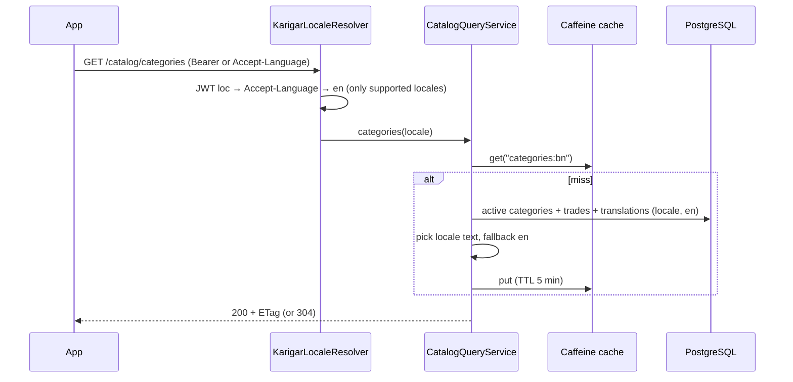
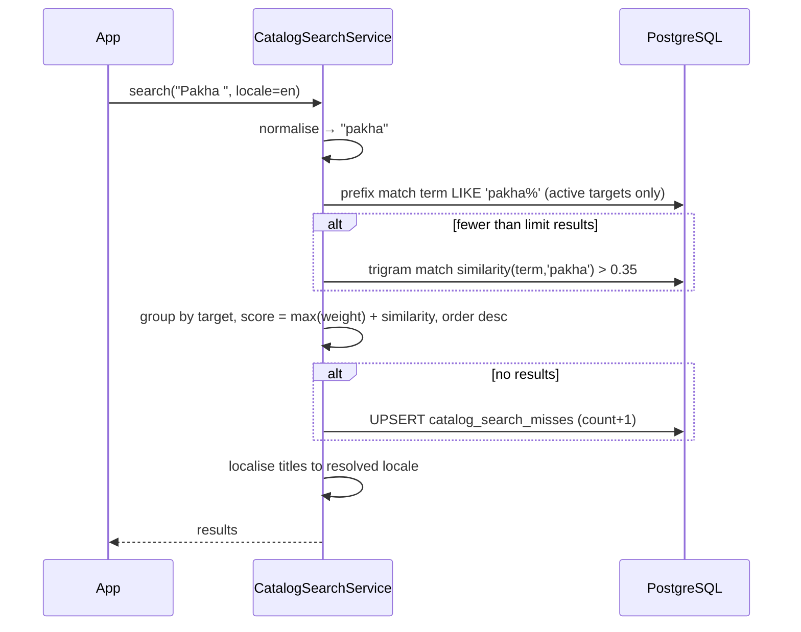

# LLD-003: Catalog (Categories, Trades, Skills, Common Problems), Search and Language Resolution

| Field | Value |
|---|---|
| Status | Draft |
| Owner | TBD |
| Reviewers | TBD |
| Module | `catalog` (+ shared `i18n` component) |
| Parent HLD | [architecture/03 §12–13, §34.1](../architecture/03-erd-and-production-database-design.md), [api/01 §23 Catalog, Language](../api/01-rest-api-contract-endpoints-and-error-model.md), [modules/09](../modules/09-search-discovery-and-worker-profile.md) |
| Requirements | FR-CUS-004 (3-step request: pick category/trade/problem, search in any language), FR-WRK-002/003 (trades and skills) |
| Depends on | LLD-002 (`loc` claim in the access token) |
| Last updated | 2026-10-03 |

---

## 1. Context & scope

The catalog is the reference data everything else points to: **Category → Trade (profession) → Skill**, plus **Common problems** per trade with a price guide. It is shown in English, Bengali, Hindi and any language added later. The backend decides the language; clients never pick translated fields.

**In scope**

- Public read APIs: categories with trades, trade details, skills, common problems, search
- Language resolution for every API response (shared component used by all modules)
- Multilingual search ("fan", "pakha", "পাখা", "पंखा" → *Fan not working*)
- Admin APIs to manage catalog data and translations; activate / deactivate trades
- Seed data: 7 categories, 33 trades, launch skills and problems for electrician and plumber
- Caching

**Out of scope:** worker ↔ trade links and rates (LLD-004), reason codes (`reason_codes` + translations, created in [LLD-022](lld-022-shared-platform.md) `V1_0`), prices actually charged (quotes, [LLD-017](lld-017-quotes-additional-work-material.md)).

**Decisions**

| # | Decision | Why |
|---|---|---|
| D1 | Language order: `loc` claim in the access token (= `users.preferred_locale`) → `Accept-Language` → `en`. Missing translation → `en`. | No DB lookup per request; anonymous users still get their phone's language. |
| D2 | Supported languages are rows in `supported_locales`; adding a language = insert locale + translation rows. | Keeps the "no code change for a new language" promise. |
| D3 | Search uses one table, `catalog_search_terms`, holding every name and keyword in every language (including romanised spellings), with prefix match + `pg_trgm` similarity. | Works for Bengali/Hindi script and typos without Elasticsearch ([ADR 0012](../adr/0012-search-on-postgresql.md)). |
| D4 | Caching: in-process Caffeine cache per locale (TTL 5 min) + HTTP `ETag` / `Cache-Control: public, max-age=300`, `Vary: Accept-Language`. No Redis. | Catalog is small (< 1 MB) and changes rarely; simplest thing that is fast. |
| D5 | Catalog rows are never deleted, only deactivated; `code` is immutable. | Old requests, bookings and analytics reference them. |
| D6 | Searches with no result are counted in `catalog_search_misses` so ops can add keywords. | Real users' words improve search quickly in a new market. |

---

## 2. Classes / components

```text
com.karigar.shared.i18n
├── LocaleContext                 -- request-scoped resolved locale
├── KarigarLocaleResolver         -- implements Spring LocaleResolver: JWT loc → Accept-Language → en
├── SupportedLocales              -- cached set from supported_locales
└── ContentLanguageFilter         -- sets Content-Language response header

com.karigar.catalog
├── api/
│   ├── CatalogController         -- public GET endpoints
│   ├── CatalogSearchController   -- GET /catalog/search
│   ├── AdminCatalogController    -- /admin/catalog/** (permission catalog.manage)
│   └── dto/  CategoryView, TradeView, SkillView, ProblemView, SearchResultView, Admin*Request
├── application/
│   ├── CatalogQueryService       -- builds localized views, uses cache
│   ├── CatalogSearchService      -- normalise query, run search, record misses
│   ├── CatalogAdminService       -- create/update/activate, rebuilds search terms, evicts cache
│   └── port/ CatalogLookup (public API for other modules: professionExists(id), activeProfessionIds(),
│                            problemBelongsToProfession(problemId, professionId), skillBelongsTo(...))
├── domain/
│   ├── TradeCategory, Profession, Skill, CommonProblem       -- entities with code, active, sort_order
│   ├── Translation (locale, name, description, keywords)     -- value object
│   ├── RateType                                              -- VISIT | HOURLY | HALF_DAY | DAILY | PER_UNIT | MINIMUM
│   └── event/ CatalogChanged
└── infrastructure/
    ├── persistence/  JPA entities + repositories (translations as @ElementCollection-free child tables)
    ├── search/       SearchTermIndexer (rebuilds catalog_search_terms for one entity)
    └── cache/        CaffeineCatalogCache (key: "categories:{locale}", "problems:{professionId}:{locale}")
```

Text normalisation used for both indexing and queries:

```java
static String normalise(String s) {
    String n = Normalizer.normalize(s.strip(), Normalizer.Form.NFC).toLowerCase(Locale.ROOT);
    n = n.replaceAll("\\s+", " ");
    // strip Latin diacritics only; Bengali/Devanagari combining marks are meaningful and kept
    return LATIN_DIACRITICS.matcher(Normalizer.normalize(n, Normalizer.Form.NFD)).replaceAll("")
            .transform(t -> Normalizer.normalize(t, Normalizer.Form.NFC));
}
```

---

## 3. Data model

Tables from the ERD ([§12–13, §34.1](../architecture/03-erd-and-production-database-design.md)) plus three added by this LLD: `supported_locales`, `catalog_search_terms`, `catalog_search_misses` (now also in the ERD).

```sql
-- V2_1__catalog.sql
CREATE EXTENSION IF NOT EXISTS pg_trgm;

CREATE TABLE supported_locales (
    code         VARCHAR(10) PRIMARY KEY,           -- BCP 47: en, bn, hi
    native_name  VARCHAR(40) NOT NULL,              -- English, বাংলা, हिन्दी
    active       BOOLEAN NOT NULL DEFAULT true,
    sort_order   SMALLINT NOT NULL DEFAULT 0
);

CREATE TABLE trade_categories (
    id UUID PRIMARY KEY, code VARCHAR(40) NOT NULL UNIQUE, icon_key VARCHAR(60),
    sort_order SMALLINT NOT NULL DEFAULT 0, active BOOLEAN NOT NULL DEFAULT true,
    created_at TIMESTAMPTZ NOT NULL, updated_at TIMESTAMPTZ NOT NULL
);
CREATE TABLE trade_category_translations (
    category_id UUID NOT NULL REFERENCES trade_categories (id),
    locale VARCHAR(10) NOT NULL REFERENCES supported_locales (code),
    name VARCHAR(80) NOT NULL,
    PRIMARY KEY (category_id, locale)
);

CREATE TABLE professions (
    id UUID PRIMARY KEY, code VARCHAR(40) NOT NULL UNIQUE,
    category_id UUID NOT NULL REFERENCES trade_categories (id),
    default_rate_type VARCHAR(20) NOT NULL
        CHECK (default_rate_type IN ('VISIT','HOURLY','HALF_DAY','DAILY','PER_UNIT','MINIMUM')),
    sort_order SMALLINT NOT NULL DEFAULT 0, active BOOLEAN NOT NULL DEFAULT false,
    created_at TIMESTAMPTZ NOT NULL, updated_at TIMESTAMPTZ NOT NULL
);
CREATE TABLE profession_translations (
    profession_id UUID NOT NULL REFERENCES professions (id),
    locale VARCHAR(10) NOT NULL REFERENCES supported_locales (code),
    name VARCHAR(80) NOT NULL, description TEXT,
    PRIMARY KEY (profession_id, locale)
);

CREATE TABLE skills (
    id UUID PRIMARY KEY, profession_id UUID NOT NULL REFERENCES professions (id),
    code VARCHAR(60) NOT NULL UNIQUE, active BOOLEAN NOT NULL DEFAULT true,
    created_at TIMESTAMPTZ NOT NULL, updated_at TIMESTAMPTZ NOT NULL,
    UNIQUE (id, profession_id)                      -- target of worker_skills composite FK (LLD-004)
);
CREATE TABLE skill_translations (
    skill_id UUID NOT NULL REFERENCES skills (id),
    locale VARCHAR(10) NOT NULL REFERENCES supported_locales (code),
    name VARCHAR(80) NOT NULL, description TEXT,
    PRIMARY KEY (skill_id, locale)
);

CREATE TABLE common_problems (
    id UUID PRIMARY KEY, profession_id UUID NOT NULL REFERENCES professions (id),
    code VARCHAR(60) NOT NULL UNIQUE, skill_id UUID REFERENCES skills (id),
    typical_min_minor BIGINT, typical_max_minor BIGINT,
    estimated_minutes SMALLINT, needs_inspection BOOLEAN NOT NULL DEFAULT false,
    sort_order SMALLINT NOT NULL DEFAULT 0, active BOOLEAN NOT NULL DEFAULT true,
    CHECK (typical_max_minor IS NULL OR typical_max_minor >= typical_min_minor),
    CHECK (needs_inspection OR typical_min_minor IS NOT NULL)   -- either a price guide or "needs inspection"
);
CREATE TABLE common_problem_translations (
    problem_id UUID NOT NULL REFERENCES common_problems (id),
    locale VARCHAR(10) NOT NULL REFERENCES supported_locales (code),
    title VARCHAR(120) NOT NULL, search_keywords TEXT,       -- comma-separated, incl. romanised spellings
    PRIMARY KEY (problem_id, locale)
);

-- search index: one row per (entity, term)
CREATE TABLE catalog_search_terms (
    id            BIGSERIAL PRIMARY KEY,
    target_type   VARCHAR(20) NOT NULL CHECK (target_type IN ('PROFESSION', 'PROBLEM', 'SKILL')),
    target_id     UUID NOT NULL,
    profession_id UUID NOT NULL REFERENCES professions (id),
    locale        VARCHAR(10) NOT NULL,
    term          VARCHAR(120) NOT NULL,           -- normalised (§2)
    weight        SMALLINT NOT NULL                -- name 3, keyword 2, description word 1
);
CREATE INDEX ix_search_terms_prefix ON catalog_search_terms (term text_pattern_ops);
CREATE INDEX ix_search_terms_trgm   ON catalog_search_terms USING gin (term gin_trgm_ops);
CREATE INDEX ix_search_terms_target ON catalog_search_terms (target_type, target_id);

CREATE TABLE catalog_search_misses (
    query_normalised VARCHAR(120) NOT NULL,
    locale           VARCHAR(10)  NOT NULL,
    miss_count       INTEGER      NOT NULL DEFAULT 1,
    first_seen_at    TIMESTAMPTZ  NOT NULL,
    last_seen_at     TIMESTAMPTZ  NOT NULL,
    PRIMARY KEY (query_normalised, locale)
);
```

**Integrity rules enforced by `CatalogAdminService`** (cross-table, so not plain constraints; covered by tests):

- A trade can be **activated** only if it has an `en` translation, its category is active, and it has at least one active common problem.
- Every category / trade / skill / problem must always have an `en` translation (fallback guarantee).
- A problem's `skill_id` must belong to the same profession.

**Seed data** (`V2_2__catalog_seed.sql`, deterministic, runs in every environment): `supported_locales` (en, bn, hi); 7 categories and 33 trades with en/bn/hi names exactly as in [ERD §12](../architecture/03-erd-and-production-database-design.md); `ELECTRICIAN` and `PLUMBER` active with their skills and the 11 common problems from ERD §34.1 (incl. the emergency-eligible ones; `emergency_enabled` and `advance_minor` set for both trades), including romanised keywords (e.g. *Fan not working*: `fan, pankha, pakha, ceiling fan, fan slow, fan noise`). Rows are inserted by `code`, with `ON CONFLICT (code) DO NOTHING`, so the migration is safe to re-run in new environments. Later trades get their problems in later migrations before activation.

---

## 4. API contract

### 4.1 Public (no login)

| Method | Path | Response |
|---|---|---|
| GET | `/api/v1/catalog/locales` | active languages for the language picker |
| GET | `/api/v1/catalog/categories` | categories with their **active** trades (categories with no active trade are omitted) |
| GET | `/api/v1/catalog/professions/{id}` | one trade with description and default rate type |
| GET | `/api/v1/catalog/professions/{id}/skills` | active skills |
| GET | `/api/v1/catalog/professions/{id}/problems` | active common problems with price guide |
| GET | `/api/v1/catalog/search?q=pakha&limit=10` | mixed results (trades and problems) |

`GET /catalog/categories` (with `Accept-Language: bn`):

```json
{
  "data": [
    {
      "code": "ELECTRICAL_PLUMBING",
      "name": "ইলেকট্রিক ও প্লাম্বিং",
      "icon": "electrical_plumbing",
      "trades": [
        { "id": "…", "code": "ELECTRICIAN", "name": "ইলেকট্রিশিয়ান", "defaultRateType": "VISIT" },
        { "id": "…", "code": "PLUMBER", "name": "প্লাম্বার", "defaultRateType": "VISIT" }
      ]
    }
  ]
}
```

Response headers: `Content-Language: bn`, `ETag: "c-bn-<hash>"`, `Cache-Control: public, max-age=300`, `Vary: Accept-Language, Authorization`. `If-None-Match` → `304`.

`GET /catalog/professions/{id}/problems`:

```json
{
  "data": [
    { "id": "…", "code": "ELEC_FAN_NOT_WORKING", "title": "পাখা চলছে না",
      "priceGuide": { "minMinor": 20000, "maxMinor": 40000, "currency": "INR" },
      "estimatedMinutes": 45, "needsInspection": false },
    { "id": "…", "code": "ELEC_MCB_TRIPPING", "title": "এমসিবি বারবার পড়ে যাচ্ছে",
      "priceGuide": null, "estimatedMinutes": null, "needsInspection": true }
  ]
}
```

`GET /catalog/search?q=pakha`:

```json
{
  "data": [
    { "type": "PROBLEM", "id": "…", "title": "Fan not working", "professionId": "…", "professionName": "Electrician" },
    { "type": "PROFESSION", "id": "…", "title": "Electrician", "professionId": "…", "professionName": "Electrician" }
  ]
}
```

Titles are in the resolved language even when the match came from another language's keyword.

### 4.2 Admin (`catalog.manage` permission)

| Method | Path | Purpose |
|---|---|---|
| POST / PATCH | `/api/v1/admin/catalog/categories[/{id}]` | create / edit category |
| POST / PATCH | `/api/v1/admin/catalog/professions[/{id}]` | create / edit trade (code immutable), incl. `emergencyEnabled`, `emergencySurchargeMinor`, `advanceMinor` ([LLD-006](lld-006-create-service-request.md)) |
| POST | `/api/v1/admin/catalog/professions/{id}/activate` · `/deactivate` | launch / pause a trade |
| POST / PATCH | `/api/v1/admin/catalog/professions/{id}/skills[/{skillId}]` | skills |
| POST / PATCH | `/api/v1/admin/catalog/professions/{id}/problems[/{problemId}]` | problems and price guide |
| PUT | `/api/v1/admin/catalog/{type}/{id}/translations/{locale}` | add / replace one translation |
| GET | `/api/v1/admin/catalog/search-misses?locale=bn` | top queries with no result |
| GET | `/api/v1/admin/catalog/missing-translations?locale=hi` | entities lacking a translation |

Admin GETs return **all** translations of an entity (not resolved), so the admin screen can edit them side by side.

### 4.3 Error codes

| HTTP | `error.code` | When |
|---|---|---|
| 404 | `PROFESSION_NOT_FOUND` | unknown or inactive trade on public endpoints |
| 400 | `VALIDATION_ERROR` | `q` shorter than 2 characters or longer than 60; bad locale code |
| 409 | `CATALOG_CODE_EXISTS` | admin create with an existing code |
| 409 | `TRANSLATION_REQUIRED` | activating without an `en` translation, or deleting the `en` translation |
| 409 | `TRADE_NOT_READY` | activating a trade with no active problem or inactive category |
| 422 | `SKILL_PROFESSION_MISMATCH` | problem's skill belongs to another trade |

---

## 5. Sequence diagrams

### 5.1 Localized read



### 5.2 Search



Query sketch:

```sql
SELECT t.target_type, t.target_id, t.profession_id,
       max(t.weight + CASE WHEN t.term LIKE :q || '%' THEN 2 ELSE similarity(t.term, :q) END) AS score
FROM catalog_search_terms t
JOIN professions p ON p.id = t.profession_id AND p.active
WHERE t.term LIKE :q || '%' OR t.term % :q          -- % uses pg_trgm.similarity_threshold (0.35)
GROUP BY t.target_type, t.target_id, t.profession_id
ORDER BY score DESC
LIMIT :limit;
```

### 5.3 Admin edit

Admin change → `CatalogAdminService` validates → updates rows → `SearchTermIndexer` deletes and re-inserts the entity's terms (same transaction) → after commit, publishes `CatalogChanged` → each instance evicts its cache on its next request for that key (TTL ≤ 5 min across instances).

---

## 6. State transitions

| Entity | From | Event | Guard | To |
|---|---|---|---|---|
| Profession (trade) | INACTIVE | activate | en translation, category active, ≥ 1 active problem | ACTIVE |
| Profession | ACTIVE | deactivate | — (existing requests/bookings continue; no new requests, workers can't add it) | INACTIVE |
| Category | any | (derived) | shown only if active and has ≥ 1 active trade | VISIBLE / HIDDEN |
| Problem / skill | ACTIVE ↔ INACTIVE | admin toggle | — | — |

Deactivation never deletes; `worker_professions` rows for that trade are set to `PAUSED` by the worker module on `CatalogChanged` (LLD-004).

---

## 7. Error handling, idempotency & concurrency

- Admin edits use optimistic locking (`version` column on each catalog table); a stale edit returns `409 CONCURRENT_UPDATE`.
- Seed migrations use `ON CONFLICT DO NOTHING` on `code`, so re-running is safe.
- Unsupported locale in `Accept-Language` (e.g. `ta`) → next supported in the header's list, else `en`; never an error.
- Search is read-only and cheap; rate limit 30 requests / 10 s per IP to stop scraping.
- Cache stampede: Caffeine `get(key, loader)` loads once per key per instance.

---

## 8. Security & privacy

- Public endpoints return only active, non-sensitive reference data; no personal data.
- Admin endpoints require `catalog.manage`; every change writes `audit_events` (who, what, old → new).
- Translation text is admin input shown in apps: stored as plain text, never rendered as HTML; length-limited.
- Search misses store only the normalised query text and locale — no user id or IP (queries can contain names; misses older than 90 days are purged).

---

## 9. Observability

| Type | Name | Notes |
|---|---|---|
| Counter | `catalog_search_total{locale, result}` | result = hit, miss |
| Timer | `catalog_search_seconds` | p95 < 50 ms |
| Gauge | `catalog_cache_hit_ratio` | expect > 95 % |
| Gauge | `catalog_missing_translations{locale}` | active entities lacking a translation |
| Log | `CATALOG_CHANGED` | admin, entity, fields changed |

Alert: search miss rate > 30 % for a day (keywords need work); missing `en` translation > 0 (should be impossible).

---

## 10. Test plan

| Level | Cases |
|---|---|
| Unit | `normalise` (NFC, case, spaces, Latin diacritics stripped, Bengali marks kept); locale resolution order and fallback; price guide null when `needsInspection` |
| Integration (Testcontainers PostgreSQL with pg_trgm) | categories in `bn` with `en` fallback for a missing translation; category hidden when its only trade is inactive; inactive trade → 404 |
| Search | "pakha", "পাখা", "पंखा", "fan" → *Fan not working* first; typo "plumbr" → Plumber; "xyz" → empty + miss counted; results localised to requested locale |
| Admin | activate without `en` → 409; activate without problems → 409; code change rejected; translation upsert rebuilds search terms; stale version → 409 |
| HTTP caching | `ETag` stable for same data; `If-None-Match` → 304; different `Accept-Language` → different ETag |
| Seed | fresh DB has 3 locales, 7 categories, 33 trades, 2 active; every entity has `en` |
| Performance | search p95 < 50 ms with 33 trades × 30 problems × 3 locales |

---

## 11. Open questions

| Question | Default until decided | Owner | Due |
|---|---|---|---|
| Native speakers to review all bn/hi names and keywords | Seed as drafted; review before launch | TBD | Before launch |
| Show trades per service zone (a trade live in Howrah but not Kolkata)? | No — trades are global for now; add `profession_zones` if needed | TBD | Before Kolkata launch |
| Voice search (speech-to-text) | Later; app can use the phone's keyboard voice input meanwhile | TBD | Phase 2 |

---

## Change log

| Version | Date | Author | Change |
|---|---|---|---|
| 0.1 | 2026-10-03 | TBD | First draft |
| 0.2 | 2026-10-05 | TBD | Integrated with LLD-012–022: pointers to LLD-022 (`reason_codes`) and LLD-017 (quotes) |
