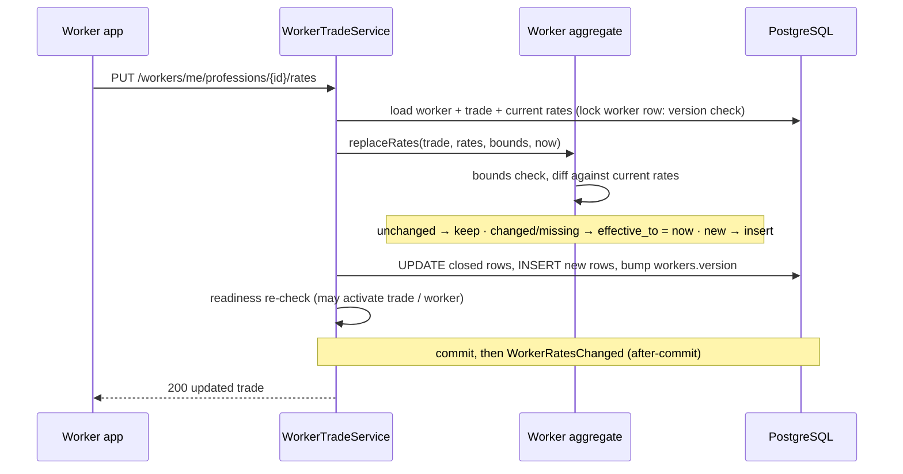
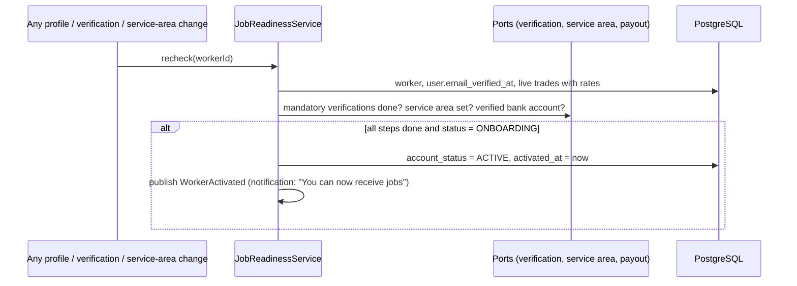

# LLD-004: Worker Profile — Trades, Rates, Skills and Job Readiness

| Field | Value |
|---|---|
| Status | Draft |
| Owner | TBD |
| Reviewers | TBD |
| Module | `worker` |
| Parent HLD | [architecture/03 §10, §14–14.2](../architecture/03-erd-and-production-database-design.md), [architecture/04 Worker](../architecture/04-domain-model-aggregates-and-state-machines.md), [modules/09](../modules/09-search-discovery-and-worker-profile.md), [modules/07](../modules/07-trust-verification-reputation-and-reviews.md) |
| Requirements | FR-WRK-001, FR-WRK-002, FR-WRK-003 |
| Depends on | LLD-001 (worker row created at sign-up), LLD-003 (`CatalogLookup`) |
| Used by | Matching (LLD-007), shortlist (LLD-008), booking rate snapshot (LLD-009) |
| Last updated | 2026-10-03 |

---

## 1. Context & scope

A worker's profile says **what they do and what they charge**: one or more trades (one primary), experience per trade, rates per trade (visit charge, daily wage, per sq ft…), skills within each trade, and the languages they speak. Many workers have low literacy and use cheap Android phones, so the app guides them through a short checklist until they are ready to receive jobs.

**In scope**

- Worker profile basics (display name, bio, spoken languages)
- Trades: add, change primary, change experience, pause, remove
- Rates per trade with history
- Skills per trade
- Job-readiness checklist and automatic `ONBOARDING → ACTIVE`
- Public worker profile view used by customers and the shortlist
- Reacting to a trade being deactivated in the catalog

**Out of scope:** verification documents (verification LLD), service area and live location (matching LLD-007), online/offline availability (availability LLD), profile photo upload (media LLD), payout accounts (payouts LLD), ratings (reviews LLD-012).

**Decisions**

| # | Decision | Default (configurable) |
|---|---|---|
| D1 | A worker can hold up to **3 trades**; exactly one is primary. | 3 |
| D2 | A trade can only be **ACTIVE** (receive jobs) if it has at least one current rate. | — |
| D3 | Rates are edited **per trade as a full list** (`PUT …/professions/{id}/rates`); changed rates close the old row and insert a new one; unchanged rates are left alone. | — |
| D4 | Rates must be within **sanity bounds** per rate type (catches typos like ₹85,000/day). Bounds live in config, not code. | table in §3 |
| D5 | `account_status` moves `ONBOARDING → ACTIVE` **automatically** when the readiness checklist is complete; admins only suspend / reinstate. | — |
| D6 | Bio and display name may not contain phone numbers, emails or links. | Keeps bookings on the platform (product/01 Scenario K). |
| D7 | Profile change events are **best-effort** after-commit Spring events (search projection, matching cache); a nightly job reconciles. | [ADR 0005](../adr/0005-async-events-and-transactional-outbox.md) — not money or bookings, so no outbox. |
| D8 | A **verified bank account** (IFSC, penny-drop) is required before a worker's first job, even for cash-only workers; a UPI ID can be added as an extra payout option. | Decided by product owner (2026-10-03). |

---

## 2. Classes / components

```text
com.karigar.worker
├── api/
│   ├── WorkerProfileController       -- /api/v1/workers/me/**
│   ├── PublicWorkerController        -- GET /api/v1/workers/{workerId}
│   └── dto/ WorkerProfileView, PublicWorkerView, UpdateProfileRequest, ProfessionsRequest,
│            RatesRequest, SkillsRequest, ReadinessView
├── application/
│   ├── WorkerProfileService          -- basics, spoken languages
│   ├── WorkerTradeService            -- professions, rates, skills
│   ├── JobReadinessService           -- checklist + auto-activation
│   ├── PublicWorkerQueryService      -- read model for customers / shortlist
│   ├── WorkerProfileOnRegistration   -- @EventListener(UserRegistered) from LLD-001
│   ├── PauseTradesOnCatalogChange    -- @EventListener(CatalogChanged) from LLD-003
│   └── port/
│       ├── CatalogLookup             -- LLD-003 public API
│       ├── VerificationStatusLookup  -- mandatory checks per trade (verification LLD)
│       ├── ServiceAreaLookup         -- has a service area (LLD-007)
│       ├── ReputationLookup          -- rating, jobs done (LLD-012)
│       └── ContactInfoDetector       -- phone / email / URL patterns
├── domain/
│   ├── Worker                        -- aggregate root: profile, professions, rates, skills
│   ├── WorkerProfession              -- trade link: primary, experience, status
│   ├── WorkerRate                    -- rate row with effective_from / effective_to
│   ├── RateType, RateUnit, WorkerStatus, TradeStatus
│   ├── RateBounds                    -- min/max per rate type (from config)
│   └── event/ WorkerProfileUpdated, WorkerTradesChanged, WorkerRatesChanged, WorkerActivated
└── infrastructure/persistence/  JPA entities, repositories, PublicWorkerQuery (native SQL projection)
```

The `Worker` aggregate owns its trades, rates and skills; every change goes through it so the rules hold together:

```java
public final class Worker {
    private final WorkerId id;
    private final UserId userId;
    private String displayName;
    private String bio;
    private WorkerStatus status;                       // ONBOARDING | ACTIVE | SUSPENDED | DEACTIVATED
    private final Map<ProfessionId, WorkerProfession> professions;
    private long version;

    public void replaceProfessions(List<TradeInput> input, CatalogLookup catalog, int maxTrades, Instant now) {
        long live = input.stream().filter(t -> t.status() != TradeStatus.REMOVED).count();
        if (live > maxTrades) throw new TooManyTrades(maxTrades);
        if (live > 0 && input.stream().filter(TradeInput::isPrimary).count() != 1) throw new PrimaryTradeRequired();
        for (TradeInput t : input) {
            if (!catalog.isActiveProfession(t.professionId())) throw new ProfessionNotAvailable(t.professionId());
            professions.computeIfAbsent(t.professionId(), id -> WorkerProfession.add(this.id, id, now))
                       .update(t.isPrimary(), t.experienceYears(), t.status(), now);
        }
        // trades missing from the list are removed (rates closed, skills cleared)
        professions.values().stream()
                .filter(p -> input.stream().noneMatch(t -> t.professionId().equals(p.professionId())))
                .forEach(p -> p.remove(now));
        events.add(new WorkerTradesChanged(id, now));
    }

    public void replaceRates(ProfessionId trade, List<RateInput> rates, RateBounds bounds, Instant now) {
        WorkerProfession p = liveProfession(trade);
        rates.forEach(r -> bounds.check(r.type(), r.unit(), r.amountMinor()));   // RATE_OUT_OF_RANGE / UNIT_REQUIRED
        p.replaceRates(rates, now);   // close changed/missing rows, insert new ones, keep identical ones
        if (p.currentRates().isEmpty() && p.status() == TradeStatus.ACTIVE) p.pause(now);  // D2
        events.add(new WorkerRatesChanged(id, trade, now));
    }
}
```

---

## 3. Data model

From the ERD ([§10, §14–14.2](../architecture/03-erd-and-production-database-design.md)) plus `worker_spoken_languages`, which this LLD adds (now also in the ERD).

```sql
-- V3_1__worker_profile.sql
CREATE TABLE workers (
    id                  UUID PRIMARY KEY,
    user_id             UUID NOT NULL UNIQUE REFERENCES users (id),
    display_name        VARCHAR(100) NOT NULL,
    bio                 VARCHAR(500),
    account_status      VARCHAR(20) NOT NULL DEFAULT 'ONBOARDING'
                        CHECK (account_status IN ('ONBOARDING','ACTIVE','SUSPENDED','DEACTIVATED')),
    verification_status VARCHAR(20) NOT NULL DEFAULT 'UNVERIFIED'
                        CHECK (verification_status IN ('UNVERIFIED','PARTIAL','VERIFIED')),
    activated_at        TIMESTAMPTZ,
    created_at          TIMESTAMPTZ NOT NULL,
    updated_at          TIMESTAMPTZ NOT NULL,
    deactivated_at      TIMESTAMPTZ,
    version             BIGINT NOT NULL DEFAULT 0
);

CREATE TABLE worker_professions (
    worker_id        UUID NOT NULL REFERENCES workers (id),
    profession_id    UUID NOT NULL REFERENCES professions (id),
    is_primary       BOOLEAN NOT NULL DEFAULT false,
    experience_years SMALLINT NOT NULL CHECK (experience_years BETWEEN 0 AND 60),
    status           VARCHAR(20) NOT NULL CHECK (status IN ('ACTIVE','PAUSED','REMOVED')),
    verified_at      TIMESTAMPTZ,
    created_at       TIMESTAMPTZ NOT NULL,
    updated_at       TIMESTAMPTZ NOT NULL,
    PRIMARY KEY (worker_id, profession_id),
    CHECK (NOT (is_primary AND status = 'REMOVED'))
);
CREATE UNIQUE INDEX ux_worker_primary_profession
    ON worker_professions (worker_id) WHERE is_primary;
CREATE INDEX ix_worker_professions_profession
    ON worker_professions (profession_id, worker_id) WHERE status = 'ACTIVE';

CREATE TABLE worker_rates (
    id             UUID PRIMARY KEY,
    worker_id      UUID NOT NULL,
    profession_id  UUID NOT NULL,
    rate_type      VARCHAR(20) NOT NULL
                   CHECK (rate_type IN ('VISIT','HOURLY','HALF_DAY','DAILY','PER_UNIT','MINIMUM')),
    unit           VARCHAR(20)
                   CHECK (unit IN ('SQ_FT','RUNNING_FT','POINT','PIECE','TAP','FIXTURE','KG','TANK')),
    amount_minor   BIGINT NOT NULL CHECK (amount_minor > 0),
    currency       CHAR(3) NOT NULL DEFAULT 'INR',
    note           VARCHAR(200),
    effective_from TIMESTAMPTZ NOT NULL,
    effective_to   TIMESTAMPTZ,
    created_at     TIMESTAMPTZ NOT NULL,
    FOREIGN KEY (worker_id, profession_id) REFERENCES worker_professions (worker_id, profession_id),
    CHECK ((rate_type = 'PER_UNIT') = (unit IS NOT NULL)),
    CHECK (effective_to IS NULL OR effective_to > effective_from)
);
CREATE UNIQUE INDEX ux_worker_rates_current
    ON worker_rates (worker_id, profession_id, rate_type, COALESCE(unit, ''))
    WHERE effective_to IS NULL;

CREATE TABLE worker_skills (
    worker_id     UUID NOT NULL,
    profession_id UUID NOT NULL,
    skill_id      UUID NOT NULL,
    verified      BOOLEAN NOT NULL DEFAULT false,
    created_at    TIMESTAMPTZ NOT NULL,
    PRIMARY KEY (worker_id, skill_id),
    FOREIGN KEY (worker_id, profession_id) REFERENCES worker_professions (worker_id, profession_id),
    FOREIGN KEY (skill_id, profession_id)  REFERENCES skills (id, profession_id)
);

CREATE TABLE worker_spoken_languages (
    worker_id     UUID NOT NULL REFERENCES workers (id),
    language_code VARCHAR(3) NOT NULL,              -- ISO 639: bn, hi, ur, or, en, ne …
    PRIMARY KEY (worker_id, language_code)
);
```

Spoken languages are separate from `supported_locales` (LLD-003): a worker may speak Urdu or Odia even if the app isn't translated into them. Customers can see them, and matching can prefer a shared language later.

**Rate sanity bounds** (config `karigar.worker.rate-bounds`, amounts in rupees for readability):

| rate_type | min | max |
|---|---|---|
| VISIT | ₹50 | ₹2,000 |
| HOURLY | ₹50 | ₹2,000 |
| HALF_DAY | ₹200 | ₹5,000 |
| DAILY | ₹300 | ₹10,000 |
| PER_UNIT | ₹1 | ₹10,000 |
| MINIMUM | ₹50 | ₹5,000 |

---

## 4. API contract

All endpoints need a worker access token, except the public profile.

| Method | Path | Purpose |
|---|---|---|
| GET | `/api/v1/workers/me` | full own profile with trades, rates, skills, languages, readiness summary |
| PATCH | `/api/v1/workers/me` | `displayName`, `bio`, `spokenLanguages`, `acceptsEmergencyJobs` (only with a verified POLICE_VERIFICATION; [LLD-006](lld-006-create-service-request.md) D5) |
| PUT | `/api/v1/workers/me/professions` | full list of trades |
| PUT | `/api/v1/workers/me/professions/{professionId}/rates` | full list of rates for one trade |
| PUT | `/api/v1/workers/me/professions/{professionId}/skills` | full list of skill ids for one trade |
| GET | `/api/v1/workers/me/readiness` | checklist to start receiving jobs |
| GET | `/api/v1/workers/{workerId}` | public profile (customers, shortlist) |

`PUT /workers/me/professions`:

```json
{
  "professions": [
    { "professionId": "…raj-mistri", "isPrimary": true,  "experienceYears": 12, "status": "ACTIVE" },
    { "professionId": "…tiles-mistri", "isPrimary": false, "experienceYears": 4, "status": "ACTIVE" }
  ],
  "version": 7
}
```

A trade missing from the list is removed. A newly added trade with no rate is stored as `PAUSED` until a rate is added (D2), and the response says so.

`PUT /workers/me/professions/{rajMistriId}/rates`:

```json
{
  "rates": [
    { "rateType": "DAILY",    "amountMinor": 85000 },
    { "rateType": "HALF_DAY", "amountMinor": 45000, "note": "Up to 4 hours" }
  ]
}
```

`GET /workers/me/readiness`:

```json
{
  "data": {
    "readyForJobs": false,
    "status": "ONBOARDING",
    "steps": [
      { "code": "EMAIL_VERIFIED",        "done": true },
      { "code": "PROFILE_BASICS",        "done": true },
      { "code": "TRADE_WITH_RATE",       "done": true },
      { "code": "SERVICE_AREA",          "done": false },
      { "code": "MANDATORY_VERIFICATIONS", "done": false, "missing": ["AADHAAR_EKYC", "SELFIE_MATCH"] },
      { "code": "BANK_ACCOUNT_VERIFIED", "done": false }
    ]
  }
}
```

Step labels are localized by the backend (LLD-003); the app shows them as a simple checklist with icons.

`GET /workers/{workerId}` (public):

```json
{
  "data": {
    "workerId": "…", "displayName": "Rahim Sheikh", "photoUrl": "https://…",
    "trades": [
      { "name": "রাজমিস্ত্রি", "isPrimary": true, "experienceYears": 12,
        "rates": [ { "rateType": "DAILY", "amountMinor": 85000 }, { "rateType": "HALF_DAY", "amountMinor": 45000 } ],
        "skills": ["প্লাস্টার", "ইটের গাঁথনি"] }
    ],
    "spokenLanguages": ["bn", "hi"],
    "badges": ["ID_VERIFIED"],
    "rating": { "average": 4.6, "count": 38 },
    "jobsCompleted": 52,
    "memberSince": "2026-10"
  }
}
```

Never returned publicly: phone, email, user id, exact location, payout details, verification documents, `PAUSED`/`REMOVED` trades. Only `ACTIVE` workers are visible publicly (others → 404).

**Error codes**

| HTTP | `error.code` | When |
|---|---|---|
| 400 | `VALIDATION_ERROR` | name length, bio > 500, experience out of range, unknown language code |
| 400 | `CONTACT_INFO_NOT_ALLOWED` | phone number / email / link in name or bio |
| 404 | `WORKER_NOT_FOUND` | public profile of a non-active worker |
| 409 | `CONCURRENT_UPDATE` | `version` mismatch |
| 422 | `PROFESSION_NOT_AVAILABLE` | trade inactive in the catalog |
| 422 | `TOO_MANY_TRADES` | more than 3 live trades |
| 422 | `PRIMARY_TRADE_REQUIRED` | not exactly one primary among live trades |
| 422 | `TRADE_NOT_REGISTERED` | rates/skills for a trade the worker doesn't have |
| 422 | `RATE_OUT_OF_RANGE` | outside sanity bounds (`details.min`, `details.max`) |
| 422 | `UNIT_REQUIRED` | `PER_UNIT` without unit, or unit on another rate type |
| 422 | `SKILL_NOT_IN_TRADE` | skill belongs to another trade |

---

## 5. Sequence diagrams

### 5.1 Update rates



### 5.2 Readiness and auto-activation



`recheck` also sets `worker_professions.job_eligible` per trade (trade ACTIVE and its mandatory verifications valid) — the flag the matching query filters on ([LLD-007](lld-007-matching-candidate-search.md)). `recheck` runs after the worker's own changes and on events from the verification, service-area and payout modules (`VerificationStatusChanged`, `ServiceAreaChanged`, `PayoutAccountVerified`).

---

## 6. State transitions

**Worker account (`workers.account_status`)**

| From | Event | Guard | To |
|---|---|---|---|
| — | `UserRegistered` (role WORKER) | — | ONBOARDING |
| ONBOARDING | readiness recheck | all steps done | ACTIVE |
| ACTIVE | admin suspend / strike threshold ([modules/07](../modules/07-trust-verification-reputation-and-reviews.md)) | — | SUSPENDED |
| SUSPENDED | admin reinstate | — | ACTIVE |
| ONBOARDING / ACTIVE | worker deactivates account | no live booking | DEACTIVATED |

An ACTIVE worker whose mandatory verification expires stays ACTIVE but that trade is excluded from matching until renewed (verification LLD).

**Worker trade (`worker_professions.status`)**

| From | Event | Guard | To |
|---|---|---|---|
| — | add trade | trade active in catalog, ≤ 3 live | ACTIVE if it has a rate, else PAUSED |
| PAUSED | rate added / worker resumes | ≥ 1 current rate, catalog trade active | ACTIVE |
| ACTIVE | worker pauses / last rate removed / catalog trade deactivated | — | PAUSED |
| ACTIVE / PAUSED | removed from list | not primary (or another primary set in same request) | REMOVED (rates closed, skills deleted) |
| REMOVED | added again | as for add | ACTIVE / PAUSED |

---

## 7. Error handling, idempotency & concurrency

- All `PUT` endpoints are naturally idempotent (full replacement); sending the same body twice changes nothing and creates no new rate rows (diff by type + unit + amount + note).
- **Concurrent edits** from two phones: `workers.version` optimistic lock; the second gets `409 CONCURRENT_UPDATE` and the app reloads.
- DB backstops: `ux_worker_primary_profession` (two primaries impossible), `ux_worker_rates_current` (two current rates of the same type impossible), composite FKs (skill outside trade impossible, rate for unregistered trade impossible).
- Bookings are never affected by later edits: they store a rate snapshot (LLD-009).
- `CatalogChanged` with a deactivated trade → `PauseTradesOnCatalogChange` sets matching `worker_professions` to `PAUSED` in batches of 500; idempotent.
- Best-effort events lost on crash → nightly reconcile rebuilds the search projection for workers changed in the last 24 h.

---

## 8. Security & privacy

- A worker can only change their own profile: the worker id is taken from the token (`sub` → worker), never from the request.
- `ContactInfoDetector` rejects Indian mobile numbers (with spaces, dashes, +91, or written with mixed digits), emails, URLs and "WhatsApp me" style phrases in name and bio; the rule list is config so ops can extend it.
- Public profile returns the fields in §4 only; display name is shown as entered (workers often use first name + initial).
- Rate history is personal business data of the worker: visible to the worker and admins, not to customers (customers see current rates only).
- Admin changes to a worker profile write `audit_events`.

---

## 9. Observability

| Type | Name | Notes |
|---|---|---|
| Counter | `worker_profile_update_total{part, result}` | part = basics, professions, rates, skills |
| Counter | `worker_activated_total` | workers reaching ACTIVE |
| Histogram | `worker_onboarding_duration_days` | sign-up → ACTIVE; shows where onboarding stalls |
| Gauge | `worker_readiness_step_pending{step}` | how many ONBOARDING workers are stuck on each step |
| Counter | `worker_contact_info_rejected_total` | bios with phone numbers etc. |

Alert: no worker activated in 7 days during pilot (onboarding broken); `RATE_OUT_OF_RANGE` > 20 % of rate saves (bounds wrong for the market).

---

## 10. Test plan

| Level | Cases |
|---|---|
| Unit (aggregate) | 4th trade → `TOO_MANY_TRADES`; zero / two primaries → `PRIMARY_TRADE_REQUIRED`; trade without rate is PAUSED; rate diff keeps unchanged rows, closes changed ones; bounds per type; `PER_UNIT` needs unit |
| Unit (detector) | `98765 43210`, `+91-98765-43210`, `nine eight…` style, emails, `wa.me/…` rejected; normal text like "12 years experience, 2BHK" accepted |
| Integration (Testcontainers) | sign-up as worker → ONBOARDING row; add raj mistri + tiles mistri with rates and skills; skill from another trade → FK error mapped to 422; removing primary without new primary → 422 |
| Readiness | completing the last step (e.g. verification event) activates the worker exactly once and emits `WorkerActivated` |
| Concurrency | two parallel `PUT /professions` with same version → one 200, one 409; two parallel rate saves never produce two current rates |
| Catalog | deactivating a trade pauses all worker trades for it; re-activating does not auto-resume (worker must resume) |
| Public view | non-active worker → 404; response has no phone/email/userId; names localized |
| Contract | OpenAPI matches; error codes as listed |

---

## 11. Open questions

| Question | Default until decided | Owner | Due |
|---|---|---|---|
| Should rate bounds differ per trade (e.g. welder vs jogare daily rate)? | Per rate type only | TBD | After 1 month of data |
| Show a "typical rate in your area" hint while workers set rates? | Later, from completed-job data | TBD | Phase 2 |
| Allow helpers (jogare) as linked sub-profiles of a raj mistri's team? | No; helpers are counted on bookings ([ERD §35](../architecture/03-erd-and-production-database-design.md)) | TBD | Phase 2 |

---

## Change log

| Version | Date | Author | Change |
|---|---|---|---|
| 0.1 | 2026-10-03 | TBD | First draft |
