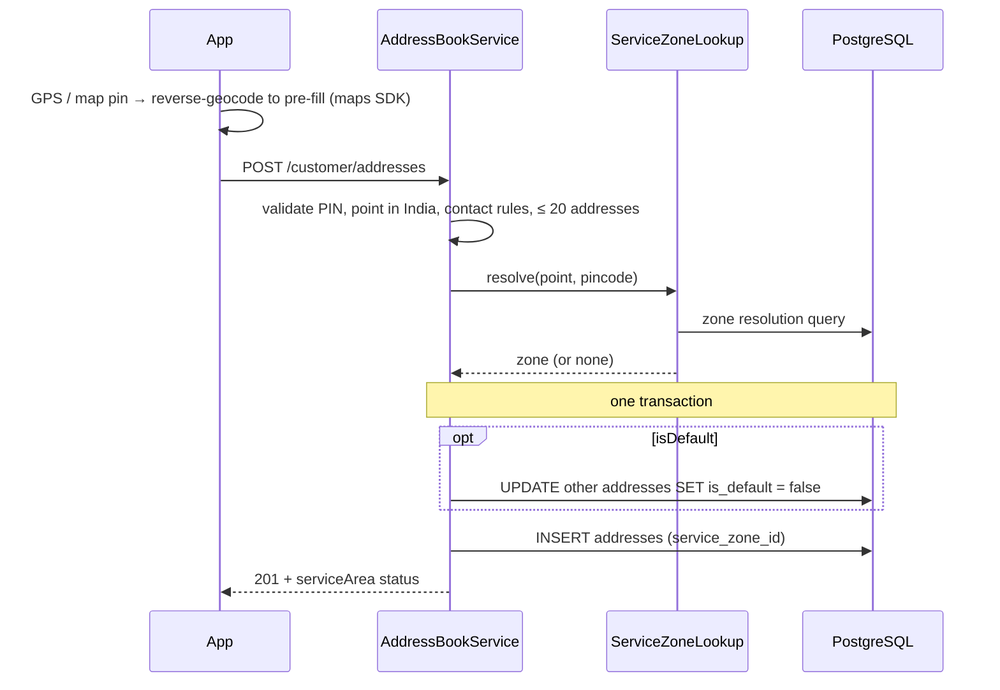
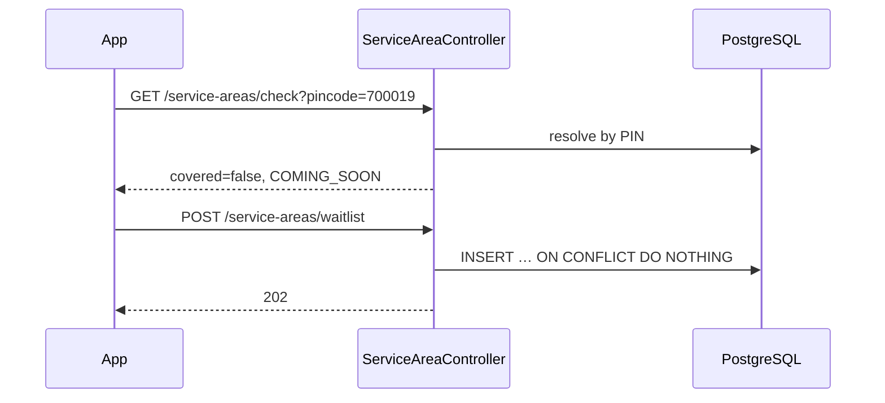

# LLD-005: Customer Address Book and Service-Area Check

| Field | Value |
|---|---|
| Status | Draft |
| Owner | TBD |
| Reviewers | TBD |
| Module | `customer` (addresses) + `catalog` (service zones, reference data) |
| Parent HLD | [architecture/03 §22–23.1](../architecture/03-erd-and-production-database-design.md), [security/03 §100 third-party data](../security/03-data-privacy-pii-retention-and-compliance.md) |
| Requirements | FR-CUS-003 (manage addresses, service areas) |
| Depends on | LLD-001 (customer row created at sign-up), LLD-003 (localized labels) |
| Used by | LLD-006 (service request uses a saved address + snapshot), LLD-007 (matching uses the location) |
| Last updated | 2026-10-03 |

---

## 1. Context & scope

Customers keep an **address book of service locations**. An address is not "the customer's address": it can be their own home, a parent's flat, a rented-out property or a shop. Each address says whose place it is and who to contact on site. A request can only be placed for a **saved** address in an **active service zone** (Howrah at launch).

**In scope**

- Address book CRUD, default address, soft delete
- Validation of Indian addresses (PIN, floor, lift, contact for someone else's place)
- Service zones: resolution from location / PIN, public coverage check, admin management
- "Notify me when you launch here" waitlist for uncovered areas

**Out of scope:** the service request and its address snapshot (LLD-006), what the worker sees and when (LLD-007/008/009), map rendering and reverse geocoding (done in the app with the maps SDK).

**Decisions**

| # | Decision | Default (configurable) |
|---|---|---|
| D1 | Location comes from the app (GPS or the customer moving a map pin); the app may reverse-geocode to pre-fill fields. The backend never calls a geocoding API in MVP. | No paid geocoding dependency at pilot. |
| D2 | Zone resolution: **boundary polygon if any zone has one, else PIN code**. Stored on the address for display, but **re-resolved when a request is created** (LLD-006) so zone changes apply immediately. | — |
| D3 | An address outside an active zone **can be saved** (customer may be planning ahead); only placing a request is blocked. | — |
| D4 | Someone else's place (`address_for ≠ SELF`) needs a contact name + Indian mobile, and the customer confirms they have that person's permission. | [security/03 §100](../security/03-data-privacy-pii-retention-and-compliance.md) |
| D5 | Max **20** live addresses per customer; deleting is a soft delete. | 20 |
| D6 | No automatic new default when the default address is deleted; the app asks next time. | Avoids surprising a customer by booking at the wrong place. |

---

## 2. Classes / components

```text
com.karigar.customer
├── api/
│   ├── AddressController              -- /api/v1/customer/addresses/**
│   └── dto/ AddressRequest, AddressView, ServiceAreaView
├── application/
│   ├── AddressBookService
│   ├── CustomerProfileOnRegistration  -- @EventListener(UserRegistered), role CUSTOMER (LLD-001)
│   └── port/ ServiceZoneLookup        -- catalog public API: resolve(point, pincode)
├── domain/
│   ├── Address                        -- entity owned by the customer's address book
│   ├── AddressFor                     -- SELF | FAMILY | RELATIVE | TENANT | BUSINESS | OTHER
│   ├── PropertyType                   -- FLAT | INDEPENDENT_HOUSE | SHOP | OFFICE | OTHER
│   ├── valueobject/ Pincode, GeoPoint, SiteContact, FloorInfo
│   └── event/ AddressSaved, AddressDeleted   -- payload: customerId, addressId only, never the address text or location
└── infrastructure/persistence/

com.karigar.catalog.servicezone
├── api/ ServiceAreaController (public), AdminServiceZoneController
├── application/ ServiceZoneService   -- implements ServiceZoneLookup; waitlist
├── domain/ ServiceZone, ZoneStatus (ACTIVE | COMING_SOON | INACTIVE)
└── infrastructure/ ZoneResolverQuery (PostGIS), GeoJsonBoundaryParser
```

Value-object rules:

```java
public record Pincode(String value) {
    private static final Pattern P = Pattern.compile("^[1-9][0-9]{5}$");
    public Pincode { if (!P.matcher(value).matches()) throw new InvalidPincode(value); }
}

public record GeoPoint(double lat, double lng) {
    public GeoPoint {   // rough India bounding box; rejects swapped lat/lng and (0,0)
        if (lat < 6.0 || lat > 37.5 || lng < 68.0 || lng > 97.5) throw new LocationOutsideIndia(lat, lng);
    }
}

public record SiteContact(String name, PhoneNumber phone) {}   // PhoneNumber from LLD-001 (E.164, Indian mobile)
```

---

## 3. Data model

From [ERD §22–23.1](../architecture/03-erd-and-production-database-design.md), plus `service_area_waitlist` and `contact_consent_confirmed_at`, which this LLD adds (now also in the ERD).

```sql
-- V4_1__customer_addresses.sql
CREATE TABLE customers (
    id          UUID PRIMARY KEY,
    user_id     UUID NOT NULL UNIQUE REFERENCES users (id),
    created_at  TIMESTAMPTZ NOT NULL,
    updated_at  TIMESTAMPTZ NOT NULL
);

CREATE TABLE service_zones (
    id           UUID PRIMARY KEY,
    code         VARCHAR(40)  NOT NULL UNIQUE,
    name         VARCHAR(100) NOT NULL,
    city         VARCHAR(60)  NOT NULL,
    district     VARCHAR(60)  NOT NULL,
    state_code   CHAR(2)      NOT NULL,
    boundary     geography(MultiPolygon, 4326),
    status       VARCHAR(20)  NOT NULL CHECK (status IN ('ACTIVE','COMING_SOON','INACTIVE')),
    launched_at  TIMESTAMPTZ,
    created_at   TIMESTAMPTZ  NOT NULL,
    updated_at   TIMESTAMPTZ  NOT NULL
);
CREATE INDEX ix_service_zones_boundary ON service_zones USING GIST (boundary);

CREATE TABLE service_zone_pincodes (
    service_zone_id UUID    NOT NULL REFERENCES service_zones (id),
    pincode         CHAR(6) NOT NULL CHECK (pincode ~ '^[1-9][0-9]{5}$'),
    PRIMARY KEY (service_zone_id, pincode)
);
CREATE INDEX ix_service_zone_pincodes_pin ON service_zone_pincodes (pincode);

CREATE TABLE addresses (
    id                   UUID PRIMARY KEY,
    customer_id          UUID NOT NULL REFERENCES customers (id),
    label                VARCHAR(40)  NOT NULL,
    address_for          VARCHAR(20)  NOT NULL
                         CHECK (address_for IN ('SELF','FAMILY','RELATIVE','TENANT','BUSINESS','OTHER')),
    contact_name         VARCHAR(100),
    contact_phone        VARCHAR(16),
    contact_consent_confirmed_at TIMESTAMPTZ,      -- customer confirmed permission to share contact
    property_type        VARCHAR(20)  NOT NULL
                         CHECK (property_type IN ('FLAT','INDEPENDENT_HOUSE','SHOP','OFFICE','OTHER')),
    house_no             VARCHAR(50)  NOT NULL,
    building_name        VARCHAR(100),
    street               VARCHAR(150),
    locality             VARCHAR(100) NOT NULL,
    landmark             VARCHAR(150),
    city                 VARCHAR(60)  NOT NULL,
    district             VARCHAR(60)  NOT NULL,
    state_code           CHAR(2)      NOT NULL,
    pincode              CHAR(6)      NOT NULL,
    floor_number         SMALLINT,
    has_lift             BOOLEAN,
    location             geography(Point, 4326) NOT NULL,
    location_source      VARCHAR(20)  NOT NULL CHECK (location_source IN ('GPS','MAP_PIN','GEOCODED')),
    location_accuracy_m  INTEGER,
    service_zone_id      UUID REFERENCES service_zones (id),
    is_default           BOOLEAN      NOT NULL DEFAULT false,
    created_at           TIMESTAMPTZ  NOT NULL,
    updated_at           TIMESTAMPTZ  NOT NULL,
    deleted_at           TIMESTAMPTZ,
    version              BIGINT       NOT NULL DEFAULT 0,
    CONSTRAINT ck_addresses_pincode CHECK (pincode ~ '^[1-9][0-9]{5}$'),
    CONSTRAINT ck_addresses_floor   CHECK (floor_number BETWEEN -2 AND 100),
    CONSTRAINT ck_addresses_contact_phone CHECK (contact_phone IS NULL OR contact_phone ~ '^\+[1-9][0-9]{7,14}$'),
    CONSTRAINT ck_addresses_contact_required CHECK (
        address_for = 'SELF'
        OR (contact_name IS NOT NULL AND contact_phone IS NOT NULL AND contact_consent_confirmed_at IS NOT NULL))
);
CREATE UNIQUE INDEX ux_addresses_default ON addresses (customer_id) WHERE is_default AND deleted_at IS NULL;
CREATE INDEX ix_addresses_customer ON addresses (customer_id) WHERE deleted_at IS NULL;

CREATE TABLE service_area_waitlist (
    id          UUID PRIMARY KEY,
    user_id     UUID REFERENCES users (id),          -- NULL when not logged in
    email       VARCHAR(254),
    pincode     CHAR(6) NOT NULL,
    location    geography(Point, 4326),
    created_at  TIMESTAMPTZ NOT NULL,
    notified_at TIMESTAMPTZ,
    CHECK (user_id IS NOT NULL OR email IS NOT NULL)
);
CREATE UNIQUE INDEX ux_waitlist_user_pin  ON service_area_waitlist (user_id, pincode) WHERE user_id IS NOT NULL;
CREATE UNIQUE INDEX ux_waitlist_email_pin ON service_area_waitlist (lower(email), pincode) WHERE email IS NOT NULL;
```

**Zone resolution query** (one round trip):

```sql
WITH by_boundary AS (
    SELECT id, status, 1 AS priority
    FROM service_zones
    WHERE boundary IS NOT NULL AND ST_Covers(boundary, ST_SetSRID(ST_MakePoint(:lng, :lat), 4326)::geography)
), by_pin AS (
    SELECT z.id, z.status, 2 AS priority
    FROM service_zone_pincodes p JOIN service_zones z ON z.id = p.service_zone_id
    WHERE p.pincode = :pincode
)
SELECT id, status FROM (SELECT * FROM by_boundary UNION ALL SELECT * FROM by_pin) z
ORDER BY priority, CASE status WHEN 'ACTIVE' THEN 0 WHEN 'COMING_SOON' THEN 1 ELSE 2 END
LIMIT 1;
```

Note `ST_MakePoint(lng, lat)` — longitude first.

**Seed** (`V4_2__service_zones_seed.sql`): the Howrah zones and Kolkata `COMING_SOON` from [ERD §23.1](../architecture/03-erd-and-production-database-design.md). **PIN codes must be checked against the India Post directory before this migration is merged.** Boundaries are added later through the admin API.

---

## 4. API contract

### 4.1 Customer address book (customer token)

| Method | Path | Purpose |
|---|---|---|
| GET | `/api/v1/customer/addresses` | live addresses, default first |
| POST | `/api/v1/customer/addresses` | create → `201` |
| PATCH | `/api/v1/customer/addresses/{id}` | edit (send `version`) |
| DELETE | `/api/v1/customer/addresses/{id}` | soft delete → `204` |
| POST | `/api/v1/customer/addresses/{id}/default` | make default → `200` |

Create request: as in [api/01 §15](../api/01-rest-api-contract-endpoints-and-error-model.md), plus `"contactConsentConfirmed": true` when `addressFor ≠ SELF`, and optional `"locationAccuracyM": 18`.

Response:

```json
{
  "data": {
    "id": "…", "label": "Maa's flat", "addressFor": "FAMILY",
    "contactName": "Anjali Das", "contactPhone": "+919830012345",
    "formattedAddress": "Flat 3B, Shanti Apartment, 14/2 G.T. Road, Shibpur, near Shibpur Bazar bus stop, Howrah, WB 711102",
    "floorNumber": 2, "hasLift": false, "propertyType": "FLAT",
    "latitude": 22.5664, "longitude": 88.3097,
    "serviceArea": { "code": "HWH-SHIBPUR", "name": "Shibpur", "status": "ACTIVE" },
    "isDefault": true, "version": 0
  }
}
```

`formattedAddress` is built by the backend: non-empty parts in the order house no, building, street, locality, landmark (prefixed "near" only if the customer didn't write it), city, state code, PIN.

### 4.2 Service area (public)

| Method | Path | Purpose |
|---|---|---|
| GET | `/api/v1/service-areas/check?pincode=711102` | coverage by PIN |
| GET | `/api/v1/service-areas/check?latitude=22.56&longitude=88.31&pincode=711102` | coverage by location (+ PIN fallback) |
| POST | `/api/v1/service-areas/waitlist` | `{ "pincode": "700019", "email": "…" }` (email optional when logged in) → `202` |

```json
{ "data": { "covered": false, "status": "COMING_SOON", "areaName": "Kolkata Central",
            "message": "আমরা শীঘ্রই আপনার এলাকায় আসছি" } }
```

`message` is localized by the backend (LLD-003).

### 4.3 Admin (`service_zone.manage` permission)

| Method | Path | Purpose |
|---|---|---|
| POST / PATCH | `/api/v1/admin/service-zones[/{id}]` | create / edit zone |
| PUT | `/api/v1/admin/service-zones/{id}/pincodes` | full PIN list |
| PUT | `/api/v1/admin/service-zones/{id}/boundary` | GeoJSON MultiPolygon (validated with `ST_IsValid`) |
| POST | `/api/v1/admin/service-zones/{id}/status` | `ACTIVE` / `COMING_SOON` / `INACTIVE` |
| GET | `/api/v1/admin/service-zones/waitlist?pincode=…` | demand by PIN |

When a zone becomes `ACTIVE`, the status change transaction writes one outbox event `WaitlistAreaLaunched {waitlistEntryId, userId?, zoneId}` per waitlist entry for its PINs with `notified_at IS NULL`, and sets `notified_at` in the same transaction; [LLD-013](lld-013-notifications.md) sends "We're now in your area" (push / inbox for a user, email for a logged-out entry, resolved from `waitlistEntryId`). No email or PIN in the payload (LLD-022 D8).

### 4.4 Error codes

| HTTP | `error.code` | When |
|---|---|---|
| 400 | `VALIDATION_ERROR` | missing required fields, lengths, floor out of range |
| 400 | `INVALID_PINCODE` | not 6 digits / starts with 0 |
| 400 | `LOCATION_OUTSIDE_INDIA` | point outside India bounds (often swapped lat/lng) |
| 400 | `SITE_CONTACT_REQUIRED` | `addressFor ≠ SELF` without name, valid mobile or consent confirmation |
| 404 | `ADDRESS_NOT_FOUND` | not the customer's, or deleted |
| 409 | `CONCURRENT_UPDATE` | stale `version` |
| 422 | `ADDRESS_LIMIT_REACHED` | more than 20 live addresses |
| 422 | `INVALID_ZONE_BOUNDARY` | admin GeoJSON invalid or not a (Multi)Polygon |

`SERVICE_AREA_NOT_AVAILABLE` is returned by LLD-006 when a request is placed, not here (D3).

---

## 5. Sequence diagrams

### 5.1 Save an address



### 5.2 Coverage check before the customer types an address



---

## 6. State transitions

**Address**

| From | Event | Guard | To |
|---|---|---|---|
| — | create | valid, ≤ 20 live | LIVE |
| LIVE | edit | owner, version matches | LIVE (zone re-resolved if location or PIN changed) |
| LIVE | delete | owner | DELETED (`deleted_at`; `is_default` cleared) |

Deleting or editing never changes past or live service requests — they hold a snapshot (LLD-006).

**Service zone**

| From | Event | Guard | To |
|---|---|---|---|
| — | admin create | ≥ 1 PIN or a boundary | COMING_SOON |
| COMING_SOON | admin activate | — | ACTIVE (waitlist notified) |
| ACTIVE | admin pause | — | INACTIVE (new requests blocked; live jobs continue) |
| INACTIVE | admin reactivate | — | ACTIVE |

---

## 7. Error handling, idempotency & concurrency

- Setting a default: un-set others and set the new one in one transaction; `ux_addresses_default` guarantees at most one even under two parallel calls (the loser retries once, then 409).
- The 20-address limit is checked with the customer row locked (`SELECT … FROM customers WHERE id = ? FOR UPDATE`) so two parallel creates can't exceed it.
- `POST /customer/addresses` accepts `Idempotency-Key` (shared `idempotency_records`), because flaky mobile networks often resend.
- Waitlist inserts are idempotent through the unique indexes.
- Zone activation: `WaitlistAreaLaunched` outbox rows and `notified_at` are written in the activation transaction, so a retry or re-activation never notifies an entry twice (`WHERE notified_at IS NULL`).
- Zone changes: `addresses.service_zone_id` is refreshed by a nightly job and on `ServiceZoneChanged`; it is display-only — LLD-006 always re-resolves.
- PIN and boundary disagree (boundary says zone A, PIN listed in zone B): boundary wins; a `zone_pin_mismatch` metric is incremented so ops can fix the PIN lists.

---

## 8. Security & privacy

- Only the owning customer can read or change an address; ids are UUIDs and every query filters by `customer_id` from the token (`ADDRESS_NOT_FOUND`, not 403, for others' ids).
- **Third-party data** ([security/03 §100](../security/03-data-privacy-pii-retention-and-compliance.md)): the contact's name and phone are used only to coordinate the job; the app shows "Make sure Anjali Das is OK with us sharing her number with the worker" before saving; consent confirmation time is stored.
- Exact location, house number and contact phone are shown to a worker **only after the customer selects them** (LLD-008/009); before that, workers see locality and distance only.
- Deleted addresses are purged (personal fields nulled, location rounded to 3 decimals ≈ 100 m) 90 days after deletion unless a live request or legal hold references them (retention, security/03).
- Logs never contain full addresses or contact phones (log the address id and PIN only).

---

## 9. Observability

| Type | Name | Notes |
|---|---|---|
| Counter | `address_saved_total{address_for, covered}` | how often people book for others; coverage |
| Counter | `service_area_check_total{result}` | covered, coming_soon, not_served |
| Gauge | `service_area_waitlist_size{pincode}` | demand outside Howrah → expansion planning |
| Counter | `zone_pin_mismatch_total` | data quality |
| Histogram | `address_location_accuracy_m` | GPS quality; many > 100 m means pins need confirming |

---

## 10. Test plan

| Level | Cases |
|---|---|
| Unit | `Pincode` (711102 ok, 011102 / 71110 / 7111022 fail); `GeoPoint` (Howrah ok, swapped lat/lng fails, 0,0 fails); contact required unless SELF; formatted address assembly and "near" prefix |
| Integration (Testcontainers PostGIS) | save in Shibpur → ACTIVE zone; PIN 700019 → COMING_SOON; unknown PIN → no zone, still saved; boundary beats PIN; DB check rejects FAMILY address without contact |
| Concurrency | two parallel "make default" → exactly one default; 21st address in parallel creates → one rejected |
| Ownership | customer B reading / editing customer A's address → 404 |
| Waitlist | duplicate join is idempotent; zone activation notifies only that zone's PINs, once |
| Privacy | logs contain no contact phone / house number; purge job nulls fields after 90 days |

---

## 11. Open questions

| Question | Default until decided | Owner | Due |
|---|---|---|---|
| Which maps SDK in the app (Google Maps, Ola Maps, MapmyIndia)? Cost and India address quality differ. | Decide with the mobile LLD; backend is independent of it | TBD | Before app build |
| Draw zone boundaries (ward maps) or rely on PIN codes only for the pilot? | PIN codes only; add boundaries if PIN areas prove too coarse | TBD | Pilot + 1 month |
| Ask the site contact to confirm by SMS/WhatsApp link once SMS exists? | No (customer confirmation only) | TBD | With SMS phase |

---

## Change log

| Version | Date | Author | Change |
|---|---|---|---|
| 0.1 | 2026-10-03 | TBD | First draft |
| 0.2 | 2026-10-05 | TBD | Address events carry ids only |
| 0.3 | 2026-10-05 | TBD | Integrated with LLD-012–022: zone activation writes outbox `WaitlistAreaLaunched` per waitlist entry + `notified_at` in the same tx (LLD-013) |
