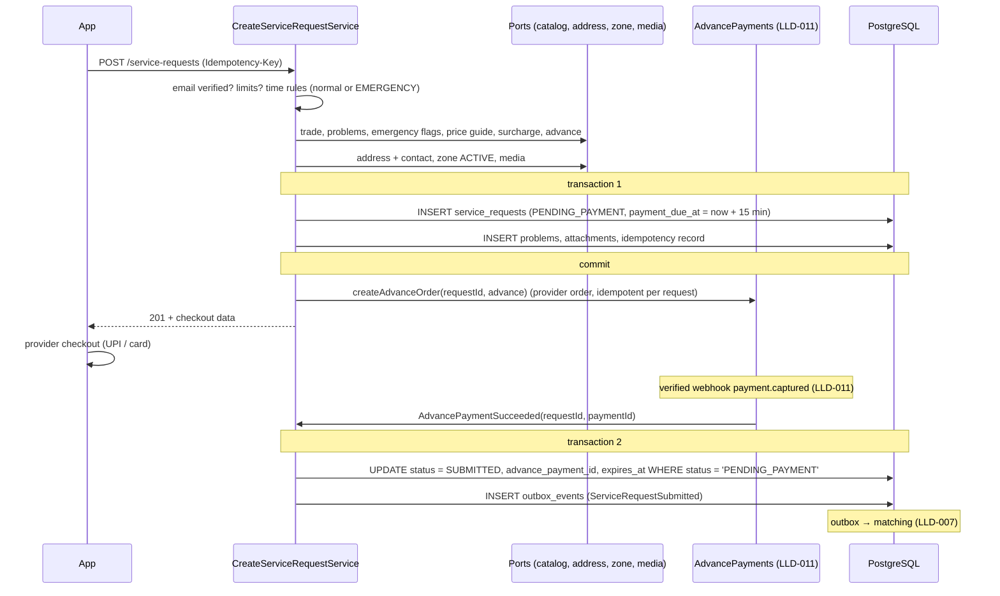
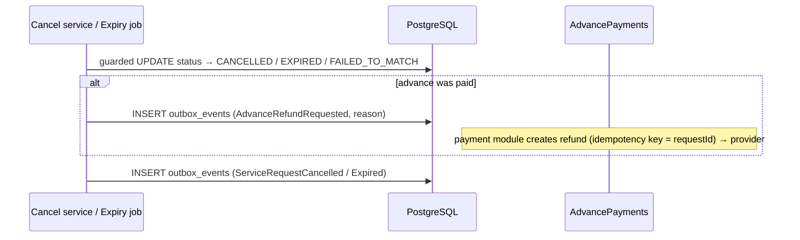

# LLD-006: Create Service Request (Problems, Urgency, Emergency, Drafts, Advance, Address Snapshot)

| Field | Value |
|---|---|
| Status | Draft |
| Owner | TBD |
| Reviewers | TBD |
| Module | `servicerequest` |
| Parent HLD | [modules/02](../modules/02-service-request-booking-and-job-execution.md), [architecture/03 §25–29, §34.1, §43](../architecture/03-erd-and-production-database-design.md), [ADR 0017](../adr/0017-customer-picks-the-worker.md) |
| Requirements | FR-CUS-004 (3-step request, emergency, drafts, advance), FR-CUS-003 rules (saved address, service area) |
| Depends on | LLD-001 (email verified), LLD-003 (`CatalogLookup`), LLD-005 (address book, zone resolution), LLD-011 (online payment: advance order, webhook, refund), media upload (separate LLD) |
| Used by | LLD-007 (matching starts on `ServiceRequestSubmitted`), LLD-008 (shortlist / selection), LLD-009 (booking, advance applied to the bill) |
| Last updated | 2026-10-03 |

---

## 1. Context & scope

The customer's three steps — **what** (trade + common problems, optional description / photos / voice note), **where and when** (saved address; Now / Today / Scheduled, or **Emergency** at any hour), **confirm** (price guide, surcharge, **advance payment**) — end in a request that is handed to matching once the advance is paid. Customers can also **save a draft** and finish it later on any device.

**In scope**

- Drafts: save, edit, list, submit, auto-expire
- Create a request: validation, address and contact snapshot, price guide
- Emergency requests (24×7) with surcharge
- Advance payment at request time and its automatic refund / adjustment rules
- Customer cancel before booking; automatic expiry
- Customer's request list / detail; "Book again"
- Request status machine and which module may move it

**Out of scope:** notifying workers and rounds (LLD-007), accept / shortlist / select (LLD-008), booking, job and final bill (LLD-009), payment provider integration details (LLD-011), media upload (media LLD).

**Decisions**

| # | Decision | Default (configurable) |
|---|---|---|
| D1 | **Drafts** live in a separate `service_request_drafts` table (JSON payload, light validation). Real requests are always complete and strictly validated; `service_requests` never holds drafts. | max 5 drafts per customer, expire after 30 days |
| D2 | Placing a request needs a **verified email** (LLD-001 D1). | — |
| D3 | The address is **re-resolved** to a service zone at creation; the zone must be `ACTIVE`. | — |
| D4 | Normal time rules (IST): working hours **07:00–21:00**; **NOW** until 20:00, window now → +3 h; **TODAY** window ≥ 2 h within today's hours; **SCHEDULED** start +2 h … +30 days, window 2–12 h. | as listed |
| D5 | **EMERGENCY** urgency: allowed **24×7**, only for problems flagged `emergency_eligible` in trades with `emergency_enabled`; window now → +2 h; a per-trade **emergency surcharge** is shown before confirming and added to the bill. Only workers who opted in to emergency jobs and are **police-verified** are notified (LLD-007). | surcharge per trade, e.g. ₹200 (indicative) |
| D6 | **Advance payment** is required to submit a request: paid online (UPI / card / net banking) through the payment provider. The request waits in `PENDING_PAYMENT` and goes to matching only after a verified payment webhook. | amount per trade (e.g. ₹99, indicative); required for all urgencies; can be switched off per urgency |
| D7 | **Advance refund / adjustment:** full automatic refund if the request is cancelled before booking, expires, or fails to match; if a worker is booked, the advance is **deducted from the final bill** (LLD-009); after booking, cancellation fees follow LLD-009. Unpaid requests expire after 15 min with no charge. | 15 min to pay |
| D8 | Limits: max **3 open requests** per customer; **one open request per (trade, address)**. | 3 / 1 |
| D9 | `ServiceRequestSubmitted`, `…Cancelled`, `…Expired` go through the **outbox**. | [ADR 0005](../adr/0005-async-events-and-transactional-outbox.md) |
| D10 | Request expiry (time to find and select a worker): NOW → +2 h; EMERGENCY → +45 min; TODAY → window end; SCHEDULED → window start. | as listed |

---

## 2. Classes / components

```text
com.karigar.servicerequest
├── api/
│   ├── ServiceRequestController        -- /api/v1/service-requests/**
│   ├── DraftController                 -- /api/v1/service-request-drafts/**
│   └── dto/ CreateServiceRequest, DraftPayload, ServiceRequestView, PaymentInstruction, CancelRequest
├── application/
│   ├── CreateServiceRequestService     -- validate, snapshot, create PENDING_PAYMENT (or SUBMITTED if no advance)
│   ├── DraftService                    -- save / edit / submit (calls CreateServiceRequestService)
│   ├── AdvancePaymentHandler           -- on AdvancePaymentSucceeded / Failed (from payment module)
│   ├── CancelServiceRequestService     -- cancel + advance refund trigger
│   ├── ServiceRequestExpiryJob         -- unpaid, unbooked and draft expiry (ShedLock, SKIP LOCKED)
│   ├── ServiceRequestQueryService
│   ├── ServiceRequestLifecycle         -- public API for other modules to move status (§6)
│   └── port/
│       ├── CatalogLookup               -- trade active, problem ∈ trade, price guide, emergency flags,
│       │                                  surcharge and advance amount per trade
│       ├── AddressBook, ServiceZoneLookup   -- LLD-005
│       ├── MediaLookup, FavouriteWorkerLookup
│       ├── AdvancePayments             -- LLD-011: createAdvanceOrder(requestId, amount) → checkout data;
│       │                                  refundAdvance(requestId, reason)
│       └── OutboxWriter, Clock
├── domain/
│   ├── ServiceRequest                  -- aggregate root
│   ├── ServiceRequestDraft
│   ├── RequestStatus, Urgency, TimeWindow, TimeRules, AddressSnapshot, PriceGuide, Charges
│   └── event/ ServiceRequestSubmitted, ServiceRequestCancelled, ServiceRequestExpired, AdvanceRefundRequested
└── infrastructure/persistence/
```

Aggregate (key parts):

```java
public final class ServiceRequest {
    private RequestStatus status;
    private final Charges charges;          // advanceMinor, emergencySurchargeMinor, priceGuide
    // … ids, snapshot, urgency, window, expiresAt, version

    public static ServiceRequest create(NewRequest in, Charges charges, Clock clock) {
        if (in.problems().isEmpty() && in.description() == null && !in.hasVoiceNote())
            throw new DescribeTheProblem();
        RequestStatus start = charges.advanceMinor() > 0 ? RequestStatus.PENDING_PAYMENT : RequestStatus.SUBMITTED;
        ServiceRequest r = new ServiceRequest(in, charges, start, clock);
        if (start == RequestStatus.SUBMITTED) r.events.add(ServiceRequestSubmitted.of(r));
        return r;
    }

    public void advancePaid(PaymentId paymentId, Instant now) {          // from verified webhook
        if (status != RequestStatus.PENDING_PAYMENT) return;               // idempotent / late webhook
        status = RequestStatus.SUBMITTED;
        expiresAt = TimeRules.selectionExpiry(urgency, window, now);       // D10 starts after payment
        events.add(ServiceRequestSubmitted.of(this));
    }

    public void cancelByCustomer(String reasonCode, Instant now) {
        if (!status.isCancellableByCustomer()) throw new RequestNotCancellable(status);
        boolean wasPaid = status != RequestStatus.PENDING_PAYMENT;
        status = RequestStatus.CANCELLED;
        events.add(new ServiceRequestCancelled(id, reasonCode, now));
        if (wasPaid && charges.advanceMinor() > 0) events.add(new AdvanceRefundRequested(id, "CANCELLED_BEFORE_BOOKING"));
    }
}
```

- `isOpen()` = `SUBMITTED | MATCHING | AWAITING_SELECTION`
- `isCancellableByCustomer()` = `PENDING_PAYMENT` or `isOpen()`

---

## 3. Data model

From [ERD §25–27](../architecture/03-erd-and-production-database-design.md). This LLD adds: status `PENDING_PAYMENT`, urgency `EMERGENCY`, charge snapshot columns, `service_request_drafts`, and catalog / worker settings for emergency and advance — all now reflected in the ERD.

```sql
-- V5_1__service_requests.sql
CREATE TABLE service_requests (
    id                    UUID PRIMARY KEY,
    customer_id           UUID NOT NULL REFERENCES customers (id),
    profession_id         UUID NOT NULL REFERENCES professions (id),
    description           VARCHAR(1000),
    address_id            UUID NOT NULL REFERENCES addresses (id),
    service_zone_id       UUID NOT NULL REFERENCES service_zones (id),
    -- address snapshot (never updated from addresses)
    location              geography(Point, 4326) NOT NULL,
    address_text          TEXT NOT NULL,
    landmark              VARCHAR(150),
    pincode               CHAR(6) NOT NULL,
    property_type         VARCHAR(20) NOT NULL,
    floor_number          SMALLINT,
    has_lift              BOOLEAN,
    address_for           VARCHAR(20) NOT NULL,
    contact_name          VARCHAR(100) NOT NULL,
    contact_phone         VARCHAR(16)  NOT NULL,
    -- when
    urgency               VARCHAR(20) NOT NULL CHECK (urgency IN ('NOW','TODAY','SCHEDULED','EMERGENCY')),
    preferred_start_at    TIMESTAMPTZ NOT NULL,
    preferred_end_at      TIMESTAMPTZ NOT NULL,
    -- charges snapshot shown at confirm
    price_guide_min_minor BIGINT,
    price_guide_max_minor BIGINT,
    emergency_surcharge_minor BIGINT NOT NULL DEFAULT 0 CHECK (emergency_surcharge_minor >= 0),
    advance_minor         BIGINT NOT NULL DEFAULT 0 CHECK (advance_minor >= 0),
    advance_payment_id    UUID REFERENCES payments (id),        -- set when the advance succeeds
    preferred_worker_id   UUID REFERENCES workers (id),
    selected_worker_id    UUID REFERENCES workers (id),
    status                VARCHAR(20) NOT NULL CHECK (status IN
                          ('PENDING_PAYMENT','SUBMITTED','MATCHING','AWAITING_SELECTION','BOOKED',
                           'COMPLETED','CANCELLED','EXPIRED','FAILED_TO_MATCH')),
    payment_due_at        TIMESTAMPTZ,                          -- PENDING_PAYMENT only (+15 min)
    expires_at            TIMESTAMPTZ NOT NULL,
    cancellation_reason_code VARCHAR(40),
    created_at            TIMESTAMPTZ NOT NULL,
    updated_at            TIMESTAMPTZ NOT NULL,
    cancelled_at          TIMESTAMPTZ,
    version               BIGINT NOT NULL DEFAULT 0,
    CHECK (preferred_end_at > preferred_start_at),
    CHECK (price_guide_max_minor IS NULL OR price_guide_max_minor >= price_guide_min_minor),
    CHECK (urgency = 'EMERGENCY' OR emergency_surcharge_minor = 0),
    CHECK ((status = 'PENDING_PAYMENT') = (payment_due_at IS NOT NULL))
);
-- D8: one open (or awaiting payment) request per customer + trade + address
CREATE UNIQUE INDEX ux_service_requests_open_per_address
    ON service_requests (customer_id, profession_id, address_id)
    WHERE status IN ('PENDING_PAYMENT', 'SUBMITTED', 'MATCHING', 'AWAITING_SELECTION');
CREATE INDEX ix_service_requests_customer ON service_requests (customer_id, created_at DESC);
CREATE INDEX ix_service_requests_zone_status ON service_requests (service_zone_id, status, created_at);
CREATE INDEX ix_service_requests_payment_due ON service_requests (payment_due_at) WHERE status = 'PENDING_PAYMENT';
CREATE INDEX ix_service_requests_expiry ON service_requests (expires_at)
    WHERE status IN ('SUBMITTED', 'MATCHING', 'AWAITING_SELECTION');

CREATE TABLE service_request_problems (
    service_request_id UUID NOT NULL REFERENCES service_requests (id),
    problem_id         UUID NOT NULL REFERENCES common_problems (id),
    PRIMARY KEY (service_request_id, problem_id)
);

CREATE TABLE service_request_attachments (
    id                 UUID PRIMARY KEY,
    service_request_id UUID NOT NULL REFERENCES service_requests (id),
    media_id           UUID NOT NULL,
    kind               VARCHAR(10) NOT NULL CHECK (kind IN ('PHOTO','VIDEO','VOICE')),
    created_at         TIMESTAMPTZ NOT NULL,
    UNIQUE (service_request_id, media_id)
);

CREATE TABLE service_request_drafts (
    id           UUID PRIMARY KEY,
    customer_id  UUID NOT NULL REFERENCES customers (id),
    payload      JSONB NOT NULL,          -- same shape as CreateServiceRequest, any field may be missing
    created_at   TIMESTAMPTZ NOT NULL,
    updated_at   TIMESTAMPTZ NOT NULL,
    expires_at   TIMESTAMPTZ NOT NULL,    -- updated_at + 30 days
    version      BIGINT NOT NULL DEFAULT 0
);
CREATE INDEX ix_drafts_customer ON service_request_drafts (customer_id, updated_at DESC);
CREATE INDEX ix_drafts_expiry   ON service_request_drafts (expires_at);
```

Catalog and worker settings (owned by LLD-003 / LLD-004, added there via migration):

```sql
ALTER TABLE professions
    ADD COLUMN emergency_enabled         BOOLEAN NOT NULL DEFAULT false,
    ADD COLUMN emergency_surcharge_minor BIGINT  NOT NULL DEFAULT 0 CHECK (emergency_surcharge_minor >= 0),
    ADD COLUMN advance_minor             BIGINT  NOT NULL DEFAULT 0 CHECK (advance_minor >= 0);
ALTER TABLE common_problems
    ADD COLUMN emergency_eligible BOOLEAN NOT NULL DEFAULT false;
ALTER TABLE workers
    ADD COLUMN accepts_emergency_jobs BOOLEAN NOT NULL DEFAULT false;   -- needs POLICE_VERIFICATION (LLD-004)
```

Emergency-eligible problems at launch (seed, LLD-003): `ELEC_SWITCHBOARD_SPARKING`, `ELEC_NO_POWER` (new: "No power in the house / one room"), `PLUM_BURST_PIPE` (new: "Burst / leaking pipe flooding"), `PLUM_TOILET_OVERFLOW` (new: "Toilet overflowing / blocked"). Locksmith "Locked out" is added when that trade launches.

Payment link (ERD §43): `payments.purpose` gains `BOOKING_ADVANCE`, and `payments.service_request_id` is added (nullable) because the advance is paid before a job exists.

Limits enforced in the service: max **5** problems, **5** photos, **1** video (≤ 30 s), **1** voice note (≤ 60 s).

---

## 4. API contract

### 4.1 Requests

| Method | Path | Purpose |
|---|---|---|
| POST | `/api/v1/service-requests` | create → `201` (`PENDING_PAYMENT` with payment instructions, or `SUBMITTED` if no advance applies) |
| GET | `/api/v1/service-requests/quote-preview` | price guide, surcharge, advance for a trade + problems + urgency before confirming |
| GET | `/api/v1/service-requests?status=OPEN&page=…` | customer's requests |
| GET | `/api/v1/service-requests/{id}` | detail |
| POST | `/api/v1/service-requests/{id}/pay-advance` | new checkout session if the first attempt failed / app was closed (until `payment_due_at`) |
| POST | `/api/v1/service-requests/{id}/cancel` | `{ "reasonCode": "NO_LONGER_NEEDED" }` → `200` (+ refund info) |
| GET | `/api/v1/service-requests/{id}/repeat-template` | pre-filled body for "Book again" |

Create request (headers: `Authorization`, `Idempotency-Key`, `Accept-Language`):

```json
{
  "professionId": "…plumber",
  "problemIds": ["…plum-burst-pipe"],
  "description": "Pipe under kitchen sink burst, water everywhere",
  "mediaIds": ["…photo-1"],
  "addressId": "…maa-flat",
  "urgency": "EMERGENCY",
  "preferredWindow": null,
  "preferredWorkerId": null
}
```

Response (advance required):

```json
{
  "data": {
    "id": "…", "status": "PENDING_PAYMENT", "urgency": "EMERGENCY",
    "trade": "Plumber", "problems": ["Burst / leaking pipe flooding"],
    "charges": {
      "priceGuide": { "minMinor": 30000, "maxMinor": 80000 },
      "emergencySurchargeMinor": 20000,
      "advanceMinor": 9900,
      "advanceNote": "Refunded in full if no worker is booked; otherwise deducted from your final bill.",
      "currency": "INR"
    },
    "payment": { "provider": "RAZORPAY", "orderId": "order_…", "checkout": { "keyId": "rzp_…", "amountMinor": 9900 },
                 "dueAt": "2026-10-03T22:15:00Z" },
    "expiresAt": null
  }
}
```

The app opens the provider checkout with `payment.checkout`. It must **not** treat the checkout's success callback as final; it polls `GET /service-requests/{id}` (or listens on realtime) until `status` becomes `SUBMITTED` after the verified webhook (LLD-011).

### 4.2 Drafts

| Method | Path | Purpose |
|---|---|---|
| POST | `/api/v1/service-request-drafts` | save draft (any subset of the create body; `professionId` required) → `201` |
| GET | `/api/v1/service-request-drafts` | list (newest first, max 5) |
| GET / PATCH / DELETE | `/api/v1/service-request-drafts/{id}` | read / edit (send `version`) / delete |
| POST | `/api/v1/service-request-drafts/{id}/submit` | runs full create validation; on success the draft is deleted and the request returned (same response as create) |

Draft validation is light: field formats and ownership of `addressId` / `mediaIds` only. Everything else is checked on submit, which returns the same error codes as create.

### 4.3 Error codes

| HTTP | `error.code` | When |
|---|---|---|
| 400 | `VALIDATION_ERROR` | field errors |
| 400 | `DESCRIBE_THE_PROBLEM` | no problem, no description, no voice note |
| 403 | `EMAIL_NOT_VERIFIED` | D2 |
| 404 | `ADDRESS_NOT_FOUND` / `DRAFT_NOT_FOUND` | not the customer's or deleted |
| 409 | `DUPLICATE_OPEN_REQUEST` | open or unpaid request for same trade + address (`details.requestId`) |
| 409 | `REQUEST_NOT_CANCELLABLE` | after `BOOKED` (cancel the booking) or already ended |
| 409 | `PAYMENT_WINDOW_CLOSED` | `pay-advance` after `payment_due_at` |
| 422 | `PROFESSION_NOT_AVAILABLE` / `PROBLEM_NOT_IN_TRADE` | catalog checks |
| 422 | `SERVICE_AREA_NOT_AVAILABLE` | zone missing / not ACTIVE (`details.status` for the waitlist) |
| 422 | `INVALID_TIME_WINDOW` | outside the rules in D4 |
| 422 | `EMERGENCY_NOT_AVAILABLE` | trade not emergency-enabled, or no selected problem is emergency-eligible (`details.suggestion: "SCHEDULED"`) |
| 422 | `TOO_MANY_OPEN_REQUESTS` / `TOO_MANY_DRAFTS` | > 3 open / > 5 drafts |
| 422 | `INVALID_MEDIA` / `PREFERRED_WORKER_UNAVAILABLE` | as before |

---

## 5. Sequence diagrams

### 5.1 Create with advance



If creating the provider order fails after commit, the request stays `PENDING_PAYMENT`; the app calls `pay-advance`, which retries order creation (idempotent per request id). Unpaid requests expire at `payment_due_at`.

### 5.2 Cancel / expire with refund



### 5.3 Draft → submit

`POST /service-request-drafts/{id}/submit` → `DraftService` loads the draft (owner, version) → maps payload to `CreateServiceRequest` → calls `CreateServiceRequestService` → in the same transaction as the request insert, deletes the draft. Any validation error leaves the draft unchanged so the customer can fix it.

---

## 6. State transitions

The `servicerequest` module owns the table; other modules change status only through `ServiceRequestLifecycle` with guarded updates.

| From | Event | Called by | Guard | To |
|---|---|---|---|---|
| — | create, advance required | customer | validations | PENDING_PAYMENT |
| — | create, no advance (switched off for this urgency) | customer | validations | SUBMITTED |
| PENDING_PAYMENT | advance payment succeeded (verified webhook) | payment (LLD-011) | — | SUBMITTED |
| PENDING_PAYMENT | `payment_due_at` passed / customer cancels | expiry job / customer | — | EXPIRED / CANCELLED (nothing to refund) |
| SUBMITTED | first round of offers sent | matching (LLD-007) | — | MATCHING |
| MATCHING | first worker accepts | matching (LLD-008) | — | AWAITING_SELECTION |
| AWAITING_SELECTION | all accepted workers withdrew / expired | matching | — | MATCHING |
| AWAITING_SELECTION | customer selects a worker | booking (LLD-008) | match ACCEPTED | BOOKED (advance moves to the booking, LLD-009) |
| MATCHING | last round ended, nobody accepted | matching | — | FAILED_TO_MATCH (+ advance refund) |
| FAILED_TO_MATCH | customer "search again" | customer → matching | not expired | MATCHING (refund only if they don't retry within 10 min) |
| SUBMITTED / MATCHING / AWAITING_SELECTION | customer cancels | customer | — | CANCELLED (+ advance refund) |
| SUBMITTED / MATCHING / AWAITING_SELECTION | `expires_at` passed | expiry job | — | EXPIRED (+ advance refund) |
| BOOKED | job completed / booking cancelled by customer | job / booking (LLD-009) | — | COMPLETED / CANCELLED |
| BOOKED | worker cancels, or worker no-show on a single-visit job | booking (LLD-009) | not expired | MATCHING (re-matching, that worker excluded, advance kept) |

**Draft:** `SAVED → SUBMITTED (deleted)`, `SAVED → EXPIRED (deleted by job after 30 days without edits)`, `SAVED → DELETED (customer)`.

---

## 7. Error handling, idempotency & concurrency

- **Idempotency:** `Idempotency-Key` required on create and draft submit; retries return the stored response. Provider advance orders use the request id as their idempotency key; refunds use `requestId + reason`.
- **Late or duplicate webhooks:** `advancePaid` only acts in `PENDING_PAYMENT`. A payment that succeeds **after** the request expired is refunded automatically (`AdvanceRefundRequested`, reason `PAID_AFTER_EXPIRY`).
- **Double tap / two devices:** `ux_service_requests_open_per_address` covers `PENDING_PAYMENT` too; the loser gets `DUPLICATE_OPEN_REQUEST` with the existing id (the app resumes its payment).
- **Open-request limit:** counted with the `customers` row locked.
- **Status races** (cancel vs select, expiry vs payment webhook): guarded `UPDATE … WHERE status IN (…)`; exactly one wins; the loser either no-ops or triggers the refund path.
- **Expiry job** (every minute, ShedLock, `FOR UPDATE SKIP LOCKED LIMIT 200`): unpaid requests past `payment_due_at`; unbooked requests past `expires_at`; drafts past `expires_at`.
- **Refunds are never lost:** they are outbox events consumed by the payment module, retried until the provider confirms.

---

## 8. Security & privacy

- Only the owning customer sees requests and drafts; all queries filter by `customer_id` from the token.
- Contact name / phone are copied for use **after selection**; `ServiceRequestSubmitted` carries only trade, zone, location, urgency, window and the emergency flag.
- **Night safety:** emergency requests go only to police-verified workers who opted in (LLD-004 / LLD-007); the customer sees the worker's verification badges before selecting; the start code (LLD-009) applies as for any job.
- Drafts hold personal data (description, address id): deleted on submit or after 30 days; never shared with workers.
- The amount to pay always comes from the server (catalog settings); the client never sends an amount ([ADR 0007](../adr/0007-payment-provider-abstraction.md)).

---

## 9. Observability

| Type | Name | Notes |
|---|---|---|
| Counter | `service_request_created_total{trade, urgency, zone}` | demand, incl. emergencies at night |
| Counter | `service_request_rejected_total{code}` | which validation stops customers |
| Counter | `advance_payment_total{result}` | paid, unpaid_expired, failed |
| Histogram | `advance_payment_seconds` | create → paid; long times mean checkout friction |
| Counter | `advance_refund_total{reason}` | cancelled, expired, failed_to_match, paid_after_expiry |
| Counter | `service_request_ended_total{status}` | booked, cancelled, expired, failed_to_match |
| Histogram | `service_request_time_to_booked_seconds{urgency}` | EMERGENCY should be shortest |
| Counter | `drafts_submitted_total`, `drafts_expired_total` | is the draft feature used |

Alerts: outbox lag for `ServiceRequestSubmitted` > 60 s; unpaid-expired > 40 % of creates in a day (checkout problem or advance too high); emergency requests failing to match > 30 % at night (not enough opted-in workers).

---

## 10. Test plan

| Level | Cases |
|---|---|
| Unit | time rules at IST boundaries; EMERGENCY allowed at 02:00 only with an eligible problem in an enabled trade; surcharge only on EMERGENCY; expiry per urgency; price guide with inspection problems |
| Integration (Testcontainers PostGIS) | create → PENDING_PAYMENT with checkout data; simulated verified webhook → SUBMITTED + outbox row; advance switched off for an urgency → SUBMITTED directly; snapshot unaffected by later address edits |
| Payment edge cases | duplicate webhook → one transition; webhook after `payment_due_at` → refund event `PAID_AFTER_EXPIRY`; provider order creation fails → `pay-advance` succeeds later |
| Refunds | cancel in MATCHING → one refund event; expire unbooked → refund; FAILED_TO_MATCH then retry within 10 min → no refund; booked → no refund (advance moves to booking) |
| Drafts | save partial draft; 6th draft → 422; submit invalid draft → errors, draft kept; submit valid → request created and draft deleted in one transaction; expiry job deletes 30-day-old drafts |
| Concurrency | 10 parallel creates same trade + address → 1 created; cancel vs webhook race → consistent end state and refund only if paid |
| Contract | OpenAPI + error codes |

---

## 11. Open questions

| Question | Default until decided | Owner | Due |
|---|---|---|---|
| Advance and surcharge amounts per trade | Indicative: advance ₹99, emergency surcharge ₹200; set from pilot data | Product | Before launch |
| Split of the emergency surcharge between worker and platform | Treated like the rest of the bill (normal commission) | Product / CA | Before launch |
| Allow cash-only customers to skip the advance (e.g. trusted repeat customers)? | No; advance required for all urgencies at launch, configurable per urgency | Product | After pilot |
| Accept emergency requests in zones where few verified workers are online at night? | Show emergency only if ≥ 1 opted-in worker is within range at that moment (LLD-007 check) | TBD | With LLD-007 |

---

## Change log

| Version | Date | Author | Change |
|---|---|---|---|
| 0.1 | 2026-10-03 | TBD | First draft |
| 0.2 | 2026-10-03 | TBD | Added emergency requests (24×7 + surcharge), drafts, advance payment at request time |
