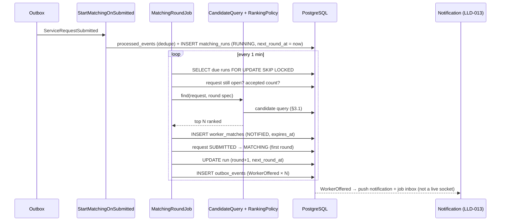

# LLD-007: Matching — Service Area, Online Status, Candidate Search and Rounds

| Field | Value |
|---|---|
| Status | Draft |
| Owner | TBD |
| Reviewers | TBD |
| Module | `matching` (+ `worker` for service area and online status) |
| Parent HLD | [modules/01](../modules/01-matching-engine-and-geospatial-discovery.md), [ADR 0011](../adr/0011-explainable-rule-based-matching.md), [ADR 0017](../adr/0017-customer-picks-the-worker.md), [architecture/03 §17, §30–34.2](../architecture/03-erd-and-production-database-design.md), [modules/07 §4–6](../modules/07-trust-verification-reputation-and-reviews.md) |
| Requirements | FR-MAT-001, FR-MAT-002, FR-WRK-005 (availability), FR-WRK-006 (service area), FR-WRK-007 |
| Depends on | LLD-004 (trades, `job_eligible`), LLD-006 (`ServiceRequestSubmitted`, request lifecycle), LLD-012 (`reputation_snapshots`), LLD-015 (working hours, time off, capacity), LLD-020 (`admin_users`) |
| Used by | LLD-008 (offers → accept / shortlist / select), LLD-013 (offer notifications) |
| Last updated | 2026-10-03 |

---

## 1. Context & scope

When a request is submitted (advance paid, LLD-006), matching finds suitable nearby workers and **offers** them the job in small rounds, widening the search until the customer has up to 3 workers who accepted, or the rounds run out. The customer then picks one (LLD-008).

**This is not real-time dispatch** (unlike ride-hailing or delivery). Workers are often on another job or at home, and most home-service work is booked hours or days ahead. Offers therefore arrive as a **push notification plus a job inbox** in the worker app, response windows are human-paced (30 min to 4 h; 10 min only for emergencies), and the customer is told by push as workers show interest instead of watching a live spinner.

**In scope**

- Worker **service area** (home base + travel radius) and **online / offline** toggle
- Eligibility filter and ranking (explainable, rule-based)
- Rounds: favourite worker first, then widening radius; emergency settings
- Creating offers (`worker_matches`), offer expiry, closing offers when the request ends
- "Search again" after no match; emergency-availability check used by LLD-006
- Request status: `SUBMITTED → MATCHING`, `MATCHING → FAILED_TO_MATCH`

**Out of scope:** the worker's offer inbox, accept / decline / withdraw, shortlist and selection (LLD-008); push delivery (LLD-013); weekly working hours, time off and open-job capacity ([LLD-015](lld-015-worker-availability-schedule.md), which adds its clauses to the §3.1 query); live GPS tracking during a job (LLD-009).

**Decisions**

| # | Decision | Default (configurable) |
|---|---|---|
| D1 | A worker has **one service area**: a home base point + travel radius (1–20 km). Distance is measured from the base, not live GPS (privacy, battery, cheap phones). | radius default 5 km |
| D2 | Online status is a simple toggle (`ACCEPTING_JOBS` / `NOT_ACCEPTING_JOBS`); going online requires the worker to be ACTIVE (LLD-004). Missing offers is normal when busy, so there is **no quick auto-offline**: a reminder after 5 missed offers in 24 h; set offline only if the worker has not responded to any offer for 48 h. | 5 / 48 h |
| D3 | Eligibility is a **filter**; ranking only orders eligible workers. Every offer stores its score and reasons (explainability). | — |
| D4 | Rounds per urgency (below). Widen only while fewer than 3 workers have accepted. | table below |
| D5 | A worker holds at most **3 live offers** at once (avoids spamming one worker and lets others get work). | 3 |
| D6 | Matching progress is stored in `matching_runs` and driven by a DB-polling job, so it survives restarts and runs safely on several instances. | poll every 1 min |
| D9 | **Delivery is push + inbox, not a live socket.** `WorkerOffered` → high-priority FCM push ("New plumbing job in Shibpur, today 4–7 pm"); the offer waits in the inbox until it expires. WhatsApp / SMS alerts can be added later (LLD-013). | — |
| D10 | When accepting, the worker says **when they can come** (`available_from`, within the customer's window) and their visit charge; the customer compares these on the shortlist. | — |
| D7 | A worker the customer **blocked**, or who **declined** this request, is never offered it again; workers whose offer simply **expired** may get it again in a later round. | — |
| D8 | Workers under a strike restriction (`account_restrictions` type `NO_NEW_OFFERS`) are excluded ([modules/07 §6](../modules/07-trust-verification-reputation-and-reviews.md)). | — |

**Round settings** (config `karigar.matching.rounds`):

| Urgency | Favourite round | Rounds (radius km) | Offers per round | Worker response window = round length |
|---|---|---|---|---|
| NOW (as soon as possible, today) | 15 min | 3 → 6 → 10 | 8 | 30 min |
| TODAY (chosen window) | 30 min | 3 → 6 → 10 | 8 | 1 h |
| SCHEDULED (later date) | 2 h | 3 → 6 → 10 | 8 | 4 h |
| EMERGENCY (24×7) | — (speed first) | 3 → 6 → 10 | 10 | 10 min |

A window never runs past the request's `expires_at` (LLD-006 D10); the last round is shortened if needed. Offers sent between 21:00 and 07:00 are only EMERGENCY; non-emergency offers created late in the evening wait until 07:00 to be sent, and their windows start then.

---

## 2. Classes / components

```text
com.karigar.worker (service area + online status; owned by worker module)
├── api/  WorkerAvailabilityController   -- PUT /workers/me/service-area, PUT /workers/me/online
├── application/  ServiceAreaService, AvailabilityService, AutoOfflineOnMissedOffers
└── api-for-modules/ ServiceAreaLookup (used by LLD-004 readiness)

com.karigar.matching
├── api/
│   ├── MatchingStatusController        -- GET /service-requests/{id}/matching (customer progress)
│   └── EmergencyAvailabilityController -- GET /service-areas/emergency-availability
├── application/
│   ├── StartMatchingOnSubmitted        -- consumes ServiceRequestSubmitted (outbox, processed_events)
│   ├── MatchingRoundJob                -- every 1 min: due runs FOR UPDATE SKIP LOCKED
│   ├── OfferExpiryJob                  -- every 1 min: NOTIFIED/VIEWED past expires_at → EXPIRED
│   ├── CloseOffersOnRequestEnded       -- consumes ServiceRequestCancelled / Expired / Booked
│   ├── SearchAgainService              -- FAILED_TO_MATCH → new run
│   ├── CandidateQuery                  -- §3 SQL
│   ├── RankingPolicy                   -- §4 formula, versioned
│   └── port/ ServiceRequestLifecycle (LLD-006), RequestDetails, OutboxWriter, Clock
├── domain/
│   ├── MatchingRun                     -- per request: round, radius, next_round_at, status
│   ├── WorkerMatch                     -- offer: status, round, score, reasons, expires_at
│   └── event/ WorkerOffered {workerId, matchId, tradeId, window, urgency, expiresAt}, MatchingRoundCompleted,
│              MatchingFailed {requestId, customerId}, WorkerNotSelected {workerId, matchId, reason}
│              (+ worker module: MissedOffersReminder {workerId}, WorkerAutoOffline {workerId}) — all outbox, ids only (LLD-022 D8)
└── infrastructure/persistence/
```

`MatchingRoundJob` core:

```java
@Transactional
public void runDue(MatchingRun run) {
    RequestDetails req = requests.details(run.requestId());
    if (!req.isOpenForMatching()) { run.stop(); return; }                 // cancelled / expired / booked

    int accepted = matches.countAccepted(run.requestId());
    if (accepted >= settings.shortlistSize()) { run.waitForSelection(); return; }

    Optional<RoundSpec> next = settings.nextRound(req.urgency(), run);       // favourite → r1 → r2 → r3
    if (next.isEmpty()) {
        if (accepted == 0) { lifecycle.failToMatch(run.requestId()); run.fail(); }
        else run.waitForSelection();
        return;
    }
    List<Candidate> candidates = candidateQuery.find(req, next.get());      // eligible + ranked + limited
    candidates.forEach(c -> matches.save(WorkerMatch.offer(req, c, next.get(), clock)));
    outbox.append(candidates.stream().map(c -> WorkerOffered.of(req, c)).toList());
    if (run.roundNo() == 0 && req.status() == SUBMITTED) lifecycle.startMatching(run.requestId());   // → MATCHING
    run.advance(next.get(), clock.instant().plus(next.get().roundLength()));
}
```

A round that finds **no** candidates moves straight on to the next one (no waiting).

---

## 3. Data model

ERD changes made by this LLD (now in the ERD): `worker_service_areas` becomes base point + radius (one per worker); `worker_availability` gains `missed_offers_in_row`; `worker_professions.job_eligible`; new `matching_runs`, `customer_worker_blocks`, `account_restrictions`; `worker_matches` gains `score_reasons` and `close_reason`.

```sql
-- V6_1__worker_service_area_availability.sql (worker module)
CREATE TABLE worker_service_areas (
    worker_id      UUID PRIMARY KEY REFERENCES workers (id),
    base_location  geography(Point, 4326) NOT NULL,
    base_label     VARCHAR(100) NOT NULL,          -- locality shown to the worker, e.g. "Shibpur"
    radius_meters  INTEGER NOT NULL CHECK (radius_meters BETWEEN 1000 AND 20000),
    updated_at     TIMESTAMPTZ NOT NULL
);
CREATE INDEX ix_worker_service_areas_base ON worker_service_areas USING GIST (base_location);

CREATE TABLE worker_availability (
    worker_id            UUID PRIMARY KEY REFERENCES workers (id),
    status               VARCHAR(20) NOT NULL CHECK (status IN ('ACCEPTING_JOBS','NOT_ACCEPTING_JOBS')),
    missed_offers_in_row SMALLINT NOT NULL DEFAULT 0,
    changed_by           VARCHAR(10) NOT NULL CHECK (changed_by IN ('WORKER','SYSTEM','ADMIN')),
    updated_at           TIMESTAMPTZ NOT NULL
);   -- time_zone, max_open_jobs added by LLD-015 V6_4__worker_schedule.sql

-- maintained by LLD-004 JobReadinessService: trade ACTIVE + mandatory verifications valid
ALTER TABLE worker_professions ADD COLUMN job_eligible BOOLEAN NOT NULL DEFAULT false;
CREATE INDEX ix_worker_professions_eligible
    ON worker_professions (profession_id, worker_id) WHERE status = 'ACTIVE' AND job_eligible;

-- V6_2__matching.sql (matching module)
CREATE TABLE matching_runs (
    service_request_id UUID PRIMARY KEY REFERENCES service_requests (id),
    status             VARCHAR(20) NOT NULL CHECK (status IN ('RUNNING','WAITING_SELECTION','FAILED','STOPPED')),
    round_no           SMALLINT NOT NULL DEFAULT 0,          -- 0 = favourite round
    radius_meters      INTEGER,
    next_round_at      TIMESTAMPTZ,
    attempt            SMALLINT NOT NULL DEFAULT 1,          -- +1 on "search again"
    ranking_version    SMALLINT NOT NULL,
    created_at         TIMESTAMPTZ NOT NULL,
    updated_at         TIMESTAMPTZ NOT NULL
);
CREATE INDEX ix_matching_runs_due ON matching_runs (next_round_at) WHERE status = 'RUNNING';

CREATE TABLE worker_matches (
    id                         UUID PRIMARY KEY,
    service_request_id         UUID NOT NULL REFERENCES service_requests (id),
    worker_id                  UUID NOT NULL REFERENCES workers (id),
    round_no                   SMALLINT NOT NULL,
    attempt                    SMALLINT NOT NULL DEFAULT 1,
    source                     VARCHAR(20) NOT NULL CHECK (source IN ('MATCHING','FAVOURITE')),
    status                     VARCHAR(20) NOT NULL CHECK (status IN
                               ('NOTIFIED','VIEWED','ACCEPTED','DECLINED','EXPIRED','WITHDRAWN','SELECTED','NOT_SELECTED')),
    close_reason               VARCHAR(30),   -- REQUEST_CANCELLED | REQUEST_EXPIRED | OTHER_SELECTED | REQUEST_BOOKED
    distance_meters            INTEGER NOT NULL,
    ranking_score              NUMERIC(6,3),
    score_reasons              JSONB NOT NULL,   -- {"distance":0.82,"reputation":0.74,...} for explainability
    offered_rate_type          VARCHAR(20),      -- set on accept (LLD-008)
    offered_unit               VARCHAR(20),
    offered_amount_minor       BIGINT,
    available_from             TIMESTAMPTZ,
    decline_reason_code        VARCHAR(40),
    notified_at                TIMESTAMPTZ NOT NULL,
    viewed_at                  TIMESTAMPTZ,
    responded_at               TIMESTAMPTZ,
    expires_at                 TIMESTAMPTZ NOT NULL,
    created_at                 TIMESTAMPTZ NOT NULL,
    updated_at                 TIMESTAMPTZ NOT NULL
);
CREATE UNIQUE INDEX ux_matches_live ON worker_matches (service_request_id, worker_id)
    WHERE status IN ('NOTIFIED','VIEWED','ACCEPTED','SELECTED');
CREATE UNIQUE INDEX ux_matches_selected ON worker_matches (service_request_id) WHERE status = 'SELECTED';
CREATE INDEX ix_matches_worker_live ON worker_matches (worker_id, expires_at) WHERE status IN ('NOTIFIED','VIEWED');
CREATE INDEX ix_matches_request ON worker_matches (service_request_id, status);
CREATE INDEX ix_matches_expiry ON worker_matches (expires_at) WHERE status IN ('NOTIFIED','VIEWED');

CREATE TABLE customer_worker_blocks (
    customer_id  UUID NOT NULL REFERENCES customers (id),
    worker_id    UUID NOT NULL REFERENCES workers (id),
    reason_code  VARCHAR(40),
    created_at   TIMESTAMPTZ NOT NULL,
    PRIMARY KEY (customer_id, worker_id)
);

CREATE TABLE account_restrictions (           -- shared with modules/07–08 (strikes, fraud, admin)
    id                UUID PRIMARY KEY,
    user_id           UUID NOT NULL REFERENCES users (id),
    restriction_type  VARCHAR(30) NOT NULL CHECK (restriction_type IN
                      ('NO_NEW_OFFERS','NO_NEW_REQUESTS','NO_PAYOUTS')),
    source            VARCHAR(20) NOT NULL CHECK (source IN ('STRIKES','FRAUD','ADMIN')),
    reason_code       VARCHAR(40),
    starts_at         TIMESTAMPTZ NOT NULL,
    ends_at           TIMESTAMPTZ,               -- NULL = until lifted
    lifted_at         TIMESTAMPTZ,
    created_by_admin_id UUID REFERENCES admin_users (id),   -- admin_users: LLD-020 V1_3 (runs before V6_2)
    created_at        TIMESTAMPTZ NOT NULL
);
-- lifted_by_admin_id is added by LLD-020 V15_1.
CREATE INDEX ix_restrictions_active ON account_restrictions (user_id, restriction_type) WHERE lifted_at IS NULL;
```

### 3.1 Candidate query

The constant round radius uses the GIST index; the worker's own radius is checked afterwards (a per-row radius cannot use the index). `reputation_snapshots` is created by LLD-012 `V10_1`; its rates may be `NULL` (no offers / bookings yet), so `coalesce` falls back to the priors. The last three clauses (working hours, time off, capacity) and `:min_overlap` come from [LLD-015 §3.2](lld-015-worker-availability-schedule.md); `av` also provides `time_zone` and `max_open_jobs`.

```sql
WITH req AS (SELECT CAST(:location AS geography) AS loc)
SELECT w.id AS worker_id,
       ST_Distance(a.base_location, req.loc)::int AS distance_m,
       coalesce(r.rating_bayesian, :prior_rating)      AS rating,
       coalesce(r.response_rate, :prior_response)      AS response_rate,
       coalesce(r.completion_rate, :prior_completion)  AS completion_rate,
       (fw.worker_id IS NOT NULL)                       AS is_favourite,
       (SELECT count(*) FROM worker_matches m3
         WHERE m3.worker_id = w.id AND m3.notified_at > now() - interval '24 hours') AS offers_24h
FROM req
JOIN worker_service_areas a ON ST_DWithin(a.base_location, req.loc, :round_radius_m)          -- index
JOIN workers w            ON w.id = a.worker_id AND w.account_status = 'ACTIVE'
JOIN worker_availability av ON av.worker_id = w.id AND av.status = 'ACCEPTING_JOBS'
JOIN worker_professions wp  ON wp.worker_id = w.id AND wp.profession_id = :profession_id
                           AND wp.status = 'ACTIVE' AND wp.job_eligible
LEFT JOIN LATERAL (SELECT * FROM reputation_snapshots rs WHERE rs.worker_id = w.id
                   ORDER BY rs.snapshot_date DESC LIMIT 1) r ON true
LEFT JOIN favourite_workers fw ON fw.customer_id = :customer_id AND fw.worker_id = w.id
WHERE ST_Distance(a.base_location, req.loc) <= a.radius_meters                               -- worker's own radius
  AND (NOT :emergency OR w.accepts_emergency_jobs)
  AND NOT EXISTS (SELECT 1 FROM account_restrictions ar
                  WHERE ar.user_id = w.user_id AND ar.restriction_type = 'NO_NEW_OFFERS'
                    AND ar.lifted_at IS NULL AND ar.starts_at <= now() AND (ar.ends_at IS NULL OR ar.ends_at > now()))
  AND NOT EXISTS (SELECT 1 FROM customer_worker_blocks b WHERE b.customer_id = :customer_id AND b.worker_id = w.id)
  AND NOT EXISTS (SELECT 1 FROM worker_matches m WHERE m.service_request_id = :request_id AND m.worker_id = w.id
                    AND m.status IN ('NOTIFIED','VIEWED','ACCEPTED','SELECTED','DECLINED','WITHDRAWN'))
  AND (SELECT count(*) FROM worker_matches m2
        WHERE m2.worker_id = w.id AND m2.status IN ('NOTIFIED','VIEWED')) < :max_live_offers
  AND NOT EXISTS (SELECT 1 FROM job_visits v
                  WHERE v.worker_id = w.id
                    AND v.status NOT IN ('CANCELLED','RESCHEDULED','WORKER_NO_SHOW','CUSTOMER_NO_SHOW','DONE')
                    AND tstzrange(v.scheduled_start_at, v.scheduled_end_at) && tstzrange(:window_start, :window_end))
  AND w.user_id <> :customer_user_id                                                         -- no self-booking
  -- LLD-015: working hours overlap the window by ≥ :min_overlap; skipped for EMERGENCY
  AND (:emergency OR EXISTS (
        SELECT 1
        FROM generate_series(0, CAST(timezone(av.time_zone, :window_end)   AS date)
                              - CAST(timezone(av.time_zone, :window_start) AS date)) AS n(i)
        CROSS JOIN LATERAL (SELECT CAST(timezone(av.time_zone, :window_start) AS date) + n.i AS day) d
        JOIN worker_working_hours h
          ON h.worker_id = w.id AND h.iso_weekday = extract(isodow FROM d.day)
        CROSS JOIN LATERAL (
          SELECT tstzrange(timezone(av.time_zone, d.day + h.start_time),
                           timezone(av.time_zone, d.day + h.end_time))
               * tstzrange(:window_start, :window_end) AS r) x
        WHERE NOT isempty(x.r) AND upper(x.r) - lower(x.r) >= :min_overlap))
  -- LLD-015: not on time off during the window
  AND NOT EXISTS (SELECT 1 FROM worker_time_off t
                  WHERE t.worker_id = w.id AND t.ends_at > :window_start AND t.starts_at < :window_end)
  -- LLD-015: under capacity
  AND (SELECT count(*) FROM bookings b JOIN jobs j ON j.booking_id = b.id
        WHERE b.worker_id = w.id AND b.status = 'CONFIRMED'
          AND j.status IN ('SCHEDULED','IN_PROGRESS','ON_HOLD')) < av.max_open_jobs
ORDER BY ST_Distance(a.base_location, req.loc)
LIMIT :prefilter_limit;      -- e.g. 50 nearest eligible; ranking (§4) then picks the top N in Java
```

`:emergency` also requires a valid police verification. This is enforced through `accepts_emergency_jobs`, not `job_eligible`: the flag can only be set with a valid `POLICE_VERIFICATION`, and the LLD-004 `recheck` clears it when the check expires or is revoked ([LLD-016](lld-016-worker-verification.md); LLD-006 D5).

---

## 4. Ranking

Computed in Java on the ≤ 50 pre-filtered candidates; weights are config, versioned (`ranking_version`), and stored per offer in `score_reasons`.

| Factor | Formula (0–1) | Weight |
|---|---|---|
| Distance | `1 − distance_m / round_radius_m` | 0.40 |
| Reputation | `(rating_bayesian − 3.0) / 2.0`, clamped; new workers use the prior ([modules/07 §4](../modules/07-trust-verification-reputation-and-reviews.md)) | 0.25 |
| Responsiveness | `response_rate` | 0.15 |
| Reliability | `completion_rate` | 0.10 |
| Fair share | `1 / (1 + offers_24h / 5)` — spreads work, helps new workers | 0.10 |

- **Favourite round:** only the request's `preferred_worker_id` (if any) — eligible check still applies; then normal rounds where favourites get **+0.10**.
- **Emergency:** distance weight 0.60, reputation 0.20, responsiveness 0.20 (fast and close matter most).
- Ties: shorter distance, then earlier `activated_at` rotation by hash of request id (deterministic, fair).

Example `score_reasons`:

```json
{ "version": 1, "distance": 0.82, "reputation": 0.74, "responsiveness": 0.91, "reliability": 0.95,
  "fairShare": 0.83, "favourite": false, "total": 0.835 }
```

---

## 5. API contract

### 5.1 Worker (worker token)

| Method | Path | Body | Notes |
|---|---|---|---|
| PUT | `/api/v1/workers/me/service-area` | `{ "latitude": 22.5664, "longitude": 88.3097, "baseLabel": "Shibpur", "radiusMeters": 5000 }` | base must be inside an ACTIVE or COMING_SOON zone (LLD-005); triggers readiness recheck |
| GET | `/api/v1/workers/me/service-area` | — | |
| PUT | `/api/v1/workers/me/online` | `{ "online": true }` | `409 WORKER_NOT_READY` unless ACTIVE (LLD-004); returns `offersToday`, `liveOffers` |

### 5.2 Customer (customer token)

`GET /api/v1/service-requests/{id}/matching` — progress for the "finding workers" screen:

```json
{ "data": { "requestStatus": "MATCHING", "round": 2, "radiusKm": 5,
            "workersNotified": 9, "workersAccepted": 1, "nextUpdateInSeconds": 120 } }
```

`POST /api/v1/service-requests/{id}/search-again` (only from `FAILED_TO_MATCH`, before `expires_at`) → `200`, new run (`attempt + 1`); workers who declined are still excluded.

### 5.3 Public

`GET /api/v1/service-areas/emergency-availability?professionId=…&latitude=…&longitude=…`

```json
{ "data": { "available": true } }
```

`true` if at least one eligible, online, emergency-opted-in worker's area covers the point within 10 km, applying the LLD-015 time-off and capacity clauses (not working hours). Used by LLD-006 to show or hide the Emergency option. It never returns counts or worker details.

### 5.4 Error codes

| HTTP | `error.code` | When |
|---|---|---|
| 400 | `VALIDATION_ERROR` | radius outside 1–20 km, bad coordinates |
| 409 | `WORKER_NOT_READY` | going online while not ACTIVE |
| 409 | `WORKER_RESTRICTED` | going online during a `NO_NEW_OFFERS` restriction (`details.endsAt`) |
| 409 | `SEARCH_AGAIN_NOT_ALLOWED` | request not `FAILED_TO_MATCH` or past `expires_at` |
| 422 | `SERVICE_AREA_NOT_AVAILABLE` | worker base outside any ACTIVE / COMING_SOON zone |

---

## 6. Sequence diagrams

### 6.1 From submitted request to offers



### 6.2 End of rounds

```mermaid
sequenceDiagram
    participant J as MatchingRoundJob
    participant DB as PostgreSQL
    participant L as ServiceRequestLifecycle (LLD-006)
    J->>DB: no more rounds
    alt accepted = 0
        J->>L: failToMatch(request) → FAILED_TO_MATCH
        J->>DB: run FAILED; outbox MatchingFailed {requestId, customerId} (customer notified; advance refund timer, LLD-006)
    else accepted ≥ 1
        J->>DB: run WAITING_SELECTION (customer picks, LLD-008)
    end
```

---

## 7. State transitions

**Matching run**

| From | Event | Guard | To |
|---|---|---|---|
| — | `ServiceRequestSubmitted` | not already created (dedupe) | RUNNING |
| RUNNING | round due | request open, accepted < 3, rounds left | RUNNING (next round) |
| RUNNING | accepted ≥ 3, or rounds done with ≥ 1 accepted | — | WAITING_SELECTION |
| WAITING_SELECTION | all accepted workers withdrew / their offers lapsed (LLD-008) and rounds left | — | RUNNING |
| RUNNING | rounds done, 0 accepted | — | FAILED |
| FAILED | customer search again | before `expires_at` | RUNNING (attempt + 1, round 1) |
| any | request cancelled / expired / booked | — | STOPPED |

**Offer (`worker_matches`)** — this LLD creates and expires/closes; LLD-008 handles accept / decline / withdraw / select.

| From | Event | By | To |
|---|---|---|---|
| — | round sends offer | matching | NOTIFIED |
| NOTIFIED | worker opens it | LLD-008 | VIEWED |
| NOTIFIED / VIEWED | `expires_at` passed | `OfferExpiryJob` | EXPIRED (missed-offer counter +1) |
| NOTIFIED / VIEWED / ACCEPTED | request cancelled / expired / booked by another worker | `CloseOffersOnRequestEnded` | EXPIRED / NOT_SELECTED (`close_reason`); `WorkerNotSelected` (reason `REQUEST_ENDED`) to `ACCEPTED` offers only |

---

## 8. Error handling, idempotency & concurrency

- **Duplicate events:** `processed_events (consumer='matching.start', event_id)` makes `ServiceRequestSubmitted` handling idempotent; `matching_runs` PK on `service_request_id` is the backstop.
- **Several app instances:** runs and offer expiry are claimed with `FOR UPDATE SKIP LOCKED`; each due run is processed by exactly one instance.
- **Same worker offered twice:** prevented by `ux_matches_live`; if two rounds race, the insert fails for that worker and the round continues with the rest.
- **Max live offers:** counted in the query and re-checked by the insert's transaction (a worker may briefly reach 4 under a race; acceptable, bounded).
- **Request ends mid-round:** the job re-reads request status inside the transaction; `CloseOffersOnRequestEnded` runs on the outbox event and closes remaining offers (idempotent: only touches NOTIFIED / VIEWED / ACCEPTED); for offers that were `ACCEPTED` it writes outbox `WorkerNotSelected {workerId, matchId, reason: REQUEST_ENDED}` — workers who never accepted get nothing.
- **Missed offers:** `OfferExpiryJob` increments `missed_offers_in_row`. At 5 within 24 h the worker gets a reminder (outbox `MissedOffersReminder {workerId}`: "You have missed 5 job offers — turn off 'available' when you are busy"). Only if the worker has not responded to any offer for 48 h are they set offline (`changed_by = SYSTEM`) with outbox `WorkerAutoOffline {workerId}`. Any response resets the counter.
- **Empty areas:** a round with no candidates advances immediately; with zero candidates in all rounds the request fails within seconds rather than waiting.

---

## 9. Security & privacy

- The `WorkerOffered` outbox payload is ids only: `{workerId, matchId, tradeId, window, urgency, expiresAt}` (+ `aggregateVersion`); the offer card (LLD-008) shows **locality, distance, trade, problems, window, price guide, urgency, surcharge** and photos — never the house number, exact location, customer name or phone (released only after selection, LLD-008/009).
- Worker base location is personal data: never shown to customers (they see distance only, rounded to 0.5 km); stored to ~10 m precision.
- `emergency-availability` returns only a boolean and is rate-limited (20/min per IP) so it can't be used to map where workers live.
- Ranking reasons are visible to admins (explainability, disputes about fairness), not to customers or other workers.
- Self-booking (worker and customer are the same user) is excluded.

---

## 10. Observability

| Type | Name | Notes |
|---|---|---|
| Counter | `matching_offers_total{trade, urgency, round}` | |
| Counter | `matching_round_empty_total{trade, zone, radius}` | no eligible worker in range → supply gap map |
| Histogram | `matching_time_to_first_accept_seconds{urgency}` | key marketplace health metric |
| Counter | `matching_failed_total{trade, zone, urgency}` | requests with no accept |
| Gauge | `workers_online{zone, trade}` | live supply |
| Histogram | `matching_candidate_query_seconds` | p95 < 100 ms |
| Counter | `worker_auto_offline_total` | |
| Histogram | `offer_response_seconds{urgency}` | how long workers actually take; tunes the windows |

Alerts: run lag (oldest due `next_round_at` > 5 min behind); failed-to-match > 30 % in a zone over 2 h; candidate query p95 > 300 ms.

---

## 11. Test plan

| Level | Cases |
|---|---|
| Unit | round progression per urgency; widen only while accepted < 3; ranking formula and emergency weights; favourite boost; deterministic tie-break |
| Integration (Testcontainers PostGIS) | worker 4 km away with 5 km radius found in round 2 (5 km) not round 1 (2 km); worker 4 km away with 3 km own radius never found; offline / not job_eligible / restricted / blocked / declined / busy-overlapping-visit workers excluded; outside working hours / on leave / at capacity (LLD-015) excluded, emergency ignores working hours only; expired-offer worker re-offered in a later round; emergency only opted-in workers |
| Geography | lon/lat order (`ST_MakePoint(lng, lat)`), distances checked against a known Howrah pair (e.g. Howrah station ↔ Shibpur ≈ 4–5 km) |
| Jobs | two instances run the round job → each run processed once per round; offer expiry sets EXPIRED; reminder after 5 missed; offline only after 48 h without any response |
| Quiet hours | non-emergency request created at 22:30 → first offers sent at 07:00; emergency at 02:00 → offers sent immediately |
| Lifecycle | first round moves request to MATCHING; zero accepts after last round → FAILED_TO_MATCH; cancel mid-round stops the run and closes offers; search again excludes decliners |
| Performance | 5,000 workers in Howrah seed: candidate query p95 < 100 ms |
| Privacy | `WorkerOffered` payload contains no house number / phone / name |

---

## 12. Open questions

| Question | Default until decided | Owner | Due |
|---|---|---|---|
| Use live GPS for NOW / EMERGENCY distance when the worker is out? | No; base location only in MVP | TBD | Phase 2 |
| Prefer workers who speak the customer's language? | Not in ranking yet; shown on profile | TBD | After pilot data |
| ~~Weekly working hours (don't offer outside them)~~ | **Decided by [LLD-015](lld-015-worker-availability-schedule.md):** working hours, time off and capacity filter the candidate query | — | — |
| Pay workers a small fee for emergency standby at night? | No | Product | After pilot |

---

## Change log

| Version | Date | Author | Change |
|---|---|---|---|
| 0.1 | 2026-10-03 | TBD | First draft |
| 0.2 | 2026-10-03 | TBD | Not real-time dispatch: push + inbox, human-paced response windows, quiet hours, softer missed-offer handling |
| 0.3 | 2026-10-05 | TBD | Integrated with LLD-012–022: LLD-015 clauses (working hours / time off / capacity, `:min_overlap`) in candidate + emergency queries; `admin_users` (020 V1_3), `lifted_by_admin_id` (020 V15_1), `reputation_snapshots` (012 V10_1, NULL rates → priors); emergency police check via `accepts_emergency_jobs`; named `MissedOffersReminder`, `WorkerAutoOffline`, `WorkerNotSelected` (REQUEST_ENDED); id-only `WorkerOffered` / `MatchingFailed` payloads |
