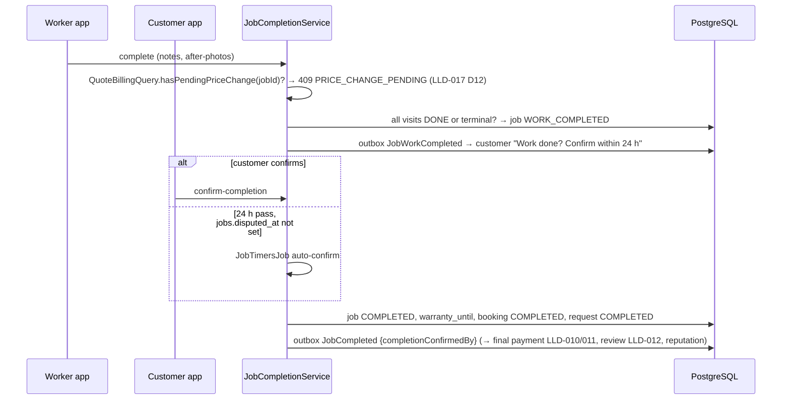

# LLD-009: Booking, Job and Visits — Start Code, Check-in/out, Extra Days, Cancellations, No-shows, Completion

| Field | Value |
|---|---|
| Status | Draft |
| Owner | TBD |
| Reviewers | TBD |
| Module | `booking` + `job` |
| Parent HLD | [modules/02](../modules/02-service-request-booking-and-job-execution.md), [architecture/03 §35–41, §46](../architecture/03-erd-and-production-database-design.md), [modules/03](../modules/03-pricing-quotation-and-money-flow.md), [modules/07 §6](../modules/07-trust-verification-reputation-and-reviews.md) |
| Requirements | FR-JOB-001, FR-JOB-002, FR-JOB-003 (multi-day, attendance), FR-BOOK-001 |
| Depends on | LLD-006 (request lifecycle, advance), LLD-008 (selection calls `createFromSelection`), LLD-014 (`media_objects`), LLD-017 (`QuoteBillingQuery`, quote / material timers), LLD-020 (`admin_users`, permissions) |
| Used by | LLD-010 / LLD-011 (bill → payment), LLD-012 (`JobLookup`: review after completion, reputation), LLD-017 (additional work, material), LLD-018 (`JobDisputeHooks`, `worker_strikes`), LLD-013 (notifications), LLD-020 (ops queue, admin views), LLD-021 (realtime) |
| Last updated | 2026-10-03 |

---

## 1. Context & scope

After the customer picks a worker, there is a **booking** (the agreement), a **job** (the work) and one or more **visits** (each day or trip). This LLD covers everything from the booking's creation to the customer confirming the work is done, including the cases that happen in real life: the worker is late or doesn't come, the customer isn't home, the work needs more days, someone cancels.

**In scope**

- `createFromSelection` (called by LLD-008)
- Booking views for customer and worker (contact details released here)
- Visit flow: on my way → arrived (GPS check-in) → start code → in progress → check-out
- Per-visit amounts by rate type; customer confirms each day
- Adding days (→ MULTI_DAY) and rescheduling, by proposal and approval
- Cancellation by customer or worker, fees and strikes
- Worker no-show and customer no-show
- Job completion, auto-completion, warranty
- Bill breakdown (`GET /jobs/{id}/bill`) consumed by payments

**Out of scope:** creating/accepting quotes and material bills ([LLD-017](lld-017-quotes-additional-work-material.md)), taking payment and ledger entries (LLD-010 / 011), reviews ([LLD-012](lld-012-reviews-ratings.md)), disputes ([LLD-018](lld-018-disputes.md) — opened with `POST /api/v1/disputes`; this LLD only exposes `JobDisputeHooks`).

**Decisions**

| # | Decision | Default (configurable) |
|---|---|---|
| D1 | **No live map tracking** in MVP. The worker taps "On my way" (with an ETA) and the customer sees status changes by push. GPS is used only at check-in / check-out. | — |
| D2 | **Check-in** requires GPS within **300 m** of the request location (accuracy ≤ 100 m). If GPS is poor the worker may "check in anyway" with a reason; the visit is flagged for review. The **start code** is the real proof of presence. | 300 m / 100 m |
| D3 | **Start code**: 4 digits per visit, shown in the customer's app; the customer tells the on-site contact by phone (SMS/WhatsApp later). **5 wrong attempts** lock it; the customer can regenerate. | 5 attempts |
| D4 | Customer **confirms each visit** (amount, work summary); auto-confirmed **24 h** after check-out unless a dispute is open (`disputed_at` set by LLD-018). | 24 h |
| D5 | Customer cancellation: **free until 2 h before** the first visit; later, or after "On my way", a **cancellation fee** (taken from the advance, paid to the worker). | 2 h; fee = min(advance, ₹100) before EN_ROUTE, = visit charge after |
| D6 | Worker cancellation: allowed, but **< 2 h before start = LATE_CANCELLATION strike**; the request automatically goes **back to matching** (that worker excluded) and the advance stays. | 2 h |
| D7 | **Worker no-show**: not checked in **60 min** after the visit start → customer can report it (auto at 2 h). NO_SHOW strike; re-matching offered; no charge. | 60 min / 2 h |
| D8 | **Customer no-show**: worker checked in (valid GPS) and waited **30 min**, customer and contact unreachable → visit `CUSTOMER_NO_SHOW`; customer pays the visit charge from the advance. | 30 min |
| D9 | **Completion**: worker marks `WORK_COMPLETED` (with photos) → customer confirms or opens a dispute ([LLD-018](lld-018-disputes.md)) within **24 h**, else auto-`COMPLETED`. `warranty_until = completed date + 30 days` (per trade, configurable). | 24 h / 30 days |
| D10 | Booking statuses stay simple (`CONFIRMED | COMPLETED | CANCELLED`); day-to-day progress is on the job and visits. | — |

---

## 2. Classes / components

```text
com.karigar.booking
├── api/  BookingController            -- /api/v1/bookings/**
├── application/
│   ├── BookingCreationService         -- createFromSelection (LLD-008)
│   ├── BookingCancellationService     -- customer / worker / admin cancel, fees, rematch
│   ├── BookingQueryService            -- role-aware views (contact release); admin views (LLD-020 booking.view)
│   └── port/ ServiceRequestLifecycle, StrikeIssuer (modules/07; owns worker_strikes), MatchingRestart (LLD-007), OutboxWriter
└── domain/ Booking, BookingStatus, AgreedRate, CancellationPolicy

com.karigar.job
├── api/  JobController, VisitController, ProposalController
├── application/
│   ├── VisitFlowService               -- en-route, check-in, start, check-out, confirm
│   ├── NoShowService                  -- worker / customer no-show
│   ├── VisitProposalService           -- add days, reschedule
│   ├── JobCompletionService           -- complete, confirm, auto-complete
│   ├── VisitAmountCalculator          -- §4
│   ├── JobBillService                 -- §5.4 breakdown (+ LLD-017 QuoteBillingQuery.billLines)
│   ├── JobTimersJob                   -- every 1 min: auto-confirm visits, no-show timeouts, auto-complete,
│   │                                      proposal expiry, LLD-017 quote / material-ack expiry (ShedLock, SKIP LOCKED);
│   │                                      skips rows with disputed_at set
│   ├── JobDisputeHooks                -- public API for LLD-018: context(jobId), holdVisit, holdCompletion,
│   │                                      releaseVisit(adjusted?), releaseCompletion
│   ├── JobLookup                      -- public API for LLD-012: reviewContext(jobId), completedJobs(workerId),
│   │                                      completionRate(workerId, since)
│   ├── FlaggedCheckInQueue            -- implements OpsQueueSource FLAGGED_CHECK_IN (LLD-020)
│   └── port/ QuoteBillingQuery (LLD-017: billLines, hasPendingPriceChange), MediaAttachments (LLD-014)
└── domain/ Job, JobVisit, VisitStatus, VisitChangeProposal, StartCode, GeoCheck
    └── event/ VisitEnRoute {etaMinutes}, VisitArrived, VisitCheckedOut {amountMinor}, VisitConfirmed,
               VisitNoShow {kind: WORKER|CUSTOMER}, VisitChangeProposed, VisitChangeResolved {outcome},
               JobWorkCompleted, JobCompleted {completionConfirmedBy}, JobFailed,
               BookingCancelled {cancelledBy, customerId, workerId, …}
               -- all outbox; ids + aggregateVersion + amounts only, never names / phones / addresses (LLD-022 D8)
```

---

## 3. Data model

Builds on [ERD §35–40.1](../architecture/03-erd-and-production-database-design.md). Additions in this LLD (now in the ERD): visit columns for start-code attempts, check-in distance, quantity and minutes worked, reschedule count; `jobs` completion columns; new `visit_change_proposals` and `job_media`. The start code is stored as a plain 4-digit value (it must be shown to the customer again; protection is the attempt limit), replacing `start_code_hash`.

```sql
-- V7_1__bookings_jobs.sql
CREATE TABLE bookings (
    id                        UUID PRIMARY KEY,
    service_request_id        UUID NOT NULL REFERENCES service_requests (id),
    customer_id               UUID NOT NULL REFERENCES customers (id),
    worker_id                 UUID NOT NULL REFERENCES workers (id),
    profession_id             UUID NOT NULL REFERENCES professions (id),
    match_id                  UUID NOT NULL REFERENCES worker_matches (id),
    booking_type              VARCHAR(20) NOT NULL CHECK (booking_type IN ('SINGLE_VISIT','MULTI_DAY')),
    scheduled_start_at        TIMESTAMPTZ NOT NULL,
    scheduled_end_at          TIMESTAMPTZ,
    planned_days              SMALLINT CHECK (planned_days BETWEEN 1 AND 180),
    agreed_rate_type          VARCHAR(20) NOT NULL,
    agreed_unit               VARCHAR(20),
    agreed_amount_minor       BIGINT NOT NULL CHECK (agreed_amount_minor >= 0),
    helper_count              SMALLINT NOT NULL DEFAULT 0,
    helper_day_rate_minor     BIGINT,
    emergency_surcharge_minor BIGINT NOT NULL DEFAULT 0,
    advance_paid_minor        BIGINT NOT NULL DEFAULT 0,
    payment_schedule          VARCHAR(20) NOT NULL CHECK (payment_schedule IN ('ON_COMPLETION','DAILY','WEEKLY','MILESTONE')),
    status                    VARCHAR(20) NOT NULL CHECK (status IN ('CONFIRMED','COMPLETED','CANCELLED')),
    confirmed_at              TIMESTAMPTZ NOT NULL,
    cancelled_at              TIMESTAMPTZ,
    cancelled_by              VARCHAR(20) CHECK (cancelled_by IN ('CUSTOMER','WORKER','ADMIN','SYSTEM')),
    cancellation_reason_code  VARCHAR(40),
    cancellation_note         TEXT,
    cancellation_fee_minor    BIGINT,
    created_at                TIMESTAMPTZ NOT NULL,
    updated_at                TIMESTAMPTZ NOT NULL,
    version                   BIGINT NOT NULL DEFAULT 0
);
CREATE UNIQUE INDEX ux_bookings_one_active_per_request ON bookings (service_request_id) WHERE status <> 'CANCELLED';
CREATE INDEX ix_bookings_worker ON bookings (worker_id, scheduled_start_at);
CREATE INDEX ix_bookings_customer ON bookings (customer_id, created_at DESC);

CREATE TABLE jobs (
    id                          UUID PRIMARY KEY,
    booking_id                  UUID NOT NULL UNIQUE REFERENCES bookings (id),
    status                      VARCHAR(20) NOT NULL CHECK (status IN
                                ('SCHEDULED','IN_PROGRESS','ON_HOLD','WORK_COMPLETED','COMPLETED','CANCELLED','FAILED')),
    failure_reason              VARCHAR(30) CHECK (failure_reason IN ('PART_UNAVAILABLE','NEEDS_OTHER_TRADE','SITE_NOT_READY','OTHER')),
    started_at                  TIMESTAMPTZ,
    worker_marked_complete_at   TIMESTAMPTZ,
    completed_at                TIMESTAMPTZ,
    completion_confirmed_by     VARCHAR(10) CHECK (completion_confirmed_by IN ('CUSTOMER','AUTO','ADMIN')),
    completion_notes            TEXT,
    warranty_until              DATE,
    disputed_at                 TIMESTAMPTZ,                     -- completion held by an open dispute (LLD-018)
    created_at                  TIMESTAMPTZ NOT NULL,
    updated_at                  TIMESTAMPTZ NOT NULL,
    version                     BIGINT NOT NULL DEFAULT 0
);

CREATE EXTENSION IF NOT EXISTS btree_gist;
CREATE TABLE job_visits (
    id                     UUID PRIMARY KEY,
    job_id                 UUID NOT NULL REFERENCES jobs (id),
    worker_id              UUID NOT NULL REFERENCES workers (id),
    visit_no               SMALLINT NOT NULL,
    visit_date             DATE NOT NULL,
    day_type               VARCHAR(20) NOT NULL CHECK (day_type IN ('VISIT','HALF_DAY','FULL_DAY')),
    scheduled_start_at     TIMESTAMPTZ NOT NULL,
    scheduled_end_at       TIMESTAMPTZ NOT NULL,
    reschedule_count       SMALLINT NOT NULL DEFAULT 0,
    status                 VARCHAR(20) NOT NULL CHECK (status IN
                           ('SCHEDULED','EN_ROUTE','ARRIVED','IN_PROGRESS','DONE',
                            'WORKER_NO_SHOW','CUSTOMER_NO_SHOW','RESCHEDULED','CANCELLED')),
    en_route_at            TIMESTAMPTZ,
    eta_minutes            SMALLINT,
    check_in_at            TIMESTAMPTZ,
    check_in_location      geography(Point, 4326),
    check_in_distance_m    INTEGER,
    check_in_flagged       BOOLEAN NOT NULL DEFAULT false,    -- "checked in anyway" (poor GPS / far)
    start_code             CHAR(4) NOT NULL,
    start_code_attempts    SMALLINT NOT NULL DEFAULT 0,
    start_code_verified_at TIMESTAMPTZ,
    check_out_at           TIMESTAMPTZ,
    check_out_location     geography(Point, 4326),
    worked_minutes         INTEGER,                           -- HOURLY
    quantity               NUMERIC(10,2),                     -- PER_UNIT (e.g. 120 sq ft)
    helpers_present        SMALLINT NOT NULL DEFAULT 0,
    work_summary           TEXT,
    labour_amount_minor    BIGINT,
    helper_amount_minor    BIGINT,
    customer_confirmed_at  TIMESTAMPTZ,
    confirmed_by           VARCHAR(10) CHECK (confirmed_by IN ('CUSTOMER','AUTO','ADMIN')),   -- ADMIN: dispute ADJUST_VISIT (LLD-018)
    disputed_at            TIMESTAMPTZ,                       -- held by an open dispute (LLD-018)
    created_at             TIMESTAMPTZ NOT NULL,
    updated_at             TIMESTAMPTZ NOT NULL,
    UNIQUE (job_id, visit_no),
    CHECK (scheduled_end_at > scheduled_start_at),
    CONSTRAINT ex_job_visits_worker_overlap EXCLUDE USING gist (
        worker_id WITH =, tstzrange(scheduled_start_at, scheduled_end_at) WITH &&
    ) WHERE (status NOT IN ('CANCELLED','RESCHEDULED','WORKER_NO_SHOW','CUSTOMER_NO_SHOW'))
);
CREATE INDEX ix_job_visits_worker_date ON job_visits (worker_id, visit_date);
CREATE INDEX ix_job_visits_timers ON job_visits (status, scheduled_start_at) WHERE status IN ('SCHEDULED','EN_ROUTE','ARRIVED');

CREATE TABLE visit_change_proposals (
    id               UUID PRIMARY KEY,
    job_id           UUID NOT NULL REFERENCES jobs (id),
    visit_id         UUID REFERENCES job_visits (id),          -- RESCHEDULE only
    kind             VARCHAR(20) NOT NULL CHECK (kind IN ('ADD_DAYS','RESCHEDULE')),
    proposed_by      VARCHAR(10) NOT NULL CHECK (proposed_by IN ('CUSTOMER','WORKER')),
    payload          JSONB NOT NULL,      -- ADD_DAYS: [{date, dayType, start, end}], helpers, payment_schedule; RESCHEDULE: {start, end}
    reason           VARCHAR(300),
    status           VARCHAR(20) NOT NULL CHECK (status IN ('PENDING','ACCEPTED','REJECTED','EXPIRED','WITHDRAWN')),
    expires_at       TIMESTAMPTZ NOT NULL,                     -- 12 h, or 1 h before the earliest proposed start
    decided_at       TIMESTAMPTZ,
    created_at       TIMESTAMPTZ NOT NULL
);
CREATE UNIQUE INDEX ux_proposals_one_pending ON visit_change_proposals (job_id) WHERE status = 'PENDING';

CREATE TABLE job_media (
    id          UUID PRIMARY KEY,
    job_id      UUID NOT NULL REFERENCES jobs (id),
    visit_id    UUID REFERENCES job_visits (id),
    media_id    UUID NOT NULL REFERENCES media_objects (id),   -- LLD-014
    kind        VARCHAR(10) NOT NULL CHECK (kind IN ('BEFORE','AFTER','PROGRESS')),
    uploaded_by VARCHAR(10) NOT NULL CHECK (uploaded_by IN ('WORKER','CUSTOMER')),
    created_at  TIMESTAMPTZ NOT NULL
);

-- ERD §48.2. Written by BookingCancellationService / NoShowService (StrikeIssuer) and LLD-018.
CREATE TABLE worker_strikes (
    id                   UUID PRIMARY KEY,
    worker_id            UUID NOT NULL REFERENCES workers (id),
    strike_type          VARCHAR(30) NOT NULL CHECK (strike_type IN
                         ('NO_SHOW','LATE_CANCELLATION','LATE_ARRIVAL','OFF_PLATFORM_PAYMENT',
                          'ABUSIVE_BEHAVIOUR','DISPUTE_UPHELD','REVIEW_MANIPULATION')),
    points               SMALLINT NOT NULL CHECK (points BETWEEN 1 AND 10),
    job_id               UUID REFERENCES jobs (id),
    job_visit_id         UUID REFERENCES job_visits (id),
    dispute_id           UUID,                              -- FK added by LLD-018 V13_1 (disputes does not exist yet)
    reason_code          VARCHAR(40),
    status               VARCHAR(20) NOT NULL CHECK (status IN ('ACTIVE','APPEALED','REVOKED','EXPIRED')),
    issued_by            VARCHAR(10) NOT NULL CHECK (issued_by IN ('SYSTEM','ADMIN')),
    issued_by_admin_id   UUID REFERENCES admin_users (id),  -- LLD-020 V1_3
    issued_at            TIMESTAMPTZ NOT NULL,
    expires_at           TIMESTAMPTZ NOT NULL,              -- issued_at + 90 days (configurable)
    appeal_note          TEXT,
    appealed_at          TIMESTAMPTZ,
    resolved_by_admin_id UUID REFERENCES admin_users (id),
    resolved_at          TIMESTAMPTZ,
    created_at           TIMESTAMPTZ NOT NULL,
    updated_at           TIMESTAMPTZ NOT NULL,
    CHECK (expires_at > issued_at),
    CHECK (issued_by = 'SYSTEM' OR issued_by_admin_id IS NOT NULL)
);
CREATE UNIQUE INDEX ux_strikes_visit_type ON worker_strikes (job_visit_id, strike_type)
    WHERE job_visit_id IS NOT NULL AND status <> 'REVOKED';
CREATE UNIQUE INDEX ux_strikes_dispute ON worker_strikes (dispute_id)
    WHERE dispute_id IS NOT NULL AND status <> 'REVOKED';
CREATE INDEX ix_strikes_worker_live ON worker_strikes (worker_id, expires_at)
    WHERE status IN ('ACTIVE','APPEALED');
```

---

## 4. Visit amounts

`VisitAmountCalculator` runs at check-out; the customer sees and confirms the result. All amounts in paise, rounded half-up.

| Agreed rate | Visit labour amount |
|---|---|
| VISIT | visit 1 = agreed amount; later visits 0 unless a quote says otherwise |
| HOURLY | `ceil(worked_minutes / 30) × 30 min × rate / 60`, minimum 1 h |
| HALF_DAY / DAILY | `FULL_DAY` = daily rate; `HALF_DAY` = half-day rate if agreed, else 50 % of the daily rate |
| PER_UNIT | `quantity × unit rate` (quantity entered at check-out, confirmed by customer) |
| MINIMUM | agreed amount on visit 1 |
| QUOTE | 0 per visit — the accepted quote's lines are billed ([LLD-017](lld-017-quotes-additional-work-material.md)) |

Helpers: `helper_amount = helpers_present × helper_day_rate` for `FULL_DAY` (half for `HALF_DAY`).

---

## 5. API contract

### 5.1 Booking views

| Method | Path | Who | Purpose |
|---|---|---|---|
| GET | `/api/v1/bookings?role=customer\|worker&status=…` | both | my bookings |
| GET | `/api/v1/bookings/{id}` | customer / selected worker | role-aware detail |

The **worker's** view now includes `address` (formatted, house no, landmark, floor/lift), `location`, `contactName`, `contactPhone`; the **customer's** view includes the worker's phone and photo. Others → 404.

### 5.2 Visit flow

| Method | Path | Who | Body |
|---|---|---|---|
| POST | `/api/v1/visits/{id}/en-route` | worker | `{ "etaMinutes": 25 }` |
| POST | `/api/v1/visits/{id}/check-in` | worker | `{ "latitude", "longitude", "accuracyM", "anywayReason": null }` |
| GET | `/api/v1/visits/{id}/start-code` | customer | → `{ "code": "4821", "attemptsLeft": 5 }` |
| POST | `/api/v1/visits/{id}/start-code/regenerate` | customer | after a lock |
| POST | `/api/v1/visits/{id}/start` | worker | `{ "code": "4821" }` |
| POST | `/api/v1/visits/{id}/check-out` | worker | `{ "dayType": "FULL_DAY", "helpersPresent": 1, "quantity": null, "workSummary": "Plastered east wall", "mediaIds": [] }` |
| POST | `/api/v1/visits/{id}/confirm` | customer | `{}` (to dispute instead: `POST /api/v1/disputes`, [LLD-018](lld-018-disputes.md)) |
| POST | `/api/v1/visits/{id}/report-worker-no-show` | customer | after start + 60 min |
| POST | `/api/v1/visits/{id}/customer-no-show` | worker | after check-in + 30 min waiting |

### 5.3 Changes, cancellation, completion

| Method | Path | Who | Purpose |
|---|---|---|---|
| POST | `/api/v1/jobs/{id}/proposals` | both | `ADD_DAYS` (worker usually) or `RESCHEDULE` |
| POST | `/api/v1/proposals/{id}/accept` · `/reject` · `/withdraw` | other side / proposer | |
| POST | `/api/v1/bookings/{id}/cancel` | both | `{ "reasonCode": "…", "note": null }` → shows fee before confirming via `?preview=true` |
| POST | `/api/v1/jobs/{id}/complete` | worker | `{ "notes": "…", "mediaIds": ["after-1"] }` |
| POST | `/api/v1/jobs/{id}/confirm-completion` | customer | `{}`; or open a dispute with `POST /api/v1/disputes` ([LLD-018](lld-018-disputes.md)) |
| POST | `/api/v1/jobs/{id}/cannot-complete` | worker | `{ "reasonCode": "PART_UNAVAILABLE", "notes": "…", "mediaIds": [] }` → job `FAILED` (§7, §8) |
| GET | `/api/v1/jobs/{id}/bill` | both | breakdown below |

**Admin** (permissions per [LLD-020](lld-020-admin-operations.md); every call writes `audit_events`):

| Method | Path | Permission | Purpose |
|---|---|---|---|
| GET | `/api/v1/admin/bookings` · `/api/v1/admin/bookings/{id}` · `/api/v1/admin/jobs[/{id}]` | `booking.view` | search / detail incl. visits, timeline and the job's quotes and material bills (LLD-017) |
| POST | `/api/v1/admin/bookings/{id}/cancel` | `booking.manage` (LLD-020) | `{ "reasonCode", "note" }`; same rules as §8 with `cancelled_by = ADMIN` |

Add-days proposal (raj mistri, wall needs two more days with a helper):

```json
{
  "kind": "ADD_DAYS",
  "visits": [
    { "date": "2026-10-15", "dayType": "FULL_DAY", "start": "2026-10-15T03:30:00Z", "end": "2026-10-15T11:30:00Z" },
    { "date": "2026-10-16", "dayType": "HALF_DAY", "start": "2026-10-16T03:30:00Z", "end": "2026-10-16T07:30:00Z" }
  ],
  "helperCount": 1,
  "paymentSchedule": "DAILY",
  "reason": "Second wall needs plaster as well"
}
```

Accepting it inserts the visits (overlap constraint applies), sets `booking_type = MULTI_DAY`, updates `planned_days`, `scheduled_end_at`, helper fields and `payment_schedule`.

### 5.4 Bill breakdown

```json
{
  "data": {
    "jobId": "…", "status": "WORK_COMPLETED",
    "lines": [
      { "type": "VISIT_LABOUR", "visitNo": 1, "amountMinor": 85000 },
      { "type": "HELPER",       "visitNo": 1, "amountMinor": 50000 },
      { "type": "VISIT_LABOUR", "visitNo": 2, "amountMinor": 85000 },
      { "type": "QUOTE",        "quoteId": "…", "amountMinor": 90000 },
      { "type": "MATERIAL",     "materialBillId": "…", "quoteId": "…", "amountMinor": 30000 },
      { "type": "EMERGENCY_SURCHARGE", "amountMinor": 0 },
      { "type": "ADVANCE_PAID", "amountMinor": -9900 },
      { "type": "ALREADY_PAID", "amountMinor": -135000 }
    ],
    "totalMinor": 340000,
    "paidMinor": 144900,
    "dueMinor": 195100,
    "currency": "INR"
  }
}
```

Only **confirmed** visits and **accepted** quotes are included. `QUOTE` and `MATERIAL` lines come from `QuoteBillingQuery.billLines(jobId)` ([LLD-017](lld-017-quotes-additional-work-material.md) §3): `QUOTE` amount = `total_minor − material_total_minor` (labour only, not on a `CANCELLED` / `FAILED` job); `MATERIAL` = `{materialBillId, quoteId?, amountMinor}` per covered / acknowledged material bill (any job status). `ALREADY_PAID` covers daily/weekly payments (LLD-010/011). The bill is computed, never stored as a mutable total; payments record what was charged.

### 5.5 Error codes

| HTTP | `error.code` | When |
|---|---|---|
| 404 | `BOOKING_NOT_FOUND` / `VISIT_NOT_FOUND` | not a party to it |
| 409 | `VISIT_STATE_INVALID` | action not allowed in current visit status |
| 422 | `TOO_FAR_FROM_SITE` | check-in > 300 m without `anywayReason` (`details.distanceM`) |
| 422 | `START_CODE_INVALID` | wrong code (`details.attemptsLeft`) |
| 423 | `START_CODE_LOCKED` | 5 wrong attempts; customer must regenerate |
| 409 | `NO_SHOW_TOO_EARLY` | reporting before the waiting time |
| 409 | `PROPOSAL_PENDING` | another proposal is open for this job |
| 422 | `WORKER_BUSY_AT_TIME` | proposed visit overlaps another booking |
| 409 | `RESCHEDULE_LIMIT_REACHED` | > 2 reschedules of a visit |
| 409 | `BOOKING_NOT_CANCELLABLE` | job already in progress / completed |
| 409 | `JOB_NOT_COMPLETABLE` | visits still open or unconfirmed check-outs |
| 409 | `PRICE_CHANGE_PENDING` | `complete` while a quote is `SUBMITTED` or a material bill is `PENDING_ACK` ([LLD-017](lld-017-quotes-additional-work-material.md) D12) |

---

## 6. Sequence diagrams

### 6.1 A visit

```mermaid
sequenceDiagram
    participant W as Worker app
    participant C as Customer app
    participant V as VisitFlowService
    participant DB as PostgreSQL
    W->>V: en-route (ETA 25 min)
    V->>DB: visit EN_ROUTE; outbox VisitEnRoute {etaMinutes} → push to customer "Sujit is on the way, ~25 min"
    W->>V: check-in (GPS)
    V->>V: distance to request location ≤ 300 m? accuracy ok?
    V->>DB: visit ARRIVED (check_in_distance_m); outbox VisitArrived
    C->>V: GET start-code → "4821" (customer tells on-site contact)
    W->>V: start (4821)
    V->>DB: attempts < 5 and code matches → IN_PROGRESS; job SCHEDULED → IN_PROGRESS
    W->>V: check-out (FULL_DAY, 1 helper, summary, photos)
    V->>V: VisitAmountCalculator
    V->>DB: visit DONE (amounts); outbox VisitCheckedOut {amountMinor} → customer "Confirm today's work"
    C->>V: confirm
    V->>DB: customer_confirmed_at; outbox VisitConfirmed (→ daily payment, LLD-010/011)
```

### 6.2 Worker cancels late → re-matching

```mermaid
sequenceDiagram
    participant W as Worker app
    participant B as BookingCancellationService
    participant DB as PostgreSQL
    participant L as ServiceRequestLifecycle
    participant M as MatchingRestart (LLD-007)
    W->>B: POST /bookings/{id}/cancel (PERSONAL_EMERGENCY)
    Note over B,DB: one transaction
    B->>DB: booking CANCELLED (WORKER), job CANCELLED, open visits CANCELLED
    B->>DB: < 2 h before start → INSERT worker_strikes (LATE_CANCELLATION)
    B->>L: request BOOKED → MATCHING (selected_worker cleared)
    B->>M: new matching run, attempt + 1, this worker added to exclusions
    B->>DB: outbox BookingCancelled {cancelledBy: WORKER, customerId, workerId, …} (customer: "Sujit cancelled — we're finding someone else; your advance is safe")
```

### 6.3 Completion



---

## 7. State transitions

**Visit**

| From | Event | By | Guard | To |
|---|---|---|---|---|
| SCHEDULED | on my way | worker | ≤ 3 h before start | EN_ROUTE |
| SCHEDULED / EN_ROUTE | check-in | worker | GPS ≤ 300 m or `anywayReason` | ARRIVED |
| ARRIVED | correct start code | worker | attempts < 5 | IN_PROGRESS |
| IN_PROGRESS | check-out | worker | — | DONE (amounts set) |
| DONE | confirm / 24 h | customer / timer | `disputed_at` not set | DONE + confirmed (`VisitConfirmed`) |
| DONE (disputed) | dispute closed (LLD-018 `releaseVisit`) | admin | — | DONE + confirmed (`confirmed_by = ADMIN` if adjusted) |
| SCHEDULED / EN_ROUTE | worker no-show | customer (≥ 60 min) / timer (2 h) | not checked in | WORKER_NO_SHOW |
| ARRIVED | customer no-show | worker | ≥ 30 min after check-in, valid GPS | CUSTOMER_NO_SHOW |
| SCHEDULED | reschedule accepted | other party | ≤ 2 reschedules, no overlap | RESCHEDULED; a new SCHEDULED visit row is created with the new times and the next free `visit_no` (`reschedule_count` carried + 1) |
| SCHEDULED / EN_ROUTE | booking cancelled | either | — | CANCELLED |

**Job**

| From | Event | To |
|---|---|---|
| SCHEDULED | first visit IN_PROGRESS | IN_PROGRESS |
| IN_PROGRESS | worker pauses (material awaited, rain) with reason | ON_HOLD |
| ON_HOLD | next visit starts | IN_PROGRESS |
| IN_PROGRESS | worker marks complete (no open visits) | WORK_COMPLETED |
| WORK_COMPLETED | customer confirms / 24 h with `disputed_at` not set / dispute closed (LLD-018 `releaseCompletion`) | COMPLETED |
| SCHEDULED / IN_PROGRESS / ON_HOLD | booking cancelled, or single-visit worker no-show | CANCELLED |
| IN_PROGRESS / ON_HOLD | worker reports the work can't be done (part unavailable, needs another trade), current visit checked out | FAILED |

**Booking:** `CONFIRMED → COMPLETED` (job completed) · `CONFIRMED → CANCELLED` (customer / worker / admin / no-show / job `FAILED` / worker suspended).

**Request side (LLD-006):** worker cancellation or worker no-show on a single-visit job → `BOOKED → MATCHING` (this LLD adds that transition); customer cancellation or job `FAILED` → `BOOKED → CANCELLED` (for `FAILED` the app offers "Book again" pre-filled, [LLD-006](lld-006-create-service-request.md)); completion → `COMPLETED`.

---

## 8. Cancellation and no-show money rules

| Case | Customer pays | Worker gets | Strike |
|---|---|---|---|
| Customer cancels ≥ 2 h before start | 0 (advance refunded) | 0 | — |
| Customer cancels < 2 h before, worker not yet on the way | min(advance, ₹100) from advance | that fee (less commission) | — |
| Customer cancels after "On my way" | visit charge, capped at the advance | that amount (less commission) | — |
| Customer no-show (D8) | visit charge, capped at the advance | that amount (less commission) | customer counter (modules/07 §4.5) |
| Worker cancels ≥ 2 h before | 0 — re-matching, advance kept | 0 | — |
| Worker cancels < 2 h before | 0 — re-matching | 0 | LATE_CANCELLATION |
| Worker no-show (D7) | 0 — re-matching or refund | 0 | NO_SHOW |
| Multi-day job cancelled midway | confirmed visits are payable + covered/acknowledged material bills (LLD-017 D10); fee rules apply to the next visit only | confirmed visits | as above |
| Job `FAILED` (worker can't complete) | visit charge for the failed visit, capped at the advance, plus earlier confirmed visits + covered/acknowledged material bills (LLD-017 D10); rest of advance refunded | that amount (less commission) | — (repeated `NEEDS_OTHER_TRADE` is an ops signal, not a strike) |
| Worker suspended with confirmed jobs ([LLD-004](lld-004-worker-profile-trades-rates.md)) | as "worker cancels ≥ 2 h before" for every future visit; a visit already `IN_PROGRESS` may be checked out first | confirmed visits only | — (the suspension is the sanction) |

The money movement itself (refunds, fee to worker, ledger) is done by LLD-010/011 from the `BookingCancelled` / `VisitNoShow` / `JobFailed` events, which carry the computed amounts (incl. `materialDueMinor`). Suspension: `BookingCancellationService` consumes `WorkerSuspended` and cancels each of that worker's `CONFIRMED` bookings with reason `WORKER_SUSPENDED`.

---

## 9. Error handling, idempotency & concurrency

- Every visit / job / booking action is a guarded update on the current status (`… WHERE status = :expected AND version = :v`); repeating an action that already happened returns `200` with the current state (idempotent for flaky networks).
- **Overlap:** new or rescheduled visits are protected by `ex_job_visits_worker_overlap`; a violation → `422 WORKER_BUSY_AT_TIME`.
- **Start-code brute force:** attempts counted in the same row update (`start_code_attempts = start_code_attempts + 1 … RETURNING`), so parallel guesses can't exceed 5.
- **Cancel vs check-in race:** both lock the booking row first (booking → job → visit lock order); one wins.
- **Timers** (`JobTimersJob`, every minute, `FOR UPDATE SKIP LOCKED`): auto-confirm visits (24 h), worker no-show at 2 h, auto-complete jobs (24 h), proposal expiry, and LLD-017 quote expiry + material-bill ack expiry. Rows with `disputed_at` set are skipped (auto-confirm / auto-complete re-check `disputed_at IS NULL`). Each timer action re-checks status inside its transaction.
- **Disputes:** LLD-018 holds a visit / completion through `JobDisputeHooks.holdVisit` / `holdCompletion` (guarded set of `disputed_at` in its open transaction) and releases it with `releaseVisit` / `releaseCompletion` when the dispute closes.
- Events go through the outbox (§2 list): `VisitEnRoute`, `VisitArrived`, `VisitCheckedOut`, `VisitConfirmed`, `VisitNoShow`, `VisitChangeProposed`, `VisitChangeResolved`, `JobWorkCompleted`, `JobCompleted`, `JobFailed`, `BookingCancelled` — money ones (`VisitConfirmed`, `BookingCancelled`, `VisitNoShow`, `JobCompleted`, `JobFailed`) must never be lost. Payloads carry ids + `aggregateVersion` + amounts, never names / phones / addresses (LLD-022 D8).
- **Timestamps are server time.** Offline retries reuse the same action; the first one that arrives sets `checked_in_at` etc. Client clock values are never stored as business time.

---

## 10. Security & privacy

- Booking detail is visible only to the customer and the selected worker; contact details appear only in their views, only while the booking is `CONFIRMED` and for 7 days after completion (for warranty calls), then hidden.
- Check-in / check-out locations are stored for disputes; retained per [security/03](../security/03-data-privacy-pii-retention-and-compliance.md) (proposed 90 days, then rounded to ~1 km).
- The start code is shown only to the customer; it's never sent to the worker or in events.
- Photos (`job_media`) are private objects; customer and worker of the job (and dispute agents) can see them.
- `check_in_flagged` visits are listed for ops review (possible fake check-ins) through the `FLAGGED_CHECK_IN` `OpsQueueSource` ([LLD-020](lld-020-admin-operations.md) §3.3).
- Every booking / job / visit status change writes an `audit_events` row (actor, from → to, reason) — the history used in disputes. No separate status-history table.
- Free-text notes (`completion_notes`, proposal reasons, cannot-complete notes) are never logged.

---

## 11. Observability

| Type | Name | Notes |
|---|---|---|
| Histogram | `visit_arrival_delay_minutes{trade}` | check-in vs scheduled start — punctuality |
| Counter | `start_code_failures_total`, `start_code_locked_total` | |
| Counter | `check_in_flagged_total{reason}` | poor GPS vs too far |
| Counter | `booking_cancelled_total{by, late}` | |
| Counter | `no_show_total{side}` | worker / customer |
| Counter | `visit_auto_confirmed_total`, `job_auto_completed_total` | customers not engaging |
| Histogram | `job_duration_days{trade, booking_type}` | |

Alerts: worker no-shows > 5 % of visits in a day; flagged check-ins > 10 %; auto-completed jobs > 50 % (customers not confirming — check UX).

---

## 12. Test plan

| Level | Cases |
|---|---|
| Unit | amount calculator for every rate type incl. HOURLY rounding and HALF_DAY fallback; cancellation fee table at the 2 h boundary and after EN_ROUTE; distance check at 299 / 301 m |
| Integration (Testcontainers PostGIS) | full single visit: en-route → check-in → wrong code ×2 → right code → check-out → confirm; contact details only in the selected worker's view |
| Multi-day | add-days proposal accepted → MULTI_DAY, visits inserted, payment schedule DAILY; overlapping proposed day → 422 |
| No-shows | worker not checked in at +60 min → customer report → strike + request back to MATCHING; customer no-show after 30 min → fee from advance |
| Cancellation | customer cancels 3 h before (no fee), 1 h before (fee), after EN_ROUTE (visit charge); worker cancels late → strike + re-matching with that worker excluded |
| Concurrency | 10 parallel wrong codes → exactly 5 counted then locked; cancel vs check-in → one result; two reschedules in parallel → one pending proposal |
| Timers | auto-confirm at 24 h, auto-complete at 24 h, two instances → once; visit / job with `disputed_at` set is not auto-confirmed |
| Quotes (LLD-017) | `complete` with a `SUBMITTED` quote → 409 `PRICE_CHANGE_PENDING`; bill shows `QUOTE` labour (total − material) and `MATERIAL` lines; `FAILED` job → `MATERIAL` only, `materialDueMinor` in `JobFailed` |
| Completion | complete with open visits → 409; confirm → booking, request COMPLETED, warranty date set, `JobCompleted` in outbox |
| Failed job | cannot-complete during IN_PROGRESS → job FAILED, booking + request CANCELLED, `JobFailed` with visit charge and refund amount in outbox |
| Suspension | `WorkerSuspended` with 2 future bookings → both cancelled (`WORKER_SUSPENDED`), requests back to MATCHING excluding that worker; IN_PROGRESS visit can still check out |
| Architecture (ArchUnit) | `booking` / `job` do not depend on other modules' `infrastructure` packages |

---

## 13. Open questions

| Question | Default until decided | Owner | Due |
|---|---|---|---|
| Send the start code to the site contact by SMS / WhatsApp | Customer relays it by phone in MVP | TBD | With SMS phase |
| Live location sharing while "On my way" | No (D1) | TBD | Phase 2 |
| Warranty length per trade (30 days for all?) | 30 days, per-trade config | Product | Before launch |
| ~~Who pays if the customer cancels after material was bought~~ | **Decided by [LLD-017](lld-017-quotes-additional-work-material.md) D10:** covered / acknowledged material bills are payable on a cancelled or failed job; accepted quote labour is not | — | — |

---

## Change log

| Version | Date | Author | Change |
|---|---|---|---|
| 0.1 | 2026-10-03 | TBD | First draft |
| 0.2 | 2026-10-05 | TBD | `FAILED` job (visit charge only), suspended worker's bookings cancelled + re-matched, audit_events for status history, server timestamps, notes not logged |
| 0.3 | 2026-10-05 | TBD | Integrated with LLD-012–022: `worker_strikes` DDL (ERD §48.2), `jobs.disputed_at`, `confirmed_by` ADMIN, `job_media` FK (014); disputes via `POST /api/v1/disputes` + `JobDisputeHooks` (018); `JobLookup` (012); bill `QUOTE`/`MATERIAL` lines, `PRICE_CHANGE_PENDING`, material on cancel/fail, quote timers (017); named outbox events; `FLAGGED_CHECK_IN` queue + admin booking endpoints (020) |
