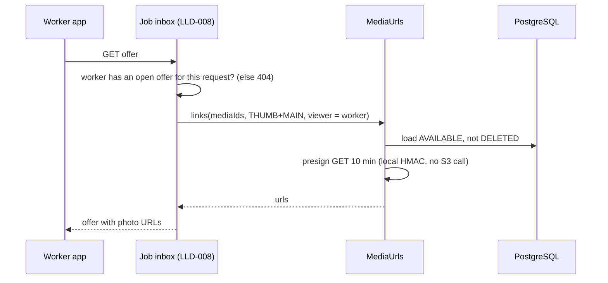

# LLD-014: Media Upload and Object Storage

| Field | Value |
|---|---|
| Status | Draft |
| Owner | TBD |
| Reviewers | TBD |
| Module | `media` |
| Parent HLD | [modules/10](../modules/10-media-upload-and-object-storage.md), [ADR 0013](../adr/0013-object-storage-direct-upload.md), [architecture/09 §28](../architecture/09-async-processing-domain-events-and-outbox.md), [security/02 §48–53, §74](../security/02-threat-model-and-application-security.md), [security/03 §56, §102–103](../security/03-data-privacy-pii-retention-and-compliance.md) |
| Requirements | FR-CUS-004 (request photos / video / voice note), FR-CUS-002 + FR-WRK-002 (profile photo), FR-WRK-004 (verification files), FR-JOB-001 (job photos), FR-DIS-001 (evidence), NFR-003 |
| Depends on | LLD-001 (`users`, roles), `audit_events` (LLD-020 `V1_3`), `idempotency_records` (LLD-022) |
| Used by | LLD-006 (request attachments, drafts), LLD-008 (photos in the job inbox / shortlist), LLD-009 (`job_media`), LLD-004 / LLD-001 (profile photo), LLD-016 (`VERIFICATION_DOC`), LLD-017 (`MATERIAL_BILL`), LLD-018 (`DISPUTE_EVIDENCE`), LLD-012 (`REVIEW_PHOTO`, later) |
| Last updated | 2026-10-05 |

---

## 1. Context & scope

Customers add photos, a short video or a voice note to a request; workers add before/after photos and verification files; both sides add dispute evidence. Most users are on cheap Android phones and patchy 4G. Files go **straight from the phone to S3** with a presigned URL; the backend only authorises, validates, cleans and hands out short-lived links. The business module that uses a file owns the link to it (`service_request_attachments`, `job_media`, …); this module owns storage mechanics only.

**In scope**

- Upload intent → presigned PUT → complete → background validation and processing → `AVAILABLE`
- Per-purpose limits (type, size, duration, role) from config
- Image cleaning: decode, auto-rotate, strip EXIF/GPS, re-encode, one thumbnail
- Attach-once API for owning modules; signed GET URLs after the owner has authorised the viewer
- Public copies for worker profile photos (and review photos after moderation)
- Orphan cleanup, deletion, purge of objects

**Out of scope:** who may see a given file (each owning module decides, then calls `MediaUrls`), retention periods (owning modules call `release` per [security/03 §102](../security/03-data-privacy-pii-retention-and-compliance.md)), video transcoding, PDFs, malware scanning (D9), CDN for private media.

**Decisions**

| # | Decision | Default (configurable) |
|---|---|---|
| D1 | **One table `media_objects`**, no polymorphic owner. Business links live in the owning module's table with `media_id REFERENCES media_objects (id)` (HLD §52–53). | — |
| D2 | **Presigned PUT**, single request (no multipart). `Content-Type` and the exact declared `Content-Length` are signed, so S3 rejects any other size or type. The PUT URL expires quickly; on expiry the app asks for a new intent. | 15 min |
| D3 | Status flow `PENDING_UPLOAD → UPLOADED → AVAILABLE` (or `REJECTED` / `EXPIRED` / `DELETED`). `complete` only does a `HEAD`; all content checks and processing run in `MediaProcessingJob`, never on the request thread (architecture/09 §28). | job every 1 s |
| D4 | **Attach-once:** the owning module calls `MediaAttachments.attach(...)` in its own transaction; it succeeds only for `AVAILABLE` media, of the expected purpose, owned by the expected user, not yet attached. The app waits for `AVAILABLE` (usually < 3 s) before enabling "Submit". | — |
| D5 | **Unattached media is deleted after 24 h**, unless the owner asked to keep it longer (`keepUntil`, used by request drafts — LLD-006 keeps drafts 30 days). | 24 h |
| D6 | **Images are always re-encoded** to JPEG (main ≤ 1600 px long edge, thumb 320 px, quality 82). This strips EXIF/GPS, fixes rotation and defuses crafted or polyglot files. The original is deleted, except for `DISPUTE_EVIDENCE`, where it is kept private for dispute agents (metadata may matter as evidence, HLD §33). | 1600 / 320 px |
| D7 | **Video and voice notes are not transcoded.** MP4 / M4A container is parsed (type, duration); the MP4 location atoms (`©xyz`, `loci`) are blanked in place (same length, no remux) so a request video cannot reveal the home's GPS to workers before selection (LLD-008). | — |
| D8 | **Two buckets** (operations/02 §6): `media-private` (everything; presigned GET/PUT only) and `media-public` (CloudFront + OAC). A file goes public only when its owning module calls `publish` and the purpose allows it (worker profile photo, moderated review photo). | — |
| D9 | **No malware scanner in MVP.** Accepted types are only JPEG / PNG / WebP (re-encoded, D6), MP4 and M4A (parsed, never executed, served with a fixed type + `nosniff`). PDFs and other documents are refused until ClamAV (or similar) is added — verification files are photos of the certificate. | open question §11 |
| D10 | Signed GET URLs: normal media 10 min; `VERIFICATION_DOC` and dispute originals 60 s, and every URL issued for them writes `audit_events`. | 10 min / 60 s |
| D11 | **Client does the heavy lifting:** the app compresses photos to ~1600 px JPEG before upload (~300 KB instead of 4 MB), records video in-app at 720p ≈ 1 Mbit/s (30 s ≈ 4 MB), uploads one file at a time with retry, and can start uploading while the user is still filling the form. | — |

**Purposes and limits** (`media.purposes.*`, loaded at start-up; a purpose not in config is rejected):

| Purpose | Who may upload | Types | Max size | Max duration | Can be public | Original kept |
|---|---|---|---|---|---|---|
| `REQUEST_PHOTO` | customer | jpeg, png, webp | 10 MB | — | no | no |
| `REQUEST_VIDEO` | customer | mp4 | 25 MB | 30 s | no | — |
| `VOICE_NOTE` | customer | m4a (audio/mp4) | 2 MB | 60 s | no | — |
| `JOB_PHOTO` | worker, customer | jpeg, png, webp | 10 MB | — | no | no |
| `PROFILE_PHOTO` | any user | jpeg, png, webp | 5 MB | — | yes (workers only, D8) | no |
| `VERIFICATION_DOC` | worker | jpeg, png, webp | 10 MB | — | never | no |
| `DISPUTE_EVIDENCE` | customer, worker | jpeg, png, webp, mp4 | 10 MB / 50 MB | 60 s | never | yes |
| `REVIEW_PHOTO`, `MATERIAL_BILL` | customer / worker | jpeg, png, webp | 10 MB | — | review only | no |

`MATERIAL_BILL` (shop receipt) is enabled by LLD-017. `REVIEW_PHOTO` is in the DB check but `enabled: false` (review photos are not in MVP, LLD-012 §11). Counts per business object (5 photos, 1 video, 1 voice note per request) are enforced by the owning module, not here. Images over 24 MP or 8000 px on a side are rejected before decoding (decompression bombs).

---

## 2. Classes / components

```text
com.karigar.media
├── MediaAttachments                  -- public API: attach, keepUntil, release, publish, unpublish
├── MediaUrls                         -- public API: links(ids, variant, viewer) → signed / public URLs
├── api/
│   └── MediaController               -- /api/v1/media/upload-intents, /{id}/complete, GET/DELETE /{id}
├── application/
│   ├── UploadIntentService           -- role + purpose + limits, pending cap, INSERT row, presign PUT
│   ├── CompleteUploadService         -- HEAD object → UPLOADED (idempotent)
│   ├── MediaProcessingJob            -- every 1 s: UPLOADED rows FOR UPDATE SKIP LOCKED, bounded pool (2)
│   ├── MediaCleanupJob               -- every 15 min, ShedLock: expire intents, delete orphans, purge objects
│   └── port/ StorageGateway, AuditWriter
├── domain/
│   ├── MediaObject, MediaStatus, MediaPurpose, Variant (THUMB | MAIN | ORIGINAL)
│   ├── PurposePolicy                 -- one per purpose, from MediaProperties
│   ├── MagicBytes                    -- sniff JPEG / PNG / WebP / MP4 / M4A from the first 64 bytes
│   ├── ImageSanitizer                -- ImageIO + TwelveMonkeys (WebP read); subsampled decode, rotate, JPEG write
│   └── Mp4Inspector                  -- metadata-extractor: brand, duration; blanks ©xyz / loci
└── infrastructure/
    ├── storage/ S3StorageGateway      -- AWS SDK v2 S3Client + S3Presigner (MinIO locally)
    ├── persistence/ MediaObjectRepository
    └── config/ MediaProperties
```

```java
public interface StorageGateway {
    URI presignPut(Bucket b, String key, String contentType, long contentLength, Duration ttl);
    URI presignGet(String key, Duration ttl, String contentType);   // response-content-type + inline disposition
    Optional<ObjectHead> head(String key);                           // size, type
    InputStream get(String key, long maxBytes);
    void put(Bucket b, String key, byte[] body, String contentType);
    void delete(Bucket b, String key);                               // idempotent
}

public interface MediaAttachments {
    /** Same DB transaction as the caller's link-row insert. Throws InvalidMediaException (→ 422 INVALID_MEDIA). */
    void attach(Collection<MediaId> ids, UserId owner, Set<MediaPurpose> allowed, String attachedRef);
    void keepUntil(Collection<MediaId> ids, UserId owner, Instant until);   // drafts (D5)
    void release(Collection<MediaId> ids);                                  // owner detaches / retention expired
    URI publish(MediaId id);                                                // copies MAIN + THUMB to media-public
    void unpublish(MediaId id);
}
```

`attach` is one statement; the row count must equal `ids.size()`:

```sql
UPDATE media_objects SET attached_at = now(), attached_ref = :ref, updated_at = now()
WHERE id = ANY(:ids) AND owner_user_id = :owner AND purpose = ANY(:allowed)
  AND status = 'AVAILABLE' AND attached_at IS NULL;
```

---

## 3. Data model

New table. Runs as **`V4_8__media.sql`** — after `V4_2` and before `V5_1__service_requests.sql`, the first migration whose tables link to media. No earlier migration references media. Later migrations (`V5_1`, `V7_1`, verification, disputes, reviews) declare `media_id UUID NOT NULL REFERENCES media_objects (id)`.

```sql
-- V4_8__media.sql
CREATE TABLE media_objects (
    id                  UUID PRIMARY KEY,                -- UUIDv7 (ADR 0018); also part of the object key
    owner_user_id       UUID NOT NULL REFERENCES users (id),
    purpose             VARCHAR(30) NOT NULL CHECK (purpose IN ('REQUEST_PHOTO','REQUEST_VIDEO','VOICE_NOTE',
                            'JOB_PHOTO','PROFILE_PHOTO','VERIFICATION_DOC','DISPUTE_EVIDENCE','REVIEW_PHOTO','MATERIAL_BILL')),
    status              VARCHAR(20) NOT NULL CHECK (status IN ('PENDING_UPLOAD','UPLOADED','AVAILABLE',
                            'REJECTED','EXPIRED','DELETED')),
    content_type        VARCHAR(50) NOT NULL,             -- declared, signed into the PUT, re-checked by magic bytes
    declared_size_bytes BIGINT NOT NULL CHECK (declared_size_bytes > 0),
    object_key          VARCHAR(200) NOT NULL UNIQUE,     -- {prefix}/{ownerUserId}/{id}/original
    main_key            VARCHAR(200),                     -- images: …/main.jpg; video / voice: = object_key
    thumb_key           VARCHAR(200),                     -- images only
    size_bytes          BIGINT,                           -- of MAIN
    sha256              CHAR(64),                         -- hex, of the uploaded bytes (ADR 0013: evidence hash)
    width_px            INTEGER,
    height_px           INTEGER,
    duration_ms         INTEGER,
    reject_reason       VARCHAR(30),                      -- TYPE_MISMATCH, TOO_LONG, TOO_MANY_PIXELS, UNREADABLE, PROCESSING_FAILED
    attempts            SMALLINT NOT NULL DEFAULT 0,
    next_attempt_at     TIMESTAMPTZ,
    upload_expires_at   TIMESTAMPTZ NOT NULL,
    retain_until        TIMESTAMPTZ,                      -- keepUntil (drafts); NULL = created_at + 24 h
    attached_at         TIMESTAMPTZ,
    attached_ref        VARCHAR(80),                      -- e.g. 'service_request:{id}' — support/debug only, not authoritative
    published_at        TIMESTAMPTZ,                      -- copy exists in media-public
    created_at          TIMESTAMPTZ NOT NULL,
    updated_at          TIMESTAMPTZ NOT NULL,
    deleted_at          TIMESTAMPTZ,
    purged_at           TIMESTAMPTZ,                      -- objects removed from S3
    CHECK ((attached_at IS NULL) = (attached_ref IS NULL)),
    CHECK (attached_at IS NULL OR status IN ('AVAILABLE','DELETED')),
    CHECK (published_at IS NULL OR purpose IN ('PROFILE_PHOTO','REVIEW_PHOTO')),
    CHECK (status <> 'AVAILABLE' OR (main_key IS NOT NULL AND sha256 IS NOT NULL)),
    CHECK ((reject_reason IS NOT NULL) = (status = 'REJECTED'))
);
CREATE INDEX ix_media_processing ON media_objects (next_attempt_at) WHERE status = 'UPLOADED';
CREATE INDEX ix_media_unattached ON media_objects (owner_user_id, created_at)
    WHERE attached_at IS NULL AND status IN ('PENDING_UPLOAD','UPLOADED','AVAILABLE');
CREATE INDEX ix_media_purge ON media_objects (updated_at)
    WHERE status IN ('REJECTED','EXPIRED','DELETED') AND purged_at IS NULL;

-- Profile photo is a media reference, not a URL (HLD §15); LLD-001 V1_1 creates no photo column.
ALTER TABLE users ADD COLUMN profile_photo_media_id UUID REFERENCES media_objects (id);
```

Object key prefixes per purpose (security/03 §56): `request/`, `job/`, `profile/`, `verification/`, `dispute/`, `review/`, `bill/`. Keys are built only by the server from ids; no client file name is ever stored. Public copies: `media-public/p/{id}/main.jpg`, `…/thumb.jpg`.

---

## 4. API contract

| Method | Path | Who | Purpose |
|---|---|---|---|
| POST | `/api/v1/media/upload-intents` | authenticated | `{ purpose, contentType, sizeBytes }` + optional `Idempotency-Key` → `201` with presigned PUT |
| POST | `/api/v1/media/{id}/complete` | uploader | after the PUT; `200` with status (`UPLOADED`, or later state on retry) |
| GET | `/api/v1/media/{id}` | uploader | status, reject reason, and (when `AVAILABLE`) own preview URLs — the app polls this every 1 s |
| DELETE | `/api/v1/media/{id}` | uploader | remove an **unattached** file (user removed the photo before submitting) → `204` |

Nobody else reads a file through `/media/{id}`. Viewers get URLs inside the owning module's response (e.g. LLD-008 job inbox `"photos": [{ "thumbUrl", "url" }]`), built with `MediaUrls` after that module has checked access.

```json
// POST /api/v1/media/upload-intents
{ "purpose": "REQUEST_PHOTO", "contentType": "image/jpeg", "sizeBytes": 312480 }
// 201
{
  "data": {
    "mediaId": "01928f7a-…",
    "upload": {
      "method": "PUT",
      "url": "https://karigar-prod-media-private.s3.ap-south-1.amazonaws.com/request/…/original?X-Amz-…",
      "headers": { "Content-Type": "image/jpeg", "Content-Length": "312480" },
      "expiresAt": "2026-10-05T10:15:00Z"
    }
  }
}

// GET /api/v1/media/{id}   (after processing)
{ "data": { "mediaId": "01928f7a-…", "purpose": "REQUEST_PHOTO", "status": "AVAILABLE",
            "widthPx": 1600, "heightPx": 1200, "thumbUrl": "https://…", "url": "https://…" } }
```

**Error codes**

| HTTP | `error.code` | When |
|---|---|---|
| 400 | `VALIDATION_ERROR` | missing / malformed fields |
| 403 | `PURPOSE_NOT_ALLOWED` | role may not upload this purpose, or purpose disabled |
| 404 | `MEDIA_NOT_FOUND` | unknown id or not the uploader |
| 409 | `TOO_MANY_PENDING_UPLOADS` | user already has 20 unattached files |
| 409 | `UPLOAD_EXPIRED` | `complete` after `upload_expires_at` — create a new intent |
| 409 | `UPLOAD_INCOMPLETE` | `complete` but no object in S3 — the app retries the PUT |
| 409 | `MEDIA_ATTACHED` | `DELETE` of an attached file — remove it through the owning feature |
| 422 | `UNSUPPORTED_MEDIA_TYPE` / `MEDIA_TOO_LARGE` | declared type / size outside the purpose's limits (`details.maxBytes`) |
| 422 | `INVALID_MEDIA` | returned by **owning** modules when `attach` fails (not ready, wrong owner / purpose, already used) |
| 429 | `TOO_MANY_REQUESTS` | > 60 intents / hour / user (Redis limiter, fails closed) |
| 503 | `MEDIA_STORAGE_UNAVAILABLE` | S3 unreachable on `complete`; safe to retry |

---

## 5. Sequence diagrams

### 5.1 Request photo: upload → process → attach on submit

```mermaid
sequenceDiagram
    participant App as Customer app
    participant M as MediaController
    participant DB as PostgreSQL
    participant S3 as S3 media-private
    participant J as MediaProcessingJob
    participant SR as CreateServiceRequestService (LLD-006)
    App->>App: compress to 1600 px JPEG (~300 KB)
    App->>M: POST upload-intents (REQUEST_PHOTO, image/jpeg, 312480)
    M->>DB: check role, limits, unattached < 20; INSERT PENDING_UPLOAD (commit)
    M-->>App: 201 presigned PUT (15 min, type + length signed)
    App->>S3: PUT bytes (retry with backoff on network error)
    App->>M: POST /media/{id}/complete
    M->>S3: HEAD original
    M->>DB: PENDING_UPLOAD → UPLOADED, next_attempt_at = now
    J->>DB: SELECT … WHERE status = 'UPLOADED' FOR UPDATE SKIP LOCKED
    J->>S3: GET original (≤ max size)
    J->>J: magic bytes, pixel limit, decode subsampled, rotate, strip EXIF, sha256
    J->>S3: PUT main.jpg + thumb.jpg, DELETE original
    J->>DB: UPLOADED → AVAILABLE
    App->>M: GET /media/{id} (poll 1 s) → AVAILABLE + preview URLs
    App->>SR: POST /service-requests { mediaIds: [...] }
    SR->>DB: INSERT request + service_request_attachments; MediaAttachments.attach(...) — one transaction
```

### 5.2 Worker views request photos (LLD-008)



For `VERIFICATION_DOC` and dispute `ORIGINAL`, `MediaUrls` also checks the viewer is an admin with `verification.review` / `dispute.manage`, uses a 60 s TTL and writes `audit_events` (viewer, media id, purpose).

---

## 6. State transitions

| From | Event | Guard | To | Side effects |
|---|---|---|---|---|
| — | upload intent | role, purpose enabled, type and size within limits, unattached < 20 | PENDING_UPLOAD | presigned PUT |
| PENDING_UPLOAD | `complete` | object exists, size = declared | UPLOADED | `next_attempt_at = now` |
| PENDING_UPLOAD | `upload_expires_at` + 1 h passed | — | EXPIRED | object (if any) purged |
| UPLOADED | processing OK | magic bytes = type, pixels / duration within limits | AVAILABLE | MAIN, THUMB written; original deleted (except dispute) |
| UPLOADED | content check fails | — | REJECTED | `reject_reason`; objects purged |
| UPLOADED | S3 error | attempts < 5 | UPLOADED | backoff 5 s · 2^n |
| UPLOADED | S3 error | attempts = 5 | REJECTED (`PROCESSING_FAILED`) | alert |
| AVAILABLE | `attach` | owner, purpose, not attached | AVAILABLE (attached) | — |
| PENDING_UPLOAD / UPLOADED / AVAILABLE | unattached past `coalesce(retain_until, created_at + 24 h)` | — | DELETED | — |
| any not DELETED | `DELETE` by uploader (unattached) or `release` | — | DELETED | `deleted_at`; `unpublish` if published |
| REJECTED / EXPIRED / DELETED | `MediaCleanupJob` purge | — | (same) | all keys deleted in both buckets; `purged_at` |

`AVAILABLE` attached media never changes again except to `DELETED`. Rows are kept after purge (ids stay valid for the link tables and audit).

---

## 7. Error handling, idempotency & concurrency

- **Intent:** optional `Idempotency-Key` (shared `idempotency_records`) replays the same `201`; without it a resend only creates another pending row, which expires.
- **Complete** is naturally idempotent: `SELECT … FOR UPDATE`; if already `UPLOADED` / `AVAILABLE` / `REJECTED` return the current state. Object missing → `409 UPLOAD_INCOMPLETE`, row unchanged.
- **Processing** runs on several instances safely: `FOR UPDATE SKIP LOCKED` per row; S3 work happens with the row claimed by setting `next_attempt_at = now + 2 min` and committing first, then a second transaction writes the result — no DB transaction is open during S3 I/O. A crash mid-way is retried after 2 min; S3 writes are overwrites of fixed keys, so retries are harmless.
- **Attach race** (same media in two requests, double submit): the conditional `UPDATE … WHERE attached_at IS NULL` lets exactly one transaction win; the other gets `INVALID_MEDIA` and rolls back its link rows.
- **Cleanup vs attach race:** cleanup uses `UPDATE … WHERE attached_at IS NULL AND <expired>`; whichever commits first wins, the other matches 0 rows.
- **DB and S3 are not atomic** (HLD §28): every object key is recorded in the DB *before* its URL is issued, so S3 can never hold an object the DB doesn't know about; the purge job is the only deleter and is idempotent. No bucket listing is needed.
- **S3 down:** intents still work (presigning is local); `complete` → `503`; processing backs off. Requests, bookings, jobs and payments don't depend on media and keep working (HLD §39). The app lets the customer submit without the failed photo.
- **Slow networks:** single PUT ≤ 25 MB; the app retries the same URL until it expires, then creates a new intent. Multipart / resumable upload is skipped; add it only if failure metrics show large uploads timing out.

---

## 8. Security & privacy

- Both buckets block public ACLs; `media-public` is readable only through CloudFront OAC. The ECS task role may only `PutObject/GetObject/DeleteObject` on the two buckets (no `ListBucket`). SSE-S3 encryption at rest; India region `ap-south-1` (security/03 §103).
- `media-private` has versioning (operations/02); a lifecycle rule expires **non-current versions after 7 days** so deletions really complete (DPDP erasure).
- Presigned PUT signs `Content-Type` + `Content-Length`; presigned GET forces `response-content-type` to our canonical type and `Content-Disposition: inline`; CloudFront adds `X-Content-Type-Options: nosniff`.
- Client-declared type and size are re-checked: size by `HEAD`, type by magic bytes. Images are re-encoded (D6); MP4/M4A are only parsed by `metadata-extractor` with the byte cap of their purpose.
- EXIF / GPS stripped from every image anyone but its uploader or a dispute agent can see; video location atoms blanked (D7). Original file names are never stored.
- Owning modules authorise every viewer before calling `MediaUrls`; a media id alone never grants access. Verification files: admins with `verification.review` only, 60 s URLs, audited. Customers never see them — only badges.
- Account erasure: identity calls `release(profile photo)`; other modules release on their own retention schedule (security/03 §102). Purge deletes the objects; the row keeps only ids and status.
- Logs carry media id, purpose, status and sizes — never URLs (they are bearer tokens for their lifetime).

---

## 9. Observability

| Type | Name | Notes |
|---|---|---|
| Counter | `media_upload_intents_total{purpose, result}` | ok, rejected_type, rejected_size, cap, rate_limited |
| Counter | `media_processed_total{purpose, result}` | available, rejected{reason}, failed |
| Histogram | `media_upload_complete_seconds{purpose}` | intent → complete: real network upload time on users' phones |
| Histogram | `media_processing_seconds{purpose}` | UPLOADED → AVAILABLE; alert p95 > 10 s |
| Gauge | `media_processing_backlog_oldest_seconds` | alert > 60 s |
| Counter | `media_bytes_uploaded_total{purpose}` | storage cost |
| Counter | `media_orphans_deleted_total{purpose}`, `media_purged_total` | high orphan rate = app flow bug |
| Counter | `media_signed_urls_total{purpose, restricted}` | |
| Counter | `storage_errors_total{op}` | alert > 20 / 5 min |

Logs: one line per state change (`mediaId`, `purpose`, `from → to`, `reason`). Alert: `REJECTED (PROCESSING_FAILED)` > 0 in 15 min.

---

## 10. Test plan

| Level | Cases |
|---|---|
| Unit | `MagicBytes` for each type + spoofed (PNG bytes declared `image/jpeg`, HTML in `.jpg`); `PurposePolicy` limits and roles; `ImageSanitizer`: EXIF orientation 6 → rotated, GPS tag absent after, 30 MP header rejected without decoding; `Mp4Inspector`: 31 s video rejected, `©xyz` blanked and file still parses |
| Integration (Testcontainers PostGIS + MinIO) | full flow intent → PUT → complete → AVAILABLE; PUT with different `Content-Length` refused by storage; complete twice → same state; complete before PUT → `UPLOAD_INCOMPLETE`; complete after expiry → `UPLOAD_EXPIRED` |
| Attach | attach AVAILABLE → ok; attach UPLOADED / other owner / wrong purpose / already attached → `INVALID_MEDIA`; two parallel attaches of one id → one wins |
| Cleanup | unattached 25 h old → DELETED → purged (objects gone in MinIO); `keepUntil` +30 d → kept; attached → never touched; EXPIRED intent with a late object → object deleted |
| Processing | two app instances → each row processed once; MinIO stopped → retries then `PROCESSING_FAILED`; dispute evidence keeps original, request photo doesn't |
| Access | `MediaUrls` for verification doc writes `audit_events`; non-admin viewer → refused; `publish` only for PROFILE_PHOTO / REVIEW_PHOTO; `GET /media/{id}` by another user → 404 |
| Architecture (ArchUnit) | only `media.infrastructure.storage` imports the AWS SDK; other modules use only `MediaAttachments` / `MediaUrls` |
| Device (manual, low-end Android, 3G throttling) | 5 photos + voice note on a ₹8k phone; upload progress, retry after airplane-mode toggle, submit enabled only when all AVAILABLE |

---

## 11. Open questions

| Question | Default until decided | Owner | Due |
|---|---|---|---|
| Accept PDFs (certificates, licences) with a malware scanner (ClamAV sidecar)? | No: photos only (D9) | Security + product | Before verification LLD |
| Request video at all? product/04 §26 defers video; LLD-006 allows 1 × 30 s | Enabled per LLD-006; can be turned off by config | Product | Before pilot |
| Retention of request / job photos after the job closes | Owning modules release 180 days after closure (same as address snapshot, security/03 §102) | Legal | Before launch |
| Customer profile photo: private or public? | Private (signed URL); only worker photos are published | Product | With LLD-001 update |
| Video poster thumbnail for workers on slow networks | None — play icon; first frame shown only after tap | Product | After pilot data |
| SSE-KMS (own key) for `verification/` | SSE-S3 | Security | Before verification LLD |

---

## Change log

| Version | Date | Author | Change |
|---|---|---|---|
| 0.1 | 2026-10-05 | TBD | First draft |
| 0.2 | 2026-10-05 | TBD | Cross-LLD consistency |
