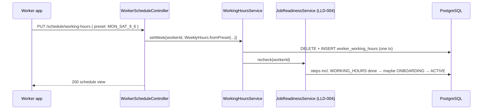
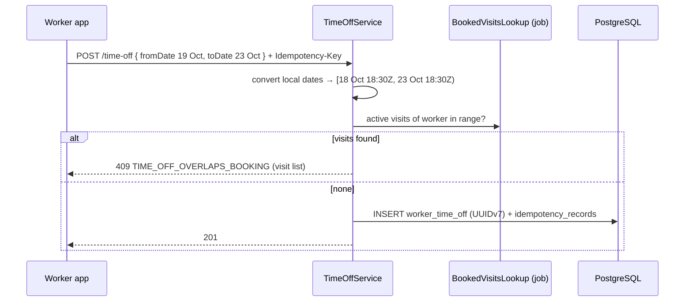
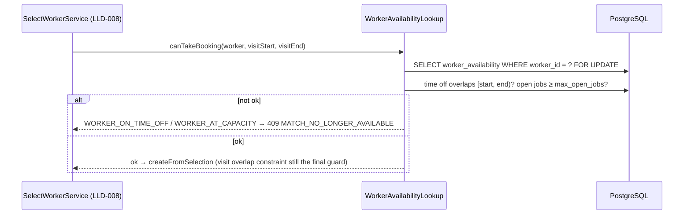

# LLD-015: Worker Availability — Working Hours, Time Off, Capacity

| Field | Value |
|---|---|
| Status | Draft |
| Owner | TBD |
| Reviewers | TBD |
| Module | `worker` (availability classes in the worker module's normal layers, [architecture/02 §10](../architecture/02-project-directory-and-package-structure.md)) |
| Parent HLD | [modules/04](../modules/04-worker-availability-scheduling-and-capacity.md), [product/04 §28](../product/04-mvp-scope-release-plan-and-future-phases.md), [architecture/03 §17](../architecture/03-erd-and-production-database-design.md) |
| Requirements | FR-WRK-005 (availability), product/04 §28 (working hours, unavailable periods, active-job capacity) |
| Depends on | LLD-004 (`account_status`, readiness, `accepts_emergency_jobs`), LLD-007 (`worker_availability`, online toggle, candidate query), LLD-009 (`job_visits` = busy time, `jobs` status) |
| Used by | LLD-007 (candidate filter), LLD-008 (re-check at selection), LLD-004 (readiness step) |
| Last updated | 2026-10-05 |

---

## 1. Context & scope

LLD-007 gives a worker one switch: accepting jobs or not. That is not enough. A plumber who only works mornings, who goes home for Durga Puja, or who already has three jobs lined up should not keep getting offers he will ignore (and then be reminded about missed offers, LLD-007 D2). This LLD adds the three things product/04 §28 asks for in the MVP — **weekly working hours**, **time off**, **a cap on open jobs** — and plugs them into the existing candidate query as extra `WHERE` clauses. It stays one SQL query.

Busy time is **not** stored again. A worker's booked time is already in `job_visits` and protected by `ex_job_visits_worker_overlap` (LLD-009); matching already excludes workers with an overlapping visit (LLD-007 §3.1). This LLD reuses that unchanged.

Availability stays separate from `account_status` (LLD-004): a SUSPENDED worker with perfect working hours still gets nothing, and an ACTIVE worker on leave stays ACTIVE.

**In scope**

- Weekly working hours (per weekday, worker-local times), set with one-tap presets or per day
- Time off (date ranges, plus "rest of today")
- Capacity: max open jobs at once
- Filters in the LLD-007 candidate query and the emergency-availability check
- Re-check at selection (LLD-008) and the capacity race
- Readiness step `WORKING_HOURS` (LLD-004)

**Out of scope:** online/offline toggle and missed offers (LLD-007, unchanged); recurring exceptions ("every 2nd Saturday"); calendar sync (Google etc.); travel buffers between visits; per-day job limits; Redis presence.

**Decisions**

| # | Decision | Default (configurable) |
|---|---|---|
| D1 | Working hours are **per ISO weekday, up to 2 ranges per day** (split shift, modules/04 §10), stored as local `TIME` + the worker's `time_zone`. No range crosses midnight. A day with no rows is a day off. | — |
| D2 | The app sets hours with **presets** first ("Mon–Sat 9–6", "Every day 8–8", "Mon–Sat 9–1 and 4–8"); "Custom" opens a per-day editor. Presets are server config so they can change without an app release. | 4 presets, see §4.3 |
| D3 | A worker is offered a non-emergency request only if their hours overlap the request window by at least **`min_overlap`**. | 60 min |
| D4 | **EMERGENCY ignores working hours.** Opting in to emergency jobs (LLD-004 `accepts_emergency_jobs`) means "wake me up". Time off, capacity and visit overlap still apply. | — |
| D5 | **Time off** = whole local days (`fromDate`–`toDate`, inclusive) or "rest of today" (now → local midnight). Stored as UTC instants. Any overlap with the request window excludes the worker (same rule LLD-007 uses for visits). | max 60 days per entry, ≤ 180 days ahead, ≤ 10 upcoming entries |
| D6 | Time off **cannot cover a booked visit**: `409 TIME_OFF_OVERLAPS_BOOKING` lists the visits; the worker reschedules or cancels them first (LLD-009 rules and strikes apply). We never auto-cancel a customer's booking because of leave. | — |
| D7 | **Capacity** = max **open jobs** (`jobs.status IN ('SCHEDULED','IN_PROGRESS','ON_HOLD')` for the worker's bookings). At the cap, no new offers. `WORK_COMPLETED` does not count (the worker is free; only the customer's confirmation is pending). | default 3, range 1–10 |
| D8 | Capacity is enforced at **selection** by locking the worker's `worker_availability` row (`FOR UPDATE`) before counting, so two customers picking the same worker at once cannot push them over the cap. | — |
| D9 | Existing offers are left alone when hours / time off / capacity change; they expire normally (LLD-007), and selection re-checks (D8, §7). | — |
| D10 | `time_zone` is a column (default `Asia/Kolkata`), not hard-coded, but there is no API to change it in MVP. | `Asia/Kolkata` |

---

## 2. Classes / components

Added to the existing worker module (same layers LLD-007 uses for service area and online status):

```text
com.karigar.worker
├── api/
│   └── WorkerScheduleController         -- /api/v1/workers/me/schedule/**, /time-off/**
├── application/
│   ├── WorkingHoursService              -- set preset / custom week; triggers readiness recheck (LLD-004)
│   ├── TimeOffService                   -- add / end time off; visit-conflict check (D6)
│   ├── CapacityService                  -- set max open jobs
│   ├── ScheduleQueryService             -- GET view incl. presets + open job count
│   └── port/ BookedVisitsLookup (job module: visits in a range), OpenJobsLookup (job module: count)
├── api-for-modules/
│   └── WorkerAvailabilityLookup         -- canTakeBooking(workerId, start, end): used by LLD-008 selection
└── domain/
    ├── WeeklyHours                      -- validated set of DayRange; fromPreset(); covers(window, tz, minOverlap)
    ├── DayRange                         -- isoWeekday, start, end (start < end, no midnight crossing)
    ├── TimeOff                          -- fromDates(from, to, tz), restOfToday(now, tz), endNow()
    └── Capacity                         -- maxOpenJobs 1..10
```

`WeeklyHours.covers` is the Java twin of the SQL filter (§3.2); one parameterised test runs both on the same cases so they never drift.

```java
public record DayRange(DayOfWeek day, LocalTime start, LocalTime end) {
    public DayRange {
        if (!start.isBefore(end)) throw new InvalidWorkingHours("start must be before end, same day");
    }
}

public final class WeeklyHours {
    private final List<DayRange> ranges;

    public static WeeklyHours of(List<DayRange> ranges) {
        Map<DayOfWeek, List<DayRange>> byDay = ranges.stream().collect(groupingBy(DayRange::day));
        byDay.values().forEach(day -> {
            if (day.size() > 2) throw new InvalidWorkingHours("max 2 ranges per day");
            if (day.size() == 2 && overlaps(day.get(0), day.get(1))) throw new InvalidWorkingHours("ranges overlap");
        });
        if (ranges.isEmpty()) throw new InvalidWorkingHours("at least one working day");
        return new WeeklyHours(List.copyOf(ranges));
    }
}
```

---

## 3. Data model

ERD changes made by this LLD: `worker_availability` gains `time_zone`, `max_open_jobs`; new `worker_working_hours`, `worker_time_off`. No calendar / slot table — busy time comes from `job_visits`.

```sql
-- V6_4__worker_schedule.sql (worker module)
ALTER TABLE worker_availability
    ADD COLUMN time_zone     VARCHAR(40) NOT NULL DEFAULT 'Asia/Kolkata',   -- IANA name, validated in app
    ADD COLUMN max_open_jobs SMALLINT    NOT NULL DEFAULT 3 CHECK (max_open_jobs BETWEEN 1 AND 10);

CREATE TABLE worker_working_hours (
    worker_id    UUID     NOT NULL REFERENCES workers (id),
    iso_weekday  SMALLINT NOT NULL CHECK (iso_weekday BETWEEN 1 AND 7),     -- 1 = Monday (matches isodow)
    slot_no      SMALLINT NOT NULL CHECK (slot_no IN (1, 2)),               -- split shift (D1)
    start_time   TIME     NOT NULL,                                         -- worker-local (time_zone)
    end_time     TIME     NOT NULL,
    PRIMARY KEY (worker_id, iso_weekday, slot_no),
    CHECK (end_time > start_time)                                           -- no midnight crossing
);
-- the PK (worker_id, …) serves the matching lookup; no extra index

CREATE TABLE worker_time_off (
    id           UUID PRIMARY KEY,                                          -- UUIDv7, app-generated (ADR 0018)
    worker_id    UUID NOT NULL REFERENCES workers (id),
    starts_at    TIMESTAMPTZ NOT NULL,
    ends_at      TIMESTAMPTZ NOT NULL,
    reason_code  VARCHAR(20) NOT NULL CHECK (reason_code IN ('LEAVE','FESTIVAL','SICK','PERSONAL','OTHER')),
    created_at   TIMESTAMPTZ NOT NULL,
    updated_at   TIMESTAMPTZ NOT NULL,
    CHECK (ends_at > starts_at)
);
CREATE INDEX ix_worker_time_off_worker ON worker_time_off (worker_id, ends_at);

-- Existing workers keep getting offers: give them the default preset (Mon–Sat 09:00–18:00).
INSERT INTO worker_working_hours (worker_id, iso_weekday, slot_no, start_time, end_time)
SELECT w.id, d, 1, TIME '09:00', TIME '18:00'
FROM workers w CROSS JOIN generate_series(1, 6) AS d
WHERE w.account_status IN ('ONBOARDING','ACTIVE');
```

Notes:

- Rows are replaced as a whole week (`DELETE … WHERE worker_id = ?` + `INSERT`) in one transaction; a week is ≤ 14 rows, so there is nothing to diff.
- Old time off is kept (support: "why did I get no jobs last week?"); a nightly job deletes rows that ended > 90 days ago.
- `max_open_jobs` lives on `worker_availability` (one row per worker, already locked by D8) rather than a new table.

### 3.1 Busy time and capacity — read from existing tables

| Question | Source | Index |
|---|---|---|
| Is the worker already booked in the window? | `job_visits` overlap (unchanged LLD-007 clause) | `ex_job_visits_worker_overlap` GiST (worker_id, range) |
| How many open jobs? | `bookings.worker_id` ⋈ `jobs.status` | `ix_bookings_worker`, `jobs.booking_id` unique |

### 3.2 Candidate query change (LLD-007 §3.1)

The query stays one statement. Three clauses are added to its `WHERE`; nothing else changes. `av` (the existing `worker_availability` join) now also provides `time_zone` and `max_open_jobs`. New parameter: `:min_overlap` (interval, D3). The existing visit-overlap clause is kept as is.

```sql
  -- (new) working hours overlap the request window by ≥ :min_overlap; skipped for EMERGENCY (D4)
  AND (:emergency OR EXISTS (
        SELECT 1
        FROM generate_series(0, CAST(timezone(av.time_zone, :window_end)   AS date)
                              - CAST(timezone(av.time_zone, :window_start) AS date)) AS n(i)
        CROSS JOIN LATERAL (SELECT CAST(timezone(av.time_zone, :window_start) AS date) + n.i AS day) d
                                                                               -- local dates the window touches (1–2)
        JOIN worker_working_hours h
          ON h.worker_id = w.id AND h.iso_weekday = extract(isodow FROM d.day)
        CROSS JOIN LATERAL (
          SELECT tstzrange(timezone(av.time_zone, d.day + h.start_time),
                           timezone(av.time_zone, d.day + h.end_time))
               * tstzrange(:window_start, :window_end) AS r) x
        WHERE NOT isempty(x.r) AND upper(x.r) - lower(x.r) >= :min_overlap))
  -- (new) not on time off during the window (D5)
  AND NOT EXISTS (SELECT 1 FROM worker_time_off t
                  WHERE t.worker_id = w.id AND t.ends_at > :window_start AND t.starts_at < :window_end)
  -- (new) under capacity (D7)
  AND (SELECT count(*) FROM bookings b JOIN jobs j ON j.booking_id = b.id
        WHERE b.worker_id = w.id AND b.status = 'CONFIRMED'
          AND j.status IN ('SCHEDULED','IN_PROGRESS','ON_HOLD')) < av.max_open_jobs
```

`timezone(zone, timestamp)` turns a local wall-clock time into a `timestamptz` (DST-safe for any future zone); `timezone(zone, timestamptz)` does the reverse to find the local date. The sub-selects run only for workers that already passed the GiST radius filter and the indexed trade / status joins (tens, not thousands), so the LLD-007 p95 < 100 ms budget holds; verified by the existing performance test with schedules seeded.

**Emergency-availability check** (LLD-007 §5.3) gets the time-off and capacity clauses, not the working-hours one.

---

## 4. API contract

All endpoints: worker token, own data only. Times are local `HH:mm` in the worker's `timeZone`; dates are local `YYYY-MM-DD`; instants are UTC ISO-8601.

| Method | Path | Body | Notes |
|---|---|---|---|
| GET | `/api/v1/workers/me/schedule` | — | hours, upcoming time off, capacity, open jobs, presets (localized) |
| PUT | `/api/v1/workers/me/schedule/working-hours` | `{ "preset": "MON_SAT_9_6" }` or `{ "days": [...] }` | replaces the whole week; readiness recheck |
| PUT | `/api/v1/workers/me/schedule/capacity` | `{ "maxOpenJobs": 2 }` | lower than current open jobs is allowed (just stops new offers) |
| POST | `/api/v1/workers/me/time-off` | `{ "fromDate", "toDate", "reasonCode" }` or `{ "preset": "REST_OF_TODAY" }` | `Idempotency-Key` header; `201` |
| DELETE | `/api/v1/workers/me/time-off/{id}` | — | future → deleted; ongoing → `ends_at = now` ("I'm back"); past → `409` |
| GET | `/api/v1/admin/workers/{id}/schedule` | — | read-only, `user.view` permission (LLD-020), for support |

### 4.1 GET schedule

```json
{
  "data": {
    "timeZone": "Asia/Kolkata",
    "workingHours": [
      { "day": "MON", "ranges": [ { "from": "09:00", "to": "18:00" } ] },
      { "day": "SAT", "ranges": [ { "from": "09:00", "to": "13:00" }, { "from": "16:00", "to": "20:00" } ] }
    ],
    "timeOff": [
      { "id": "0192f1c4-7a3e-7c21-9b0d-5e8f2a1c4d33", "fromDate": "2026-10-19", "toDate": "2026-10-23",
        "startsAt": "2026-10-18T18:30:00Z", "endsAt": "2026-10-23T18:30:00Z", "reasonCode": "FESTIVAL" }
    ],
    "capacity": { "maxOpenJobs": 3, "openJobs": 1 },
    "presets": [ { "code": "MON_SAT_9_6", "label": "সোম–শনি, সকাল ৯টা – সন্ধ্যা ৬টা" } ]
  }
}
```

Days missing from `workingHours` are days off. Labels come from LLD-003 translations.

### 4.2 Custom week

```json
{ "days": [ { "day": "MON", "ranges": [ { "from": "08:00", "to": "12:00" }, { "from": "15:00", "to": "20:00" } ] },
            { "day": "TUE", "ranges": [ { "from": "08:00", "to": "20:00" } ] } ] }
```

### 4.3 Presets (config `karigar.worker.schedule.presets`)

| Code | Hours |
|---|---|
| `MON_SAT_9_6` (default suggestion) | Mon–Sat 09:00–18:00 |
| `MON_SAT_8_8` | Mon–Sat 08:00–20:00 |
| `EVERY_DAY_8_8` | Mon–Sun 08:00–20:00 |
| `MON_SAT_SPLIT` | Mon–Sat 09:00–13:00 and 16:00–20:00 |

Time-off presets: `REST_OF_TODAY`, `TOMORROW` (app may also send dates directly).

### 4.4 Error codes

| HTTP | `error.code` | When |
|---|---|---|
| 400 | `VALIDATION_ERROR` | bad time format, unknown day / preset / reason, `maxOpenJobs` outside 1–10 |
| 422 | `INVALID_WORKING_HOURS` | start ≥ end, > 2 ranges a day, ranges overlap, empty week |
| 422 | `INVALID_TIME_OFF` | `toDate < fromDate`, starts in the past, > 60 days long, > 180 days ahead, > 10 upcoming |
| 409 | `TIME_OFF_OVERLAPS_BOOKING` | an active visit falls in the period; `details.visits: [{visitId, jobId, scheduledStartAt}]` |
| 409 | `TIME_OFF_ALREADY_ENDED` | DELETE on a past entry |
| 404 | `TIME_OFF_NOT_FOUND` | not found or not the caller's |

```json
{ "error": { "code": "TIME_OFF_OVERLAPS_BOOKING", "message": "You have a job during this time. Reschedule or cancel it first.",
             "details": { "visits": [ { "visitId": "0192f1…", "jobId": "0192e8…", "scheduledStartAt": "2026-10-20T05:30:00Z" } ] } } }
```

---

## 5. Sequence diagrams

### 5.1 Worker sets hours during onboarding



### 5.2 Worker adds time off



### 5.3 Selection re-check (inside LLD-008 §5.2 transaction)



Working hours are **not** re-checked at selection: the worker chose `availableFrom` themselves when accepting (LLD-008 D2), which overrides their usual hours.

---

## 6. State transitions

Working hours and capacity are plain settings (no states). Time off:

| From | Event | Guard | To |
|---|---|---|---|
| — | worker adds | valid range, no booked visit inside (D6) | UPCOMING (`starts_at > now`) |
| UPCOMING | time passes | `starts_at ≤ now` | ONGOING |
| UPCOMING | worker deletes | — | row deleted |
| ONGOING | worker "I'm back" (DELETE) | — | ENDED (`ends_at = now`) |
| ONGOING | time passes | `ends_at ≤ now` | ENDED |
| ENDED | nightly cleanup | ended > 90 days ago | row deleted |

States are derived from `starts_at` / `ends_at` and `now`; nothing is stored or scheduled.

Matching eligibility (precedence from modules/04 §29; all must pass, most restrictive wins):

| Check | Owner | Emergency |
|---|---|---|
| `account_status = ACTIVE` | LLD-004 | same |
| `ACCEPTING_JOBS` | LLD-007 | same |
| working hours overlap ≥ 60 min | this LLD | skipped (D4) |
| no time off in window | this LLD | same |
| no overlapping visit | LLD-007 / LLD-009 | same |
| open jobs < `max_open_jobs` | this LLD | same |

---

## 7. Error handling, idempotency & concurrency

- **Capacity race (modules/04 §33):** selection locks the worker's `worker_availability` row before counting open jobs (D8). Two selections of the same worker serialise; the second sees the new job and fails with `MATCH_NO_LONGER_AVAILABLE`. The lock is held only for the selection transaction (milliseconds). The online toggle (LLD-007) updates the same row and simply waits.
- **Time-off vs booking race:** a selection inserting a visit and the worker adding time off at the same moment. `TimeOffService` also takes the `worker_availability` row lock before checking visits, so the two serialise and D6 holds.
- **Visit overlap** stays guarded by `ex_job_visits_worker_overlap`; this LLD adds no second copy of busy time.
- **Idempotency:** `POST /time-off` requires `Idempotency-Key` (shared `idempotency_records`); a retry returns the same `201`. `PUT`s replace whole values, so retries are naturally idempotent. `DELETE` on an already-ended entry returns `409 TIME_OFF_ALREADY_ENDED`, on a deleted one `404`.
- **Stale offers:** offers already sent are not withdrawn when settings change (D9); the worker can still accept, and selection re-checks time off and capacity.
- **Missed-offer counter (LLD-007 D2):** offers are no longer sent outside hours / during leave, so the counter only reflects real ignoring — the main reason for this LLD.
- **Clock / zone:** all comparisons in SQL use `now()` and UTC instants; local days are computed with the worker's `time_zone` in one place (`TimeOff.fromDates`, the SQL in §3.2).

---

## 8. Security & privacy

- Endpoints act on the caller's own worker id only; no path takes another worker's id except the admin read, which needs `user.view` (LLD-020) and is audited.
- Customers never see a worker's hours, time off or capacity. The shortlist shows only the `availableFrom` the worker chose (LLD-008). Time off reasons are worker-private; `SICK` is not shown to admins in lists, only on the detail view.
- Emergency-availability (public) still returns only a boolean (LLD-007 §9); adding filters does not leak more.

---

## 9. Observability

| Type | Name | Notes |
|---|---|---|
| Counter | `matching_excluded_total{reason}` | `OUTSIDE_HOURS`, `TIME_OFF`, `AT_CAPACITY` — sampled by a nightly diagnostic query, not per request (keeps the candidate query one statement) |
| Gauge | `workers_on_time_off{zone}` | festival planning (Durga Puja week) |
| Gauge | `workers_at_capacity{zone, trade}` | supply squeeze signal |
| Counter | `worker_schedule_updated_total{kind, preset}` | `preset` vs `CUSTOM` — are presets enough? |
| Counter | `time_off_rejected_total{reason}` | mostly `OVERLAPS_BOOKING` |
| Counter | `selection_rejected_total{reason}` | `WORKER_AT_CAPACITY`, `WORKER_ON_TIME_OFF` |

Logs: `workerId`, action, preset code. Never the time-off reason in INFO logs.

Alerts: none new; `matching_failed_total` (LLD-007) already catches a zone where too many workers are off.

---

## 10. Test plan

| Level | Cases |
|---|---|
| Unit | `WeeklyHours`: >2 ranges, overlapping ranges, start ≥ end, empty week rejected; presets expand correctly. `TimeOff.fromDates` 19–23 Oct IST → `[18 Oct 18:30Z, 23 Oct 18:30Z)`; `restOfToday` at 22:00 IST ends 18:30Z same day |
| SQL ↔ Java parity | one parameterised table run against `WeeklyHours.covers` and the §3.2 clause (Testcontainers PostGIS): window 07:00–10:00 vs hours 09:00–18:00 → 60 min → in; vs 09:30–18:00 → out; split shift; window crossing local midnight (EMERGENCY skipped, SCHEDULED never crosses) |
| Integration (candidate query) | Sunday request, Mon–Sat worker → excluded; worker on leave overlapping window → excluded, leave ending before window → included; 3 open jobs with cap 3 → excluded, one moves to `WORK_COMPLETED` → included; EMERGENCY at 02:00 with no night hours but opted in → included; existing LLD-007 cases still pass |
| Concurrency | two parallel selections for a worker at `max_open_jobs − 1` → exactly one booking; time off added while a selection inserts a visit in the same period → one of them fails cleanly |
| API | `TIME_OFF_OVERLAPS_BOOKING` lists visits; POST time off twice with same key → one row; DELETE ongoing → `ends_at = now`, DELETE past → 409 |
| Readiness | ONBOARDING worker with every other step done → setting hours activates them once (LLD-004) |
| Migration | V6_4 on a DB with ACTIVE workers → each has Mon–Sat 09:00–18:00; still matched |
| Performance | 5,000-worker Howrah seed with schedules and 10 % on leave: candidate query p95 still < 100 ms |

---

## 11. Open questions

| Question | Default until decided | Owner | Due |
|---|---|---|---|
| Any overlap with a visit or time off excludes the worker for the whole window, even a 12 h SCHEDULED window. Compute free gaps instead (PostgreSQL multiranges: hours ∩ window − time off − visits ≥ 60 min)? | No; measure `matching_excluded_total` first | TBD | After pilot data |
| Travel buffer between visits (modules/04 §42) | 0; visit end-times already include the estimate | TBD | Phase 2 |
| Default `max_open_jobs` per trade (a raj mistri on a 10-day job vs a plumber doing 4 calls a day) | 3 for all trades | Product | Before pilot |
| Let workers change `time_zone` | No API; set by ops if ever needed | TBD | Second city outside IST |
| Auto-suggest time off around big festivals (Durga Puja, Eid, Chhath) | No | Product | Before Oct 2027 |

---

## Change log

| Version | Date | Author | Change |
|---|---|---|---|
| 0.1 | 2026-10-05 | TBD | First draft |
| 0.2 | 2026-10-05 | TBD | Cross-LLD consistency |
