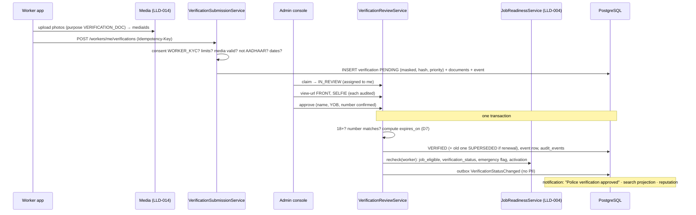

# LLD-016: Worker Verification — Identity, Trade, Police Verification, Expiry

| Field | Value |
|---|---|
| Status | Draft |
| Owner | TBD |
| Reviewers | TBD |
| Module | `worker` (sub-package `verification`; tables owned by `worker` per [ERD §70](../architecture/03-erd-and-production-database-design.md), [modules/07 §11](../modules/07-trust-verification-reputation-and-reviews.md)) |
| Parent HLD | [modules/07 §1.3, §2](../modules/07-trust-verification-reputation-and-reviews.md), [architecture/03 §15–16, §52–52.4](../architecture/03-erd-and-production-database-design.md), [architecture/04 §19–21](../architecture/04-domain-model-aggregates-and-state-machines.md), [security/03 §21–22, §102](../security/03-data-privacy-pii-retention-and-compliance.md), [modules/10 §19, §45](../modules/10-media-upload-and-object-storage.md), [modules/11 §15–17](../modules/11-admin-and-marketplace-operations.md) |
| Requirements | FR-WRK-004, BR-W-001, product/04 §10, §22 |
| Depends on | LLD-001 (`user_consents` `WORKER_KYC`), LLD-003 (`professions`), LLD-004 (`JobReadinessService.recheck`), LLD-014 (media, purpose `VERIFICATION_DOC`) |
| Used by | LLD-004 (`VerificationStatusLookup`: readiness, `job_eligible`, `verification_status`, badges), LLD-006 D5 / LLD-007 (emergency needs valid police verification), LLD-008 (badges on shortlist), payouts LLD (PAN for TDS), LLD-012 / reputation (police check for `TRUSTED` level), LLD-013 (notifications) |
| Last updated | 2026-10-05 |

---

## 1. Context & scope

Customers let a stranger into their home, so a worker gets jobs in a trade only after the checks that trade needs are approved. In the MVP there is **no KYC vendor**: the worker photographs a document, enters its number, and a verification agent reviews it. The vendor flow (DigiLocker) is designed as a port so it can be added without changing tables or APIs.

**In scope**

- Check types: `ID_PROOF` (with a selfie), `PAN`, `POLICE_VERIFICATION`, `SKILL_CERTIFICATE`, `ELECTRICAL_LICENSE`
- Per-trade mandatory / optional checks (`verification_requirements`, data not code)
- Worker submits a check; ops queue, claim, approve / reject with reason codes; resubmission
- Expiry, renewal, reminders; revocation (two admins); KYC consent withdrawal
- `VerificationStatusLookup` (the port LLD-004 calls) and the `VerificationStatusChanged` event
- Evidence viewing through short-lived signed URLs, every view audited; file retention and deletion

**Out of scope:** `EMAIL` (LLD-001, `users.email_verified_at`) and `BANK_ACCOUNT` (payouts LLD, `worker_payout_accounts.verified_at`) — LLD-004 already checks them as their own readiness steps, so they get no rows here; `PHONE` (SMS phase); automatic selfie / face match and PAN API (provider phase); trust score (product/04 §22: no opaque score); upload mechanics (LLD-014).

**Decisions**

| # | Decision | Default (configurable) |
|---|---|---|
| D1 | **Manual review only in MVP** (`method = MANUAL_REVIEW`). `IdentityProofProvider` port (§2) is defined, not implemented. | — |
| D2 | **No Aadhaar uploads.** Aadhaar is accepted only through DigiLocker / offline e-KYC (later); a card photo, even masked, is a "card copy" (security/03, Aadhaar Act s.29). MVP `ID_PROOF` documents: **Voter ID (EPIC), Driving Licence, Passport**. An Aadhaar photo uploaded anyway is rejected `AADHAAR_NOT_ACCEPTED` and its file deleted at once. | — |
| D3 | `ID_PROOF` includes a **selfie holding the document**; the reviewer compares faces. This replaces a separate `SELFIE_MATCH` check until a provider exists. | — |
| D4 | What is stored for a document number: **masked** (last 4; PAN as `ABXXXXX34F`) + **HMAC-SHA256 hash** (duplicate detection). Full number only for PAN, encrypted (TDS returns). Name and **year of birth** only (18+ check). | ERD §15 |
| D5 | **Resubmission = new row**; old rows stay (`REJECTED`, `EXPIRED`, `REVOKED`, `SUPERSEDED`) with their history. At most **3 submissions per type (per trade) per 30 days**. | 3 / 30 days |
| D6 | **Renewal** may be submitted from **60 days before expiry** while the current check stays `VERIFIED`; approving it marks the old one `SUPERSEDED`. | 60 days |
| D7 | Police verification is valid **24 months from issue date** (`valid_for_months`); a certificate older than that is refused at submission. Licences use the expiry printed on them; the earlier of the two wins. | 24 months |
| D8 | **Expiry job at 00:05 IST** (not 02:00, so an expired police check can't receive an emergency offer for two extra hours). Reminders 30, 7 and 1 day before. Expiry never cancels booked jobs (modules/07 §2.2). | 00:05; 30/7/1 days |
| D9 | **Revoking** a `VERIFIED` check needs **two different admins** (request + confirm), modules/07 §2.3. Approve / reject need one. `SYSTEM` revocations (consent withdrawn) need none. | — |
| D10 | Review SLA **24 h (P90), 48 h max**; queue order: worker blocked from all jobs → mandatory check → optional badge, then oldest. | modules/07 §2.3 |
| D11 | A decision updates the worker's eligibility **in the same transaction** (`JobReadinessService.recheck`, same module) and writes `VerificationStatusChanged` to the outbox for other modules. | ADR 0005 |

---

## 2. Classes / components

```text
com.karigar.worker.verification
├── api/
│   ├── WorkerVerificationController     -- /api/v1/workers/me/verifications/**
│   └── AdminVerificationController      -- /api/v1/admin/verifications/**   (permission verification.review)
├── application/
│   ├── VerificationSubmissionService    -- submit, limits, consent, media checks
│   ├── VerificationReviewService        -- claim, approve, reject, revoke request / confirm / cancel
│   ├── VerificationQueryService         -- implements VerificationStatusLookup (LLD-004)
│   ├── EvidenceAccessService            -- signed view URL + audit row
│   ├── VerificationExpiryJob            -- 00:05 IST: reminders, VERIFIED → EXPIRED (ShedLock, SKIP LOCKED)
│   ├── VerificationRetentionJob         -- 03:00 IST: delete files past retention (§8)
│   ├── RevokeOnKycConsentWithdrawn      -- @EventListener(ConsentWithdrawn WORKER_KYC) from identity
│   └── port/ MediaAttachments + MediaUrls (LLD-014), ConsentLookup (identity), JobReadiness (LLD-004),
│             IdentityProofProvider (deferred), OutboxWriter, AuditWriter
├── domain/
│   ├── WorkerVerification               -- aggregate: status machine, decision rules
│   ├── VerificationType, VerificationStatus, DocumentKind, VerificationMethod, Badge
│   ├── DocumentNumber                   -- normalise, mask, hmac; refuses AADHAAR for MANUAL_REVIEW
│   └── event/ VerificationStatusChanged, VerificationExpiring
└── infrastructure/ persistence (JPA), PanCipher (AES-GCM, key from secret store)
```

The port LLD-004 calls, and the deferred provider port:

```java
public interface VerificationStatusLookup {
    /** Mandatory types for this trade that are not VERIFIED-and-unexpired today. Empty = trade may get jobs. */
    Set<VerificationType> missingMandatory(WorkerId worker, ProfessionId trade, LocalDate today);
    boolean hasValid(WorkerId worker, VerificationType type, LocalDate today);   // e.g. POLICE_VERIFICATION, PAN
    Set<Badge> badges(WorkerId worker, LocalDate today);   // ID_VERIFIED, POLICE_VERIFIED, SKILL_CERTIFIED, LICENSED_ELECTRICIAN
}

/** DigiLocker / KYC vendor. Not built in MVP (D1); the adapter goes in worker/infrastructure/verification. */
public interface IdentityProofProvider {
    ProviderSession start(WorkerId worker, URI returnUrl);              // redirect URL + session ref
    ProviderResult complete(String sessionRef, String authCode);         // name, yearOfBirth, last4, referenceId, documentKind
}
```

A provider result becomes an `ID_PROOF` row with `method = DIGILOCKER`, `provider_reference_id` set, no files and no hash (duplicates via `ux_verifications_ekyc_ref`), going straight to `VERIFIED` unless the name mismatches (→ `IN_REVIEW`).

---

## 3. Data model

From [ERD §15–16](../architecture/03-erd-and-production-database-design.md), with these changes (to be copied into the ERD): `AADHAAR_EKYC` / `SELFIE_MATCH` become `ID_PROOF` + `document_kind` + a `SELFIE` document; `EMAIL` / `PHONE` / `BANK_ACCOUNT` are not rows here; status `SUPERSEDED`; columns `document_kind`, `priority`, claim and revocation columns, `version`; the single "live" index split into "one open submission" and "one current verified".

```sql
-- V12_1__verification.sql
CREATE TABLE worker_verifications (
    id                           UUID PRIMARY KEY,                       -- UUIDv7, app-generated (ADR 0018)
    worker_id                    UUID NOT NULL REFERENCES workers (id),
    verification_type            VARCHAR(30) NOT NULL CHECK (verification_type IN
                                 ('ID_PROOF','PAN','POLICE_VERIFICATION','SKILL_CERTIFICATE','ELECTRICAL_LICENSE')),
    profession_id                UUID REFERENCES professions (id),
    document_kind                VARCHAR(30) NOT NULL CHECK (document_kind IN
                                 ('VOTER_ID','DRIVING_LICENCE','PASSPORT','AADHAAR','PAN_CARD',
                                  'POLICE_CERTIFICATE','SKILL_CERTIFICATE','ELECTRICAL_LICENSE')),
    status                       VARCHAR(20) NOT NULL CHECK (status IN
                                 ('PENDING','IN_REVIEW','VERIFIED','REJECTED','EXPIRED','REVOKED','SUPERSEDED')),
    method                       VARCHAR(20) NOT NULL CHECK (method IN ('MANUAL_REVIEW','DIGILOCKER','OFFLINE_EKYC','PROVIDER_API')),
    provider                     VARCHAR(40),
    provider_reference_id        VARCHAR(100),
    document_number_masked       VARCHAR(30),
    document_number_hash         VARCHAR(64),             -- HMAC-SHA256(secret, kind + normalised number); never for AADHAAR
    document_number_encrypted    BYTEA,                   -- PAN only
    name_on_document             VARCHAR(150),
    year_of_birth                SMALLINT CHECK (year_of_birth BETWEEN 1930 AND 2100),
    issuer                       VARCHAR(150),            -- "Shibpur Police Station", "ITI Howrah"
    issued_on                    DATE,
    expires_on                   DATE,
    priority                     SMALLINT NOT NULL CHECK (priority IN (1,2,3)),   -- D10, set at submission
    submitted_at                 TIMESTAMPTZ NOT NULL,
    assigned_admin_id            UUID REFERENCES admin_users (id),
    claimed_at                   TIMESTAMPTZ,
    reviewed_at                  TIMESTAMPTZ,
    reviewed_by_admin_id         UUID REFERENCES admin_users (id),
    rejection_reason_code        VARCHAR(40),             -- reason_codes VERIFICATION_REJECTION
    revoke_requested_by_admin_id UUID REFERENCES admin_users (id),
    revoke_requested_at          TIMESTAMPTZ,
    revoke_reason_code           VARCHAR(40),
    created_at                   TIMESTAMPTZ NOT NULL,
    updated_at                   TIMESTAMPTZ NOT NULL,
    version                      BIGINT NOT NULL DEFAULT 0,
    CHECK ((verification_type IN ('SKILL_CERTIFICATE','ELECTRICAL_LICENSE')) = (profession_id IS NOT NULL)),
    CHECK (document_kind <> 'AADHAAR' OR (method IN ('DIGILOCKER','OFFLINE_EKYC')
                                         AND document_number_hash IS NULL AND document_number_encrypted IS NULL)),
    CHECK (document_number_encrypted IS NULL OR verification_type = 'PAN'),
    CHECK (status <> 'VERIFIED' OR reviewed_at IS NOT NULL),
    CHECK (revoke_requested_by_admin_id IS NULL OR status = 'VERIFIED')
);

-- one open submission and one current approval per type (per trade)
CREATE UNIQUE INDEX ux_verifications_open ON worker_verifications
    (worker_id, verification_type, COALESCE(profession_id, '00000000-0000-0000-0000-000000000000'::uuid))
    WHERE status IN ('PENDING','IN_REVIEW');
CREATE UNIQUE INDEX ux_verifications_current ON worker_verifications
    (worker_id, verification_type, COALESCE(profession_id, '00000000-0000-0000-0000-000000000000'::uuid))
    WHERE status = 'VERIFIED';
-- the same document cannot verify two accounts
CREATE UNIQUE INDEX ux_verifications_document ON worker_verifications (verification_type, document_number_hash)
    WHERE status = 'VERIFIED' AND document_number_hash IS NOT NULL;
CREATE UNIQUE INDEX ux_verifications_ekyc_ref ON worker_verifications (provider, provider_reference_id)
    WHERE document_kind = 'AADHAAR' AND status = 'VERIFIED';
CREATE INDEX ix_verifications_review_queue ON worker_verifications (priority, submitted_at)
    WHERE status IN ('PENDING','IN_REVIEW');
CREATE INDEX ix_verifications_expiry ON worker_verifications (expires_on) WHERE status = 'VERIFIED' AND expires_on IS NOT NULL;
CREATE INDEX ix_verifications_worker ON worker_verifications (worker_id, verification_type, submitted_at DESC);
CREATE INDEX ix_verifications_hash ON worker_verifications (document_number_hash) WHERE document_number_hash IS NOT NULL;

CREATE TABLE verification_documents (
    id              UUID PRIMARY KEY,
    verification_id UUID NOT NULL REFERENCES worker_verifications (id),
    side            VARCHAR(10) NOT NULL CHECK (side IN ('FRONT','BACK','SELFIE','OTHER')),
    media_id        UUID NOT NULL UNIQUE REFERENCES media_objects (id),   -- LLD-014, purpose VERIFICATION_DOC, private bucket
    created_at      TIMESTAMPTZ NOT NULL,
    UNIQUE (verification_id, side)
);

CREATE TABLE verification_requirements (
    profession_id     UUID NOT NULL REFERENCES professions (id),
    verification_type VARCHAR(30) NOT NULL,
    is_mandatory      BOOLEAN NOT NULL,                -- mandatory to get jobs, else optional badge
    valid_for_months  SMALLINT CHECK (valid_for_months > 0),
    PRIMARY KEY (profession_id, verification_type)
);

CREATE TABLE worker_verification_events (              -- append-only
    id              UUID PRIMARY KEY,
    verification_id UUID NOT NULL REFERENCES worker_verifications (id),
    from_status     VARCHAR(20),
    to_status       VARCHAR(20) NOT NULL,
    actor_type      VARCHAR(20) NOT NULL CHECK (actor_type IN ('WORKER','ADMIN','SYSTEM','PROVIDER')),
    actor_id        UUID,
    reason_code     VARCHAR(40),
    note            TEXT,                              -- internal; never shown to the worker or logged
    created_at      TIMESTAMPTZ NOT NULL
);
CREATE INDEX ix_verification_events_verification ON worker_verification_events (verification_id, created_at);
-- append-only: the app DB role gets INSERT and SELECT only on this table (ERD §16)
```

**Seed** (`R__verification_requirements.sql`, repeatable; modules/07 §2.1, to be confirmed by the business):

| Trades | Mandatory | Optional (badge) | `valid_for_months` |
|---|---|---|---|
| All trades | `ID_PROOF` | `POLICE_VERIFICATION`, `SKILL_CERTIFICATE` | police 24 |
| `ELECTRICIAN` | + `ELECTRICAL_LICENSE` | | from document |
| `LOCKSMITH`, `HOME_CLEANING` | + `POLICE_VERIFICATION` | | 24 |

`PAN` is never a job requirement: the payouts module asks `hasValid(worker, PAN)` and applies the no-PAN TDS rate (`TDS_194O_NO_PAN`) or holds payouts above the threshold. Emergency jobs need `hasValid(worker, POLICE_VERIFICATION)` (LLD-006 D5).

**Rejection / revocation reasons** (`reason_codes` category `VERIFICATION_REJECTION`, seeded with en/bn/hi labels in this module's repeatable `R__verification_reason_codes.sql`, LLD-022): `BLURRY_IMAGE`, `DOCUMENT_INCOMPLETE`, `WRONG_DOCUMENT_TYPE`, `NAME_MISMATCH`, `FACE_MISMATCH`, `NUMBER_MISMATCH`, `EXPIRED_DOCUMENT`, `UNDERAGE`, `DUPLICATE_DOCUMENT`, `AADHAAR_NOT_ACCEPTED`, `SUSPECTED_FORGERY`, `SAFETY_COMPLAINT`, `CONSENT_WITHDRAWN`, `REVIEWER_ERROR`, `OTHER` (`requires_note`).

**Badges:** `ID_PROOF → ID_VERIFIED`, `POLICE_VERIFICATION → POLICE_VERIFIED`, `SKILL_CERTIFICATE → SKILL_CERTIFIED`, `ELECTRICAL_LICENSE → LICENSED_ELECTRICIAN`; `PAN` has none. A badge shows only while the check is `VERIFIED` and not expired.

---

## 4. API contract

### 4.1 Worker

| Method | Path | Purpose |
|---|---|---|
| GET | `/api/v1/workers/me/verifications` | requirements for my trades + my checks (current and history) |
| POST | `/api/v1/workers/me/verifications` | submit a check (`Idempotency-Key` required) |

The worker first uploads each photo via LLD-014 with purpose `VERIFICATION_DOC` and gets a `mediaId`; submit attaches them with `MediaAttachments.attach(ids, worker, {VERIFICATION_DOC}, "verification:{id}")` in the same transaction. Submit:

```json
{
  "type": "POLICE_VERIFICATION",
  "professionId": null,
  "documentKind": "POLICE_CERTIFICATE",
  "documentNumber": "HWH/PCC/2026/04417",
  "issuer": "Shibpur Police Station",
  "issuedOn": "2026-08-12",
  "expiresOn": null,
  "documents": [ { "side": "FRONT", "mediaId": "0192…" } ]
}
```

Required sides: `ID_PROOF` → `FRONT` + `SELFIE` (+ `BACK` for Voter ID / DL); others → `FRONT`. `201`:

```json
{
  "data": {
    "verificationId": "0192…", "type": "POLICE_VERIFICATION", "status": "PENDING",
    "documentNumberMasked": "XXXXXXXXXXXXXX4417", "submittedAt": "2026-10-05T06:10:00Z",
    "expectedDecisionBy": "2026-10-06T06:10:00Z"
  }
}
```

`GET` returns per trade `{ professionId, requirements: [{ type, mandatory, status, validUntil, renewFrom }] }` and the list of checks with `status`, `rejectionReasonCode` (localized label, LLD-003), `expiresOn`. Never: the hash, encrypted PAN, reviewer identity, notes, file URLs.

### 4.2 Admin (permission `verification.review`, LLD-020 §4.1; every call writes `audit_events`)

| Method | Path | Purpose |
|---|---|---|
| GET | `/api/v1/admin/verifications?status=PENDING&type=&cursor=` | queue, ordered by `priority, submitted_at` |
| POST | `/api/v1/admin/verifications/{id}/claim` | `PENDING → IN_REVIEW`, assigned to me (stale claim > 30 min may be taken over) |
| GET | `/api/v1/admin/verifications/{id}` | detail: worker profile name, bank-holder name (payout port), earlier attempts, `duplicateOf` (other workers with the same hash) |
| POST | `/api/v1/admin/verifications/{id}/documents/{documentId}/view-url` | signed URL via `MediaUrls` (60 s, LLD-014 D10), audited (§8) |
| POST | `/api/v1/admin/verifications/{id}/approve` | `{ "nameOnDocument", "yearOfBirth", "documentNumber", "issuedOn", "expiresOn", "version" }` — reviewer confirms / corrects what the worker typed |
| POST | `/api/v1/admin/verifications/{id}/reject` | `{ "reasonCode": "BLURRY_IMAGE", "note": null, "version" }` |
| POST | `/api/v1/admin/verifications/{id}/revoke` | `{ "reasonCode": "SAFETY_COMPLAINT", "note": "…" }` → revocation requested |
| POST | `/api/v1/admin/verifications/{id}/revoke/confirm` · `/revoke/cancel` | second admin confirms; requester or another admin cancels |

### 4.3 Error codes (`{"error":{"code":…}}`)

| HTTP | `error.code` | When |
|---|---|---|
| 400 | `VALIDATION_ERROR` | missing side, bad dates, document number format |
| 403 | `KYC_CONSENT_REQUIRED` | no active `WORKER_KYC` consent |
| 403 | `PERMISSION_DENIED` | admin without `verification.review` (LLD-020) |
| 409 | `SELF_ACTION_FORBIDDEN` | same admin confirming own revocation (LLD-020 D5) |
| 404 | `VERIFICATION_NOT_FOUND` | not mine / unknown |
| 409 | `VERIFICATION_ALREADY_OPEN` | a `PENDING` / `IN_REVIEW` check of this type exists (`ux_verifications_open`) |
| 409 | `ALREADY_VERIFIED` | `VERIFIED` and not inside the renewal window (D6) |
| 409 | `VERIFICATION_STATE_INVALID` / `CONCURRENT_UPDATE` | wrong status / `version` mismatch / claimed by someone else |
| 409 | `DUPLICATE_DOCUMENT` | approve hits `ux_verifications_document` → reviewer must reject `DUPLICATE_DOCUMENT` |
| 422 | `AADHAAR_NOT_ACCEPTED` | `documentKind = AADHAAR` with manual upload (D2) |
| 422 | `TRADE_NOT_REGISTERED` / `NOT_REQUIRED_FOR_TRADE` | trade check for a trade the worker doesn't have or that has no such requirement |
| 422 | `INVALID_MEDIA` | `attach` failed: media not mine, wrong purpose, not `AVAILABLE`, or already attached (LLD-014) |
| 422 | `DOCUMENT_TOO_OLD` / `DOCUMENT_EXPIRED` | police certificate older than 24 months; licence already expired |
| 429 | `RESUBMISSION_LIMIT` | > 3 submissions in 30 days (`details.retryAfter`) |

---

## 5. Sequence diagrams

### 5.1 Submit and review



### 5.2 Expiry

```mermaid
sequenceDiagram
    participant X as VerificationExpiryJob (00:05 IST)
    participant DB as PostgreSQL
    participant J as JobReadinessService
    X->>DB: VERIFIED with expires_on in 30 / 7 / 1 days → outbox VerificationExpiring (once per mark)
    loop batches of 200, FOR UPDATE SKIP LOCKED
        X->>DB: VERIFIED AND expires_on < today → EXPIRED, event (SYSTEM)
        X->>J: recheck(worker) → trade job_eligible = false if mandatory; accepts_emergency_jobs = false if police
        X->>DB: outbox VerificationStatusChanged
    end
    Note over DB: booked jobs untouched; LLD-008 withdraws open accepted offers of now-ineligible workers
```

---

## 6. State transitions

| From | Event | By | Guard | To |
|---|---|---|---|---|
| — | submit | worker | consent, limits, no open check of type, valid media | PENDING |
| — | provider result (later) | provider | name matches | VERIFIED (else IN_REVIEW) |
| PENDING | claim | admin | — | IN_REVIEW |
| IN_REVIEW | claim older than 30 min taken over | other admin | — | IN_REVIEW (new assignee) |
| IN_REVIEW | approve | assigned admin | 18+ (`ID_PROOF`), not expired, hash not verified elsewhere | VERIFIED (current VERIFIED of same type → SUPERSEDED) |
| PENDING / IN_REVIEW | reject | admin | reason code | REJECTED |
| VERIFIED | `expires_on < today` | system | — | EXPIRED |
| VERIFIED | revoke confirmed | second admin ≠ requester | revocation requested | REVOKED |
| VERIFIED | `WORKER_KYC` consent withdrawn | system | — | REVOKED (`CONSENT_WITHDRAWN`) |
| REJECTED / EXPIRED / REVOKED / SUPERSEDED | — | — | — | terminal; worker submits a new row |

Every row change inserts a `worker_verification_events` row. **Worker summary** (`workers.verification_status`, recomputed in `recheck`): `VERIFIED` = every mandatory check of every live trade is valid; `PARTIAL` = at least one check valid; `UNVERIFIED` = none.

---

## 7. Error handling, idempotency & concurrency

- **Submit** needs `Idempotency-Key` (shared `idempotency_records`, LLD-022); a retry returns the stored `201`. Backstop: `ux_verifications_open` → `409 VERIFICATION_ALREADY_OPEN`; `verification_documents.media_id UNIQUE` stops one photo being attached twice.
- **Review actions** are guarded updates (`… WHERE id = :id AND status = :expected AND version = :v`). Repeating the same decision returns `200` with current state; a different decision on a decided row → `409 VERIFICATION_STATE_INVALID`.
- **Claim** is `UPDATE … SET assigned_admin_id = :me, claimed_at = now() WHERE status = 'PENDING' OR (status = 'IN_REVIEW' AND claimed_at < now() - interval '30 minutes')`; zero rows → `409`.
- **Duplicates** are decided by `ux_verifications_document` at approval, not by a read-then-write; two parallel approvals of the same document on two accounts → one wins, the other gets `409 DUPLICATE_DOCUMENT` and raises a risk signal (modules/08 Rule A).
- **Renewal** approval locks the current `VERIFIED` row first (worker → old → new lock order), sets it `SUPERSEDED`, then the new one `VERIFIED`, so `ux_verifications_current` never sees two.
- **Expiry vs approval of a renewal** on the same night: both lock the old row; whichever runs second sees the changed status and skips.
- `recheck` and the outbox insert are in the decision's transaction; if the outbox publisher is down, eligibility in PostgreSQL is still right (matching reads `job_eligible`).
- **Jobs**: ShedLock + `SKIP LOCKED`; idempotent (status re-checked inside each row's transaction; reminder marks stored in the event table as `reason_code = REMINDER_30D` etc. so a re-run doesn't resend).

---

## 8. Security & privacy

- **Never stored:** full Aadhaar number, Aadhaar card image, e-KYC XML, full date of birth (D2, D4). `DocumentNumber` refuses Aadhaar on the manual path; the reviewer UI has a one-click `AADHAAR_NOT_ACCEPTED` rejection that deletes the files immediately (not after 90 days).
- **PAN:** full value AES-256-GCM encrypted by `PanCipher` (key in the secret store, rotated yearly, key id in the ciphertext header). Decrypted only by the TDS export (finance), never returned by any API. Masked value for display.
- **Hash:** HMAC-SHA256 with a server secret (not plain SHA — numbers are low-entropy and guessable). Normalised: upper-case, no spaces / dashes / slashes, prefixed with `document_kind`.
- **Evidence access:** files live in the private bucket (LLD-014). Only `verification.review` holders get a **60-second signed GET URL** (`MediaUrls`, LLD-014 D10), one per document per click; each issue writes `audit_events (action VERIFICATION_DOCUMENT_VIEWED, entity WORKER_VERIFICATION, metadata {documentId, side})`. No list endpoint returns URLs; the worker app never gets them back after upload. Download prevention in the console is not relied on; the audit trail is the control.
- **Customers** see badges only (modules/07 §1.3). Events and logs carry ids, type, status — never names, numbers, YOB, notes.
- **Admin decisions** (claim, approve, reject, revoke request / confirm / cancel) each write `audit_events`; revocation needs two different `admin_user_id`s (checked in code and by `revoke_requested_by_admin_id <> reviewed_by_admin_id` on confirm).
- **Consent:** submitting requires active `WORKER_KYC`; withdrawing it revokes all `VERIFIED` checks (`SYSTEM`), removes badges and stops offers (security/03).
- **Retention** (`VerificationRetentionJob`, skips rows under an active legal hold; security/03 §102, "proposed — confirm with legal"):

| Data | Kept until | Then |
|---|---|---|
| Files of `REJECTED` checks | decision + 90 days (`AADHAAR_NOT_ACCEPTED`: immediately) | `MediaAttachments.release` + delete `verification_documents` row |
| `SELFIE` file | decision + 30 days | delete |
| Files of `VERIFIED` checks | expiry / supersession / revocation + 90 days | delete |
| Masked number, name, YOB, hash, reference id | worker account life + 3 years | set NULL; keep type, status, dates, events |
| Encrypted PAN | 8 years from end of FY of the last payout with TDS | set NULL; keep masked |

---

## 9. Observability

| Type | Name | Notes |
|---|---|---|
| Counter | `verification_submitted_total{type, kind}` | |
| Counter | `verification_decided_total{type, result, reason}` | rejection reasons show where the app's photo guidance fails |
| Histogram | `verification_review_wait_hours{type, priority}` | submitted → decided; SLA |
| Gauge | `verification_queue_size{priority}`, `verification_queue_oldest_hours` | |
| Counter | `verification_expired_total{type}`, `verification_revoked_total{reason}` | |
| Counter | `verification_document_view_total{admin}` | evidence access |
| Counter | `verification_duplicate_total{type}` | possible multi-account fraud |
| Gauge | `workers_blocked_by_verification{type}` | ONBOARDING workers waiting only on a check |

Alerts: P90 wait > 24 h or oldest item > 48 h; one admin viewing > 100 documents / hour (scraping); duplicate rejections > 5 / day; expiry job not finished by 01:00 IST.

---

## 10. Test plan

| Level | Cases |
|---|---|
| Unit | masking (EPIC, DL, passport, PAN `ABXXXXX34F`); HMAC normalisation (`wb 01-2019 0012345` = `WB0120190012345`); AADHAAR + MANUAL_REVIEW refused; expiry = min(issued + 24 m, printed expiry); 18+ boundary on 1 Jan; required sides per type |
| Integration (Testcontainers) | submit → claim → approve → `job_eligible` true and `verification_status` recomputed in the same transaction, outbox row present; reject → resubmit → history has both rows; 4th submission in 30 days → 429 |
| Requirements | electrician without licence → `missingMandatory = [ELECTRICAL_LICENSE]`; locksmith needs police; adding a seed row changes eligibility without code change |
| Expiry | police check expiring today → EXPIRED at 00:05, trade ineligible for LOCKSMITH, `accepts_emergency_jobs` false, badge gone, booked job intact; reminders sent once at 30 / 7 / 1 days on re-runs |
| Renewal | new police certificate 40 days before expiry → old SUPERSEDED, no gap in eligibility; 90 days before → `ALREADY_VERIFIED` |
| Concurrency | two admins claim → one wins; same voter ID approved on two accounts in parallel → one `DUPLICATE_DOCUMENT`; expiry job ×2 instances → once |
| Revocation | same admin requests and confirms → 409 `SELF_ACTION_FORBIDDEN`; second admin confirms → REVOKED, eligibility recomputed; consent withdrawal revokes all |
| Security | view-url without `verification.review` → 403; each URL issue writes one audit row; URL expires after 60 s; worker `GET` never contains URLs, hash, PAN; logs scanned for document numbers in tests |
| Retention | rejected files deleted at +90 days, selfie at +30, Aadhaar upload immediately; legal hold skips |
| Architecture (ArchUnit) | other modules use only `VerificationStatusLookup` / events, never the tables |

---

## 11. Open questions

| Question | Default until decided | Owner | Due |
|---|---|---|---|
| DigiLocker / KYC vendor (UIDAI authorisation, cost per check) | Not in MVP; manual Voter ID / DL / passport (D1, D2) | Product + legal | Before Phase 3 |
| Workers with only an Aadhaar card cannot complete ID proof until DigiLocker/offline e-KYC is integrated | They stay `ONBOARDING` (D2); ops counts them (`workers_blocked_by_verification`) and helps them get a Voter ID / DL | Product | Pilot week 2 |
| Electrical licence mandatory for electricians? (few Howrah electricians hold a WB wireman permit) | Mandatory per modules/07 §2.1; switch to optional badge by seed change if supply is too thin | Business | Before pilot |
| Police certificate validity (24 months) and which portals' certificates are accepted | 24 months; WB Police PCC + station-issued letters | Ops + legal | Before pilot |
| Zone-scoped review queues (`admin_user_roles.service_zone_id`) | All agents see all zones in MVP | Ops | Phase 3 |
| Let a worker withdraw a `PENDING` submission (wrong photo) | No; reviewer rejects quickly with `WRONG_DOCUMENT_TYPE` / `BLURRY_IMAGE` | Product | After pilot data |
| PAN required at onboarding or only before the first payout above the TDS threshold | Only before payout (payouts LLD decides hold vs higher TDS) | Finance + CA | With payouts LLD |

---

## Change log

| Version | Date | Author | Change |
|---|---|---|---|
| 0.1 | 2026-10-05 | TBD | First draft |
| 0.2 | 2026-10-05 | TBD | Cross-LLD consistency |
