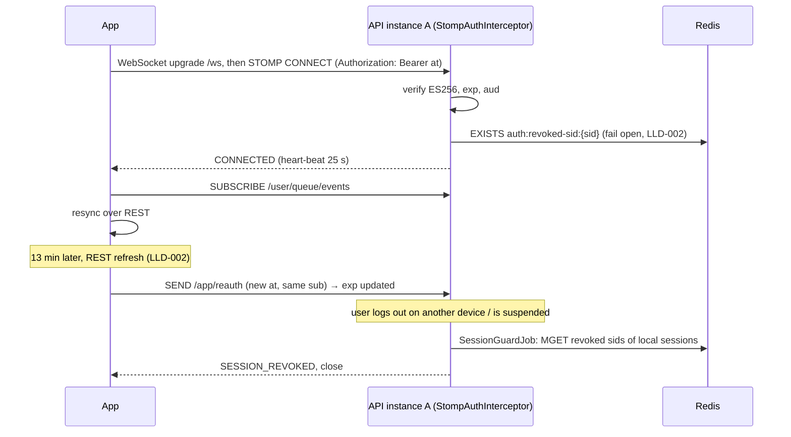
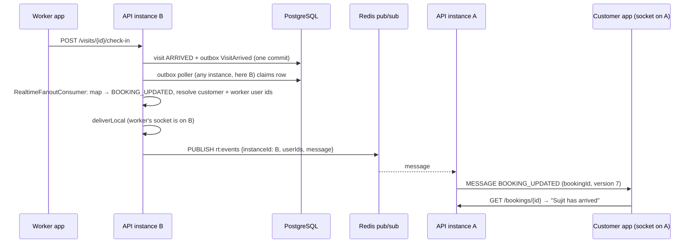

# LLD-021: Realtime Updates over WebSocket

| Field | Value |
|---|---|
| Status | Draft |
| Owner | TBD |
| Reviewers | TBD |
| Module | `realtime` |
| Parent HLD | [architecture/07](../architecture/07-realtime-and-websocket-architecture.md), [ADR 0014](../adr/0014-websocket-realtime-without-replay.md), [architecture/08 §25–26, §57](../architecture/08-caching-redis-and-distributed-state.md) |
| Requirements | [product/04 §25](../product/04-mvp-scope-release-plan-and-future-phases.md) (MVP realtime), [security/02 §45–47](../security/02-threat-model-and-application-security.md), [security/03 §61](../security/03-data-privacy-pii-retention-and-compliance.md) |
| Depends on | LLD-002 (JWT ES256, `sid` deny-list), outbox (LLD-022, [ADR 0005](../adr/0005-async-events-and-transactional-outbox.md)), events from LLD-006 / 007 / 008 / 009 / 010 / 011 / 013 / 017 / 018 |
| Used by | Customer and worker apps |
| Last updated | 2026-10-05 |

---

## 1. Context & scope

When the app is open, the customer should see "Sujit is on the way" or "Payment received" without pulling to refresh. This LLD sends a small **"something changed"** message to the right user's open app; the app then reads the real state over REST. REST and PostgreSQL stay the source of truth (ADR 0014): a lost message costs one refresh, never a wrong state.

Apps run on cheap Android phones on flaky 4G, and are often in the background. So the socket is a **nice-to-have accelerator**: push notifications (LLD-013) and polling still work when it is down.

**In scope**

- One WebSocket endpoint, authentication with the access token, re-auth on token refresh, closing revoked sessions
- Outbox consumer: domain event → message type + recipients
- Fan-out across API instances through Redis pub/sub
- Message envelope, client contract (reconnect, backoff, resync, polling fallback)
- Heartbeats, limits, slow-client handling

**Out of scope:** chat / messaging (not MVP), live GPS tracking (LLD-009 D1), worker offers (LLD-007 D9: push + inbox), presence shown to other users, admin console live updates, event replay (ADR 0014).

**Decisions**

| # | Decision | Default (configurable) |
|---|---|---|
| D1 | **Spring WebSocket + STOMP 1.2 over plain WebSocket** (no SockJS), Spring's in-memory simple broker. STOMP gives heartbeats, user destinations and an `Authorization` header on `CONNECT` out of the box; client libraries exist for Android, iOS, JS and Flutter. No external broker. | endpoint `wss://api…/ws` |
| D2 | **Only one destination: the user's own queue** `/user/queue/events`. The server decides who gets what; clients cannot subscribe to booking / job / request ids, so there is nothing to authorise per subscribe and no way to probe other users' resources. | — |
| D3 | **Message = notification, not data.** `{id, type, resourceType, resourceId, resourceVersion, occurredAt}` — no names, phones, addresses, amounts, statuses or codes. The app refetches the resource over REST, which applies the normal role-aware view. | — |
| D4 | **Source = the outbox.** `RealtimeFanoutConsumer` reads committed outbox events (so nothing is sent for a rolled-back transaction) and maps them by a fixed table (§4.3). No module calls `realtime` directly. | — |
| D5 | **Fan-out via Redis pub/sub**, one channel for all instances. The consuming instance delivers to its own local sessions first, then publishes; every other instance delivers to its local sessions. Redis loss = missed messages only (ADR 0004). | channel `rt:events` |
| D6 | **Auth on `CONNECT`** with the LLD-002 access token: same decoder and `SidNotRevokedValidator` as REST. Token goes in the STOMP header, **never in the URL** (keeps it out of ALB / access logs). No `CONNECT` within 10 s → socket closed. | 10 s |
| D7 | **Token expiry:** the app sends `/app/reauth` with its new access token after each REST refresh (same user required). Not re-authed by `exp + 30 s` → `TOKEN_EXPIRED` and close. **Revocation:** every 60 s each instance checks the deny-list for its sessions' `sid`s and closes revoked ones (`SESSION_REVOKED`). | 60 s |
| D8 | Heartbeats **25 s / 25 s** (below mobile NAT and ALB idle timeouts); session closed after **60 s** without traffic. | 25 s / 60 s |
| D9 | Limits: **3 sessions per user per instance** (oldest closed with `REPLACED`), inbound frame ≤ 8 KB, connect rate 20 / min per user and 60 / min per IP (LLD-001 rate limiter). | 3 / 8 KB / 20 / 60 |
| D10 | Slow clients: send buffer **64 KB**, send time limit **10 s**; over either → session closed, app reconnects and resyncs. No per-message priority queue — every message is "refetch", so dropping and resyncing is always correct. | 64 KB / 10 s |
| D11 | **Presence is not stored.** A socket being open never changes a worker's `ACCEPTING_JOBS` status (LLD-007 D2; architecture/08 §26). Nothing in MVP needs "is user X connected". | — |
| D12 | Delivery is at-most-once per connection, at-least-once overall (outbox retries). The consumer **does not write `processed_events`**: a duplicate message only causes one extra GET. | — |

---

## 2. Classes / components

```text
com.karigar.realtime
├── config/
│   └── WebSocketConfig              -- STOMP endpoint /ws, simple broker /queue, app prefix /app, user prefix /user,
│                                       heartbeats (D8), transport limits (D9, D10), allowed origins (admin web only)
├── security/
│   ├── StompAuthInterceptor         -- CONNECT: verify JWT + deny-list → Principal(userId, sid, exp);
│   │                                   SUBSCRIBE: only /user/queue/events; SEND: only /app/reauth; anything else → ERROR + close
│   ├── ReauthHandler                -- @MessageMapping("/reauth"): verify token, same sub → update sid/exp
│   └── SessionGuardJob              -- every 60 s: local sessions past exp+30 s or sid on deny-list → close (D7)
├── application/
│   ├── RealtimeFanoutConsumer       -- outbox consumer "realtime.fanout"; never throws (§7)
│   ├── RealtimeEventMapper          -- static table event_type → (type, resourceType, id field, recipient rule)  §4.3
│   ├── RecipientResolver            -- resource id → user ids via owners' public query APIs
│   └── RealtimeDelivery             -- deliverLocal(userIds, msg) + Redis PUBLISH
├── domain/
│   └── RealtimeMessage (record), MessageType, ResourceType
└── infrastructure/redis/
    └── RedisFanoutListener          -- SUBSCRIBE rt:events; skip own instanceId; deliverLocal
```

```java
public record RealtimeMessage(UUID id, MessageType type, ResourceType resourceType,
                              UUID resourceId, Long resourceVersion, Instant occurredAt) {}

// RecipientResolver uses only public module APIs (ArchUnit-enforced)
ServiceRequestQueries.customerUserId(UUID requestId);
BookingQueries.parties(UUID bookingId);          // customerUserId, workerUserId
PaymentQueries.parties(UUID paymentId);          // payer customerUserId, workerUserId (null for advances)
DisputeLookup.parties(UUID disputeId);          // customerUserId, workerUserId (LLD-018)
```

`RealtimeDelivery.deliverLocal` calls `SimpMessagingTemplate.convertAndSendToUser(userId, "/queue/events", msg)`; Spring's `SimpUserRegistry` already knows which users have sessions on this instance, so no connection registry is kept in Redis.

---

## 3. Data model

No tables, no migration. Ephemeral state only:

| Where | Key / name | Content | Lifetime |
|---|---|---|---|
| Instance memory | Spring `SimpUserRegistry` + session attributes | userId, sid, token `exp` | connection |
| Redis pub/sub | `rt:events` | `{instanceId, userIds[], message}` | none (fire-and-forget) |
| Redis (read only) | `auth:revoked-sid:{sid}` | owned by LLD-002 | LLD-002 |

---

## 4. Protocol contract

### 4.1 Frames

| Direction | Frame | Destination / header | Notes |
|---|---|---|---|
| C → S | `CONNECT` | `Authorization: Bearer <access token>`, `accept-version:1.2`, `heart-beat:25000,25000` | `ERROR` with `code` header on failure, then close |
| S → C | `CONNECTED` | `heart-beat:25000,25000`, `server-time` | client uses `server-time` only for display offsets |
| C → S | `SUBSCRIBE` | `/user/queue/events` | any other destination → `ERROR SUBSCRIPTION_DENIED`, close |
| C → S | `SEND` | `/app/reauth`, header `Authorization: Bearer <new token>` | after every REST token refresh |
| S → C | `MESSAGE` | `/user/queue/events` | envelope §4.2 |

Client never sends business commands over the socket (architecture/07 §36): every action stays a REST call.

### 4.2 Envelope

```json
{
  "id": "01928f3e-7b1a-7c40-9d2e-5a1f0c3b9e77",
  "type": "BOOKING_UPDATED",
  "resourceType": "BOOKING",
  "resourceId": "01928f3a-1c22-7e10-8f4d-2b6a9c0e1d55",
  "resourceVersion": 7,
  "occurredAt": "2026-10-05T10:31:04Z",
  "v": 1
}
```

- `id` = the outbox event id (UUIDv7, [ADR 0018](../adr/0018-uuidv7-identifiers.md)); the same id on every instance, so the app can drop duplicates (keep the last 100 ids).
- `resourceVersion` = the aggregate's `version` column if the event carries it, else `null`. If the app already holds that version or newer, it skips the refetch.
- `v` = envelope version. Unknown `type` → app does a full resync (§4.4), never crashes.

System messages (same envelope, `resourceType: null`): `SESSION_REVOKED`, `TOKEN_EXPIRED`, `REPLACED`, `SHUTTING_DOWN` — each followed by a server close. The app reacts as in §4.4.

### 4.3 Event → message mapping

| Outbox event (owner) | `type` | `resourceType` / id | Recipients | App refetches |
|---|---|---|---|---|
| `ServiceRequestSubmitted`, `ServiceRequestCancelled`, `ServiceRequestExpired` (LLD-006) | `SERVICE_REQUEST_UPDATED` | SERVICE_REQUEST / requestId | customer | `GET /service-requests/{id}` |
| `AdvancePaymentFailed` (LLD-011) | `SERVICE_REQUEST_UPDATED` | SERVICE_REQUEST / requestId | customer | `GET /service-requests/{id}` |
| `MatchingRoundCompleted`, `MatchingFailed` (LLD-007) | `MATCHING_UPDATED` | SERVICE_REQUEST / requestId | customer | `GET /service-requests/{id}/matching` |
| `OfferAccepted`, `OfferWithdrawn` (LLD-008) | `SHORTLIST_UPDATED` | SERVICE_REQUEST / requestId | customer | `GET /service-requests/{id}/shortlist` |
| `BookingConfirmed` (LLD-008), `BookingCancelled` (LLD-009) | `BOOKING_UPDATED` | BOOKING / bookingId | customer + worker | `GET /bookings/{id}` |
| `VisitEnRoute`, `VisitArrived`, `VisitCheckedOut`, `VisitConfirmed`, `VisitNoShow`, `VisitChangeProposed`, `VisitChangeResolved`, `JobWorkCompleted`, `JobCompleted`, `JobFailed` (LLD-009) | `BOOKING_UPDATED` | BOOKING / bookingId | customer + worker | `GET /bookings/{id}` (job + visits are in the booking view) |
| `QuoteSubmitted`, `QuoteAccepted`, `QuoteRejected`, `MaterialBillAdded` (LLD-017) | `BOOKING_UPDATED` | BOOKING / bookingId | customer + worker | `GET /bookings/{id}`, then the job's quotes / bill |
| `CashPaymentMarked`, `CashPaymentConfirmed`, `CashPaymentDisputed` (LLD-010) | `PAYMENT_UPDATED` | PAYMENT / paymentId | customer + worker of the job | `GET /payments/{id}` |
| `PaymentSucceeded` (LLD-011, online only) | `PAYMENT_UPDATED` | PAYMENT / paymentId | customer + worker of the job | `GET /payments/{id}` |
| `DisputeOpened`, `DisputeResolved` (LLD-018) | `DISPUTE_UPDATED` | DISPUTE / disputeId | customer + worker | `GET /disputes/{id}` |
| `RefundSucceeded` (LLD-011) | `PAYMENT_UPDATED` | PAYMENT / paymentId | customer | `GET /payments/{id}` |
| `NotificationCreated` (LLD-013) | `NOTIFICATION_CREATED` | NOTIFICATION / notificationId | that user | notification list / badge |

**Not mapped on purpose:** `WorkerOffered`, `OfferExpired`, `WorkerNotSelected` (offers are push + inbox, LLD-007 D9); `WorkerSelected` (covered by `BookingConfirmed`); `AdvancePaymentSucceeded` (the request's `ServiceRequestSubmitted` follows); ledger / earnings events (worker reads earnings on screen open); reviews, verification and payouts (push + inbox via LLD-013, which also triggers `NOTIFICATION_CREATED`).

### 4.4 Client contract

| Situation | App does |
|---|---|
| App comes to foreground / user logs in | connect; on `CONNECTED` → **resync** |
| **Resync** | refetch what is on screen + `GET /service-requests?status=OPEN` and `GET /bookings?status=CONFIRMED` (role-aware) |
| `MESSAGE` | coalesce per `resourceId` for 500 ms, then one GET; skip if held version ≥ `resourceVersion` |
| Socket drops / `SHUTTING_DOWN` / slow-client close | reconnect with backoff **1, 2, 4 … 60 s, full jitter**; reset after 60 s connected; then resync |
| 3 failed connects in a row | **poll** the open screen every 15 s (payment screen: 3 s, LLD-011) while retrying the socket in the background |
| `TOKEN_EXPIRED` | refresh token via REST (LLD-002), reconnect |
| `SESSION_REVOKED` | stop reconnecting; go to login |
| App to background | close the socket (saves battery and data); push notifications cover the gap |

---

## 5. Sequence diagrams

### 5.1 Connect, re-auth, revoke



### 5.2 Worker checks in → customer's screen updates



---

## 6. State transitions (one connection)

| From | Event | Guard | To |
|---|---|---|---|
| — | WebSocket upgrade | rate limits ok | OPEN |
| OPEN | `CONNECT` | token valid, `sid` not revoked, < 3 sessions else close oldest | AUTHENTICATED |
| OPEN | no `CONNECT` in 10 s / invalid token | — | CLOSED (`TOKEN_INVALID` / timeout) |
| AUTHENTICATED | `SUBSCRIBE /user/queue/events` | — | AUTHENTICATED |
| AUTHENTICATED | `/app/reauth` | valid token, same `sub` | AUTHENTICATED (`exp`, `sid` updated) |
| AUTHENTICATED | reauth with other user / bad destination | — | CLOSED (`SUBSCRIPTION_DENIED` / `TOKEN_INVALID`) |
| AUTHENTICATED | guard job | `exp + 30 s` passed / `sid` revoked | CLOSED (`TOKEN_EXPIRED` / `SESSION_REVOKED`) |
| AUTHENTICATED | no heartbeat 60 s / buffer or time limit / SIGTERM | — | CLOSED |

---

## 7. Error handling, idempotency & concurrency

- **Consumer never fails the outbox row.** Mapping, recipient lookup and publish errors are caught, counted (`realtime_fanout_errors_total`) and dropped; other consumers of the same event are unaffected. The business change and its push notification do not depend on realtime.
- **Unknown resource / recipient** (e.g. request deleted by retention): drop silently, count.
- **Redis down:** local delivery still works (single-instance pilot keeps full realtime); cross-instance messages are lost until Redis returns; apps converge through resync and push. Deny-list check fails open (LLD-002 §7), worst case a revoked session stays connected ≤ 15 min receiving only "something changed" hints whose REST refetch will fail with `401`.
- **Duplicates / reordering:** outbox redelivery or two instances never produce different ids for one event; the app drops seen ids and uses `resourceVersion`. Since every message means "refetch", order does not matter.
- **Deploys:** on SIGTERM sessions get `SHUTTING_DOWN` then close ([operations/02 §8.3](../operations/02-ci-cd-docker-environments-and-infrastructure.md)); apps reconnect to the other task with jittered backoff, so a deploy doesn't cause a reconnect spike.
- **Lookups:** one indexed read per event (by primary key) from the outbox poller thread; no locks, no writes.

---

## 8. Security & privacy

- No anonymous sockets; identity comes only from the verified token, never from a client header or frame body.
- Destination allow-list (D2) blocks topic probing; `SEND` allowed only to `/app/reauth`.
- Payload has ids and versions only (D3). Anyone who sniffs or mis-routes a message learns nothing; the REST refetch enforces who may see what (contact details only for the selected worker, start code only for the customer — LLD-009 §10).
- Tokens only in STOMP headers over TLS; frames, headers and tokens are never logged — logs carry `userId`, session id and message `type`.
- Origin: mobile apps send none and are allowed; browsers only from configured admin origins.
- Abuse: connect rate limits (D9), 8 KB inbound frames, 10 s `CONNECT` deadline, per-user session cap. Repeated `SUBSCRIPTION_DENIED` from one user → security log event.

---

## 9. Observability

| Type | Name | Notes |
|---|---|---|
| Gauge | `ws_sessions_active` | per instance; alert > 80 % of planned capacity |
| Counter | `ws_connect_total{result}` | ok, token_invalid, revoked, rate_limited, timeout |
| Counter | `ws_closed_total{reason}` | client, heartbeat, slow_client, expired, revoked, replaced, shutdown |
| Counter | `realtime_messages_total{type, result}` | delivered_local, published, no_session, dropped |
| Histogram | `realtime_delivery_lag_seconds` | `occurredAt` → frame sent; includes outbox lag |
| Counter | `realtime_fanout_errors_total{stage}` | map, resolve, publish |
| Counter | `ws_subscription_denied_total` | |

Alerts: delivery lag p95 > 15 s for 10 min (outbox backlog or Redis); `ws_connect_total{result="token_invalid"}` > 5× baseline (bad client release or attack); slow-client closes > 5 % of sessions (payloads or networks worse than assumed).

---

## 10. Test plan

| Level | Cases |
|---|---|
| Unit | mapper table: every mapped event type → expected `type` / resource / recipients; unmapped types ignored; envelope contains no fields outside §4.2 |
| Integration (Spring context + STOMP test client + Testcontainers Redis) | valid token → `CONNECTED`; missing / expired / wrong-key token → `ERROR`; `sid` on deny-list → refused; subscribe to `/topic/x` or `/user/{other}/queue/events` → denied + closed; `SEND` to anything but `/app/reauth` → closed |
| Delivery | outbox `VisitArrived` → customer and worker each get one `BOOKING_UPDATED`; a third user gets nothing; same outbox event delivered twice → same `id` |
| Multi-instance | two app contexts, one Redis: socket on A, event consumed on B → delivered once; Redis stopped → local delivery still works, cross-instance counted as lost |
| Session lifecycle | reauth with same user extends `exp`; reauth with another user's token → closed; no reauth → closed at `exp + 30 s`; logout-all → closed within 60 s; 4th session → oldest gets `REPLACED` |
| Backpressure | client that stops reading → closed after 10 s / 64 KB, other sessions unaffected |
| Mobile (manual / E2E on low-end Android) | airplane mode 2 min → reconnect + resync shows correct state; socket blocked → polling fallback; app backgrounded → socket closed, push arrives |
| Architecture (ArchUnit) | `realtime` uses only public query APIs of other modules; no module depends on `realtime` |

---

## 11. Open questions

| Question | Default until decided | Owner | Due |
|---|---|---|---|
| Should an open worker app get an `OFFERS_UPDATED` hint to refresh the inbox list? | No — LLD-007 D9; push already refreshes it | Product | After pilot |
| Presence ("customer online") for any feature? | Not stored (D11) | Product | When a feature needs it |
| Per-instance channels + Redis connection registry instead of one broadcast channel | Broadcast; fine for a few instances | Tech lead | When > ~10 API tasks |
| Include a coarse `status` in the envelope to save a GET on 2G? | No — refetch keeps one source of truth and no data leaks | Tech lead | After pilot metrics |

---

## Change log

| Version | Date | Author | Change |
|---|---|---|---|
| 0.1 | 2026-10-05 | TBD | First draft |
| 0.2 | 2026-10-05 | TBD | Cross-LLD consistency |
