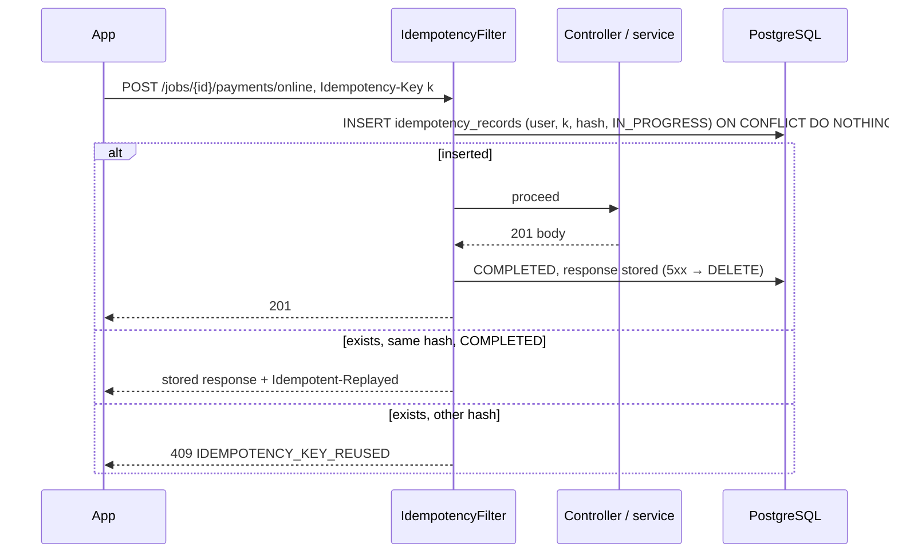

# LLD-022: Shared Platform — Outbox, Event Consumers, Idempotency, Reason Codes, Scheduled Jobs

| Field | Value |
|---|---|
| Status | Draft |
| Owner | TBD |
| Reviewers | TBD |
| Module | `shared` (+ `infrastructure` wiring) |
| Parent HLD | [architecture/09](../architecture/09-async-processing-domain-events-and-outbox.md), [architecture/03 §52.4–52.6](../architecture/03-erd-and-production-database-design.md), [ADR 0005](../adr/0005-async-events-and-transactional-outbox.md), [ADR 0018](../adr/0018-uuidv7-identifiers.md), [api/01 §78](../api/01-rest-api-contract-endpoints-and-error-model.md) |
| Requirements | NFR reliability (no lost events), NFR idempotent APIs |
| Depends on | — (first migration) |
| Used by | every module LLD (001–021) |
| Last updated | 2026-10-05 |

---

## 1. Context & scope

Every LLD writes outbox events, consumes them idempotently, accepts `Idempotency-Key`, uses reason codes and runs scheduled jobs — but none of them creates those tables or says how they work. This LLD is that common base. It is built **first** (slice 0) and is deliberately small.

**In scope**

- `outbox_events` + `OutboxWriter`; `OutboxDispatcher` (poll, claim, dispatch to in-process consumers, retry, dead)
- `processed_events` + the consumer contract
- `idempotency_records` + the HTTP `IdempotencyFilter`
- `reason_codes` + translations
- `shedlock` table for scheduled jobs on several instances
- Shared code: `Ids` (UUIDv7), `Money`, `ClockProvider`, `ContactInfoDetector`

**Out of scope:** `audit_events` and admin tables (LLD-020 `V1_3`), notifications (LLD-013), realtime fan-out (LLD-021), a message broker (none in MVP, ADR 0005).

**Decisions**

| # | Decision | Default (configurable) |
|---|---|---|
| D1 | **Outbox is used from MVP for every cross-module event that matters** (matching, booking, job, payment, earnings, notifications). Spring in-memory events only for best-effort same-module side effects (e.g. cache eviction, LLD-003/004). This settles ADR 0005 (status should move to Accepted). | — |
| D2 | **No broker.** The dispatcher polls `outbox_events` and calls registered in-process consumers. Extracting a module later means replacing the dispatcher with a broker publisher; the table and payloads stay. | poll every 500 ms when work was found, 2 s when idle |
| D3 | **One outbox row, many consumers.** Each consumer runs in its own transaction and records `processed_events (consumer, event_id)` in that same transaction. If any consumer fails, the row is retried; consumers that already succeeded skip it. | — |
| D4 | Retries: exponential backoff with jitter, then `DEAD` after the limit. `DEAD` rows appear in the LLD-020 ops queue and can be retried by `ops.act`. | 1 s → 2 → 4 … cap 10 min; 12 attempts (~1 h) |
| D5 | No global ordering. Rows are dispatched by `(occurred_at, id)`, but a retry can overtake. Consumers that care check aggregate state or `aggregateVersion` in the payload. | architecture/09 §46 |
| D6 | **Idempotency** for every `POST` that creates something or moves money: key scope = (user, key); the stored hash covers method + path + body. Same key, different request → `409 IDEMPOTENCY_KEY_REUSED`; same key while the first is still running → `409 IDEMPOTENCY_IN_PROGRESS` with `Retry-After: 1`. | records kept 24 h |
| D7 | Domain-level idempotency (ledger keys, `payments.idempotency_key`, `UNIQUE (provider, event_id)`) stays in the owning module; this filter is the HTTP layer on top, not a replacement. | — |
| D8 | Event payloads: ids + the few values consumers need (amounts, status, `aggregateVersion`). No names, phones, addresses or free text (security/03). | — |
| D9 | Cleanup: `PUBLISHED` outbox rows deleted after 7 days, `processed_events` after 30 days, expired idempotency records hourly. `DEAD` rows kept until resolved. | 7 d / 30 d |

---

## 2. Classes / components

```text
com.karigar.shared
├── id/        Ids                         -- newId(): UUIDv7 (ADR 0018)
├── money/     Money                       -- long minor + currency; addExact; percent(bps) half-up (ADR 0006)
├── time/      ClockProvider               -- injectable java.time.Clock; IST helpers
├── text/      ContactInfoDetector         -- phone / email / link detector (from LLD-004 D6; used by LLD-004, 012, 017, 018)
├── event/
│   ├── OutboxWriter                       -- write(aggregateType, aggregateId, eventType, payload) — MANDATORY tx propagation
│   ├── EventConsumer<T>                   -- name(), eventTypes(), handle(T event, EventMeta meta)
│   └── EventMeta                          -- eventId, eventType, eventVersion, occurredAt, aggregateId
├── reason/    ReasonCodes                 -- validate(category, code), label(category, code, locale)
└── web/       IdempotencyFilter, IdempotencyStore

com.karigar.infrastructure
├── outbox/    OutboxDispatcher            -- claim batch (SKIP LOCKED), invoke consumers, set status
│              OutboxCleanupJob
└── scheduling/ ShedLockConfig             -- JdbcTemplateLockProvider on table `shedlock`
```

```java
// consumer contract — the only way a module reacts to another module's event
@Component
class AdvanceAppliedOnJobCompleted implements EventConsumer<JobCompleted> {
    public String name() { return "payment.advance-on-job-completed"; }      // stable: part of processed_events PK
    @Transactional
    public void handle(JobCompleted e, EventMeta m) { /* business change only */ }
}
// The dispatcher wraps handle() in: INSERT processed_events … ON CONFLICT DO NOTHING; if 0 rows → skip.
```

`OutboxWriter.write` throws if called outside a transaction, so an event can never be written without the business change it describes.

---

## 3. Data model

From [ERD §52.4–52.6](../architecture/03-erd-and-production-database-design.md); adds `shedlock`, `consumer_failures` is **not** added (errors are kept on the outbox row).

```sql
-- V1_0__shared_platform.sql   (runs before every other migration)
CREATE EXTENSION IF NOT EXISTS postgis;
CREATE EXTENSION IF NOT EXISTS pg_trgm;        -- LLD-003 search
CREATE EXTENSION IF NOT EXISTS btree_gist;     -- LLD-009 overlap exclusion

CREATE TABLE outbox_events (
    id               UUID PRIMARY KEY,                    -- = event id
    aggregate_type   VARCHAR(40) NOT NULL,
    aggregate_id     UUID NOT NULL,
    event_type       VARCHAR(80) NOT NULL,
    event_version    SMALLINT NOT NULL DEFAULT 1,
    payload          JSONB NOT NULL,
    occurred_at      TIMESTAMPTZ NOT NULL,
    status           VARCHAR(20) NOT NULL DEFAULT 'PENDING' CHECK (status IN ('PENDING','PUBLISHED','FAILED','DEAD')),
    attempts         SMALLINT NOT NULL DEFAULT 0,
    next_attempt_at  TIMESTAMPTZ NOT NULL,
    locked_until     TIMESTAMPTZ,
    published_at     TIMESTAMPTZ,
    last_error       TEXT
);
CREATE INDEX ix_outbox_due ON outbox_events (next_attempt_at) WHERE status IN ('PENDING','FAILED');
CREATE INDEX ix_outbox_dead ON outbox_events (occurred_at) WHERE status = 'DEAD';
CREATE INDEX ix_outbox_aggregate ON outbox_events (aggregate_type, aggregate_id, occurred_at);

CREATE TABLE processed_events (
    consumer      VARCHAR(60) NOT NULL,
    event_id      UUID NOT NULL,
    processed_at  TIMESTAMPTZ NOT NULL,
    PRIMARY KEY (consumer, event_id)
);
CREATE INDEX ix_processed_events_age ON processed_events (processed_at);

CREATE TABLE idempotency_records (
    user_id          UUID NOT NULL,                       -- no FK: also used for system callers
    idempotency_key  VARCHAR(100) NOT NULL,
    request_hash     CHAR(64) NOT NULL,                   -- sha256(method + path + body)
    status           VARCHAR(12) NOT NULL CHECK (status IN ('IN_PROGRESS','COMPLETED')),
    response_status  SMALLINT,
    response_body    JSONB,
    created_at       TIMESTAMPTZ NOT NULL,
    expires_at       TIMESTAMPTZ NOT NULL,
    PRIMARY KEY (user_id, idempotency_key)
);
CREATE INDEX ix_idempotency_expiry ON idempotency_records (expires_at);

CREATE TABLE reason_codes (
    category                  VARCHAR(40) NOT NULL,
    code                      VARCHAR(40) NOT NULL,
    requires_note             BOOLEAN NOT NULL DEFAULT false,
    cancellation_fee_applies  BOOLEAN NOT NULL DEFAULT false,
    active                    BOOLEAN NOT NULL DEFAULT true,
    sort_order                SMALLINT NOT NULL DEFAULT 0,
    PRIMARY KEY (category, code)
);
CREATE TABLE reason_code_translations (
    category  VARCHAR(40) NOT NULL,
    code      VARCHAR(40) NOT NULL,
    locale    VARCHAR(10) NOT NULL,                       -- checked in code against supported_locales (LLD-003)
    label     VARCHAR(120) NOT NULL,
    PRIMARY KEY (category, code, locale),
    FOREIGN KEY (category, code) REFERENCES reason_codes (category, code)
);

CREATE TABLE shedlock (
    name        VARCHAR(64) PRIMARY KEY,
    lock_until  TIMESTAMPTZ NOT NULL,
    locked_at   TIMESTAMPTZ NOT NULL,
    locked_by   VARCHAR(255) NOT NULL
);
```

Reason-code **seeds** live with the module that owns the category (`R__` repeatable migrations in each module, e.g. LLD-009 `CUSTOMER_CANCELLATION`, LLD-012 `REVIEW_MODERATION`), so a module can add codes without touching shared files. Translations are added the same way (en, bn, hi).

Rough volume: ~20 events per completed job; at 1,000 jobs/day ≈ 20 k rows/day, ~140 k live rows with 7-day cleanup — no partitioning needed.

---

## 4. API contract

No business endpoints. Behaviour visible to clients:

| Header / case | Behaviour |
|---|---|
| `Idempotency-Key` on an endpoint marked `@Idempotent` | required → `400 IDEMPOTENCY_KEY_REQUIRED` if missing; 8–100 chars `[A-Za-z0-9_-]` |
| Retry with same key and same request after completion | original status + body replayed, header `Idempotent-Replayed: true` |
| Same key, different method/path/body | `409 IDEMPOTENCY_KEY_REUSED` |
| Same key while the first request is still running | `409 IDEMPOTENCY_IN_PROGRESS`, `Retry-After: 1` |
| First request failed with 5xx | record deleted, so the client may retry with the same key |
| First request failed with 4xx | stored and replayed (the answer won't change) |

Admin (LLD-020): `DEAD` rows are the `OUTBOX_DEAD` ops queue (`GET /api/v1/admin/ops/queues/OUTBOX_DEAD`, `ops.view`); `POST /api/v1/admin/ops/outbox/{eventId}/retry` (`ops.act`) sets `PENDING`, `attempts = 0`; audited.

---

## 5. Sequence diagrams

### 5.1 Write and dispatch

```mermaid
sequenceDiagram
    participant S as Any application service
    participant DB as PostgreSQL
    participant D as OutboxDispatcher (each instance)
    participant C1 as Consumer A
    participant C2 as Consumer B
    S->>DB: BEGIN; business change; OutboxWriter.write(JobCompleted); COMMIT
    D->>DB: UPDATE outbox_events SET locked_until = now()+60s WHERE id IN<br/>(SELECT id … status IN (PENDING,FAILED) AND next_attempt_at <= now() ORDER BY occurred_at, id LIMIT 100 FOR UPDATE SKIP LOCKED) RETURNING *
    D->>C1: tx: INSERT processed_events (A, id) ON CONFLICT DO NOTHING → handle()
    C1-->>D: ok
    D->>C2: tx: INSERT processed_events (B, id) … → handle()
    C2-->>D: exception
    D->>DB: status FAILED, attempts+1, next_attempt_at = now()+backoff, last_error, locked_until NULL
    Note over D: next round: A is skipped (already in processed_events), B retried
```

### 5.2 Idempotent POST



The record insert is its own short transaction, separate from the business transaction, so a crash between them leaves `IN_PROGRESS`; such rows older than 5 min are treated as abandoned and deleted by cleanup.

---

## 6. State transitions

**Outbox row:** `PENDING → PUBLISHED` (all consumers ok) · `PENDING/FAILED → FAILED` (a consumer threw, attempts < limit) · `FAILED → DEAD` (limit reached) · `DEAD → PENDING` (admin retry). A crashed dispatcher's lease (`locked_until`) expires and another instance takes the row.

**Idempotency record:** `IN_PROGRESS → COMPLETED` · `IN_PROGRESS → deleted` (5xx or abandoned) · `→ deleted` at `expires_at`.

---

## 7. Error handling, idempotency & concurrency

- Several app instances dispatch at once; `FOR UPDATE SKIP LOCKED` + lease means each row is handled by one instance at a time.
- A consumer must be idempotent even without `processed_events` for side effects outside the DB (push, email): those consumers send with the event id as the provider dedup key where possible (LLD-013).
- A consumer must not call slow external APIs inside its transaction; it writes its own outbox row or work row and returns (e.g. LLD-011 refunds commit `REQUESTED` first).
- Poison event (bad payload): fails every attempt → `DEAD` after ~1 h, alert; other events keep flowing.
- Clock: all `next_attempt_at` / `expires_at` use database `now()`, not app clocks.

---

## 8. Security & privacy

- Payload rule D8 is checked in code review and by a unit test per event type that serialises a sample and asserts no field named `phone|email|address|name|note`.
- `idempotency_records.response_body` may contain what the client already received; it is deleted after 24 h and never logged.
- Admin outbox view shows payloads to `ops.act` only; access is audited (LLD-020).

---

## 9. Observability

| Type | Name | Notes |
|---|---|---|
| Gauge | `outbox_pending_oldest_seconds` | **main health signal**; alert > 120 s for 5 min |
| Gauge | `outbox_dead_count` | alert > 0 |
| Counter | `outbox_dispatch_total{event_type, result}` | |
| Histogram | `outbox_consumer_ms{consumer}` | find slow consumers |
| Counter | `idempotency_total{result}` | new, replayed, key_reused, in_progress |
| Gauge | `shedlock_held_seconds{name}` | job stuck if it exceeds its lock time |

---

## 10. Test plan

| Level | Cases |
|---|---|
| Unit | `Ids`: version 7 bits, variant bits, monotonic within a millisecond; `Money` overflow; backoff schedule with jitter bounds |
| Integration (Testcontainers PostGIS) | write outside a transaction → exception; business rollback → no outbox row; two dispatchers on the same table → each row handled once; consumer A ok / B fails → retry calls only B; 12 failures → DEAD; admin retry → processed |
| Idempotency | same key + body twice → one effect, replay header; same key + other body → 409; two parallel identical requests → one runs, other 409 IN_PROGRESS; 5xx → retry allowed |
| Payload privacy | every registered event type sample passes the forbidden-field test |
| Architecture (ArchUnit) | modules call `OutboxWriter`, never insert into `outbox_events` directly; consumers live in the consuming module; no module depends on another module's `EventConsumer` |

---

## 11. Open questions

| Question | Default until decided | Owner | Due |
|---|---|---|---|
| Mark ADR 0005 Accepted (outbox from MVP, no broker) | This LLD assumes yes | Tech lead | Before slice 0 |
| Move `PUBLISHED` rows to cold storage instead of deleting (audit replay) | Delete after 7 d; `audit_events` is the long-term record | Tech lead | After pilot |

---

## Change log

| Version | Date | Author | Change |
|---|---|---|---|
| 0.1 | 2026-10-05 | TBD | First draft |
| 0.2 | 2026-10-05 | TBD | Cross-LLD consistency |
